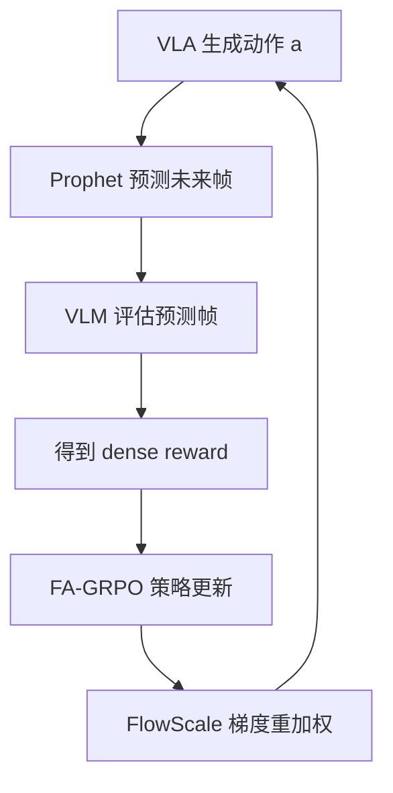

# ProphRL：预测式奖励驱动的 VLA 后训练深度精读

> **论文标题**: Reinforcing Action Policies by Prophesying  
> **作者**: Zhihao Wang, Jianxiong Li, et al.  
> **机构**: Tsinghua University, Shanghai AI Lab  
> **发表**: arXiv:2511.20633, 2025  
> **代码**: https://github.com/thu-ml/ProphRL

**标签**: `#VLA` `#强化学习` `#GRPO` `#FlowMatching` `#Prophet` `#轻量高效` `#奖励模型`

**知识链接**：
- [GRPO](/前置知识/000m_前置知识_GRPO_Group_Relative_Policy_Optimization) — Group Relative Policy Optimization
- [Flow Matching 与连续归一化流](/前置知识/000g_前置知识_Flow_Matching与连续归一化流) — Flow-based VLA 的生成框架
- [Process Reward Model](/前置知识/000n_前置知识_Process_Reward_Model) — 过程奖励模型
- [策略梯度与 PPO](/前置知识/000a_前置知识_策略梯度与PPO) — 对比：PPO 方法
- [KL 散度与策略约束](/前置知识/000j_前置知识_KL散度与策略约束) — 策略约束机制
- [VLA 模型的 RL 后训练综述](/论文综述/S06_VLA模型的RL后训练综述) — 全景概览
- [FlowRL 精读](./018_FlowRL_Flow_VLA的在线RL微调) — 对比：另一种 Flow VLA RL 方法

---

## 一、背景与动机

### 1.1 VLA 后训练的效率困境

现有 VLA RL 后训练方法的核心瓶颈是**采样效率**：

- PPO 方法（VLA-RL）：需要数千条在线 rollout，每条需要物理仿真执行
- GRPO 方法（TGRPO）：需要每个 prompt 采样多条轨迹做组内排序
- 奖励稀疏：机器人任务只有最终的 success/fail，中间无信号

**关键洞察**：如果我们能**预测**一个动作执行后环境会变成什么样（不需要真的执行），就可以极大加速奖励评估。

### 1.2 ProphRL 的三大组件

ProphRL 由三个互相配合的组件构成：

1. **Prophet**（预言者）：一个视频预测模型，预测当前动作执行后的未来帧
2. **FA-GRPO**（Flow-Action GRPO）：将 GRPO 适配到 Flow-based VLA 的动作空间
3. **FlowScale**：对 flow matching 各 denoising step 的梯度做重新加权

```mermaid
flowchart TB
    A["VLA 生成动作 a"] --> B["Prophet 预测未来帧"]
    B --> C["VLM 评估预测帧"]
    C --> D["得到 dense reward"]
    D --> E["FA-GRPO 策略更新"]
    E --> F["FlowScale 梯度重加权"]
    F --> A
```

---

## 贯穿全文的例子

> **场景**：一个基于 π₀ 的 Flow-based VLA 模型（3B 参数），需要完成 "put the red block into the blue bowl"。
>
> - **Prophet 的作用**：执行动作 $a$ 前，先预测"如果执行 $a$，3 帧后画面会是什么样"
> - **VLM 评分**：用一个 VLM 对预测画面打分（"红块是否在碗里？0-1"）
> - **好处**：一次 forward pass（~0.1s）就能得到奖励信号，不需要等物理仿真（~5s/rollout）
> - **目标**：用 200 步 RL 训练将成功率从 60% 提升到 85%+

---

## 二、方法详解

### 2.1 Prophet：动作效果预测器

Prophet 是一个轻量视频预测模型，给定当前观测 $o_t$ 和动作 $a_t$，预测未来 $k$ 帧：

$$
\hat{o}_{t+1}, \hat{o}_{t+2}, \ldots, \hat{o}_{t+k} = \text{Prophet}(o_t, a_t)
$$

**这个公式在做什么**：不真正执行动作，而是让一个神经网络"想象"执行动作 $a_t$ 之后接下来 $k$ 帧画面会变成什么样——用一次快速推理代替一次真实的物理仿真。

::: details 📐 公式详解（点击展开）

| 子表达式 | 它是谁 | 它在干嘛 |
|---------|--------|---------|
| $o_t, a_t$ | **当前的观测和动作** | 现在看到的画面 + 打算执行的动作，是 Prophet 的输入 |
| $\text{Prophet}(\cdot)$ | **预言者网络** | 一个视频预测模型，吃进"现状+动作"，吐出"未来画面" |
| $\hat{o}_{t+1},\ldots,\hat{o}_{t+k}$ | **想象出的未来帧** | 预测出的 $k$ 帧画面，带 $\hat{}$ 号表示是预测值而非真实观测 |

**用人话读**："给 Prophet 看现在的画面和打算做的动作，它直接吐出'做完之后接下来几帧会长什么样'的预测画面，不需要真的把动作执行一遍。"

**为什么是这个形式**：物理仿真跑一条轨迹要 5-30 秒，而 Prophet 只是一次前向推理（约 100ms），且可以对多个候选动作并行预测——用"预测"代替"执行"是把奖励评估从秒级压到毫秒级的关键。
:::

**为什么需要它**：
- 物理仿真太慢（一条轨迹需要 5-30 秒）
- Prophet 是纯 neural network 推理（~100ms）
- 可以并行预测多个动作的效果 → 加速采样

**训练方式**：在已有的示教数据上，用 $(o_t, a_t) \to o_{t+1:t+k}$ 对来训练。模型架构可以是简单的 U-Net 或 DiT。

### 2.2 FA-GRPO：将 GRPO 适配到 Flow 动作空间

标准 [GRPO](/前置知识/000m_前置知识_GRPO_Group_Relative_Policy_Optimization) 是为离散 token 设计的。但 Flow-based VLA（如 π₀）的动作是**连续向量**，通过 flow matching 生成。

FA-GRPO 的适配方式：

**Step 1**：对同一个观测 $o$，采样 $G$ 组动作（通过不同的 flow noise）：

$$
\{a^{(1)}, a^{(2)}, \ldots, a^{(G)}\} \sim \pi_\theta(\cdot | o)
$$

**这个公式在做什么**：面对同一个画面，让策略网络用不同的随机噪声生成 $G$ 个不同的动作候选——为接下来"组内比较谁好谁差"准备一批样本。

::: details 📐 公式详解（点击展开）

| 子表达式 | 它是谁 | 它在干嘛 |
|---------|--------|---------|
| $o$ | **固定的考题** | 同一个观测，作为这一组采样的公共条件 |
| $\pi_\theta(\cdot\|o)$ | **动作生成器** | 当前策略网络，flow matching 过程每次用不同噪声起点生成一个动作 |
| $\{a^{(1)},\ldots,a^{(G)}\}$ | **一组候选答卷** | $G$ 个针对同一观测生成的不同动作，供组内相对打分用 |

**用人话读**："对同一张画面，让策略反复生成 $G$ 次动作（每次用不同随机噪声），凑出一组候选动作。"

**为什么是这个形式**：GRPO 类方法不需要单独训练一个价值网络，而是靠"同一题目下 $G$ 个答案互相比较"来估计好坏，所以第一步必须先采出一组动作。
:::

**Step 2**：用 Prophet + VLM 对每个动作快速评分：

$$
r^{(i)} = \text{VLM}(\text{Prophet}(o, a^{(i)}))
$$

**这个公式在做什么**：给每个候选动作打一个分数——先用 Prophet 想象出执行这个动作后的画面，再用 VLM 看这张想象出的画面判断任务完成得怎么样。

::: details 📐 公式详解（点击展开）

| 子表达式 | 它是谁 | 它在干嘛 |
|---------|--------|---------|
| $\text{Prophet}(o, a^{(i)})$ | **想象力** | 预测执行动作 $a^{(i)}$ 后未来几帧会是什么样（2.1 节定义的预言者） |
| $\text{VLM}(\cdot)$ | **打分裁判** | 一个视觉语言模型，看预测出的画面给出一个 0-1 的任务完成度分数 |
| $r^{(i)}$ | **第 $i$ 个动作的分数** | 这个动作最终得到的奖励，用于下一步的组内比较 |

**用人话读**："每个候选动作都不用真的执行，先让 Prophet 想象出结果画面，再让 VLM 给这张想象画面打分，这个分数就是这个动作的奖励。"

**为什么是这个形式**：把"执行动作→观察结果→打分"这条需要真实交互的链路，换成"预测结果→打分"，去掉了最耗时的物理执行环节。
:::

**Step 3**：组内相对排序计算 advantage：

$$
A^{(i)} = \frac{r^{(i)} - \text{mean}(\{r^{(j)}\})}{\text{std}(\{r^{(j)}\})}
$$

**这个公式在做什么**：把每个动作的绝对分数换算成"比这一组里平均水平好多少个标准差"——这就是 GRPO 不需要单独价值网络的核心技巧。

::: details 📐 公式详解（点击展开）

| 子表达式 | 它是谁 | 它在干嘛 |
|---------|--------|---------|
| $r^{(i)}$ | **这个动作的原始分** | Step 2 算出的奖励 |
| $\text{mean}(\{r^{(j)}\})$ | **组内平均水平** | 这一组 $G$ 个动作分数的平均值，当作"基准线" |
| $\text{std}(\{r^{(j)}\})$ | **组内波动尺度** | 这一组分数的标准差，用来把差值归一化到统一尺度 |
| $A^{(i)}$ | **相对优势** | 这个动作比组内平均水平好（正）还是差（负），好多少个标准差 |

**用人话读**："把每个动作的分数减去这一组的平均分再除以这一组的标准差，得到一个'比同组其他答案好多少'的相对分数。"

**为什么是这个形式**：不需要训练额外的价值网络估计"平均水平应该是多少"——直接用同一批采样出的动作互相当彼此的基准，除以标准差再做一次尺度归一化，避免不同 batch 之间奖励量级不一致导致的训练不稳定。
:::

**Step 4**：用 advantage 加权更新 flow matching loss：

$$
\mathcal{L}_{\text{FA-GRPO}} = -\mathbb{E}\left[ A^{(i)} \cdot \nabla_\theta \log p_\theta(a^{(i)} | o) \right]
$$

**这个公式在做什么**：让相对优势高的动作的生成概率被推高、优势低的动作被压低——这是策略梯度的标准形式，只是把打分换成了 Step 3 算出的组内相对优势。

::: details 📐 公式详解（点击展开）

| 子表达式 | 它是谁 | 它在干嘛 |
|---------|--------|---------|
| $\nabla_\theta\log p_\theta(a^{(i)}\|o)$ | **调整方向** | 往哪个方向调参数能让这个动作的生成概率增大 |
| $A^{(i)}$ | **调整力度和方向的开关** | 优势为正就顺着方向推、为负就反向压 |
| $\mathbb{E}[\cdot]$ | **组内平均** | 对这一组 $G$ 个动作的贡献取平均，实践中就是对 batch 求 `.mean()` |
| 负号 | **梯度下降转最大化** | 优化器默认做梯度下降（最小化 loss），取负号把"最大化期望优势加权 log 概率"变成等价的最小化问题 |

**用人话读**："对这组里的每个动作，用它的相对优势去加权它的 log 生成概率梯度，优势为正就把这个动作的概率往上调，优势为负就往下压，取组内平均作为最终梯度。"

**为什么是这个形式**：这是标准策略梯度定理（详见 [策略梯度与 PPO](/前置知识/000a_前置知识_策略梯度与PPO)）套用组内相对优势的直接结果——用组内比较代替价值网络估计的 baseline，实现更轻量的策略更新。
:::

**代入数字**：$G=8$ 组动作，奖励分别为 $[0.2, 0.5, 0.8, 0.3, 0.9, 0.1, 0.6, 0.4]$：
- mean = 0.475, std = 0.27
- 最好的动作（$r=0.9$）：$A = (0.9-0.475)/0.27 = +1.57$
- 最差的动作（$r=0.1$）：$A = (0.1-0.475)/0.27 = -1.39$

好动作得到强正梯度，差动作得到强负梯度。

### 2.3 FlowScale：分步梯度重加权

Flow matching 生成动作时有 $N$ 个 denoising step。不同 step 对最终动作质量的贡献不同——早期 step 决定大方向，后期 step 决定精度。

FlowScale 为每个 step $n$ 分配不同的梯度权重：

$$
w_n = \frac{\|v_\theta(x_n, n) - v_{\text{target}}\|^2}{\sum_{m=1}^N \|v_\theta(x_m, m) - v_{\text{target}}\|^2}
$$

**一句话**：误差越大的 step 获得越大的梯度权重——把优化资源集中在"最需要改进的地方"。

::: details 📐 公式详解（点击展开）

| 子表达式 | 它是谁 | 它在干嘛 |
|---------|--------|---------|
| $v_\theta(x_n, n)$ | **网络在第 $n$ 步的猜测** | flow matching 网络在第 $n$ 个 denoising step 给出的速度场预测 |
| $\|v_\theta(x_n,n)-v_{\text{target}}\|^2$ | **第 $n$ 步的犯错程度** | 这一步预测和真实目标速度的均方误差，误差越大说明这一步学得越差 |
| $\sum_{m=1}^N\|v_\theta(x_m,m)-v_{\text{target}}\|^2$ | **全部 $N$ 步误差总和** | 把所有 denoising step 的误差加总，作为归一化分母 |
| $w_n$ | **第 $n$ 步分到的权重** | 该步误差占全部误差的比例，误差越大占比越高、权重越大 |

**用人话读**："每个 denoising step 的梯度权重，等于这一步自己的误差占所有步骤总误差的比例——哪一步错得多，就多花力气修哪一步。"

**为什么是这个形式**：Flow matching 的 $N$ 个 denoising step 对最终动作质量的贡献不均衡（早期 step 定方向、后期 step 定精度），如果所有 step 平等分配梯度权重，会把优化资源浪费在已经学得很好的 step 上；按误差比例分配权重，让优化过程自动聚焦在当前最薄弱的环节。
:::

---

## 三、实验结果

### 3.1 主要结果（LIBERO 基准）

| 方法 | RL 步数 | 成功率提升 | 计算成本 |
|------|---------|-----------|---------|
| SFT baseline | - | 48.9% | - |
| GRPO (标准) | 500 | +8% | 100% |
| FlowRL | 500 | +12% | 150% |
| **ProphRL** | **200** | **+17%** | **60%** |

### 3.2 真实机器人实验

| 场景 | SFT | ProphRL | 提升 |
|------|-----|---------|------|
| 抓取放置 | 60% | 84% | +24% |
| 开抽屉 | 55% | 85% | +30% |

**核心优势**：仅需 200 步 RL 训练（约 30 分钟），其他方法需要 500-1000 步。

### 3.3 Prophet 的加速效果

| 奖励评估方式 | 单条评估时间 | 8 组并行时间 |
|-------------|------------|-------------|
| 物理仿真 | 5s | 40s |
| Prophet + VLM | 0.3s | 0.5s |

加速 **80 倍**。这是 ProphRL 能用 200 步就收敛的关键。

---

## 四、核心优势与局限

### 优势

1. **极低训练成本**：200 步 RL 即收敛，比 VLA-RL 快 5 倍
2. **不依赖物理仿真**：Prophet 替代环境执行，可用于无仿真场景
3. **兼容多种 VLA**：适用于 Flow-based（π₀）和 Autoregressive（OpenVLA）

### 局限

1. **Prophet 的准确性**：预测帧不完美，可能导致错误的奖励信号
2. **短视**：只预测几帧，对需要长期规划的任务可能不够
3. **VLM 评分器偏差**：VLM 的判断可能与真实任务成功不完全对齐

---

## 五、总结

| 维度 | ProphRL |
|------|---------|
| 核心创新 | Prophet 预测代替环境交互 + FA-GRPO 适配 Flow VLA |
| RL 算法 | FA-GRPO（Flow-Action GRPO） |
| 训练代价 | 极低（200 步，30 分钟） |
| 性能 | +17% 仿真、+24-30% 真实机器人 |
| 关键依赖 | 视频预测模型 + VLM 评分器 |

---

## 延伸阅读

- [FlowRL：Flow VLA 的在线 RL 微调](./018_FlowRL_Flow_VLA的在线RL微调) — 同为 Flow VLA RL，但需要在线交互
- [TGRPO：轨迹级 GRPO 微调 VLA](./019_TGRPO_轨迹级GRPO微调VLA) — GRPO 在自回归 VLA 上的应用
- [VLA-RFT：世界模型验证奖励](./017_VLA_RFT_世界模型验证奖励RL微调) — 类似使用世界模型的思路
