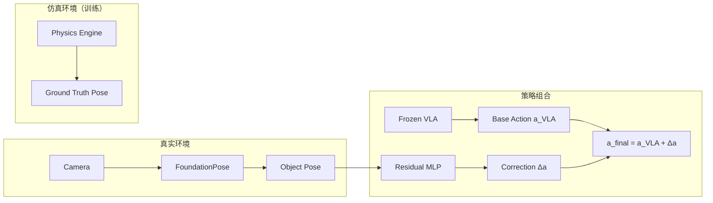

# Object-Centric Residual RL：零迁移增强 VLA 深度精读

> **论文标题**: Object-Centric Residual RL for Zero-Shot Sim-to-Real VLA Enhancement  
> **作者**: Jiafei Duan, Liang Peng, et al.  
> **机构**: Microsoft Research  
> **发表**: arXiv:2606.18953, 2025  
> **项目页**: https://www.microsoft.com/en-us/research/articles/object-centric-residual-rl/

**标签**: `#VLA` `#强化学习` `#SAC` `#ResidualRL` `#Sim-to-Real` `#物体中心` `#零迁移`

**知识链接**：
- [SAC](/前置知识/000k_前置知识_SAC_Soft_Actor_Critic) — Residual Policy 训练算法
- [Replay Buffer](/前置知识/000r_前置知识_Replay_Buffer_经验回放) — Off-policy 数据存储
- [行为克隆与 RL 微调范式](/前置知识/000d_前置知识_行为克隆与RL微调范式) — Residual RL 的上下文
- [Sim-to-Real 迁移综述](/论文综述/S04_Sim_to_Real迁移综述) — Sim-to-Real 迁移方法论
- [PLD 精读](./015_PLD_Residual_RL自改进VLA) — 对比：另一种 Residual RL 方案
- [BootRL 精读](./013_BootRL_冻结VLA加RL_Head) — 对比：冻结 VLA + 小 head
- [VLA 模型的 RL 后训练综述](/论文综述/S06_VLA模型的RL后训练综述) — VLA + RL 全景图

---

## 一、背景与动机

### 1.1 Residual RL 的 Sim-to-Real 困境

Residual RL 的思路很简洁：**冻结 VLA base policy，训练一个轻量的 residual policy 来修正动作**。

$$
a_{\text{final}} = a_{\text{VLA}} + a_{\text{residual}}
$$

**这个公式在做什么**：把冻结的 VLA 输出的动作和一个轻量 residual 网络输出的修正量直接相加，得到最终执行的动作——VLA 负责"大致方向"，residual 负责"精调"。

::: details 📐 公式详解（点击展开）

| 子表达式 | 它是谁 | 它在干嘛 |
|---------|--------|---------|
| $a_{\text{VLA}}$ | **粗略方案** | 冻结的 VLA base policy 输出的动作，负责整体任务规划 |
| $a_{\text{residual}}$ | **精调补丁** | 轻量 residual policy 输出的修正量，负责纠正 VLA 的系统性偏差 |
| $a_{\text{final}}$ | **最终执行动作** | 两者相加后真正发给机器人的动作 |

**用人话读**："机器人最终执行的动作 = VLA 给出的大致动作 + 一个小网络算出来的修正量。"

**为什么是这个形式**：VLA 已经学到了"大方向对"的策略，但精度不够（比如抓偏了几厘米）。与其重新训练整个 VLA，不如冻结它、只训练一个小的加法修正项——这样训练成本极低，且不会破坏 VLA 本身学到的能力。

:::

但是 Residual RL 在 Sim-to-Real 上面临一个三难困境：

| 方案 | 问题 |
|------|------|
| 仿真中用特权状态训练 residual | 部署时没有特权状态，需要额外蒸馏步骤 |
| 仿真中用图像训练 residual | 仿真图像 vs 真实图像有视觉 domain gap |
| 真实环境中训练 residual | 昂贵、不安全、样本效率低 |

### 1.2 核心洞察：物体位姿是天然的"零迁移"表示

本文的关键观察：**物体 6D 位姿**（position + orientation）是一种天然跨域的紧凑表示：

- 仿真中：直接从物理引擎获取
- 真实世界：用现成的位姿估计器（如 FoundationPose）获取
- 两者的数值空间**完全一致**——不存在 domain gap！

**类比**：就像 GPS 坐标在模拟地图和真实世界中是一样的，物体位姿在仿真和现实中也是一样的数字。

---

## 贯穿全文的例子

> **场景**：VLA 模型（OpenVLA）执行 "pick up the mug by its handle"。
>
> - VLA 的动作精度不够：经常抓到杯身而非手柄
> - **Object-Centric 输入**：杯子的 $(x, y, z, r_x, r_y, r_z)$ + 手柄的相对位置
> - **Residual Policy**：一个 3 层 MLP（~100K 参数），输入物体位姿，输出动作修正量
> - **训练**：纯仿真，用 SAC 训练 1 小时
> - **部署**：零迁移到真实机器人（VLA + FoundationPose + residual MLP）

---

## 二、方法详解

### 2.1 整体框架

```mermaid
flowchart LR
    subgraph Real["真实环境"]
        R1["Camera"] --> R2["FoundationPose"]
        R2 --> R3["Object Pose"]
    end
    
    subgraph Sim["仿真环境（训练）"]
        S1["Physics Engine"] --> S2["Ground Truth Pose"]
    end
    
    subgraph Policy["策略组合"]
        P1["Frozen VLA"] --> P2["Base Action a_VLA"]
        R3 --> P3["Residual MLP"]
        P3 --> P4["Correction Δa"]
        P2 --> P5["a_final = a_VLA + Δa"]
        P4 --> P5
    end
```

### 2.2 Object-Centric State Space

Residual policy 的输入是一个紧凑的物体中心状态向量：

$$
s_{\text{obj}} = [p_{\text{target}}, q_{\text{target}}, p_{\text{ee}}, q_{\text{ee}}, p_{\text{target}} - p_{\text{ee}}]
$$

**这个公式在做什么**：把"目标物体在哪、姿态如何"和"机械臂末端在哪、姿态如何"拼成一个 17 维的紧凑向量，作为 residual policy 唯一的输入。

::: details 📐 公式详解（点击展开）

| 子表达式 | 它是谁 | 它在干嘛 |
|---------|--------|---------|
| $p_{\text{target}} \in \mathbb{R}^3$ | **目标坐标** | 目标物体的 3D 位置 |
| $q_{\text{target}} \in \mathbb{R}^4$ | **目标朝向** | 目标物体的姿态（四元数表示） |
| $p_{\text{ee}}, q_{\text{ee}}$ | **手在哪、朝哪** | 机械臂末端（end-effector）的位置和姿态 |
| $p_{\text{target}} - p_{\text{ee}}$ | **还差多远** | 目标和手之间的相对位置差，直接告诉网络"该往哪个方向修正" |
| $s_{\text{obj}}$ | **整体状态向量** | 上述所有量拼接成的 $3+4+3+4+3=17$ 维向量，residual policy 的输入 |

**用人话读**："residual policy 看到的输入只有物体位置姿态和手的位置姿态，外加两者的差值，一共 17 个数字。"

**为什么是这个形式**：维度低（17 维）意味着 3 层 MLP 就够学；每一维语义明确，方便调试；更关键的是这些数字在仿真和真实世界里格式完全一致（都是位姿），所以不存在视觉 domain gap，这是实现"零迁移"的核心设计。额外加入相对位置差 $p_{\text{target}}-p_{\text{ee}}$ 虽然是冗余信息（可以由前两项算出），但显式给出能减轻网络的学习负担。

:::

**为什么这样设计**：
1. **维度低** → MLP 只需 3 层就能学好
2. **语义明确** → 每一维都有清晰的物理含义
3. **跨域一致** → 仿真和真实的数字格式完全相同

### 2.3 Residual Policy 训练

Residual policy $\pi_{\text{res}}$ 是一个小 MLP：

$$
\Delta a = \pi_{\text{res}}(s_{\text{obj}}; \phi) \in [-\epsilon, \epsilon]^7
$$

**这个公式在做什么**：residual 网络吃进物体中心状态，输出一个 7 维的动作修正量，并且这个修正量被强行限制在一个很小的范围内，不能"越权"。

::: details 📐 公式详解（点击展开）

| 子表达式 | 它是谁 | 它在干嘛 |
|---------|--------|---------|
| $\pi_{\text{res}}(\cdot;\phi)$ | **精调小网络** | 参数为 $\phi$ 的 3 层 MLP，输入 $s_{\text{obj}}$ |
| $\Delta a$ | **修正量** | 网络输出的 7 维向量，对应 7-DoF 动作的修正 |
| $[-\epsilon, \epsilon]^7$ | **安全笼子** | 每一维修正量都被 clip 在这个区间内，防止修正过猛 |

**用人话读**："residual 网络看了物体和手的位姿之后，只能给出一个幅度很小（不超过 $\epsilon$）的修正量，不能大改 VLA 的决定。"

**为什么是这个形式**：把修正幅度硬性限制在 $[-\epsilon,\epsilon]$（如 $\epsilon=0.05$，即最多修正 5cm）有两个作用：一是防止训练初期随机策略输出的修正量把动作带到危险区域；二是明确了 residual policy 的角色定位——它只做"精调"，不能替代 VLA 做决策，这也解释了它为什么能用极少的训练步数（约 100K 步）收敛。

:::

训练使用 [SAC](/前置知识/000k_前置知识_SAC_Soft_Actor_Critic)：
- **Off-policy**：样本效率高，约 100K 环境步即收敛
- **最大熵**：鼓励多样性探索，避免过拟合到单一修正模式
- **连续动作空间**：天然适合 7-DoF 修正量

**代入数字**：
- VLA 输出 $a_{\text{VLA}} = [0.32, 0.15, 0.08, 0, 0, 0.1, 1]$（位置增量 + 姿态增量 + 夹爪）
- Residual 输出 $\Delta a = [-0.02, +0.03, -0.01, 0, 0, 0, 0]$（微调末端位置）
- 最终动作 $a_{\text{final}} = [0.30, 0.18, 0.07, 0, 0, 0.1, 1]$

### 2.4 零迁移部署

部署时的pipeline：

1. 摄像头拍摄真实场景
2. VLA 接收图像 + 语言指令 → 输出 $a_{\text{VLA}}$
3. FoundationPose 从图像中估计物体 6D 位姿 → $s_{\text{obj}}$
4. Residual MLP 接收 $s_{\text{obj}}$ → 输出 $\Delta a$
5. 执行 $a_{\text{VLA}} + \Delta a$

**为什么能零迁移**：因为 residual policy 的输入是物体位姿（数字），不是图像。仿真中位姿是 $(0.3, 0.2, 0.1)$，真实中也是 $(0.3, 0.2, 0.1)$ — 没有 domain gap。

---

## 三、实验结果

### 3.1 仿真实验

| 方法 | 成功率 | 训练耗时 | 需要真实数据? |
|------|--------|---------|-------------|
| VLA alone | 62% | - | ❌ |
| Image-based Residual RL | 71% | 8h | ❌ |
| Privileged → Distill | 78% | 12h | ❌ |
| **Object-Centric Residual** | **82%** | **1h** | ❌ |
| Real-world Residual RL | 80% | 20h | ✅ |

### 3.2 真实机器人零迁移

| 任务 | VLA only | + Object-Centric Residual | 提升 |
|------|----------|--------------------------|------|
| Mug grasping | 55% | 80% | +25% |
| Precise placement | 40% | 72% | +32% |
| Drawer opening | 65% | 85% | +20% |

**关键发现**：仿真训练 1 小时，零迁移到真实机器人，接近甚至超过了需要 20 小时真实环境训练的 baseline。

---

## 四、核心优势与局限

### 优势

1. **极轻量**：Residual MLP 只有 ~100K 参数，推理几乎无延迟
2. **零迁移**：仿真训练直接部署，无需 domain adaptation
3. **模块化**：VLA 完全冻结，residual 可独立替换
4. **训练快速**：SAC + 低维状态 = 1 小时收敛

### 局限

1. **依赖位姿估计器**：FoundationPose 的精度直接影响 residual 质量
2. **单物体假设**：当前方法主要处理单目标物体场景
3. **修正幅度有限**：如果 VLA 的 base action 差得太远（超出 $\epsilon$ 范围），residual 无法救回

---

## 五、总结

| 维度 | Object-Centric Residual RL |
|------|---------------------------|
| 核心创新 | 物体位姿作为跨域不变表示，实现零迁移 Residual RL |
| RL 算法 | SAC |
| Residual 规模 | ~100K 参数的 3 层 MLP |
| 训练环境 | 纯仿真（1h） |
| 部署方式 | 零迁移到真实机器人 |
| 关键依赖 | 6D 位姿估计器（FoundationPose） |

---

## 延伸阅读

- [PLD：Residual RL 自改进 VLA](./015_PLD_Residual_RL自改进VLA) — 另一种 Residual RL 方案（但需要蒸馏回 VLA）
- [BootRL：冻结 VLA 加 RL Head](./013_BootRL_冻结VLA加RL_Head) — 类似的"不改 VLA"思路
- [Sim-to-Real 迁移综述](/论文综述/S04_Sim_to_Real迁移综述) — Sim-to-Real 的系统性介绍
