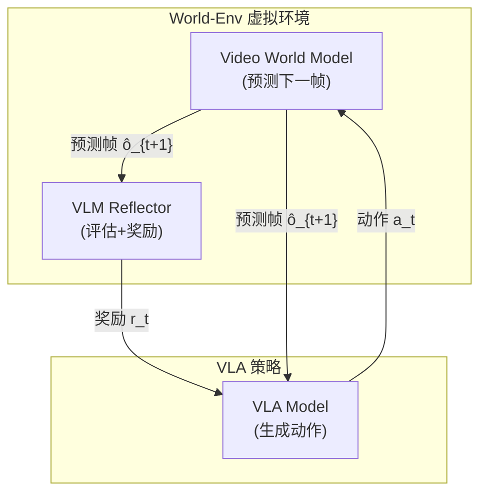

# World-Env：世界模型虚拟环境 VLA 后训练深度精读

> **论文标题**: Leveraging World Model as a Virtual Environment for VLA Post-Training  
> **作者**: Xingjian Yu, Jiawei Li, et al.  
> **机构**: Fudan University, Shanghai AI Lab  
> **发表**: arXiv:2509.24948, CVPR 2026  
> **项目页**: https://world-env-vla.github.io/

**标签**: `#VLA` `#强化学习` `#世界模型` `#视频生成` `#VLM奖励` `#数据高效` `#5个示教`

**知识链接**：
- [策略梯度与 PPO](/前置知识/000a_前置知识_策略梯度与PPO) — RL 优化算法
- [行为克隆与 RL 微调范式](/前置知识/000d_前置知识_行为克隆与RL微调范式) — SFT + RL 范式
- [KL 散度与策略约束](/前置知识/000j_前置知识_KL散度与策略约束) — 策略约束
- [世界模型基础](/前置知识/000t_前置知识_世界模型基础) — World Model 概念
- [VLA 模型的 RL 后训练综述](/论文综述/S06_VLA模型的RL后训练综述) — VLA + RL 全景图
- [VLA-RFT 精读](./017_VLA_RFT_世界模型验证奖励RL微调) — 类似思路：用世界模型提供奖励
- [ProphRL 精读](./022_ProphRL_预测式VLA后训练) — 类似思路：预测未来帧

---

## 一、背景与动机

### 1.1 VLA 后训练的环境依赖问题

现有 VLA RL 方法都需要一个**交互环境**来提供：
1. 状态转移：执行动作后的下一个观测
2. 奖励信号：评估动作的好坏

但获取高质量环境代价极高：

| 环境类型 | 优点 | 缺点 |
|---------|------|------|
| 真实机器人 | 无 domain gap | 昂贵、慢、不安全 |
| 物理仿真（Isaac Gym 等） | 快速、安全 | 建模成本高、有 sim-to-real gap |
| 无环境（纯离线） | 零交互成本 | 无法探索新策略 |

**核心问题**：能否用一种**不需要物理仿真器**也**不需要真实交互**的方式做 RL？

### 1.2 World-Env 的思路

World-Env 用一个**视频世界模型**替代物理仿真器：

- **状态转移**：视频生成模型预测"如果执行这个动作，下一帧画面是什么"
- **奖励信号**：VLM 对生成的画面进行评估"任务完成了多少"

关键优势：**5 条示教轨迹**就能训练出有效的世界模型 + 完成 RL 后训练。

---

## 贯穿全文的例子

> **场景**：VLA 模型需要学会 "stack the red cube on the blue cube"。
>
> - 只有 5 条人类示教
> - 没有仿真环境
> - World Model 训练：用 5 条视频学会"红块被推/抬时画面如何变化"
> - RL 训练：VLA 在虚拟环境中"执行"动作，World Model 生成画面，VLM 判断"红块是否在蓝块上"
> - 迭代 100 步后：VLA 的成功率从 40% → 75%

---

## 二、方法详解

### 2.1 整体架构

### 2.2 Component 1：Video World Simulator

世界模型接收当前帧 $o_t$ 和动作 $a_t$，生成下一帧 $\hat{o}_{t+1}$：

$$
\hat{o}_{t+1} = f_\psi(o_t, a_t)
$$

**架构**：基于视频扩散模型（如 Stable Video Diffusion），但经过action-conditioned 微调。

**训练数据**：仅需 5 条示教轨迹（~1000 帧），通过数据增强扩展：
- 随机裁剪 / 颜色扰动
- 时间窗口滑动
- 动作噪声注入

**时间一致性**：通过 temporal attention 保证连续帧之间的物理一致性（物体不会突然跳跃）。

### 2.3 Component 2：VLM-Guided Instant Reflector

VLM Reflector 做两件事：

**1. 连续奖励生成**

给定预测帧和任务指令，VLM 输出连续奖励：

$$
r_t = \text{VLM}(\hat{o}_{t+1}, \text{instruction})
$$

Prompt 示例："On a scale of 0 to 1, how much progress has been made toward stacking the red cube on the blue cube? Output only a number."

**2. 终止预测**

VLM 同时判断任务是否完成或不可恢复：

$$
\text{done}_t = \text{VLM}_{\text{terminate}}(\hat{o}_{t+1}, \text{instruction})
$$

**为什么用 VLM 而不是手工奖励**：
- 通用性：同一个 VLM 适用于所有任务，无需为每个任务设计奖励函数
- 语义理解：VLM 能理解"红块在蓝块上方"这种语义关系

### 2.4 RL 训练流程

整体训练流程：

1. **初始化**：用 5 条示教数据 SFT VLA
2. **Rollout in World-Env**：
   - VLA 输出动作 $a_t$
   - World Model 生成 $\hat{o}_{t+1}$
   - VLM 评估奖励 $r_t$
   - 重复直到 done 或 max steps
3. **策略更新**：用 PPO 更新 VLA 参数
4. **迭代**直到收敛

**关键超参数**：
- 每个 episode 最多 50 步（World Model 超过 50 帧后质量下降）
- PPO clip $\epsilon = 0.2$
- KL penalty 防止偏离 SFT 初始策略太远

---

## 三、实验结果

### 3.1 LIBERO 基准

| 方法 | 示教数据 | 仿真环境 | 成功率 |
|------|---------|---------|--------|
| SFT (5 demos) | 5 | ❌ | 35% |
| SFT (50 demos) | 50 | ❌ | 62% |
| Online RL (PPO) | 5 + rollouts | ✅ | 68% |
| **World-Env** | **5** | **❌** | **65%** |

**核心发现**：World-Env 用 5 条示教（无仿真器）接近了需要物理仿真器的在线 RL 性能。

### 3.2 数据效率对比

| 示教数量 | SFT 成功率 | World-Env 成功率 | 提升 |
|---------|-----------|-----------------|------|
| 5 | 35% | 65% | +30% |
| 10 | 45% | 72% | +27% |
| 30 | 58% | 78% | +20% |

数据越少，World-Env 的优势越大。

---

## 四、核心优势与局限

### 优势

1. **无需物理仿真器**：只需视频数据就能做 RL 后训练
2. **极致数据高效**：5 条示教即可
3. **通用奖励**：VLM 评分适用于任意语言描述的任务
4. **安全**：所有探索在"虚拟世界"中进行，零真实风险

### 局限

1. **世界模型质量**：视频生成不完美，物体穿模/消失时会产生错误奖励
2. **时间跨度**：50 帧以上时间一致性下降，不适合超长horizon任务
3. **计算成本**：视频扩散模型的推理本身不便宜（每帧~0.5s）
4. **物理违反**：世界模型可能生成物理上不可能的画面（如物体飘浮）

---

## 五、总结

| 维度 | World-Env |
|------|-----------|
| 核心创新 | 视频世界模型替代物理仿真器做 RL 训练环境 |
| RL 算法 | PPO |
| 数据需求 | 5 条示教轨迹（极少） |
| 环境需求 | ❌ 不需要物理仿真器 |
| 奖励来源 | VLM 自动评估 |
| 适用场景 | 无仿真环境、数据极度稀缺 |

---

## 延伸阅读

- [VLA-RFT：世界模型验证奖励 RL 微调](./017_VLA_RFT_世界模型验证奖励RL微调) — 类似使用世界模型的思路
- [ProphRL：预测式 VLA 后训练](./022_ProphRL_预测式VLA后训练) — 也用预测未来帧来加速
- [CO-RFT：离线分块 RL 微调](./021_CO_RFT_离线分块RL微调VLA) — 另一种不需在线交互的路线
