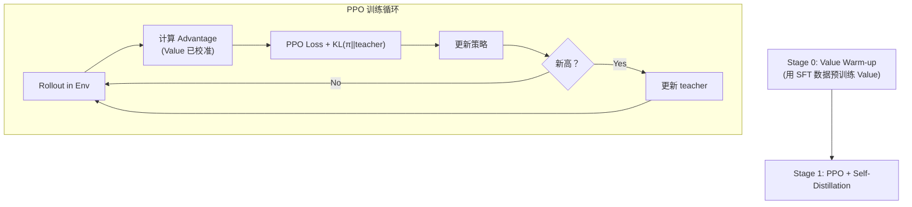

# FORCE：高效 VLA RL 微调深度精读

> **论文标题**: FORCE: Efficient VLA Reinforcement Fine-Tuning via Value-Calibrated Warm-up and Self-Distillation  
> **作者**: Anonymous (under review)  
> **机构**: TBD  
> **发表**: arXiv:2606.26006, 2025  

**标签**: `#VLA` `#强化学习` `#PPO` `#Value校准` `#自蒸馏` `#训练加速`

**知识链接**：
- [策略梯度与 PPO](/前置知识/000a_前置知识_策略梯度与PPO) — PPO 的核心机制
- [Q 函数与 Value 函数](/前置知识/000o_前置知识_Q函数与Value函数) — Value 函数基础
- [KL 散度与策略约束](/前置知识/000j_前置知识_KL散度与策略约束) — 蒸馏中的 KL 约束
- [行为克隆与 RL 微调范式](/前置知识/000d_前置知识_行为克隆与RL微调范式) — SFT → RL 范式
- [VLA 模型的 RL 后训练综述](/论文综述/S06_VLA模型的RL后训练综述) — VLA + RL 全景图
- [BootRL 精读](./013_BootRL_冻结VLA加RL_Head) — 对比方法

---

## 一、背景与动机

### 1.1 VLA RL 训练的两大效率瓶颈

即使在仿真环境中，VLA RL 微调的效率仍然很低。主要有两个原因：

**瓶颈一：Value Function 冷启动**

PPO 需要一个 Value 网络 $V(s)$ 来估计状态价值。但 VLA RL 开始训练时，Value 网络是随机初始化的：
- 前 100-200 步 RL：Value 估计完全不准 → Advantage 估计也不准 → 策略更新方向随机
- 等 Value 收敛需要几百步 → 白白浪费大量环境交互

**瓶颈二：策略漂移后的灾难性退化**

RL 训练过程中，策略会逐渐偏离 SFT 初始策略。一旦偏移过大：
- 进入 VLA 从未见过的状态分布 → 输出完全随机
- 一旦崩溃很难恢复 → 训练时间浪费

### 1.2 FORCE 的两个核心组件

1. **Value-Calibrated Warm-up**：用 SFT 数据快速校准 Value 网络，跳过冷启动
2. **Self-Distillation**：训练过程中用"历史最佳策略"约束当前策略，防止退化

---

## 贯穿全文的例子

> **场景**：OpenVLA (7B) 在 MetaWorld 基准上做 RL 微调。
>
> - **问题**：标准 PPO 需要 500 步才开始有效更新（前 200 步 Value 不准）
> - **FORCE 的 Value Warm-up**：用 50 条示教轨迹预训练 Value 网络 → 第 1 步就能有效更新
> - **Self-Distillation**：每 50 步检查点保存"当前最佳策略"，后续训练不允许偏离太远
> - **结果**：训练时间减少 32.5%，最终成功率高 10%

---

## 二、方法详解

### 2.1 Value-Calibrated Warm-up

**思路**：在 RL 训练开始前，用 SFT 示教数据来预训练 Value 网络。

对于一条成功轨迹 $\tau = (s_0, a_0, s_1, a_1, \ldots, s_T)$：

$$
V_{\text{target}}(s_t) = \sum_{k=0}^{T-t} \gamma^k r_{t+k}
$$

用 Monte Carlo 回报作为 Value 的监督信号：

$$
\mathcal{L}_{\text{warm-up}} = \mathbb{E}_{(s, V_{\text{target}}) \sim \mathcal{D}} \left[ (V_\phi(s) - V_{\text{target}})^2 \right]
$$

**为什么有效**：
- SFT 数据包含成功轨迹 → 对成功路径上的状态给高 Value
- 校准后 Value 网络知道"接近目标的状态比远离目标的状态好"
- PPO 第一步就能算出有意义的 Advantage → 有效更新从第 1 步开始

**代入数字**：一条 50 步的成功轨迹（最终 reward=1，$\gamma=0.99$）：
- $V_{\text{target}}(s_0) = 0.99^{50} \times 1 = 0.605$
- $V_{\text{target}}(s_{40}) = 0.99^{10} \times 1 = 0.904$
- $V_{\text{target}}(s_{49}) = 0.99^1 \times 1 = 0.990$

Value 网络学到：越接近终点的状态价值越高。

### 2.2 Self-Distillation

在训练过程中维护一个 **teacher policy** $\pi_{\text{teacher}}$（历史最佳）：

$$
\pi_{\text{teacher}} = \arg\max_{\pi \in \{\pi_{\theta_0}, \pi_{\theta_{50}}, \pi_{\theta_{100}}, \ldots\}} \text{eval\_success\_rate}(\pi)
$$

每隔一定步数评估当前策略，如果性能创新高就更新 teacher。

策略更新时加入蒸馏约束：

$$
\mathcal{L}_{\text{total}} = \mathcal{L}_{\text{PPO}} + \lambda \cdot D_{\text{KL}}(\pi_\theta \| \pi_{\text{teacher}})
$$

**为什么用 Self-Distillation 而不是固定 KL（如 KL penalty to SFT init）**：

| 方法 | 参考策略 | 问题 |
|------|---------|------|
| KL to SFT init | 固定不变 | 限制了策略改进空间 |
| KL to teacher (Self-Distill) | 动态更新 | 允许策略持续进步，但不允许退步 |

**类比**：固定 KL 像"永远不能离开起点太远"（限制探索）。Self-Distillation 像"你可以往前走，但不能比上次的最远点退回来"。

### 2.3 整体训练流程

---

## 三、实验结果

### 3.1 训练效率对比

| 方法 | 达到 80% 成功率所需步数 | 最终成功率 | 训练时间 |
|------|----------------------|-----------|---------|
| PPO (standard) | 450 步 | 83% | 12h |
| PPO + KL to init | 380 步 | 80% | 10h |
| **FORCE** | **280 步** | **93%** | **8h (-32.5%)** |

### 3.2 消融实验

| 组件 | 最终成功率 | 收敛速度 |
|------|-----------|---------|
| Full FORCE | 93% | 280 步 |
| - Value Warm-up | 87% | 400 步 |
| - Self-Distillation | 89% | 310 步 |
| - Both (= standard PPO) | 83% | 450 步 |

两个组件都有显著贡献，Value Warm-up 主要加速收敛，Self-Distillation 主要提高最终性能。

---

## 四、核心优势与局限

### 优势

1. **训练速度 +32.5%**：Value Warm-up 消除冷启动
2. **最终性能 +10%**：Self-Distillation 防止策略退化
3. **即插即用**：可以叠加到任何 PPO-based VLA RL 方法上
4. **无额外推理成本**：部署时只用最终策略

### 局限

1. **需要成功轨迹**：Value Warm-up 依赖有一些成功的 SFT 数据
2. **评估频率**：Self-Distillation 需要定期评估（额外计算）
3. **超参敏感**：$\lambda$（蒸馏强度）需要调整

---

## 五、总结

| 维度 | FORCE |
|------|-------|
| 核心问题 | VLA RL 训练效率低（冷启动 + 策略退化） |
| 核心方案 | Value 校准热启动 + 自蒸馏约束 |
| RL 算法 | PPO |
| 训练加速 | 32.5% 时间节省 |
| 性能提升 | +10% 成功率（vs standard PPO） |
| 兼容性 | 可叠加到任何 PPO-based 方法 |

---

## 延伸阅读

- [VLA-RL：PPO 直接训练自回归 VLA](./006_VLA_RL_PPO直接训练自回归VLA) — FORCE 可直接叠加的基础方法
- [BootRL：冻结 VLA 加 RL Head](./013_BootRL_冻结VLA加RL_Head) — 另一种高效路线（冻结 backbone）
- [SimpleVLA-RL：可扩展 VLA RL](./012_SimpleVLA_RL_可扩展VLA_RL训练) — 大规模 VLA RL 的工程实践
