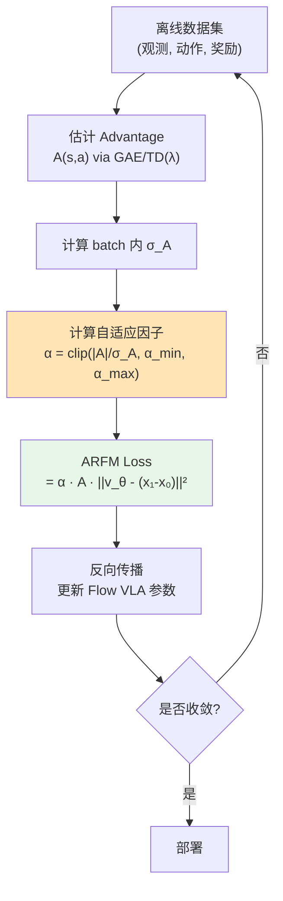

# ARFM：自适应离线 RL 后训练 Flow VLA 深度精读

> **论文标题**: Adaptive Offline RL Post-Training for VLA Flow Models  
> **作者**: Anonymous  
> **机构**: TBD  
> **发表**: arXiv:2509.04063, 2025  

**标签**: `#VLA` `#强化学习` `#FlowMatching` `#离线RL` `#自适应` `#偏差方差`

**知识链接**：
- [Flow Matching 与连续归一化流](/前置知识/000g_前置知识_Flow_Matching与连续归一化流) — Flow VLA 的生成框架
- [策略梯度与 PPO](/前置知识/000a_前置知识_策略梯度与PPO) — 对比：在线 RL 方法
- [离线强化学习基础](/前置知识/000s_前置知识_离线强化学习基础) — Offline RL 核心概念
- [KL 散度与策略约束](/前置知识/000j_前置知识_KL散度与策略约束) — 策略约束
- [VLA 模型的 RL 后训练综述](/论文综述/S06_VLA模型的RL后训练综述) — 全景概览
- [FlowRL 精读](./018_FlowRL_Flow_VLA的在线RL微调) — 对比：在线 Flow RL

---

## 一、背景与动机

### 1.1 Flow-based VLA 的 RL 挑战

Flow-based VLA（如 π₀）通过 [flow matching](/前置知识/000g_前置知识_Flow_Matching与连续归一化流) 生成连续动作。其 RL 微调面临独特挑战：

**Flow Matching Loss 和 RL Objective 的冲突**：

- Flow loss 最小化"预测速度和真实速度的差距"：让模型在任何时间步都能准确预测"从噪声到动作的方向"
- RL 要最大化累积奖励：让模型生成高奖励的动作序列

这两个目标有根本矛盾——flow loss 要求精确模仿数据中的动作方向，RL 要求偏离数据去探索更好的动作。当 RL 梯度注入 flow loss 时，会导致**梯度方差爆炸**——因为 RL advantage 的估计本身有很大噪声（特别是离线估计时），这些噪声乘到 flow loss 梯度上会使训练极不稳定。

### 1.2 ARFM 的核心思路

ARFM（Adaptive Reinforced Flow Matching）引入一个**自适应缩放因子**，在 RL 信号的"偏差"和 flow loss 的"方差"之间做最优权衡：

$$
\mathcal{L}_{\text{ARFM}} = \mathbb{E}\left[ \alpha(s, a) \cdot A(s, a) \cdot \mathcal{L}_{\text{flow}}(s, a) \right]
$$

> **一句话直觉**：还是用 advantage 加权 flow loss（好动作多学、差动作少学），但额外乘一个"信噪比调节器"$\alpha$——advantage 估计可靠时 $\alpha$ 大，不可靠时 $\alpha$ 小。

**逐项拆解**（详细推导见第二节）：

| 符号 | 含义 | 作用 |
|------|------|------|
| $\alpha(s, a)$ | 自适应缩放因子（由信噪比决定） | "这个 RL 信号可信吗？" |
| $A(s, a)$ | Advantage 函数（动作好坏的评分） | "这个动作好还是差？" |
| $\mathcal{L}_{\text{flow}}(s, a)$ | 该样本的 flow matching loss | "速度场预测误差" |
| 三者相乘 | 只有信号可靠($\alpha$大) + 动作明确好/差($A$大) 时，才产生大梯度 | 双重保护：信号差不动，信号好才大力更新 |

$\alpha(s, a)$ 是自适应调节的缩放因子——当 advantage 估计可靠时放大 RL 信号，不可靠时收缩到纯 flow loss（安全兜底）。

---

## 贯穿全文的例子

> **场景**：π₀ 模型（3B 参数）在 LIBERO 执行操作任务。
>
> - **Flow VLA 特点**：动作通过 10 步 flow denoising 生成
> - **问题**：直接加 RL advantage 到 flow loss 上 → 训练崩溃
> - **ARFM 的做法**：自适应调节——对"确定好"的动作强化 RL 信号，对"不确定"的动作保守更新
> - **效果**：稳定训练 + 比 FlowRL 快收敛

---

## 二、方法详解

### 2.1 问题形式化：Flow Matching Loss 是什么

**为什么要先看这个公式**：ARFM 的目标是"给 Flow Matching loss 加上 RL 信号"。要理解 ARFM 在做什么改动，必须先搞清楚原始的 Flow Matching loss 长什么样、每一项是什么含义。

对于 Flow VLA，标准 flow matching loss 是：

$$
\mathcal{L}_{\text{flow}}(\theta) = \mathbb{E}_{t \sim U(0,1),\; x_0 \sim \mathcal{N}(0,I),\; x_1 \sim \text{demo}} \left[ \| v_\theta(x_t, t) - (x_1 - x_0) \|^2 \right]
$$

> **一句话直觉**：让网络学会"从噪声到目标动作的正确方向"——在任意中间时刻 $t$、任意中间位置 $x_t$，网络输出的速度都要指向"从噪声直奔目标"的方向。

**逐项拆解**：

| 符号 | 含义 | 在 VLA 中对应什么 |
|------|------|-----------------|
| $\mathbb{E}_{t \sim U(0,1)}$ | 随机选一个时间点 $t$（0=纯噪声，1=干净动作） | 训练时每个 batch 随机采一个 $t$ |
| $x_0 \sim \mathcal{N}(0, I)$ | 从标准正态分布采一个噪声 | flow 推理的"起点"——随机噪声 |
| $x_1 \sim \text{demo}$ | 从演示数据取一个目标动作 | 专家示范的机械臂动作（如 [Δx, Δy, Δz, gripper]） |
| $x_t = (1-t)x_0 + tx_1$ | 噪声和目标之间的**线性插值** | 一个"半成品"状态：$t=0$ 是纯噪声，$t=1$ 是干净动作 |
| $v_\theta(x_t, t)$ | 网络预测的**速度场**：在时刻 $t$、位置 $x_t$ 处应该往哪走 | VLA 中 flow head 的输出向量 |
| $(x_1 - x_0)$ | **真实的条件速度场**：从噪声直接指向目标的方向 | "正确答案"——应该走的方向 |
| $\| \cdot \|^2$ | MSE（均方误差）：预测方向和真实方向差多少 | 标准的回归损失 |

**为什么目标是 $(x_1 - x_0)$**：[Flow Matching](/前置知识/000g_前置知识_Flow_Matching与连续归一化流) 定义了一条从 $x_0$（噪声）到 $x_1$（数据）的直线路径。沿直线走的速度就是 $\frac{\mathrm{d}x_t}{\mathrm{d}t} = x_1 - x_0$——一个常数向量，不随 $t$ 变化。所以网络需要学的就是"这条直线的方向"。

**具体数值例子**：假设动作空间是 2D（$[Δx, Δy]$）

- 采样噪声 $x_0 = [0.3, -0.7]$
- 演示动作 $x_1 = [2.0, 1.5]$（往右上方移动 2cm, 1.5cm）
- 随机选 $t = 0.4$
- 插值 $x_t = (1-0.4) \times [0.3, -0.7] + 0.4 \times [2.0, 1.5] = [0.18 + 0.8,\; -0.42 + 0.6] = [0.98, 0.18]$
- 真实速度 $(x_1 - x_0) = [2.0 - 0.3,\; 1.5 - (-0.7)] = [1.7, 2.2]$
- 假设网络预测 $v_\theta(x_{0.4}, 0.4) = [1.5, 2.0]$（接近但不完美）
- 本次 loss = $\|[1.5 - 1.7,\; 2.0 - 2.2]\|^2 = (-0.2)^2 + (-0.2)^2 = 0.08$

训练目标就是让这个 0.08 尽可能小——让网络在任何 $(x_t, t)$ 处都能准确预测"该往哪走"。

**为什么是 MSE 而不是其他 loss**：速度场是连续向量，MSE 是回归连续向量的标准选择。而且 MSE 的梯度简单稳定（$\nabla = 2(v_\theta - \text{target})$），对大规模训练友好。

### 2.2 朴素做法：直接用 Advantage 加权 Flow Loss

**为什么需要这个公式**：我们想让 Flow VLA 不只模仿演示，还能从奖励信号中学习。最直接的想法：对"好动作"（advantage > 0）加大 flow loss 的权重（多学这个方向），对"差动作"（advantage < 0）减小权重（少学这个方向）。

$$
\mathcal{L}_{\text{naive-RL}} = \mathbb{E}\left[ A(s, a) \cdot \| v_\theta(x_t, t) - (x_1 - x_0) \|^2 \right]
$$

> **一句话直觉**：好动作的 flow loss 被放大（"多学这个方向"），差动作的 flow loss 被缩小甚至取反（"别学这个方向"）。

**逐项拆解**：

| 符号 | 含义 | 作用 |
|------|------|------|
| $A(s, a)$ | [Advantage 函数](/前置知识/000a_前置知识_策略梯度与PPO)：这个动作 $a$ 在状态 $s$ 下比平均好多少 | 正值=好动作（加大力度学），负值=差动作（反向推开） |
| $\| v_\theta - (x_1 - x_0) \|^2$ | 原始 flow loss：速度场的预测误差 | 被 advantage 加权后变成"选择性学习" |
| $s$ | 当前观测/状态（图像+指令） | 决定 advantage 的上下文 |
| $a$ = $x_1$ | 被评估的动作（来自离线数据） | advantage 评价的对象 |

**数值例子**：

- 动作 A：$A(s, a_A) = +3.0$（很好的动作），flow loss = 0.08
  - 加权后 loss = $3.0 \times 0.08 = 0.24$（被放大 → 强力朝这个方向学）
- 动作 B：$A(s, a_B) = -2.0$（差的动作），flow loss = 0.15
  - 加权后 loss = $-2.0 \times 0.15 = -0.30$（负值 → 梯度反向 → 推离这个方向）
- 动作 C：$A(s, a_C) = +0.05$（和平均差不多），flow loss = 0.12
  - 加权后 loss = $0.05 \times 0.12 = 0.006$（几乎不学 → 不确定就别动）

**问题在哪**：

$A(s, a)$ 是从有限的离线数据**估计**出来的，本身有很大噪声。如果某个动作真实 advantage = 0.1（略好），但估计出来 $\hat{A} = 5.0$（严重高估），那 flow loss 会被放大 50 倍——梯度直接炸了。

在一个 batch 里：
- 有些样本的 $\hat{A}$ 估计偏高 → 梯度很大往一边拉
- 有些样本的 $\hat{A}$ 估计偏低 → 梯度很大往另一边拉
- 结果：梯度方向每步都变，参数来回震荡 → **训练不稳定/崩溃**

这就是论文要解决的核心问题：**RL 信号的噪声污染了 flow loss 的梯度**。

### 2.3 ARFM 的核心创新：自适应缩放因子

**为什么需要这个公式**：我们需要一个"信号质量检测器"——当 advantage 的估计可靠时（信号强、噪声低），放大 RL 信号；当估计不可靠时（信号弱、噪声高），收缩到保守的纯 flow loss。

ARFM 的完整损失：

$$
\mathcal{L}_{\text{ARFM}} = \mathbb{E}\left[ \alpha(s, a) \cdot A(s, a) \cdot \| v_\theta(x_t, t) - (x_1 - x_0) \|^2 \right]
$$

> **一句话直觉**：和朴素做法一样用 advantage 加权 flow loss，但额外乘一个"信噪比调节器" $\alpha$——advantage 估计越可靠，$\alpha$ 越大，RL 信号越强；反之 $\alpha$ 趋近零，退化为纯 flow loss（安全兜底）。

其中 $\alpha(s, a)$ 定义为：

$$
\alpha(s, a) = \text{clip}\left( \frac{|A(s, a)|}{\sigma_A + \epsilon}, \; \alpha_{\min}, \; \alpha_{\max} \right)
$$

> **一句话直觉**：$\alpha$ 就是"信噪比"——信号（advantage 绝对值）除以噪声（advantage 的标准差）。信噪比高就大胆更新，信噪比低就保守。

**逐项拆解**：

| 符号 | 含义 | 直觉 |
|------|------|------|
| $\|A(s, a)\|$ | advantage 的绝对值 | "信号强度"——不管是好是坏，绝对值大说明 RL 信息量大 |
| $\sigma_A$ | 当前 batch 中所有 advantage 的标准差 | "噪声水平"——整个 batch 的 advantage 波动有多大 |
| $\epsilon$ | 小常数（如 $10^{-8}$） | 防止 $\sigma_A = 0$ 时除以零 |
| $\frac{\|A\|}{\sigma_A}$ | **信噪比 (SNR)**：信号 vs 噪声 | SNR 高=可信，SNR 低=不可信 |
| $\text{clip}(\cdot, \alpha_{\min}, \alpha_{\max})$ | 把结果限制在 $[\alpha_{\min}, \alpha_{\max}]$ | 防止极端值：太小会完全忽略 RL，太大会过度放大 |
| $\alpha_{\min}$（如 0.1） | 下界 | 即使信噪比很低，也保留最小 RL 信号 |
| $\alpha_{\max}$（如 5.0） | 上界 | 即使信噪比很高，也不能无限放大 |

**具体数值例子**：假设一个 batch 中 $\sigma_A = 0.5$，$\alpha_{\min}=0.1$，$\alpha_{\max}=5.0$

| 动作 | $A(s,a)$ | $\|A\|/\sigma_A$ | clip 后 $\alpha$ | 含义 |
|------|---------|-------------------|-----------------|------|
| 确信好动作 | +2.0 | 4.0 | 4.0 | 强力朝这个方向学（信号可靠） |
| 稍微好动作 | +0.3 | 0.6 | 0.6 | 温和学习（信号一般） |
| 不确定动作 | +0.02 | 0.04 | 0.1 (被 clip) | 几乎不动（信号太弱，不如保守） |
| 确信差动作 | -1.5 | 3.0 | 3.0 | 强力远离这个方向（信号可靠） |

**完整计算一个样本的 ARFM loss**：

确信好动作（$A = +2.0$, $\alpha = 4.0$, flow loss = 0.08）：
$$
\mathcal{L} = 4.0 \times 2.0 \times 0.08 = 0.64
$$

不确定动作（$A = +0.02$, $\alpha = 0.1$, flow loss = 0.12）：
$$
\mathcal{L} = 0.1 \times 0.02 \times 0.12 = 0.00024
$$

差 400 倍！确信的好动作获得强力学习，不确定的动作几乎不动。这就是"自适应"的含义。

**为什么用 $|A|/\sigma_A$ 这个形式**：这就是统计学中经典的**信噪比**。和"检验统计量"（如 t-test 中的 $t = \bar{x}/\text{SE}$）同构——信号除以噪声，大于某阈值才"显著"，才值得采信。

### 2.4 偏差-方差权衡的理论分析

**为什么需要理论分析**：前面的 $\alpha$ 是启发式设计的，但它为什么有效？论文给出了理论依据——$\alpha$ 的最优值恰好是偏差-方差权衡的最优解。

RL 梯度估计的总误差：

$$
\text{MSE}(\hat{\nabla}) = \underbrace{\text{Bias}^2(\hat{\nabla})}_{\text{偏差}^2} + \underbrace{\text{Var}(\hat{\nabla})}_{\text{方差}}
$$

> **一句话直觉**：梯度估计的总误差 = "系统性偏离真值的程度"² + "每次估计的不稳定程度"。两者此消彼长——要同时最小化它们。

**逐项拆解**：

| 项 | 含义 | 在 ARFM 中对应什么 |
|---|---|---|
| $\text{Bias}^2$ | 梯度估计的系统性偏差 | $\alpha$ 太小 → RL 信号被压制 → 策略改进不足 → 偏差大 |
| $\text{Var}$ | 梯度估计的随机波动 | $\alpha$ 太大 → 噪声 advantage 被放大 → 梯度震荡 → 方差大 |
| MSE | 总误差（越小越好） | 找到让总误差最小的 $\alpha^*$ |

**数值直觉**：

- $\alpha = 0$（纯 flow loss，不用 RL）：偏差最大（完全不改进），方差最小（没有 RL 噪声）
- $\alpha = 10$（过度放大 RL）：偏差小（改进很激进），方差最大（噪声被放大 10 倍）
- $\alpha^*$（最优值）：在两者之间找平衡点

最优 $\alpha^*$ 的解析解：

$$
\alpha^* = \frac{\text{SNR}}{1 + \text{SNR}}, \quad \text{SNR} = \frac{|A|^2}{\sigma_A^2}
$$

> **一句话直觉**：$\alpha^*$ 就是"信噪比占总量的比例"。信噪比无穷大（完美估计）→ $\alpha^* \to 1$（完全信任 RL）；信噪比为零（纯噪声）→ $\alpha^* \to 0$（完全放弃 RL）。

**逐项拆解**：

| 项 | 含义 |
|---|---|
| $\text{SNR} = \frac{\|A\|^2}{\sigma_A^2}$ | 信噪比的平方形式 |
| $\frac{\text{SNR}}{1+\text{SNR}}$ | 把 SNR 映射到 [0, 1) 范围的单调递增函数 |
| SNR = 0 → $\alpha^* = 0$ | 纯噪声 → 完全不信任 RL 信号 |
| SNR = 1 → $\alpha^* = 0.5$ | 信号和噪声一样大 → 半信半疑 |
| SNR = 9 → $\alpha^* = 0.9$ | 信号是噪声的 3 倍 → 基本信任 |
| SNR → ∞ → $\alpha^* → 1$ | 完美信号 → 完全信任 |

**为什么 ARFM 公式（$|A|/\sigma_A$）和最优解（$\text{SNR}/(1+\text{SNR})$）不完全一样**：实践中直接用 $|A|/\sigma_A$（再 clip）就够了——它和最优解是单调关系（都是 SNR 的增函数），在 clip 范围内行为相似。而且 $|A|/\sigma_A$ 计算更简单，不需要估计 $\sigma_A^2$ 的精确值。

### 2.5 离线训练流程

ARFM 是**纯离线**方法，不需要环境交互：

**关键步骤详解**：

1. **数据准备**：收集 rollout 轨迹——可以用 SFT 策略在仿真中跑一批，记录 $(s_t, a_t, r_t)$
2. **Advantage 估计**：用 [GAE](/前置知识/000a_前置知识_策略梯度与PPO)（广义优势估计）从离线数据计算每个 $(s, a)$ 的 advantage
3. **$\sigma_A$ 计算**：对当前 mini-batch 中所有样本的 advantage 取标准差
4. **自适应加权训练**：用 ARFM loss 做正常的梯度下降
5. 可选：用更新后的策略收集新数据 → 迭代（离线 → 在线 的渐进过渡）

---

## 三、实验结果

### 3.1 LIBERO 基准

| 方法 | 训练方式 | 成功率 | 训练稳定性 |
|------|---------|--------|-----------|
| SFT | 离线 | 65% | ✅ 稳定 |
| FlowRL (在线) | 在线 | 78% | ⚠️ 偶尔崩溃 |
| Naive RL-weighted flow | 离线 | 58% ❌ | ❌ 不稳定 |
| **ARFM** | **离线** | **76%** | **✅ 稳定** |

**核心发现**：ARFM 在纯离线设置下接近在线 FlowRL 的性能，且训练极其稳定。

### 3.2 泛化与鲁棒性

| 测试场景 | FlowRL | ARFM |
|---------|--------|------|
| 正常（同分布） | 78% | 76% |
| 新物体颜色 | 65% | 72% ✅ |
| 新相机角度 | 60% | 70% ✅ |
| 新物体位置 | 58% | 68% ✅ |

ARFM 的泛化性优于 FlowRL——因为离线方法保守更新，避免了过拟合到仿真特定状态。

---

## 四、总结

| 维度 | ARFM |
|------|------|
| 核心问题 | Flow VLA 的 RL 梯度方差过大 |
| 核心方案 | 自适应缩放因子做偏差-方差最优权衡 |
| 训练方式 | 纯离线（无需环境交互） |
| 适用模型 | Flow-based VLA（π₀ 等） |
| 关键优势 | 训练稳定 + 泛化好 + 离线可行 |

---

## 延伸阅读

- [FlowRL：Flow VLA 的在线 RL 微调](./018_FlowRL_Flow_VLA的在线RL微调) — 在线版本，对比参考
- [ProphRL：预测式 VLA 后训练](./022_ProphRL_预测式VLA后训练) — 另一种 Flow VLA 的高效 RL
- [CO-RFT：离线分块 RL](./021_CO_RFT_离线分块RL微调VLA) — 自回归 VLA 的离线 RL
