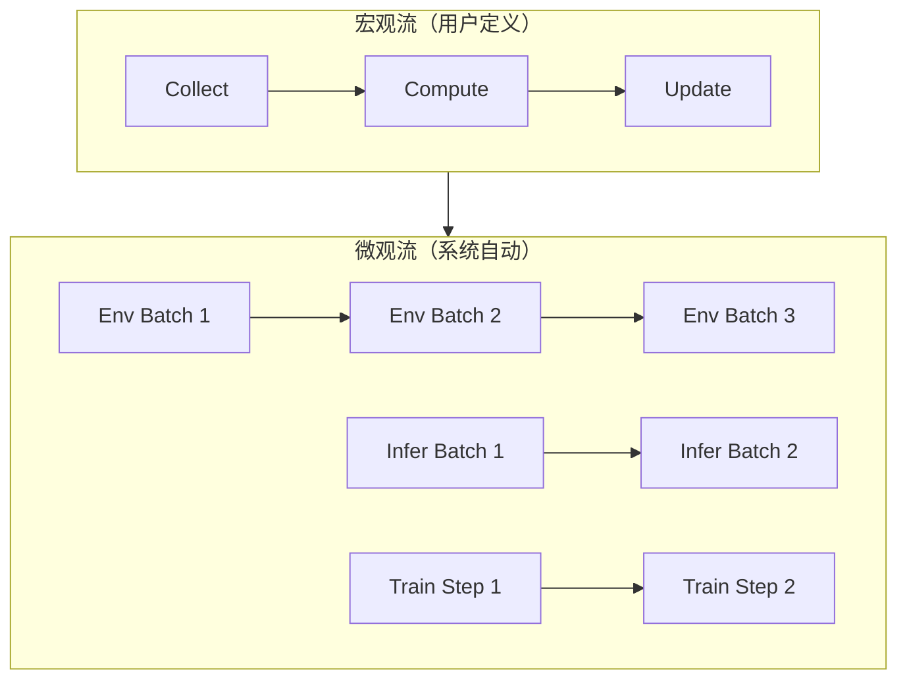

# RLinf-VLA：统一高效 VLA RL 训练框架深度精读

> **论文标题**: RLinf-VLA: A Unified and Efficient Framework for Reinforcement Learning of Vision-Language-Action Models  
> **作者**: Chao Yu, et al.  
> **机构**: Tsinghua University  
> **发表**: arXiv:2510.06710, 2025  
> **代码**: https://github.com/OpenRLHF/RLinf

**标签**: `#VLA` `#强化学习` `#训练框架` `#系统` `#异步调度` `#PPO` `#GRPO` `#可扩展`

**知识链接**：
- [策略梯度与 PPO](/前置知识/000a_前置知识_策略梯度与PPO) — PPO 算法
- [GRPO](/前置知识/000m_前置知识_GRPO_Group_Relative_Policy_Optimization) — GRPO 算法
- [Replay Buffer](/前置知识/000r_前置知识_Replay_Buffer_经验回放) — 经验存储
- [VLA 模型的 RL 后训练综述](/论文综述/S06_VLA模型的RL后训练综述) — VLA + RL 全景图
- [SimpleVLA-RL 精读](./012_SimpleVLA_RL_可扩展VLA_RL训练) — 对比系统

---

## 一、背景与动机

### 1.1 VLA RL 训练的系统瓶颈

VLA 的 RL 训练涉及三个子系统的协调：


三个子系统的资源需求完全不同：

| 子系统 | 计算类型 | 瓶颈 | 典型耗时 |
|--------|---------|------|---------|
| 环境渲染 | GPU 图形渲染 | GPU 显存带宽 | 5ms/step |
| 策略推理 | 大模型 forward | GPU 计算 + 显存 | 100ms/step |
| 模型训练 | 大模型 backward | GPU 计算 + 通信 | 500ms/step |

**传统做法**：三个阶段串行执行 → GPU 利用率只有 30-40%。大部分时间在等待其他子系统完成。

### 1.2 RLinf-VLA 的设计目标

1. **统一接口**：一个框架支持多种 VLA 架构（自回归/Flow/Diffusion）× 多种 RL 算法（PPO/GRPO/SAC）× 多种仿真器
2. **高效调度**：三个子系统异步执行，最大化 GPU 利用率
3. **可扩展**：从单机 1 卡到多机多卡无缝扩展

---

## 贯穿全文的例子

> **场景**：在 8×A100 集群上训练 OpenVLA (7B) + PPO。
>
> - **传统方案**：串行训练，8 卡利用率 ~35%，一个实验需要 48h
> - **RLinf-VLA**：异步流水线，8 卡利用率 ~80%，同一实验只需 18h
> - **节省**：2.7× 训练加速，同样的卡时成本训练更多实验

---

## 二、系统架构

### 2.1 Macro-to-Micro Flow Transformation (M2Flow)

RLinf-VLA 的核心设计理念是 **M2Flow**：

**Macro Flow（宏观流）**：用户定义的高层 RL 训练逻辑

```
while not converged:
    rollouts = collect_rollouts(env, policy, n_steps=256)
    advantages = compute_advantages(rollouts)
    update_policy(policy, rollouts, advantages)
```

**Micro Flow（微观流）**：系统自动将宏观流分解为可并行的微观操作



### 2.2 资源分配策略

RLinf-VLA 将 GPU 资源动态分配给三个子系统：

| 配置 | 环境 GPU | 推理 GPU | 训练 GPU | 场景 |
|------|---------|---------|---------|------|
| 全共享 | 8 | 8 | 8 | 小模型，显存够 |
| 推理独立 | 2 | 4 | 2 | 中型模型 |
| 全独立 | 2 | 3 | 3 | 大模型（7B+） |

动态调度器根据各子系统的队列长度自动调整资源分配。

### 2.3 异步流水线

关键优化：当前 batch 的训练和下一 batch 的 rollout **同时进行**：

```
Time:  |------- Train Batch 1 -------|------- Train Batch 2 -------|
       |--- Rollout Batch 2 ---|--- Rollout Batch 3 ---|
```

**效果**：训练永远不等 rollout，rollout 永远不等训练 → GPU 利用率 80%+。

### 2.4 统一接口设计

RLinf-VLA 提供统一的抽象接口：

```python
# 统一的 VLA 接口
class VLAPolicy:
    def forward(self, obs, instruction) -> action  # 推理
    def compute_loss(self, batch) -> loss            # 训练
    def get_log_prob(self, obs, action) -> log_p     # RL 需要

# 统一的 RL 算法接口  
class RLAlgorithm:
    def compute_advantages(self, rollouts) -> advantages
    def compute_loss(self, batch, advantages) -> loss

# 统一的环境接口
class Environment:
    def step(self, action) -> obs, reward, done
    def reset() -> obs
```

支持的组合：

| VLA 类型 | RL 算法 | 仿真器 |
|---------|---------|--------|
| OpenVLA (自回归) | PPO | Isaac Gym |
| π₀ (Flow) | GRPO | MuJoCo |
| Diffusion Policy | SAC | SAPIEN |
| ACT | REINFORCE | RoboCasa |

---

## 三、实验结果

### 3.1 训练效率

在 8×A100 上训练 OpenVLA + PPO：

| 框架 | 训练吞吐量 (rollouts/h) | GPU 利用率 | 达到 80% SR |
|------|------------------------|-----------|------------|
| Naive (serial) | 120 | 35% | 48h |
| SimpleVLA-RL | 280 | 55% | 24h |
| **RLinf-VLA** | **450** | **80%** | **18h** |

### 3.2 扩展性

| GPU 数量 | 相对吞吐量 | 线性扩展比 |
|---------|-----------|-----------|
| 1 | 1× | - |
| 4 | 3.6× | 90% |
| 8 | 6.8× | 85% |
| 16 | 12.5× | 78% |

接近线性扩展。

### 3.3 算法性能（验证统一接口不影响精度）

| VLA + 算法 | RLinf-VLA | 原始实现 | 差异 |
|-----------|-----------|---------|------|
| OpenVLA + PPO | 87.2% | 87.5% | -0.3% |
| π₀ + GRPO | 82.1% | 81.8% | +0.3% |
| OpenVLA + GRPO | 85.4% | 85.0% | +0.4% |

精度一致，纯加速无损失。

---

## 四、对研究者的价值

RLinf-VLA 对 VLA RL 研究的价值在于**降低了实验门槛**：

| 之前 | 之后 |
|------|------|
| 每换一个 VLA 或 RL 算法要重写训练代码 | 统一接口，一行配置切换 |
| 优化训练效率需要系统工程经验 | 自动异步调度 |
| 多机训练需要手动配置分布式 | 一键多机扩展 |
| 一个实验 48h | 同一实验 18h |

---

## 五、总结

| 维度 | RLinf-VLA |
|------|-----------|
| 定位 | VLA RL 训练的统一系统框架 |
| 核心创新 | M2Flow 异步调度 + 统一接口 |
| 训练加速 | 2.7× vs serial，1.6× vs SimpleVLA-RL |
| GPU 利用率 | 80%（vs 35% serial） |
| 支持组合 | 多种 VLA × 多种 RL × 多种仿真器 |
| 开源 | https://github.com/OpenRLHF/RLinf |

---

## 延伸阅读

- [SimpleVLA-RL：可扩展 VLA RL 训练](./012_SimpleVLA_RL_可扩展VLA_RL训练) — 对比系统方案
- [VLA-RL：PPO 直接训练自回归 VLA](./006_VLA_RL_PPO直接训练自回归VLA) — RLinf 支持的算法实例
- [FlowRL：Flow VLA 的在线 RL](./018_FlowRL_Flow_VLA的在线RL微调) — RLinf 支持的 Flow RL
