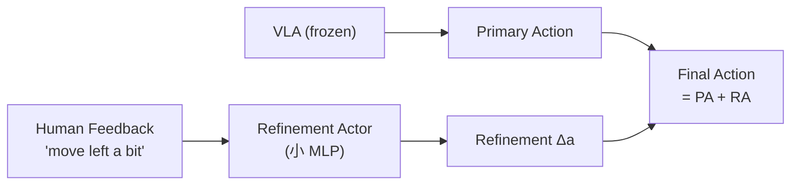
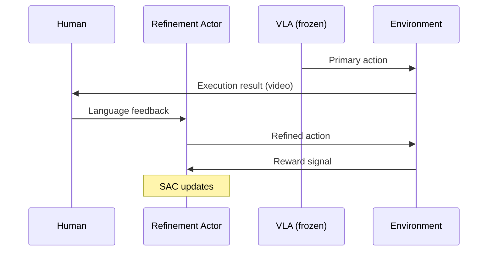

# Dual-Actor：人机协作 RL 微调 VLA 深度精读

> **论文标题**: Dual-Actor Fine-Tuning of VLA Models: A Talk-and-Tweak Human-in-the-Loop Approach  
> **作者**: Anonymous  
> **机构**: TBD  
> **发表**: arXiv:2509.13774, 2025  

**标签**: `#VLA` `#强化学习` `#HumanInTheLoop` `#双Actor` `#潜空间` `#轻量适配`

**知识链接**：
- [策略梯度与 PPO](/前置知识/000a_前置知识_策略梯度与PPO) — RL 优化方法
- [SAC](/前置知识/000k_前置知识_SAC_Soft_Actor_Critic) — Refinement Actor 训练
- [行为克隆与 RL 微调范式](/前置知识/000d_前置知识_行为克隆与RL微调范式) — SFT + RL
- [KL 散度与策略约束](/前置知识/000j_前置知识_KL散度与策略约束) — 策略约束
- [VLA 模型的 RL 后训练综述](/论文综述/S06_VLA模型的RL后训练综述) — VLA + RL 全景图
- [BootRL 精读](./013_BootRL_冻结VLA加RL_Head) — 对比：冻结 VLA 加小 head
- [PLD 精读](./015_PLD_Residual_RL自改进VLA) — 对比：Residual RL

---

## 一、背景与动机

### 1.1 纯自动 RL vs 人类参与

纯自动 RL 微调 VLA 有两个根本问题：

1. **奖励设计**：需要为每个任务设计奖励函数，通用性差
2. **安全边界**：RL 探索可能进入危险状态，没有人类监督

相反，纯人类指导（如更多示教）：
- 成本高
- 人类的精细动作很难准确示教

### 1.2 Dual-Actor 的折中方案

Dual-Actor 框架将策略分为**两个 Actor**：

| Actor | 职责 | 规模 | 训练方式 |
|-------|------|------|---------|
| Primary Actor | 多任务基础执行 | 大（VLA backbone） | SFT（冻结） |
| Refinement Actor | 精细调整 + 适配 | 小（潜空间 MLP） | RL + 人类反馈 |

人类通过**自然语言**给出反馈（如 "move a bit to the left"），Refinement Actor 将语言反馈转化为动作修正。

---

## 贯穿全文的例子

> **场景**：VLA 模型执行 "insert the USB cable"（极精细任务）。
>
> - VLA 能抓到 USB 并对准大致方向，但插入精度不够
> - **人类介入**："tilt slightly clockwise" → Refinement Actor 输出姿态修正
> - **RL 学习**：多次交互后，Refinement Actor 自动学会在类似场景做正确修正
> - 最终：无需人类持续干预，Refinement Actor 自动精调

---

## 二、方法详解

### 2.1 Primary Actor（冻结）

Primary Actor 就是预训练好的 VLA 模型，**完全冻结**：

$$
a_{\text{primary}} = \text{VLA}_{\text{frozen}}(o_t, \text{task\_instruction})
$$

优势：
- 保留泛化能力
- 无计算开销
- 多任务能力不受影响

### 2.2 Refinement Actor（轻量可训练）

Refinement Actor 是一个在潜空间操作的小网络：

$$
z = \text{Encoder}(\text{human\_feedback}, o_t)
$$
$$
\Delta a = \text{MLP}(z, a_{\text{primary}})
$$

**设计特点**：
- 输入包含人类语言反馈的编码
- 参数量 ~5M（VLA 的千分之一）
- 在潜空间做修正，而非直接在动作空间

### 2.3 人类反馈的 RL 融合

Dual-Actor 的 RL 训练结合两种奖励信号：

$$
r_t = r_{\text{task}} + \lambda_h \cdot r_{\text{human}}
$$

- $r_{\text{task}}$：环境的任务奖励（成功/失败）
- $r_{\text{human}}$：人类的即时反馈奖励（点赞/摇头，或语言评价）

训练 Refinement Actor 使用 SAC（off-policy，样本高效）：

$$
\mathcal{L}_{\text{refine}} = \mathcal{L}_{\text{SAC}}(\Delta a | z, a_{\text{primary}})
$$

### 2.4 "Talk-and-Tweak" 交互协议

---

## 三、实验结果

### 3.1 精细操作任务

| 任务 | VLA only | + Refinement (RL) | + Human Feedback |
|------|----------|-------------------|------------------|
| USB 插入 | 25% | 52% | 78% |
| 螺丝拧紧 | 30% | 55% | 82% |
| 线缆布线 | 20% | 45% | 70% |

人类反馈让精细操作成功率提升 25%+。

### 3.2 学习效率

| 方法 | 达到 70% SR 所需人类交互次数 |
|------|---------------------------|
| 纯 SFT (更多示教) | 200 次 |
| DAgger | 150 次 |
| **Dual-Actor** | **30 次** |

仅需 30 次人类反馈交互即可收敛——因为 RL 能从每次反馈中泛化。

### 3.3 Refinement Actor 的泛化

训练完成后（无人类），Refinement Actor 能自动处理类似场景：

| 场景 | 有人类 | 无人类（自动） | 差距 |
|------|--------|--------------|------|
| 训练见过的物体 | 82% | 78% | -4% |
| 新颜色物体 | 80% | 72% | -8% |
| 新形状物体 | 75% | 60% | -15% |

在见过的物体类型上，Refinement Actor 几乎能完全替代人类。

---

## 四、核心优势与局限

### 优势

1. **极轻量**：Refinement Actor 仅 5M 参数
2. **人机协作**：利用人类的高层语义理解 + RL 的精细优化
3. **不影响基础能力**：VLA 完全冻结
4. **样本高效**：30 次人类交互即收敛
5. **渐进自主**：逐步减少人类干预

### 局限

1. **需要人类参与**：初期训练需要人类在线反馈（不能全自动）
2. **语言理解有限**：Refinement Actor 对复杂指令理解有限
3. **精细度上限**：受限于机器人硬件精度

---

## 五、总结

| 维度 | Dual-Actor |
|------|-----------|
| 核心创新 | 冻结 VLA + 轻量 Refinement Actor + 人类语言反馈 |
| RL 算法 | SAC (Refinement Actor) |
| 人类成本 | 30 次交互后可自主运行 |
| 适用场景 | 高精度操作（插入、拧紧等） |
| 与 BootRL 区别 | Dual-Actor 融合人类反馈，BootRL 纯自动 RL |

---

## 延伸阅读

- [BootRL：冻结 VLA + RL Head](./013_BootRL_冻结VLA加RL_Head) — 类似架构但纯自动
- [PLD：Residual RL 自改进 VLA](./015_PLD_Residual_RL自改进VLA) — 另一种"冻结 + 小模块"路线
- [RECAP：从真实部署经验中学习](./016_RECAP_从真实部署经验中RL学习) — 也涉及真实交互反馈
