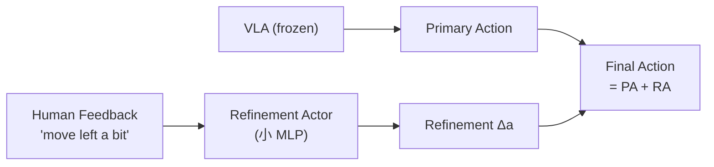
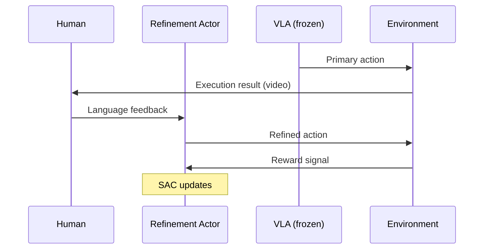

# Dual-Actor：人机协作 RL 微调 VLA 深度精读

> **论文标题**: Dual-Actor Fine-Tuning of VLA Models: A Talk-and-Tweak Human-in-the-Loop Approach  
> **作者**: Anonymous  
> **机构**: TBD  
> **发表**: arXiv:2509.13774, 2025  

**标签**: `#VLA` `#强化学习` `#HumanInTheLoop` `#双Actor` `#潜空间` `#轻量适配`

**知识链接**：
- [策略梯度与 PPO](/前置知识/000a_前置知识_策略梯度与PPO) — RL 优化方法
- [SAC](/前置知识/000k_前置知识_SAC_Soft_Actor_Critic) — Refinement Actor 训练
- [行为克隆与 RL 微调范式](/前置知识/000d_前置知识_行为克隆与RL微调范式) — SFT + RL
- [KL 散度与策略约束](/前置知识/000j_前置知识_KL散度与策略约束) — 策略约束
- [VLA 模型的 RL 后训练综述](/论文综述/S06_VLA模型的RL后训练综述) — VLA + RL 全景图
- [BootRL 精读](./013_BootRL_冻结VLA加RL_Head) — 对比：冻结 VLA 加小 head
- [PLD 精读](./015_PLD_Residual_RL自改进VLA) — 对比：Residual RL

---

## 一、背景与动机

### 1.1 纯自动 RL vs 人类参与

纯自动 RL 微调 VLA 有两个根本问题：

1. **奖励设计**：需要为每个任务设计奖励函数，通用性差
2. **安全边界**：RL 探索可能进入危险状态，没有人类监督

相反，纯人类指导（如更多示教）：
- 成本高
- 人类的精细动作很难准确示教

### 1.2 Dual-Actor 的折中方案

Dual-Actor 框架将策略分为**两个 Actor**：

| Actor | 职责 | 规模 | 训练方式 |
|-------|------|------|---------|
| Primary Actor | 多任务基础执行 | 大（VLA backbone） | SFT（冻结） |
| Refinement Actor | 精细调整 + 适配 | 小（潜空间 MLP） | RL + 人类反馈 |

人类通过**自然语言**给出反馈（如 "move a bit to the left"），Refinement Actor 将语言反馈转化为动作修正。

```mermaid
flowchart LR
    H["Human Feedback<br>'move left a bit'"] --> R["Refinement Actor<br>(小 MLP)"]
    V["VLA (frozen)"] --> PA["Primary Action"]
    R --> RA["Refinement Δa"]
    PA --> F["Final Action<br>= PA + RA"]
    RA --> F
```

---

## 贯穿全文的例子

> **场景**：VLA 模型执行 "insert the USB cable"（极精细任务）。
>
> - VLA 能抓到 USB 并对准大致方向，但插入精度不够
> - **人类介入**："tilt slightly clockwise" → Refinement Actor 输出姿态修正
> - **RL 学习**：多次交互后，Refinement Actor 自动学会在类似场景做正确修正
> - 最终：无需人类持续干预，Refinement Actor 自动精调

---

## 二、方法详解

### 2.1 Primary Actor（冻结）

Primary Actor 就是预训练好的 VLA 模型，**完全冻结**：

$$
a_{\text{primary}} = \text{VLA}_{\text{frozen}}(o_t, \text{task\_instruction})
$$

**这个公式在做什么**：让冻结的 VLA 模型照常执行任务，输出一个"大致正确但不够精细"的基础动作——它是整个系统里唯一负责"泛化到不同任务"的部分。

::: details 📐 公式详解（点击展开）

| 子表达式 | 它是谁 | 它在干嘛 |
|---------|--------|---------|
| $\text{VLA}_{\text{frozen}}$ | **不变的老师傅** | 预训练好的 VLA 模型，参数在整个 Dual-Actor 训练过程中完全锁死，不参与梯度更新 |
| $o_t$ | **当前看到的画面** | 时刻 $t$ 的观测（相机图像、机器人本体状态等） |
| $\text{task\_instruction}$ | **任务说明书** | 自然语言描述的任务目标，如 "insert the USB cable" |
| $a_{\text{primary}}$ | **粗略但可用的动作** | VLA 直接输出的基础动作，覆盖大方向但精度不够 |

**用人话读**："把当前画面和任务指令喂给冻结不动的 VLA，它照常输出一个大致对的动作。"

**为什么是这个形式**：冻结 VLA 是为了保留它在大规模预训练数据上学到的泛化能力——如果继续微调 VLA 本身，容易在小样本的精细任务上过拟合、损害多任务能力（1.2 节的核心动机）。精细度的缺口交给下面的 Refinement Actor 补。
:::

优势：
- 保留泛化能力
- 无计算开销
- 多任务能力不受影响

### 2.2 Refinement Actor（轻量可训练）

Refinement Actor 是一个在潜空间操作的小网络：

$$
z = \text{Encoder}(\text{human\_feedback}, o_t)
$$

**这个公式在做什么**：把人类说的一句话（如 "tilt slightly clockwise"）和当前画面一起编码成一个潜空间向量 $z$，作为"人类到底想让我怎么修正"的浓缩表示。

::: details 📐 公式详解（点击展开）

| 子表达式 | 它是谁 | 它在干嘛 |
|---------|--------|---------|
| $\text{human\_feedback}$ | **人类的原话** | 自然语言反馈，如 "move a bit to the left" |
| $o_t$ | **当前画面** | 与语言反馈同一时刻的观测，用来把抽象的语言落到具体场景 |
| $\text{Encoder}$ | **翻译官** | 把"语言 + 画面"这对输入压缩成一个定长向量 |
| $z$ | **修正意图的浓缩表示** | 潜空间向量，后面 MLP 只需要看这一个向量就知道"该往哪个方向调" |

**用人话读**："把人类这句话和当前画面一起丢进编码器，压缩成一个向量，代表'人类现在想要的修正方向'。"

**为什么在潜空间而不是直接解析语言成具体数值**：语言反馈是模糊的（"往左一点"到底是多少毫米没人说清楚），潜空间表示允许网络自己学习"往左一点"对应的连续修正量，比硬编码规则灵活。
:::

$$
\Delta a = \text{MLP}(z, a_{\text{primary}})
$$

**这个公式在做什么**：结合"人类想要的修正方向"$z$ 和"VLA 给出的基础动作"$a_{\text{primary}}$，算出一个要叠加上去的修正量 $\Delta a$。

::: details 📐 公式详解（点击展开）

| 子表达式 | 它是谁 | 它在干嘛 |
|---------|--------|---------|
| $z$ | **修正意图** | 上一步编码出的、代表人类反馈的潜空间向量 |
| $a_{\text{primary}}$ | **基础动作** | VLA 给出的粗略动作，MLP 需要知道"基础在哪"才能算出恰当的修正量 |
| $\text{MLP}$ | **小裁缝** | 一个约 5M 参数的小网络，专门负责把 $z$ 和 $a_{\text{primary}}$ 缝合成具体的修正向量 |
| $\Delta a$ | **修正量** | 要叠加在基础动作上的偏移，如"绕某个轴多转 3 度" |

**用人话读**："把人类的修正意图和当前的基础动作一起交给一个小网络，让它算出具体该往哪个方向、多大幅度地修正。"

**为什么要同时输入 $a_{\text{primary}}$**：修正量应该是"相对于当前基础动作"的调整，而不是凭空产生的绝对值——同一句"往左一点"，在基础动作已经偏左很多和完全没偏时，该修正的量是不一样的，所以 MLP 需要看到 $a_{\text{primary}}$ 才能算准。
:::

**设计特点**：
- 输入包含人类语言反馈的编码
- 参数量 ~5M（VLA 的千分之一）
- 在潜空间做修正，而非直接在动作空间

### 2.3 人类反馈的 RL 融合

Dual-Actor 的 RL 训练结合两种奖励信号：

$$
r_t = r_{\text{task}} + \lambda_h \cdot r_{\text{human}}
$$

**这个公式在做什么**：把"任务本身完成得怎样"和"人类当场满不满意"两种反馈信号加权合并成一个奖励，同时喂给 RL 训练。

::: details 📐 公式详解（点击展开）

| 子表达式 | 它是谁 | 它在干嘛 |
|---------|--------|---------|
| $r_{\text{task}}$ | **任务判官** | 环境给出的任务奖励，通常是成功/失败这种稀疏信号 |
| $r_{\text{human}}$ | **人类打分员** | 人类的即时反馈，如点赞/摇头，或对语言评价打的分 |
| $\lambda_h$ | **人类意见的权重** | 一个标量系数，控制人类反馈相对任务奖励的重要程度 |
| $r_t$ | **合并后的总奖励** | 两路信号加权求和后，喂给 SAC 训练用的最终奖励 |

**用人话读**："把任务完成度和人类当场的反馈按权重加起来，作为这一步的总奖励。"

**为什么要加人类反馈而不是只用任务奖励**：纯任务奖励往往稀疏（只在成功时给分），精细操作任务中失败的中间过程缺乏梯度信号；人类的即时反馈能在任务还没完成时就告诉 Refinement Actor "往哪个方向调是对的"，加速学习（对应 3.2 节"仅需 30 次交互即收敛"的结果）。
:::

- $r_{\text{task}}$：环境的任务奖励（成功/失败）
- $r_{\text{human}}$：人类的即时反馈奖励（点赞/摇头，或语言评价）

训练 Refinement Actor 使用 [SAC](/前置知识/000k_前置知识_SAC_Soft_Actor_Critic)（off-policy，样本高效）：

$$
\mathcal{L}_{\text{refine}} = \mathcal{L}_{\text{SAC}}(\Delta a | z, a_{\text{primary}})
$$

**这个公式在做什么**：用标准 SAC 的损失函数训练 Refinement Actor，只不过它要优化的"动作"是修正量 $\Delta a$，而不是完整动作。

::: details 📐 公式详解（点击展开）

| 子表达式 | 它是谁 | 它在干嘛 |
|---------|--------|---------|
| $\mathcal{L}_{\text{SAC}}$ | **标准配方** | [SAC](/前置知识/000k_前置知识_SAC_Soft_Actor_Critic) 的标准损失（Critic 的 TD 误差 + Actor 的熵正则化目标） |
| $\Delta a$ | **待优化的输出** | SAC 中原本要学习的"动作"，这里替换成了修正量 |
| $z, a_{\text{primary}}$ | **条件输入** | SAC 中原本的"状态"，这里替换成了潜空间编码和基础动作，作为 Refinement Actor 决策的依据 |

**用人话读**："照搬 SAC 的训练配方，只是把'状态'换成了人类反馈编码和基础动作，把'动作'换成了修正量。"

**为什么用 SAC 而不是 PPO 之类的 on-policy 算法**：人类反馈交互成本高（每次都需要真人参与），必须尽量重复利用已收集的数据——SAC 是 off-policy 算法，能反复从 replay buffer 里采样旧数据训练，样本效率远高于 on-policy 方法，这正是"仅需 30 次交互收敛"的关键（对应 3.2 节实验结果）。
:::

### 2.4 "Talk-and-Tweak" 交互协议

```mermaid
sequenceDiagram
    participant H as Human
    participant R as Refinement Actor
    participant V as VLA (frozen)
    participant E as Environment
    
    V->>E: Primary action
    E->>H: Execution result (video)
    H->>R: Language feedback
    R->>E: Refined action
    E->>R: Reward signal
    Note over R: SAC updates
```

---

## 三、实验结果

### 3.1 精细操作任务

| 任务 | VLA only | + Refinement (RL) | + Human Feedback |
|------|----------|-------------------|------------------|
| USB 插入 | 25% | 52% | 78% |
| 螺丝拧紧 | 30% | 55% | 82% |
| 线缆布线 | 20% | 45% | 70% |

人类反馈让精细操作成功率提升 25%+。

### 3.2 学习效率

| 方法 | 达到 70% SR 所需人类交互次数 |
|------|---------------------------|
| 纯 SFT (更多示教) | 200 次 |
| DAgger | 150 次 |
| **Dual-Actor** | **30 次** |

仅需 30 次人类反馈交互即可收敛——因为 RL 能从每次反馈中泛化。

### 3.3 Refinement Actor 的泛化

训练完成后（无人类），Refinement Actor 能自动处理类似场景：

| 场景 | 有人类 | 无人类（自动） | 差距 |
|------|--------|--------------|------|
| 训练见过的物体 | 82% | 78% | -4% |
| 新颜色物体 | 80% | 72% | -8% |
| 新形状物体 | 75% | 60% | -15% |

在见过的物体类型上，Refinement Actor 几乎能完全替代人类。

---

## 四、核心优势与局限

### 优势

1. **极轻量**：Refinement Actor 仅 5M 参数
2. **人机协作**：利用人类的高层语义理解 + RL 的精细优化
3. **不影响基础能力**：VLA 完全冻结
4. **样本高效**：30 次人类交互即收敛
5. **渐进自主**：逐步减少人类干预

### 局限

1. **需要人类参与**：初期训练需要人类在线反馈（不能全自动）
2. **语言理解有限**：Refinement Actor 对复杂指令理解有限
3. **精细度上限**：受限于机器人硬件精度

---

## 五、总结

| 维度 | Dual-Actor |
|------|-----------|
| 核心创新 | 冻结 VLA + 轻量 Refinement Actor + 人类语言反馈 |
| RL 算法 | SAC (Refinement Actor) |
| 人类成本 | 30 次交互后可自主运行 |
| 适用场景 | 高精度操作（插入、拧紧等） |
| 与 BootRL 区别 | Dual-Actor 融合人类反馈，BootRL 纯自动 RL |

---

## 延伸阅读

- [BootRL：冻结 VLA + RL Head](./013_BootRL_冻结VLA加RL_Head) — 类似架构但纯自动
- [PLD：Residual RL 自改进 VLA](./015_PLD_Residual_RL自改进VLA) — 另一种"冻结 + 小模块"路线
- [RECAP：从真实部署经验中学习](./016_RECAP_从真实部署经验中RL学习) — 也涉及真实交互反馈
