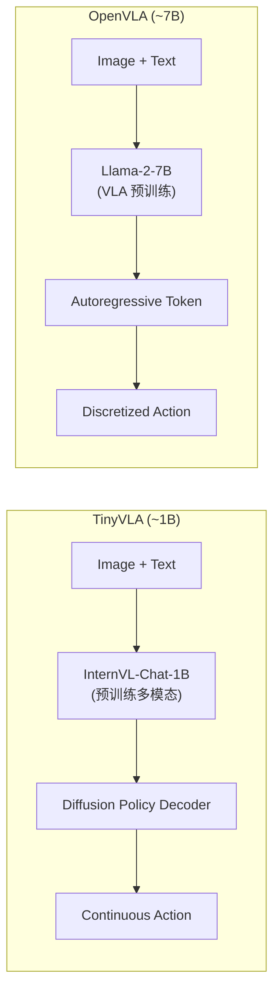

# TinyVLA：轻量快速 VLA 模型深度精读

> **论文标题**: Towards Fast, Data-Efficient Vision-Language-Action Models for Robotic Manipulation  
> **作者**: Junjie Wen, Yichen Zhu, et al.  
> **机构**: Shanghai Jiao Tong University, Midea Group  
> **发表**: arXiv:2409.12514, 2025  
> **代码**: https://github.com/lesjie-wen/tinyvla

**标签**: `#VLA` `#轻量` `#扩散策略` `#推理加速` `#数据高效` `#边缘部署`

**知识链接**：
- [扩散模型 DDPM](/前置知识/000b_前置知识_扩散模型DDPM) — 扩散策略的基础
- [Diffusion Policy](/前置知识/000c_前置知识_Diffusion_Policy) — 扩散策略解码器
- [行为克隆与 RL 微调范式](/前置知识/000d_前置知识_行为克隆与RL微调范式) — VLA 训练范式
- [动作 Token 化与自回归策略](/前置知识/000l_前置知识_动作Token化与自回归策略) — 对比：自回归方法
- [VLA 综述](/论文综述/S03_视觉语言动作模型VLA综述) — VLA 架构全景
- [OpenVLA 精读](/论文综述/015_OpenVLA_开源视觉语言动作模型) — 对比：标准 7B VLA

---

## 一、背景与动机

### 1.1 大型 VLA 的部署困境

OpenVLA (7B 参数) 等大型 VLA 模型虽然能力强，但部署面临严重挑战：

| 问题 | 具体表现 | 影响 |
|------|---------|------|
| 推理慢 | 7B 模型 forward 需要 ~500ms | 控制频率仅 2Hz |
| 显存大 | 需要 16GB+ GPU | 不能用边缘设备 |
| 训练慢 | 预训练需要数百 GPU-days | 普通实验室不可及 |
| 数据饥渴 | 需要大量多样数据才能泛化 | 收集成本高 |

**核心问题**：能否做一个又快又好、训练数据需求少的 VLA？

### 1.2 TinyVLA 的设计哲学

TinyVLA 的核心思路是**"好的初始化 + 好的解码器"**：

1. **高质量多模态 backbone**：直接用训练好的快速多模态模型（如 InternVL-Chat-1B）作为 backbone，跳过昂贵的 VLA 预训练
2. **扩散策略解码器**：用 [Diffusion Policy](/前置知识/000c_前置知识_Diffusion_Policy) 作为动作解码器，比自回归 token 生成更精确

---

## 贯穿全文的例子

> **场景**：在一个 Jetson Orin（边缘 GPU）上部署 VLA 控制机械臂。
>
> - OpenVLA (7B)：推理 500ms → 2Hz 控制频率 → 动作不流畅
> - TinyVLA (1B)：推理 80ms → 12Hz 控制频率 → 流畅精准
> - 训练：OpenVLA 需要 100 demos + 大量预训练；TinyVLA 只需 50 demos + 微调

---

## 二、方法详解

### 2.1 Architecture Design

TinyVLA 由三个组件组成：

| 组件 | 来源 | 参数量 | 作用 |
|------|------|--------|------|
| Vision Encoder | SigLIP-400M | ~400M | 图像编码 |
| Language Model | Phi-2-1.5B | ~1.5B | 多模态融合 + 推理 |
| Action Decoder | Diffusion Policy | ~50M | 动作生成 |
| **总计** | | **~2B** | |

相比 OpenVLA 的 7B，参数量减少 3.5×。

### 2.2 为什么用扩散策略解码器

自回归 VLA（如 OpenVLA）将连续动作离散化为 256 bins 的 token：

$$
a = [0.123, -0.456, 0.789, \ldots] \xrightarrow{\text{离散化}} [87, 128, 203, \ldots]
$$

**问题**：
- 量化误差：256 bins 的精度只有 ~0.004（对于归一化到 [-1,1] 的动作）
- 需要逐 token 生成：7 维动作 = 7 次 forward

扩散策略解码器直接生成连续动作：

$$
a = \text{DiffusionDecode}(z_{\text{context}}) \in \mathbb{R}^{T \times d_a}
$$

一次生成 $T$ 步的连续动作 chunk，无量化误差。

**代入数字**：
- OpenVLA：7 个 token × 500ms/token = 3.5s 生成一组动作
- TinyVLA：1 次 diffusion decode (10 steps × 8ms) = 80ms 生成 chunk

### 2.3 高效微调策略

TinyVLA 的训练只需要在目标任务数据上微调：

1. **冻结 Vision Encoder**（不需要重新学视觉）
2. **LoRA 微调 Language Model**（保留通用能力）
3. **全参数训练 Diffusion Decoder**（学任务特定的动作分布）

训练成本：50 demos × 1 张 A100 × 4 小时 = 搞定。

### 2.4 数据效率分析

为什么 TinyVLA 数据效率高？

| 因素 | 解释 |
|------|------|
| 预训练多模态理解 | backbone 已经"会看图 + 理解语言"，不需要重新学 |
| 扩散解码器的表达力 | 多模态分布建模，少量数据就能学到动作分布 |
| LoRA 微调 | 只调少量参数，不容易过拟合 |

---

## 三、实验结果

### 3.1 推理速度对比

| 模型 | 参数量 | 推理时间 | 控制频率 | GPU 需求 |
|------|--------|---------|---------|---------|
| RT-2-X | 55B | 2000ms | 0.5Hz | 8×A100 |
| OpenVLA | 7B | 500ms | 2Hz | 1×A100 |
| **TinyVLA** | **2B** | **80ms** | **12Hz** | **1×4090** |

TinyVLA 推理速度是 OpenVLA 的 **6×**。

### 3.2 任务性能

| 基准 | OpenVLA | TinyVLA | 数据量 |
|------|---------|---------|--------|
| LIBERO-Spatial | 78% | 82% ✅ | 50 demos |
| LIBERO-Object | 85% | 87% ✅ | 50 demos |
| LIBERO-Long | 45% | 52% ✅ | 50 demos |
| Real Robot (4 tasks) | 72% | 75% | 20 demos |

TinyVLA 在所有基准上都**超越** OpenVLA，同时参数量仅为其 1/3.5。

### 3.3 数据效率

| 训练数据量 | OpenVLA | TinyVLA |
|-----------|---------|---------|
| 10 demos | 35% | 55% ✅ |
| 25 demos | 58% | 72% ✅ |
| 50 demos | 78% | 82% ✅ |
| 100 demos | 83% | 85% |

数据越少，TinyVLA 的优势越明显（55% vs 35%，10 demos 时）。

---

## 四、与轻量 VLA + RL 的关联

TinyVLA 本身是 SFT 模型，但它为轻量 VLA + RL 提供了理想的 base model：

| RL 路线 | 基于 OpenVLA (7B) | 基于 TinyVLA (2B) |
|---------|-------------------|-------------------|
| Full PPO | 80GB+ 显存 | 24GB 显存 |
| LoRA PPO | 48GB | 16GB |
| Residual RL | 可行 | **可在单卡消费级 GPU 上完成** |
| 训练速度 | 1× | 3-4× |

**核心意义**：TinyVLA 让"在笔记本上做 VLA RL 研究"成为可能。

---

## 五、总结

| 维度 | TinyVLA |
|------|---------|
| 核心创新 | 高质量多模态 backbone + 扩散策略解码器 |
| 参数量 | ~2B（vs OpenVLA 7B） |
| 推理速度 | 80ms（6× faster than OpenVLA） |
| 数据效率 | 10-50 demos 即可微调 |
| 部署硬件 | 单张消费级 GPU |
| 适用 RL | 大幅降低 VLA RL 的计算门槛 |

---

## 延伸阅读

- [OpenVLA 精读](/论文综述/015_OpenVLA_开源视觉语言动作模型) — 标准 7B VLA 对比
- [VLA 综述](/论文综述/S03_视觉语言动作模型VLA综述) — VLA 架构全景
- [BootRL：冻结 VLA + RL Head](./013_BootRL_冻结VLA加RL_Head) — 可基于 TinyVLA 做 RL
