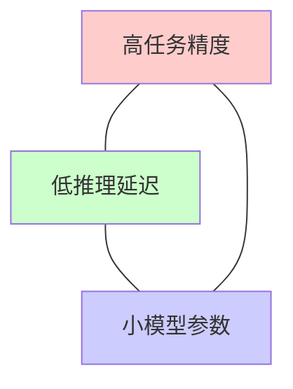
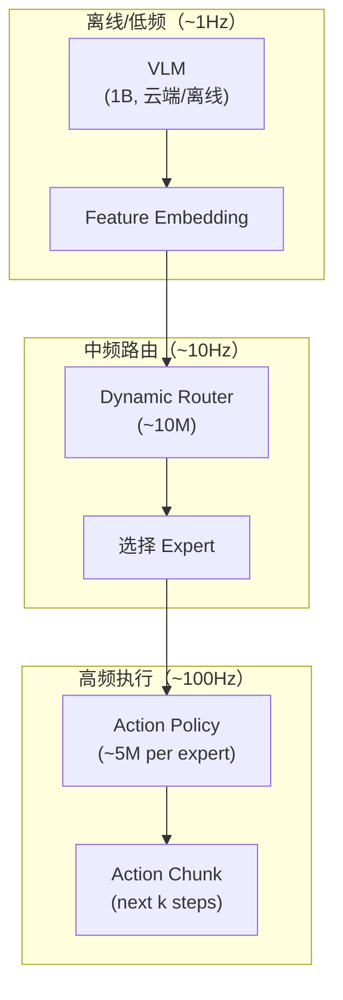

# NanoVLA：极小 VLA 边缘部署深度精读

> **论文标题**: Routing Decoupled Vision-Language Understanding for Nano-sized Generalist Robotic Policies  
> **作者**: Jianuo Huang, et al.  
> **机构**: National University of Singapore  
> **发表**: arXiv:2510.25122, ICLR 2026  

**标签**: `#VLA` `#极小模型` `#边缘部署` `#动态路由` `#ActionChunking` `#98%压缩`

**知识链接**：
- [动作 Token 化与自回归策略](/前置知识/000l_前置知识_动作Token化与自回归策略) — VLA 动作表示
- [行为克隆与 RL 微调范式](/前置知识/000d_前置知识_行为克隆与RL微调范式) — VLA 训练
- [VLA 综述](/论文综述/S03_视觉语言动作模型VLA综述) — VLA 架构全景
- [TinyVLA 精读](./031_TinyVLA_轻量快速VLA模型) — 对比：另一种轻量方案

---

## 一、背景与动机

### 1.1 VLA 模型的"不可能三角"

现有 VLA 面临三个互相矛盾的需求：

| 模型 | 参数量 | 推理延迟 | 精度 |
|------|--------|---------|------|
| RT-2-X | 55B | 2s | 高 |
| OpenVLA | 7B | 500ms | 中高 |
| TinyVLA | 2B | 80ms | 中高 |
| **NanoVLA** | **~100M** | **<10ms** | **中** |

NanoVLA 追求极致的小和快——**比 OpenVLA 少 98% 参数，快 52×**。

### 1.2 核心洞察：Vision-Language 理解和 Action 生成可以解耦

标准 VLA 用一个巨大的 LLM 同时做：
1. 视觉理解（"看到了什么"）
2. 语言理解（"指令要求什么"）
3. 动作生成（"应该怎么动"）

NanoVLA 的关键观察：**这三件事不需要同一个大模型来做**。

- Vision-Language 理解可以用**预计算 + 缓存**：同一个场景下，"看到了什么"不会每帧都变
- Action 生成需要实时响应，但所需网络很小

---

## 贯穿全文的例子

> **场景**：在 Jetson Nano（5W 功耗的边缘设备）上部署 VLA 控制机械臂。
>
> - OpenVLA：根本跑不动（显存不够）
> - TinyVLA：勉强能跑，但控制频率 <5Hz
> - **NanoVLA**：流畅运行，控制频率 **>100Hz**
> - 代价：任务精度略有下降（85% vs 90%），但足以完成大多数桌面操作

---

## 二、方法详解

### 2.1 三级解耦架构

**Level 1：VLM 语义编码（离线，1Hz）**

大型 VLM 处理图像+指令，生成语义 embedding。由于场景变化慢，不需要每帧都跑。

**Level 2：Dynamic Router（中频，10Hz）**

一个轻量路由网络根据当前状态选择合适的 expert policy。

**Level 3：Expert Action Policy（高频，100Hz）**

每个 expert 是一个极小的 action MLP，负责一类动作模式（如"接近"、"抓取"、"放置"）。

### 2.2 Long-Short Action Chunking

NanoVLA 使用双层 action chunking：

**Long chunk（粗粒度，10 步）**：Router 每秒选一次 expert + 规划大方向

$$
C_{\text{long}} = \text{Router}(z_{\text{VLM}}, o_t) \quad \text{(每 10 步更新)}
$$

**Short chunk（细粒度，3 步）**：Expert 在大方向内生成精细动作

$$
C_{\text{short}} = \text{Expert}(z_{\text{VLM}}, o_t, C_{\text{long}}) \quad \text{(每 3 步更新)}
$$

**效果**：
- Long chunk 提供全局规划一致性
- Short chunk 提供局部精细控制
- 两层叠加 = 既有大局观又有细操作

### 2.3 Dynamic Routing 机制

Router 是一个 Mixture-of-Experts 风格的 gating network：

$$
g = \text{softmax}(W_g \cdot [z_{\text{VLM}}; o_t])
$$
$$
\text{selected\_expert} = \arg\max_i(g_i)
$$

训练时用 load-balancing loss 保证各 expert 被均匀使用：

$$
\mathcal{L}_{\text{balance}} = N \sum_{i=1}^N f_i \cdot P_i
$$

其中 $f_i$ 是 expert $i$ 被选中的频率，$P_i$ 是 gating 概率之和。

### 2.4 参数预算分析

| 组件 | 参数量 | 推理设备 | 频率 |
|------|--------|---------|------|
| VLM Encoder | 1B（预计算，不部署） | 云端 | 1Hz |
| Dynamic Router | 10M | 边缘 | 10Hz |
| Expert Policies (×8) | 5M×8 = 40M | 边缘 | 100Hz |
| Feature Cache | ~1M | 边缘 | - |
| **边缘总计** | **~50M** | - | - |

实际部署到边缘设备的参数只有 **~50M**！

---

## 三、实验结果

### 3.1 推理速度

| 模型 | 参数量 | Jetson Orin 延迟 | Jetson Nano 延迟 |
|------|--------|-----------------|-----------------|
| OpenVLA | 7B | 不可运行 | 不可运行 |
| TinyVLA | 2B | 120ms | 不可运行 |
| **NanoVLA** | **50M** | **8ms** | **20ms** |

NanoVLA 是唯一能在 Jetson Nano 上实时运行的 VLA 模型。

### 3.2 任务精度

| 基准 | OpenVLA | TinyVLA | NanoVLA | 差距 |
|------|---------|---------|---------|------|
| LIBERO-Spatial | 78% | 82% | 75% | -3~7% |
| LIBERO-Object | 85% | 87% | 80% | -5~7% |
| Real Robot | 72% | 75% | 68% | -4~7% |

NanoVLA 精度比大模型低 5-7%，但在多数任务上仍然可用（>65%）。

### 3.3 RL 微调潜力

NanoVLA 的超小体积使得 RL 微调变得极为轻量：

| RL 配置 | OpenVLA | TinyVLA | NanoVLA |
|---------|---------|---------|---------|
| PPO 显存需求 | 80GB | 24GB | **4GB** |
| 一次训练迭代 | 500ms | 100ms | **10ms** |
| 边缘 RL 可行? | ❌ | ❌ | **✅** |

**NanoVLA 使得在边缘设备上做在线 RL 适配成为可能。**

---

## 四、核心优势与局限

### 优势

1. **极致轻量**：50M 参数，4GB 显存
2. **实时控制**：100Hz 控制频率
3. **边缘可部署**：Jetson Nano 级设备
4. **RL 友好**：参数少 = RL 训练快 + 便宜

### 局限

1. **精度损失**：比大模型低 5-7%
2. **泛化性**：在未见过的场景上退化明显
3. **VLM 依赖**：仍需要大 VLM 做离线语义编码
4. **长 horizon 弱**：复杂多步任务表现不如大模型

---

## 五、总结

| 维度 | NanoVLA |
|------|---------|
| 核心创新 | 三级解耦 + 动态路由 + Long-Short Chunking |
| 边缘参数 | ~50M（OpenVLA 的 2%） |
| 推理速度 | 52× faster than OpenVLA |
| 精度代价 | -5~7% |
| 独特价值 | 唯一能在边缘设备做实时 VLA + 在线 RL 的方案 |

---

## 延伸阅读

- [TinyVLA：轻量快速 VLA](./031_TinyVLA_轻量快速VLA模型) — 中等轻量方案
- [OpenVLA 精读](/论文综述/015_OpenVLA_开源视觉语言动作模型) — 标准大型 VLA
- [BootRL：冻结 VLA + RL Head](./013_BootRL_冻结VLA加RL_Head) — 冻结大 VLA 的替代路线
