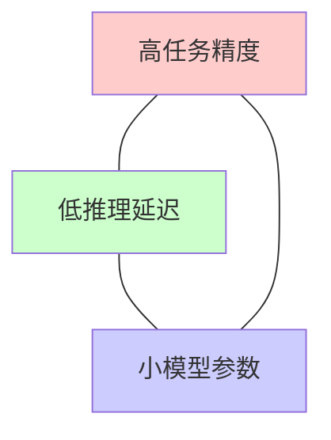
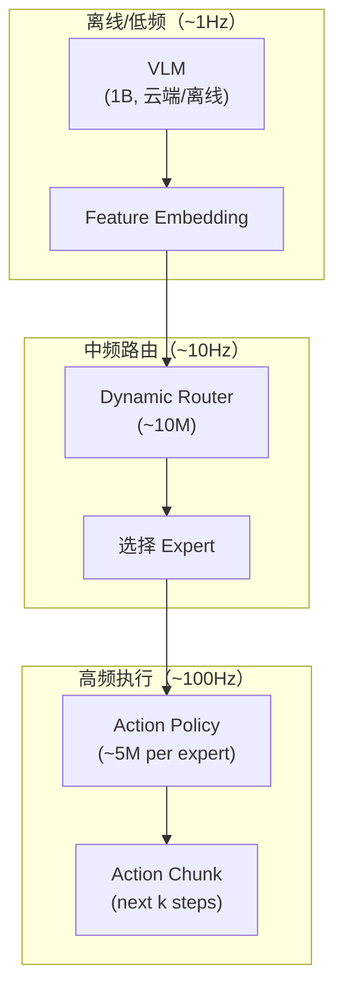

# NanoVLA：极小 VLA 边缘部署深度精读

> **论文标题**: Routing Decoupled Vision-Language Understanding for Nano-sized Generalist Robotic Policies  
> **作者**: Jianuo Huang, et al.  
> **机构**: National University of Singapore  
> **发表**: arXiv:2510.25122, ICLR 2026  

**标签**: `#VLA` `#极小模型` `#边缘部署` `#动态路由` `#ActionChunking` `#98%压缩`

**知识链接**：
- [动作 Token 化与自回归策略](/前置知识/000l_前置知识_动作Token化与自回归策略) — VLA 动作表示
- [行为克隆与 RL 微调范式](/前置知识/000d_前置知识_行为克隆与RL微调范式) — VLA 训练
- [VLA 综述](/论文综述/S03_视觉语言动作模型VLA综述) — VLA 架构全景
- [TinyVLA 精读](./031_TinyVLA_轻量快速VLA模型) — 对比：另一种轻量方案

---

## 一、背景与动机

### 1.1 VLA 模型的"不可能三角"

现有 VLA 面临三个互相矛盾的需求：

```mermaid
graph TD
    A["高任务精度"] --- B["低推理延迟"]
    B --- C["小模型参数"]
    C --- A
    style A fill:#ffcccc
    style B fill:#ccffcc
    style C fill:#ccccff
```

| 模型 | 参数量 | 推理延迟 | 精度 |
|------|--------|---------|------|
| RT-2-X | 55B | 2s | 高 |
| OpenVLA | 7B | 500ms | 中高 |
| TinyVLA | 2B | 80ms | 中高 |
| **NanoVLA** | **~100M** | **<10ms** | **中** |

NanoVLA 追求极致的小和快——**比 OpenVLA 少 98% 参数，快 52×**。

### 1.2 核心洞察：Vision-Language 理解和 Action 生成可以解耦

标准 VLA 用一个巨大的 LLM 同时做：
1. 视觉理解（"看到了什么"）
2. 语言理解（"指令要求什么"）
3. 动作生成（"应该怎么动"）

NanoVLA 的关键观察：**这三件事不需要同一个大模型来做**。

- Vision-Language 理解可以用**预计算 + 缓存**：同一个场景下，"看到了什么"不会每帧都变
- Action 生成需要实时响应，但所需网络很小

---

## 贯穿全文的例子

> **场景**：在 Jetson Nano（5W 功耗的边缘设备）上部署 VLA 控制机械臂。
>
> - OpenVLA：根本跑不动（显存不够）
> - TinyVLA：勉强能跑，但控制频率 <5Hz
> - **NanoVLA**：流畅运行，控制频率 **>100Hz**
> - 代价：任务精度略有下降（85% vs 90%），但足以完成大多数桌面操作

---

## 二、方法详解

### 2.1 三级解耦架构

```mermaid
flowchart TB
    subgraph Offline["离线/低频（~1Hz）"]
        VLM["VLM<br>(1B, 云端/离线)"] --> FE["Feature Embedding"]
    end
    
    subgraph Router["中频路由（~10Hz）"]
        FE --> DR["Dynamic Router<br>(~10M)"]
        DR --> Expert["选择 Expert"]
    end
    
    subgraph Action["高频执行（~100Hz）"]
        Expert --> AP["Action Policy<br>(~5M per expert)"]
        AP --> Chunk["Action Chunk<br>(next k steps)"]
    end
```

**Level 1：VLM 语义编码（离线，1Hz）**

大型 VLM 处理图像+指令，生成语义 embedding。由于场景变化慢，不需要每帧都跑。

**Level 2：Dynamic Router（中频，10Hz）**

一个轻量路由网络根据当前状态选择合适的 expert policy。

**Level 3：Expert Action Policy（高频，100Hz）**

每个 expert 是一个极小的 action MLP，负责一类动作模式（如"接近"、"抓取"、"放置"）。

### 2.2 Long-Short Action Chunking

NanoVLA 使用双层 action chunking：

**Long chunk（粗粒度，10 步）**：Router 每秒选一次 expert + 规划大方向

$$
C_{\text{long}} = \text{Router}(z_{\text{VLM}}, o_t) \quad \text{(每 10 步更新)}
$$

**这个公式在做什么**：每 10 步才让 Router 看一眼当前状态,决定接下来这一大段动作的"大方向"是什么(比如"该切换到抓取模式了")。

::: details 📐 公式详解（点击展开）

| 子表达式 | 它是谁 | 它在干嘛 |
|---------|--------|---------|
| $z_{\text{VLM}}$ | **场景语义摘要** | VLM 离线跑出来的"这个场景里有什么、要做什么"的语义向量,不会每帧重算 |
| $o_t$ | **当前观测** | $t$ 时刻的传感器/图像输入,告诉 Router 机器人现在处于什么具体状态 |
| $\text{Router}(\cdot,\cdot)$ | **调度员** | 拿着场景语义和当前观测,决定接下来一段动作该往哪个大方向走 |
| $C_{\text{long}}$ | **粗粒度指令** | Router 给出的"大方向"标签,会被后面的 Expert 当作条件持续用 10 步 |

**用人话读**：每隔 10 步,调度员看一眼场景大意和当前状态,决定接下来这一大段该往哪个方向使劲。

**为什么是这个形式**：大方向不需要每一步都重新判断——"正在接近物体"这种意图在几十毫秒内不会变,10 步一更新既省算力又不影响规划的连贯性。
:::

**Short chunk（细粒度，3 步）**：Expert 在大方向内生成精细动作

$$
C_{\text{short}} = \text{Expert}(z_{\text{VLM}}, o_t, C_{\text{long}}) \quad \text{(每 3 步更新)}
$$

**这个公式在做什么**：在 Router 给定的大方向内,由挑中的 Expert 每 3 步生成一段更细的具体动作,填补"大方向"和"逐帧动作"之间的粒度差。

::: details 📐 公式详解（点击展开）

| 子表达式 | 它是谁 | 它在干嘛 |
|---------|--------|---------|
| $z_{\text{VLM}}$、$o_t$ | **同上两路输入** | 场景语义 + 当前观测,和 Long chunk 共用同一份 |
| $C_{\text{long}}$ | **上级指令** | Router 刚给出的大方向,作为额外条件传给 Expert,告诉它"现在该往哪使劲" |
| $\text{Expert}(\cdot,\cdot,\cdot)$ | **执行工匠** | 在大方向约束下,把抽象意图翻译成接下来 3 步的具体动作序列 |
| $C_{\text{short}}$ | **细粒度动作块** | Expert 产出的短程动作序列,是真正下发给机械臂执行的内容 |

**用人话读**：工匠拿着调度员给的大方向、场景大意和当前状态,每 3 步就动手做出接下来几步的具体动作。

**为什么是这个形式**：细粒度动作需要跟手感——3 步一更新能及时响应观测的微小变化,同时比逐帧重新规划省算力;把 $C_{\text{long}}$ 当条件传入,保证局部动作不会偏离全局大方向。
:::

**效果**：
- Long chunk 提供全局规划一致性
- Short chunk 提供局部精细控制
- 两层叠加 = 既有大局观又有细操作

### 2.3 Dynamic Routing 机制

Router 是一个 Mixture-of-Experts 风格的 gating network：

$$
g = \text{softmax}(W_g \cdot [z_{\text{VLM}}; o_t])
$$

**这个公式在做什么**：把场景语义和当前观测拼一起，过一层线性变换再 softmax，算出"每个 expert 有多适合当前状态"的一组概率分布。

::: details 📐 公式详解（点击展开）

| 子表达式 | 它是谁 | 它在干嘛 |
|---------|--------|---------|
| $[z_{\text{VLM}}; o_t]$ | **拼接的证据** | 把场景语义向量和当前观测拼成一个长向量，作为打分的原材料 |
| $W_g$ | **打分权重** | 一层线性层的权重矩阵，把拼接向量映射成 $N$ 个 expert 各自的原始分数（logits） |
| $\text{softmax}(\cdot)$ | **归一化裁判** | 把 $N$ 个原始分数压成一组和为 1 的概率，分数越高的 expert 概率越大 |
| $g$ | **各 expert 的适配度** | 长度为 $N$ 的向量，$g_i$ 表示第 $i$ 个 expert 被选中的概率 |

**用人话读**："把场景大意和当前状态拼起来打分，转成一组和为 1 的概率，分数最高的那个 expert 最可能被选中。"

**为什么是这个形式**：softmax 门控是标准 MoE（Mixture of Experts）路由做法——用同一套打分机制让所有 expert 竞争，且概率形式天然支持后面的负载均衡 loss 计算。
:::

$$
\text{selected\_expert} = \arg\max_i(g_i)
$$

**这个公式在做什么**：从上面算出的概率分布里，直接挑出得分最高的那个 expert 来实际执行——推理时不做随机采样，只要最确定的那一个。

::: details 📐 公式详解（点击展开）

| 子表达式 | 它是谁 | 它在干嘛 |
|---------|--------|---------|
| $g_i$ | **第 $i$ 个 expert 的得票** | 上一步 softmax 算出的适配度概率 |
| $\arg\max_i(\cdot)$ | **投票唱票员** | 找出哪个 $i$ 对应的 $g_i$ 最大 |
| $\text{selected\_expert}$ | **最终上岗的 expert** | 唱票结果，接下来 Short chunk 就交给这一个 expert 处理 |

**用人话读**："看谁的得票最高，就让谁上岗执行接下来的动作。"

**为什么是这个形式**：推理阶段路由决策需要确定性、可复现，直接取最大概率的 expert 比随机采样更稳定，也方便部署时做延迟分析。
:::

训练时用 load-balancing loss 保证各 expert 被均匀使用：

$$
\mathcal{L}_{\text{balance}} = N \sum_{i=1}^N f_i \cdot P_i
$$

**这个公式在做什么**：惩罚"某几个 expert 被疯狂使用、其他 expert 一直闲置"的情况，逼着训练过程把任务均匀分给所有 expert。

::: details 📐 公式详解（点击展开）

| 子表达式 | 它是谁 | 它在干嘛 |
|---------|--------|---------|
| $f_i$ | **实际使用率** | expert $i$ 在一个 batch 里被 $\arg\max$ 选中的频率（离散统计量） |
| $P_i$ | **软概率总量** | expert $i$ 在整个 batch 上 gating 概率 $g_i$ 的累加（连续可导量），代替不可导的 $f_i$ 传梯度 |
| $f_i \cdot P_i$ | **不均衡惩罚项** | 如果某个 expert 又被频繁选中（$f_i$ 大）又持续拿到高概率（$P_i$ 大），这一项就大，惩罚也就大 |
| $N \sum_{i=1}^N(\cdot)$ | **总惩罚 + 缩放** | 对所有 $N$ 个 expert 累加，再乘 $N$ 做归一化，使得"均匀使用"时惩罚值恒定不受 $N$ 影响 |

**用人话读**："如果有 expert 又常被选、概率又一直很高，就多扣一点分，逼着模型把活儿平摊给所有 expert。"

**为什么是这个形式**：直接用 $f_i$（不可导的选择计数）做 loss 无法反向传播梯度，所以借用可导的 $P_i$ 作为 $f_i$ 的"软代理"——这是标准 MoE 负载均衡 loss 的常见写法，能在保持可训练的同时间接约束真实的选择分布趋于均匀。
:::

### 2.4 参数预算分析

| 组件 | 参数量 | 推理设备 | 频率 |
|------|--------|---------|------|
| VLM Encoder | 1B（预计算，不部署） | 云端 | 1Hz |
| Dynamic Router | 10M | 边缘 | 10Hz |
| Expert Policies (×8) | 5M×8 = 40M | 边缘 | 100Hz |
| Feature Cache | ~1M | 边缘 | - |
| **边缘总计** | **~50M** | - | - |

实际部署到边缘设备的参数只有 **~50M**！

---

## 三、实验结果

### 3.1 推理速度

| 模型 | 参数量 | Jetson Orin 延迟 | Jetson Nano 延迟 |
|------|--------|-----------------|-----------------|
| OpenVLA | 7B | 不可运行 | 不可运行 |
| TinyVLA | 2B | 120ms | 不可运行 |
| **NanoVLA** | **50M** | **8ms** | **20ms** |

NanoVLA 是唯一能在 Jetson Nano 上实时运行的 VLA 模型。

### 3.2 任务精度

| 基准 | OpenVLA | TinyVLA | NanoVLA | 差距 |
|------|---------|---------|---------|------|
| LIBERO-Spatial | 78% | 82% | 75% | -3~7% |
| LIBERO-Object | 85% | 87% | 80% | -5~7% |
| Real Robot | 72% | 75% | 68% | -4~7% |

NanoVLA 精度比大模型低 5-7%，但在多数任务上仍然可用（>65%）。

### 3.3 RL 微调潜力

NanoVLA 的超小体积使得 RL 微调变得极为轻量：

| RL 配置 | OpenVLA | TinyVLA | NanoVLA |
|---------|---------|---------|---------|
| PPO 显存需求 | 80GB | 24GB | **4GB** |
| 一次训练迭代 | 500ms | 100ms | **10ms** |
| 边缘 RL 可行? | ❌ | ❌ | **✅** |

**NanoVLA 使得在边缘设备上做在线 RL 适配成为可能。**

---

## 四、核心优势与局限

### 优势

1. **极致轻量**：50M 参数，4GB 显存
2. **实时控制**：100Hz 控制频率
3. **边缘可部署**：Jetson Nano 级设备
4. **RL 友好**：参数少 = RL 训练快 + 便宜

### 局限

1. **精度损失**：比大模型低 5-7%
2. **泛化性**：在未见过的场景上退化明显
3. **VLM 依赖**：仍需要大 VLM 做离线语义编码
4. **长 horizon 弱**：复杂多步任务表现不如大模型

---

## 五、总结

| 维度 | NanoVLA |
|------|---------|
| 核心创新 | 三级解耦 + 动态路由 + Long-Short Chunking |
| 边缘参数 | ~50M（OpenVLA 的 2%） |
| 推理速度 | 52× faster than OpenVLA |
| 精度代价 | -5~7% |
| 独特价值 | 唯一能在边缘设备做实时 VLA + 在线 RL 的方案 |

---

## 延伸阅读

- [TinyVLA：轻量快速 VLA](./031_TinyVLA_轻量快速VLA模型) — 中等轻量方案
- [OpenVLA 精读](/论文综述/015_OpenVLA_开源视觉语言动作模型) — 标准大型 VLA
- [BootRL：冻结 VLA + RL Head](./013_BootRL_冻结VLA加RL_Head) — 冻结大 VLA 的替代路线
