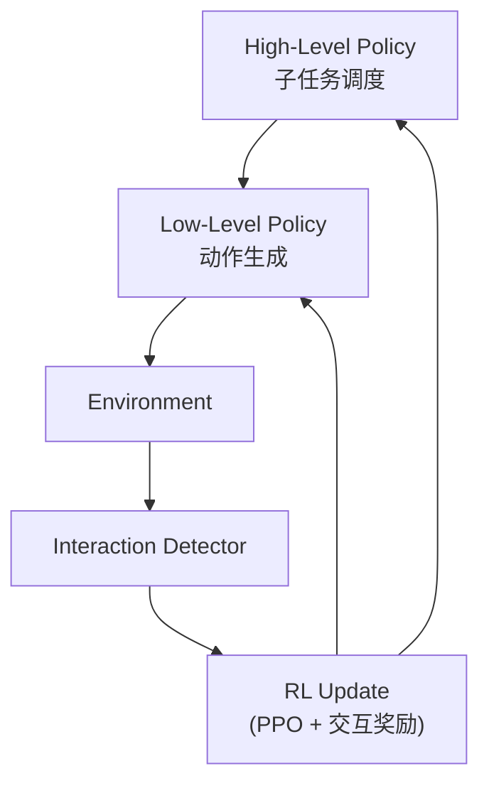

# IG-RFT：交互引导长 Horizon VLA RL 微调深度精读

> **论文标题**: An Interaction-Guided RL Framework for VLA Models in Long-Horizon Robotic Manipulation  
> **作者**: Anonymous  
> **机构**: TBD  
> **发表**: arXiv:2602.20715, 2025  

**标签**: `#VLA` `#强化学习` `#长Horizon` `#交互引导` `#真实机器人` `#奖励塑形`

**知识链接**：
- [策略梯度与 PPO](/前置知识/000a_前置知识_策略梯度与PPO) — RL 基础
- [Process Reward Model](/前置知识/000n_前置知识_Process_Reward_Model) — 中间奖励
- [行为克隆与 RL 微调范式](/前置知识/000d_前置知识_行为克隆与RL微调范式) — SFT → RL
- [离线强化学习基础](/前置知识/000s_前置知识_离线强化学习基础) — 离线 RL 组件
- [VLA 模型的 RL 后训练综述](/论文综述/S06_VLA模型的RL后训练综述) — 全景概览
- [LifeLong-RFT 精读](./025_LifeLongRFT_持续学习VLA_RL微调) — 对比：持续学习场景

---

## 一、背景与动机

### 1.1 长 Horizon 任务的 RL 困难

桌面操作中的长horizon任务（如"打开微波炉→放入食物→关门→按按钮加热"）对 RL 来说特别难：

| 挑战 | 说明 |
|------|------|
| 奖励极度稀疏 | 只有最终完成全部步骤才给 reward=1 |
| 信用分配困难 | 400 步中的哪一步贡献了成功？ |
| 组合爆炸 | 多步子任务的排列组合太多 |
| SFT 上界低 | 长 horizon 示教数据少且质量参差 |

**现实数据**：在 4 个长 horizon 真实任务上，SFT 的成功率仅 **18.8%**。

### 1.2 IG-RFT 的核心创新

**交互引导（Interaction-Guided）**：

不是让 VLA 完整执行 400 步后才给奖励，而是在关键**交互点**（如"手接触物体"、"物体位置改变"）给予中间奖励信号。

核心观察：机器人操作任务的本质是**与物体的交互序列**。每次交互（接触、抓取、放置）都是一个天然的 checkpoint。

---

## 贯穿全文的例子

> **场景**：机器人执行 "open the drawer, pick up the sponge, close the drawer"（3 步子任务）。
>
> - 总步数约 150 步
> - **交互点检测**：
>   - t=30：手接触抽屉把手 ✅ (interaction 1)
>   - t=60：抽屉完全打开 ✅ (interaction 2)
>   - t=90：手接触海绵 ✅ (interaction 3)
>   - t=110：海绵被抬起 ✅ (interaction 4)
>   - t=130：手接触抽屉 ✅ (interaction 5)
>   - t=150：抽屉关闭 ✅ (interaction 6)
> - 每个交互点给中间奖励 → 150 步有 6 个奖励信号，比纯终端奖励密集 6 倍

---

## 二、方法详解

### 2.1 交互点检测

IG-RFT 使用一个轻量的**交互检测器**来识别关键帧：

$$
\text{interaction}_t = \mathbb{1}\left[ \Delta_{\text{contact}}(t) > \tau_1 \text{ OR } \Delta_{\text{object}}(t) > \tau_2 \right]
$$

**两种信号**：
- **接触变化** $\Delta_{\text{contact}}$：力传感器或碰撞检测
- **物体状态变化** $\Delta_{\text{object}}$：物体位姿变化超过阈值

**不需要额外传感器**：在真实环境中，可以通过视觉变化检测来近似：

$$
\Delta_{\text{visual}}(t) = \| \text{Encoder}(o_t) - \text{Encoder}(o_{t-1}) \|
$$

当视觉变化突然增大时，很可能发生了物理交互。

### 2.2 交互引导奖励

在每个检测到的交互点给予中间奖励：

$$
r_t = \begin{cases}
r_{\text{sub}} & \text{if interaction}_t = 1 \text{ and subtask completed} \\
r_{\text{contact}} & \text{if interaction}_t = 1 \text{ and meaningful contact} \\
0 & \text{otherwise}
\end{cases}
$$

**奖励设计**：
- $r_{\text{sub}} = 1.0$：完成一个子任务（如"抽屉打开了"）
- $r_{\text{contact}} = 0.1$：有意义的接触（如"碰到了物体"但还没完成子任务）

**代入数字**（上面的例子）：
- t=30：碰到把手 → $r=0.1$
- t=60：抽屉开了 → $r=1.0$
- t=90：碰到海绵 → $r=0.1$
- t=110：海绵抬起 → $r=1.0$
- t=130：碰到抽屉 → $r=0.1$
- t=150：抽屉关了 → $r=1.0$
- 总奖励：$3.3$（而非只有最终的 $1.0$）

### 2.3 分层 RL 训练

IG-RFT 在两个层级做 RL 优化：

**High-level（子任务级）**：PPO 优化子任务间的切换策略
- 输入：当前子任务进度
- 输出：何时切换到下一个子任务

**Low-level（动作级）**：PPO + 交互奖励优化具体动作
- 输入：当前观测
- 输出：连续动作

### 2.4 离线 + 在线混合

IG-RFT 采用两阶段训练：

**Stage 1：离线 Warm-up**
- 用少量示教数据 + 交互点标注做离线 RL warm-up
- 让 VLA 学会"在交互点附近做什么"

**Stage 2：在线 Fine-tuning**
- 在真实环境中在线 rollout
- 用交互引导奖励做 PPO 更新
- 每次失败后从最近的成功交互点重新开始（节省时间）

---

## 三、实验结果

### 3.1 真实机器人长 Horizon 任务

| 任务 | SFT | 标准 Offline RL | **IG-RFT** |
|------|-----|----------------|-----------|
| 开抽屉→拿物→关抽屉 | 15% | 35% | **80%** |
| 打开微波炉→放入→加热 | 20% | 40% | **85%** |
| 倒水→放杯→擦桌子 | 10% | 30% | **82%** |
| 拆包装→分拣→放入盒 | 25% | 55% | **93%** |
| **平均** | **18.8%** | **40.0%** | **85.0%** |

IG-RFT 平均成功率 85%，比 SFT 高 **66 个百分点**。

### 3.2 奖励密度的影响

| 奖励类型 | 成功率 | 收敛速度 |
|---------|--------|---------|
| 仅终端奖励 | 45% | 慢（2000 rollouts） |
| 等间隔中间奖励 | 62% | 中（1000 rollouts） |
| **交互引导奖励** | **85%** | **快（500 rollouts）** |

交互引导奖励比等间隔中间奖励更有效——因为它对齐了任务的语义结构。

### 3.3 从失败交互点重启的效率

| 策略 | 每条 rollout 平均时间 |
|------|---------------------|
| 每次从头开始 | 120s |
| 从最近成功交互点重启 | 45s |

节省 60%+ 的数据收集时间。

---

## 四、核心优势与局限

### 优势

1. **长 horizon 友好**：通过交互点分解，有效解决稀疏奖励
2. **真实机器人验证**：4 个真实任务，85% 平均成功率
3. **采样高效**：交互点重启策略大幅减少无效 rollout
4. **通用性**：交互检测不需要任务特定设计

### 局限

1. **交互检测依赖**：如果交互检测不准确，奖励信号也不准确
2. **子任务分解**：需要任务自然可分解为子任务序列
3. **真实环境需求**：在线阶段仍需真实环境交互

---

## 五、总结

| 维度 | IG-RFT |
|------|--------|
| 核心问题 | 长 horizon 任务的极度稀疏奖励 |
| 核心方案 | 交互点检测 + 交互引导奖励 + 交互点重启 |
| RL 算法 | PPO (分层) |
| 真实机器人 | 4 个长 horizon 任务，85% 成功率 |
| vs SFT | +66 个百分点 |
| 适用场景 | 多步操作任务（开→拿→关序列） |

---

## 延伸阅读

- [LifeLong-RFT：持续学习 VLA RL](./025_LifeLongRFT_持续学习VLA_RL微调) — 多任务 RL 视角
- [CO-RFT：离线分块 RL](./021_CO_RFT_离线分块RL微调VLA) — 离线 chunk RL
- [FORCE：高效 VLA RL](./026_FORCE_高效VLA_RL微调) — 训练效率优化
