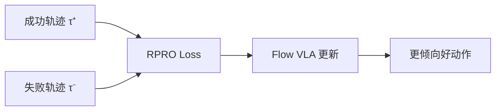

# FlowPRO：无奖励偏好优化 Flow VLA 深度精读

> **论文标题**: Reward-Free Reinforced Fine-Tuning of Flow-Matching VLAs via Proximalized Preference Optimization
> **作者**: Anonymous
> **机构**: TBD
> **发表**: arXiv:2606.05468, 2025

**标签**: `#VLA` `#DPO` `#FlowMatching` `#偏好优化` `#无奖励` `#离线`

**知识链接**：
- [Flow Matching 与连续归一化流](/前置知识/000g_前置知识_Flow_Matching与连续归一化流) — Flow VLA 生成框架
- [KL 散度与策略约束](/前置知识/000j_前置知识_KL散度与策略约束) — DPO 的理论基础
- [行为克隆与 RL 微调范式](/前置知识/000d_前置知识_行为克隆与RL微调范式) — SFT → 后训练范式
- [离线强化学习基础](/前置知识/000s_前置知识_离线强化学习基础) — 离线优化方法论
- [VLA 模型的 RL 后训练综述](/论文综述/S06_VLA模型的RL后训练综述) — 全景概览
- [GRAPE 精读](./020_GRAPE_偏好对齐VLA泛化) — 对比：自回归 VLA 的 DPO
- [ARFM 精读](./027_ARFM_自适应离线RL后训练Flow_VLA) — 对比：需要奖励的 Flow VLA 离线 RL

---

## 一、背景与动机

### 1.1 Flow VLA 后训练的困境

Flow-based VLA（如 π₀）通过 flow matching 生成连续动作。其后训练面临独特挑战：

| 路线 | 问题 |
|------|------|
| 在线 PPO | 需要仿真环境 + Flow VLA 的 log-prob 不直接可算 |
| 在线 GRPO | 需要大量在线 rollout |
| 离线 RL (ARFM) | 需要 reward function / reward model |
| DAgger | 需要持续的专家纠正 |

**核心困境**：所有方法要么需要环境交互，要么需要设计奖励函数。能否**既不需要环境交互，也不需要奖励设计**？

### 1.2 FlowPRO 的答案：偏好优化

FlowPRO 提出 **RPRO（Robotic Flow-matching Proximalized Preference Optimization）**：

- **输入**：成功轨迹 + 失败轨迹的成对偏好数据
- **无需**：环境交互、奖励函数、reward model
- **输出**：让策略更倾向于生成"好动作"，回避"坏动作"

---

## 贯穿全文的例子

> **场景**：π₀ 模型 (3B) 在真实桌面完成 "pick up the cup"。
>
> - 收集 100 条轨迹：60 条成功（chosen），40 条失败（rejected）
> - **FlowPRO**：让 Flow VLA 的动作分布偏向成功轨迹的动作模式
> - **无需仿真器**：纯离线训练
> - **无需奖励函数**：只需二元标签（成功/失败）
> - 效果：成功率从 60% → 78%

---

## 二、方法详解

### 2.1 为什么标准 DPO 不能直接用于 Flow VLA

标准 DPO 公式需要 log-probability：

$$
\mathcal{L}_{\text{DPO}} = -\log \sigma\left(\beta \left[\log \frac{\pi_\theta(a^+|s)}{\pi_{\text{ref}}(a^+|s)} - \log \frac{\pi_\theta(a^-|s)}{\pi_{\text{ref}}(a^-|s)}\right]\right)
$$

但 Flow VLA 不是自回归模型——它通过**多步 denoising** 生成动作，$\log \pi_\theta(a|s)$ 不像 LLM 那样有闭式解。

需要积分整个 flow 路径：

$$
\log \pi_\theta(a|s) = \log p(x_0) - \int_0^1 \nabla \cdot v_\theta(x_t, t) \, dt
$$

这个积分的计算非常昂贵（需要 Hutchinson trace estimator），不适合大规模训练。

### 2.2 RPRO：Flow-Matching 版的偏好优化

RPRO 绕过了 log-prob 计算，直接在 **flow loss 空间** 中定义偏好：

$$
\mathcal{L}_{\text{RPRO}} = -\log \sigma\left(\beta \left[\Delta_{\text{flow}}(a^-, s) - \Delta_{\text{flow}}(a^+, s)\right]\right)
$$

其中：

$$
\Delta_{\text{flow}}(a, s) = \| v_\theta(x_t, t | s) - (a - x_0) \|^2 - \| v_{\text{ref}}(x_t, t | s) - (a - x_0) \|^2
$$

**一句话**：如果当前模型对"好动作"的 flow loss 比参考模型低（生成好动作更容易了），同时对"坏动作"的 flow loss 比参考模型高（生成坏动作更难了），那就是在正确方向更新。

**逐项拆解**：
- $v_\theta(x_t, t|s)$ — 当前模型的速度场预测
- $v_{\text{ref}}(x_t, t|s)$ — 参考模型（SFT 初始化）的速度场
- $(a - x_0)$ — 目标速度方向（从噪声 $x_0$ 到动作 $a$）
- $\sigma(\cdot)$ — sigmoid 函数

### 2.3 Proximalization：近端约束

为防止过度偏离参考策略，RPRO 加入近端项：

$$
\mathcal{L}_{\text{total}} = \mathcal{L}_{\text{RPRO}} + \lambda \cdot \mathbb{E}_{t,x_t} \left[\| v_\theta(x_t, t) - v_{\text{ref}}(x_t, t) \|^2 \right]
$$

**直觉**：确保更新后的模型不会离 SFT 初始策略太远——只做"精细偏好调整"，不搞"大手术"。

### 2.4 偏好数据构造

FlowPRO 的偏好数据来源：

| 来源 | Chosen (τ⁺) | Rejected (τ⁻) |
|------|------------|--------------|
| 成功/失败标签 | 成功轨迹 | 失败轨迹 |
| VLM 评分 | 高分轨迹 | 低分轨迹 |
| 动作质量 | 平滑、高效动作 | 抖动、冗余动作 |

---

## 三、实验结果

### 3.1 π₀ 上的实验

| 方法 | 需要环境？ | 需要 Reward？ | 成功率 |
|------|-----------|-------------|--------|
| SFT | ❌ | ❌ | 65% |
| ARFM (离线 RL) | ❌ | ✅ | 76% |
| FlowRL (在线) | ✅ | ✅ | 80% |
| **FlowPRO** | **❌** | **❌** | **78%** |

FlowPRO 在**完全不需要环境和奖励**的情况下，接近在线 FlowRL 的性能。

### 3.2 真实机器人

| 任务 | SFT | FlowPRO | 提升 |
|------|-----|---------|------|
| Precise placement | 45% | 68% | +23% |
| Pick thin object | 50% | 72% | +22% |
| Cable routing | 30% | 48% | +18% |

### 3.3 数据效率

| 偏好对数量 | 成功率 |
|-----------|--------|
| 20 对 | 70% |
| 50 对 | 75% |
| 100 对 | 78% |
| 200 对 | 79%（趋平） |

50 对偏好数据就能获得大部分收益。

---

## 四、核心优势与局限

### 优势

1. **完全不需要环境交互**
2. **完全不需要奖励设计**
3. **只需成功/失败标签**（最简单的标注）
4. **适配 Flow VLA**：专门为 flow matching 设计

### 局限

1. **需要失败数据**：如果数据全是成功的，没有偏好信号
2. **不能超越最好的数据**：和所有离线方法一样
3. **Flow VLA 特有**：不直接适用于自回归 VLA

---

## 五、总结

| 维度 | FlowPRO |
|------|---------|
| 核心问题 | Flow VLA 的 log-prob 不可算 → DPO 无法直接使用 |
| 核心方案 | 在 flow loss 空间定义偏好（RPRO） |
| 训练方式 | 纯离线，无奖励，无环境 |
| 数据需求 | 50+ 对偏好数据（成功 vs 失败） |
| 适用模型 | Flow-based VLA（π₀ 等） |

---

## 延伸阅读

- [GRAPE：偏好对齐 VLA 泛化](./020_GRAPE_偏好对齐VLA泛化) — 自回归 VLA 的 DPO 方法
- [ARFM：自适应离线 RL for Flow VLA](./027_ARFM_自适应离线RL后训练Flow_VLA) — 需要奖励的离线方法
- [FlowRL：Flow VLA 在线 RL](./018_FlowRL_Flow_VLA的在线RL微调) — 在线方法对比
