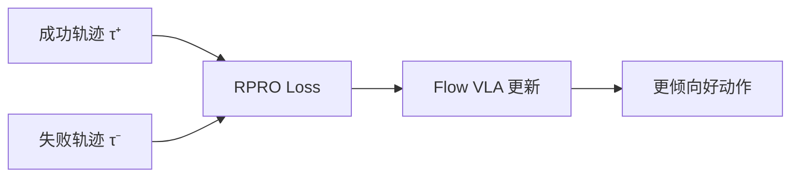

# FlowPRO：无奖励偏好优化 Flow VLA 深度精读

> **论文标题**: Reward-Free Reinforced Fine-Tuning of Flow-Matching VLAs via Proximalized Preference Optimization
> **作者**: Anonymous
> **机构**: TBD
> **发表**: arXiv:2606.05468, 2025

**标签**: `#VLA` `#DPO` `#FlowMatching` `#偏好优化` `#无奖励` `#离线`

**知识链接**：
- [Flow Matching 与连续归一化流](/前置知识/000g_前置知识_Flow_Matching与连续归一化流) — Flow VLA 生成框架
- [KL 散度与策略约束](/前置知识/000j_前置知识_KL散度与策略约束) — DPO 的理论基础
- [行为克隆与 RL 微调范式](/前置知识/000d_前置知识_行为克隆与RL微调范式) — SFT → 后训练范式
- [离线强化学习基础](/前置知识/000s_前置知识_离线强化学习基础) — 离线优化方法论
- [VLA 模型的 RL 后训练综述](/论文综述/S06_VLA模型的RL后训练综述) — 全景概览
- [GRAPE 精读](./020_GRAPE_偏好对齐VLA泛化) — 对比：自回归 VLA 的 DPO
- [ARFM 精读](./027_ARFM_自适应离线RL后训练Flow_VLA) — 对比：需要奖励的 Flow VLA 离线 RL

---

## 一、背景与动机

### 1.1 Flow VLA 后训练的困境

Flow-based VLA（如 π₀）通过 flow matching 生成连续动作。其后训练面临独特挑战：

| 路线 | 问题 |
|------|------|
| 在线 PPO | 需要仿真环境 + Flow VLA 的 log-prob 不直接可算 |
| 在线 GRPO | 需要大量在线 rollout |
| 离线 RL (ARFM) | 需要 reward function / reward model |
| DAgger | 需要持续的专家纠正 |

**核心困境**：所有方法要么需要环境交互，要么需要设计奖励函数。能否**既不需要环境交互，也不需要奖励设计**？

### 1.2 FlowPRO 的答案：偏好优化

FlowPRO 提出 **RPRO（Robotic Flow-matching Proximalized Preference Optimization）**：

- **输入**：成功轨迹 + 失败轨迹的成对偏好数据
- **无需**：环境交互、奖励函数、reward model
- **输出**：让策略更倾向于生成"好动作"，回避"坏动作"

```mermaid
flowchart LR
    A["成功轨迹 τ⁺"] --> C["RPRO Loss"]
    B["失败轨迹 τ⁻"] --> C
    C --> D["Flow VLA 更新"]
    D --> E["更倾向好动作"]
```

---

## 贯穿全文的例子

> **场景**：π₀ 模型 (3B) 在真实桌面完成 "pick up the cup"。
>
> - 收集 100 条轨迹：60 条成功（chosen），40 条失败（rejected）
> - **FlowPRO**：让 Flow VLA 的动作分布偏向成功轨迹的动作模式
> - **无需仿真器**：纯离线训练
> - **无需奖励函数**：只需二元标签（成功/失败）
> - 效果：成功率从 60% → 78%

---

## 二、方法详解

### 2.1 为什么标准 DPO 不能直接用于 Flow VLA

标准 DPO 公式需要 log-probability：

$$
\mathcal{L}_{\text{DPO}} = -\log \sigma\left(\beta \left[\log \frac{\pi_\theta(a^+|s)}{\pi_{\text{ref}}(a^+|s)} - \log \frac{\pi_\theta(a^-|s)}{\pi_{\text{ref}}(a^-|s)}\right]\right)
$$

**这个公式在做什么**：比较"当前模型 vs 参考模型"对好动作和坏动作的偏好变化量，让好动作相对变得更可能、坏动作相对变得更不可能——这是 [DPO](/前置知识/000j_前置知识_KL散度与策略约束) 的标准形式。

::: details 📐 公式详解（点击展开）

| 子表达式 | 它是谁 | 它在干嘛 |
|---------|--------|---------|
| $\log \frac{\pi_\theta(a^+\|s)}{\pi_{\text{ref}}(a^+\|s)}$ | **好动作的"涨幅"** | 当前模型比参考模型多喜欢好动作 $a^+$ 多少（log 概率比） |
| $\log \frac{\pi_\theta(a^-\|s)}{\pi_{\text{ref}}(a^-\|s)}$ | **坏动作的"涨幅"** | 当前模型比参考模型多喜欢坏动作 $a^-$ 多少 |
| $\beta[\cdot]$ | **偏好强度旋钮** | $\beta$ 放大或缩小"好动作涨幅 - 坏动作涨幅"这个差值，控制优化的激进程度 |
| $-\log\sigma(\cdot)$ | **二分类损失** | 把差值送进 sigmoid 再取负 log，差值越大（好动作涨得比坏动作多）loss 越小 |

**用人话读**："比较模型训练前后对好动作和坏动作各自变得多喜欢一点，如果好动作涨得比坏动作多，loss 就低——这就是在鼓励模型更偏向好动作。"

**为什么是这个形式**：这是 DPO 把"人类偏好排序"转化为可优化目标的标准做法——不需要真实的奖励值，只需要"好坏动作的相对排序"，用 log 概率比的差值当作隐式奖励差。
:::

但 Flow VLA 不是自回归模型——它通过**多步 denoising** 生成动作，$\log \pi_\theta(a|s)$ 不像 LLM 那样有闭式解。

需要积分整个 flow 路径：

$$
\log \pi_\theta(a|s) = \log p(x_0) - \int_0^1 \nabla \cdot v_\theta(x_t, t) \, dt
$$

**这个公式在做什么**：说明如果硬要给 Flow VLA 算出动作 $a$ 的精确概率，需要把噪声的初始概率，减去整条去噪路径上速度场"发散程度"的累积——而这个积分在实践中代价极高。

::: details 📐 公式详解（点击展开）

| 子表达式 | 它是谁 | 它在干嘛 |
|---------|--------|---------|
| $\log p(x_0)$ | **起点的已知概率** | 纯噪声 $x_0$ 服从标准高斯分布，概率密度是解析已知的 |
| $\nabla \cdot v_\theta(x_t, t)$ | **速度场的"膨胀率"** | 速度场的散度，衡量流经这一点时概率体积在膨胀还是收缩 |
| $\int_0^1 (\cdot)\, dt$ | **全程累积** | 把整条去噪路径 $t=0\to1$ 上每一点的膨胀率加总 |
| $\log p(x_0) - \int_0^1(\cdot)dt$ | **反推出的动作概率** | 用连续性方程从噪声的已知概率反推出动作 $a$ 的对数概率 |

**用人话读**："要精确知道模型生成某个动作的概率，必须把噪声的概率，沿着整条去噪路径把速度场的'膨胀率'一步步累积扣除——这是一个连续时间的积分，不是一步就能查表得到的数。"

**为什么积分代价高**：$\nabla \cdot v_\theta$（散度）在高维空间中没有闭式解，唯一可行的估计方式是 Hutchinson trace estimator（随机投影近似 trace），这需要额外的随机采样和多次前向/反向传播，在大规模训练里开销无法接受——这正是 RPRO 要绕开它的原因。
:::

这个积分的计算非常昂贵（需要 Hutchinson trace estimator），不适合大规模训练。

### 2.2 RPRO：Flow-Matching 版的偏好优化

RPRO 绕过了 log-prob 计算，直接在 **flow loss 空间** 中定义偏好：

$$
\mathcal{L}_{\text{RPRO}} = -\log \sigma\left(\beta \left[\Delta_{\text{flow}}(a^-, s) - \Delta_{\text{flow}}(a^+, s)\right]\right)
$$

**这个公式在做什么**：用"flow loss 的变化量"代替 DPO 里没法算的 log 概率比，让好动作的 flow loss 相对参考模型变得更低、坏动作的 flow loss 相对变得更高——效果和标准 DPO 一致，但完全不需要积分求概率。

::: details 📐 公式详解（点击展开）

| 子表达式 | 它是谁 | 它在干嘛 |
|---------|--------|---------|
| $\Delta_{\text{flow}}(a^+, s)$ | **好动作的"变容易了多少"** | 当前模型对好动作的 flow loss 比参考模型低多少（负值代表变容易） |
| $\Delta_{\text{flow}}(a^-, s)$ | **坏动作的"变容易了多少"** | 当前模型对坏动作的 flow loss 比参考模型低多少 |
| $\Delta_{\text{flow}}(a^-,s)-\Delta_{\text{flow}}(a^+,s)$ | **偏好方向差** | 只有当坏动作没怎么变容易、好动作明显变容易时，这个差值才是正的 |
| $\beta[\cdot]$ | **偏好强度旋钮** | 放大或缩小这个差值，控制优化力度 |
| $-\log\sigma(\cdot)$ | **二分类损失** | 差值越正 loss 越小，鼓励模型朝"好动作更容易生成"方向更新 |

**用人话读**："比较模型训练前后对好动作和坏动作各自变得多好生成，如果好动作的 flow loss 降得比坏动作多，loss 就低——这是用生成难度的变化量代替了 DPO 里算不出来的概率比。"

**为什么是这个形式**：DPO 的核心是"好坏动作的相对偏好差"，而不是绝对概率值；flow loss（$\|v_\theta - v_{\text{target}}\|^2$）本身就衡量"模型生成这个动作有多容易"，用它的相对变化量替代 log 概率比的相对变化量，保留了 DPO 的核心思想却完全绕开了积分。
:::

其中：

$$
\Delta_{\text{flow}}(a, s) = \| v_\theta(x_t, t | s) - (a - x_0) \|^2 - \| v_{\text{ref}}(x_t, t | s) - (a - x_0) \|^2
$$

**这个公式在做什么**：算出"当前模型生成动作 $a$ 的难度"相对"参考模型生成同一动作的难度"变化了多少——变小说明当前模型比参考模型更容易生成这个动作。

::: details 📐 公式详解（点击展开）

| 子表达式 | 它是谁 | 它在干嘛 |
|---------|--------|---------|
| $(a - x_0)$ | **目标速度方向** | 从噪声 $x_0$ 直线指向动作 $a$ 的方向，即 flow matching 的真实速度目标 |
| $\|v_\theta(x_t,t\|s) - (a-x_0)\|^2$ | **当前模型的生成难度** | 当前模型预测速度和目标速度差多少，差得多说明当前模型觉得这个动作"难生成" |
| $\|v_{\text{ref}}(x_t,t\|s) - (a-x_0)\|^2$ | **参考模型的生成难度** | 同样的差值，换成参考模型（SFT 初始权重）算 |
| 两者相减 | **难度变化量** | 当前模型比参考模型"更容易生成"还是"更难生成"这个动作 $a$ |

**用人话读**："看当前模型和参考模型（SFT 初始版本）相比，生成这个动作变容易了还是变难了——用两个模型各自的 flow loss 差值来衡量。"

**为什么是这个形式**：flow loss 本身（预测速度和目标速度的均方误差）天然就是"模型生成这个动作的难度分"，用当前模型和参考模型各自的 flow loss 相减，就得到了一个不需要计算概率、纯粹基于训练信号本身的"相对偏好"度量。
:::

- $v_\theta(x_t, t|s)$ — 当前模型的速度场预测
- $v_{\text{ref}}(x_t, t|s)$ — 参考模型（SFT 初始化）的速度场
- $\sigma(\cdot)$ — sigmoid 函数

### 2.3 Proximalization：近端约束

为防止过度偏离参考策略，RPRO 加入近端项：

$$
\mathcal{L}_{\text{total}} = \mathcal{L}_{\text{RPRO}} + \lambda \cdot \mathbb{E}_{t,x_t} \left[\| v_\theta(x_t, t) - v_{\text{ref}}(x_t, t) \|^2 \right]
$$

**这个公式在做什么**：在偏好优化损失之外，额外加一个"离参考模型别太远"的惩罚项，防止模型为了讨好偏好信号而把整个速度场搞得面目全非。

::: details 📐 公式详解（点击展开）

| 子表达式 | 它是谁 | 它在干嘛 |
|---------|--------|---------|
| $\mathcal{L}_{\text{RPRO}}$ | **偏好改进目标** | 上一节定义的偏好优化损失，拉动模型偏向好动作 |
| $\|v_\theta(x_t,t) - v_{\text{ref}}(x_t,t)\|^2$ | **越界惩罚** | 当前模型的速度场和参考模型速度场的差距，差得越多惩罚越重 |
| $\mathbb{E}_{t,x_t}[\cdot]$ | **全程平均** | 对随机采样的时间步 $t$ 和带噪状态 $x_t$ 取期望，实际训练中用 mini-batch 采样近似 |
| $\lambda \cdot (\cdot)$ | **约束强度旋钮** | $\lambda$ 越大，模型被拉回参考策略的力度越强 |

**用人话读**："总损失 = 让模型偏向好动作（RPRO）+ 一个惩罚项，惩罚模型的速度场和 SFT 初始模型差太远。"

**为什么需要这一项**：偏好数据量通常很小（50-200 对），如果只用 $\mathcal{L}_{\text{RPRO}}$ 优化，模型很容易在偏好信号覆盖不到的区域"跑偏"，丢掉 SFT 阶段学到的通用能力；加上这个近端项相当于给优化画了一个"安全区"，只允许在参考策略附近做精细调整。
:::

### 2.4 偏好数据构造

FlowPRO 的偏好数据来源：

| 来源 | Chosen (τ⁺) | Rejected (τ⁻) |
|------|------------|--------------|
| 成功/失败标签 | 成功轨迹 | 失败轨迹 |
| VLM 评分 | 高分轨迹 | 低分轨迹 |
| 动作质量 | 平滑、高效动作 | 抖动、冗余动作 |

---

## 三、实验结果

### 3.1 π₀ 上的实验

| 方法 | 需要环境？ | 需要 Reward？ | 成功率 |
|------|-----------|-------------|--------|
| SFT | ❌ | ❌ | 65% |
| ARFM (离线 RL) | ❌ | ✅ | 76% |
| FlowRL (在线) | ✅ | ✅ | 80% |
| **FlowPRO** | **❌** | **❌** | **78%** |

FlowPRO 在**完全不需要环境和奖励**的情况下，接近在线 FlowRL 的性能。

### 3.2 真实机器人

| 任务 | SFT | FlowPRO | 提升 |
|------|-----|---------|------|
| Precise placement | 45% | 68% | +23% |
| Pick thin object | 50% | 72% | +22% |
| Cable routing | 30% | 48% | +18% |

### 3.3 数据效率

| 偏好对数量 | 成功率 |
|-----------|--------|
| 20 对 | 70% |
| 50 对 | 75% |
| 100 对 | 78% |
| 200 对 | 79%（趋平） |

50 对偏好数据就能获得大部分收益。

---

## 四、核心优势与局限

### 优势

1. **完全不需要环境交互**
2. **完全不需要奖励设计**
3. **只需成功/失败标签**（最简单的标注）
4. **适配 Flow VLA**：专门为 flow matching 设计

### 局限

1. **需要失败数据**：如果数据全是成功的，没有偏好信号
2. **不能超越最好的数据**：和所有离线方法一样
3. **Flow VLA 特有**：不直接适用于自回归 VLA

---

## 五、总结

| 维度 | FlowPRO |
|------|---------|
| 核心问题 | Flow VLA 的 log-prob 不可算 → DPO 无法直接使用 |
| 核心方案 | 在 flow loss 空间定义偏好（RPRO） |
| 训练方式 | 纯离线，无奖励，无环境 |
| 数据需求 | 50+ 对偏好数据（成功 vs 失败） |
| 适用模型 | Flow-based VLA（π₀ 等） |

---

## 延伸阅读

- [GRAPE：偏好对齐 VLA 泛化](./020_GRAPE_偏好对齐VLA泛化) — 自回归 VLA 的 DPO 方法
- [ARFM：自适应离线 RL for Flow VLA](./027_ARFM_自适应离线RL后训练Flow_VLA) — 需要奖励的离线方法
- [FlowRL：Flow VLA 在线 RL](./018_FlowRL_Flow_VLA的在线RL微调) — 在线方法对比
