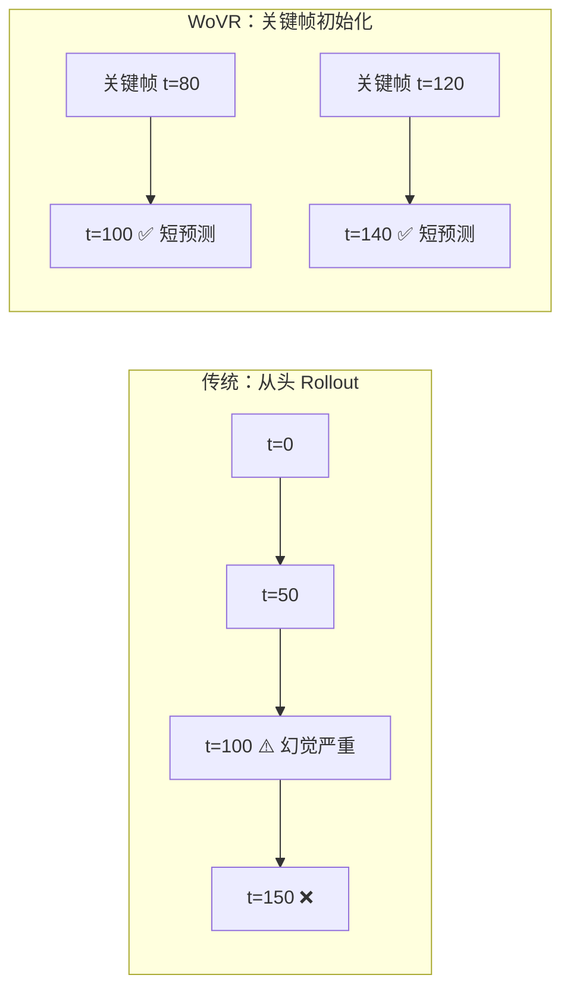

# WoVR：可靠世界模型 RL 后训练 VLA 深度精读

> **论文标题**: World Models as Reliable Simulators for Post-Training VLA Policies with RL
> **作者**: Chao Yu, et al.
> **机构**: Tsinghua University
> **发表**: arXiv:2602.13977, 2025
> **项目页**: https://wovr-rlinf.github.io/

**标签**: `#VLA` `#强化学习` `#世界模型` `#幻觉抑制` `#关键帧初始化` `#协同进化`

**知识链接**：
- [世界模型基础](/前置知识/000t_前置知识_世界模型基础) — World Model 概念
- [策略梯度与 PPO](/前置知识/000a_前置知识_策略梯度与PPO) — RL 算法
- [KL 散度与策略约束](/前置知识/000j_前置知识_KL散度与策略约束) — 策略约束
- [VLA 模型的 RL 后训练综述](/论文综述/S06_VLA模型的RL后训练综述) — 全景概览
- [World-Env 精读](./024_WorldEnv_世界模型虚拟环境VLA后训练) — 对比：假设世界模型忠实
- [VLA-RFT 精读](./017_VLA_RFT_世界模型验证奖励RL微调) — 对比：用世界模型做奖励

---

## 一、背景与动机

### 1.1 世界模型做 VLA RL 的关键瓶颈：幻觉

用世界模型（视频生成）替代物理仿真做 RL，核心问题是**世界模型会"幻觉"**：

| 幻觉类型 | 表现 | 后果 |
|---------|------|------|
| 物理违反 | 物体穿模、悬浮 | 策略学到物理上不可能的动作 |
| 时间不一致 | 物体位置跳变 | 错误的状态转移 |
| 累积漂移 | 多步预测越来越不真实 | 长 horizon 完全不可信 |

**核心洞察**：World-Env 等方法假设世界模型是"忠实的"，但实际不是。WoVR 的创新在于**显式处理世界模型不完美的问题**。

### 1.2 WoVR 的三层防护

WoVR 提出三层机制来让不完美的世界模型变成可靠的 RL 仿真器：

1. **Simulator Level**：可控视频世界模型，抑制幻觉生成
2. **Interaction Level**：关键帧初始化 Rollout，减少有效误差深度
3. **Alignment Level**：策略-世界模型协同进化，保持分布对齐

---

## 贯穿全文的例子

> **场景**：用世界模型训练 VLA 完成 "stack red block on blue block"。
>
> - **传统方式**：从 t=0 开始 rollout 200 步 → 到 t=100 时世界模型已经严重幻觉
> - **WoVR 方式**：
>   - 从示教的关键帧（如 t=80，手已经接近红块）开始 rollout
>   - 只预测 20 步（短，幻觉少）
>   - 如果检测到幻觉 → 停止 rollout，不使用该数据
>   - 世界模型和策略一起更新 → 世界模型越来越适应策略的行为分布

---

## 二、方法详解

### 2.1 Layer 1：Controllable World Model（幻觉抑制）

在视频世界模型中加入**幻觉检测器和抑制机制**：

$$
\text{hallucination\_score}(t) = \| f_{\text{physics}}(\hat{o}_t, \hat{o}_{t+1}) - f_{\text{physics}}(\hat{o}_{t-1}, \hat{o}_t) \|
$$

如果连续帧的物理一致性分数超过阈值，标记为幻觉并停止 rollout。

**具体检测指标**：
- 物体位移是否超过物理极限（如 1 帧内移动 50cm）
- 物体是否突然出现/消失
- 背景是否发生不合理变化

### 2.2 Layer 2：Keyframe-Initialized Rollouts（关键帧初始化）

**问题**：从 t=0 开始 rollout，多步后误差累积严重。

**解法**：从示教轨迹的**关键帧**开始 rollout，大幅缩短预测时间步数。



**关键帧选取**：从示教数据中选取"任务关键时刻"（如物体状态变化点）作为 rollout 起点。

**效果**：每次 rollout 最多 20-30 步 → 幻觉来不及累积。

### 2.3 Layer 3：World Model-Policy Co-evolution（协同进化）

**问题**：策略改变后，它访问的状态分布也变了 → 世界模型可能对新状态预测不准。

**解法**：每 N 步 RL 更新后，用新策略的 rollout 数据**重新微调世界模型**：

```
for iteration in range(max_iter):
    # 1. 用当前世界模型做 RL 训练
    rollouts = world_model.rollout(policy, keyframes)
    policy = ppo_update(policy, rollouts)

    # 2. 用新策略的真实/想象数据更新世界模型
    new_data = policy.rollout_in_real_or_buffer()
    world_model = finetune(world_model, new_data)
```

**类比**：就像学车时，教练（世界模型）要根据学生（策略）的进步调整教学内容——如果学生已经会直线行驶，教练就要开始教转弯了。

---

## 三、实验结果

### 3.1 与其他世界模型 RL 方法对比

| 方法 | 处理幻觉？ | LIBERO 成功率 | 策略崩溃率 |
|------|-----------|-------------|-----------|
| World-Env | ❌ 假设忠实 | 65% | 15% |
| VLA-RFT | 部分（验证奖励） | 70% | 10% |
| **WoVR** | **✅ 三层防护** | **78%** | **2%** |
| Oracle（完美仿真） | N/A | 82% | 0% |

WoVR 接近了完美仿真器的性能（差 4%），策略崩溃率极低。

### 3.2 三层防护的消融

| 配置 | 成功率 | 策略崩溃率 |
|------|--------|-----------|
| Full WoVR | 78% | 2% |
| - 幻觉抑制 | 72% | 8% |
| - 关键帧初始化 | 70% | 10% |
| - 协同进化 | 74% | 5% |
| All removed (= World-Env) | 65% | 15% |

三层防护每一层都有显著贡献，关键帧初始化效果最大。

### 3.3 真实机器人迁移

| 任务 | World-Env → Real | WoVR → Real |
|------|-----------------|-------------|
| Pick and place | 52% | 70% |
| Drawer open | 48% | 68% |
| Precise insertion | 30% | 55% |

WoVR 训练的策略在真实部署时更鲁棒——因为训练时没有利用幻觉"作弊"。

---

## 四、总结

| 维度 | WoVR |
|------|------|
| 核心问题 | 世界模型幻觉导致 RL 策略学到错误行为 |
| 核心方案 | 三层防护：幻觉抑制 + 关键帧初始化 + 协同进化 |
| vs World-Env | +13% 成功率，崩溃率从 15% → 2% |
| 关键洞察 | 承认世界模型不完美，显式管理不完美 |
| 开源 | https://github.com/OpenRLHF/RLinf |

---

## 延伸阅读

- [World-Env：世界模型虚拟环境 VLA 后训练](./024_WorldEnv_世界模型虚拟环境VLA后训练) — 假设忠实的方法
- [世界模型基础](/前置知识/000t_前置知识_世界模型基础) — World Model 概念
- [RLinf-VLA：统一训练框架](./028_RLinfVLA_统一高效VLA_RL训练框架) — 同组的系统框架
