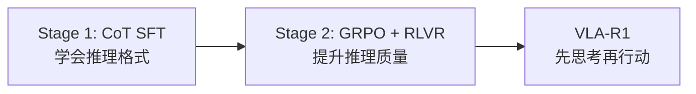

# VLA-R1：推理增强 VLA 深度精读

> **论文标题**: VLA-R1: Enhancing Reasoning in Vision-Language-Action Models
> **作者**: Yuxin Chen, et al.
> **机构**: Tsinghua University, Shanghai AI Lab
> **发表**: arXiv:2510.01623, 2025
> **代码**: https://github.com/VLA-R1/VLA-R1

**标签**: `#VLA` `#强化学习` `#GRPO` `#推理` `#CoT` `#RLVR` `#泛化`

**知识链接**：
- [GRPO](/前置知识/000m_前置知识_GRPO_Group_Relative_Policy_Optimization) — RL 优化算法
- [策略梯度与 PPO](/前置知识/000a_前置知识_策略梯度与PPO) — 对比方法
- [动作 Token 化与自回归策略](/前置知识/000l_前置知识_动作Token化与自回归策略) — VLA 动作表示
- [KL 散度与策略约束](/前置知识/000j_前置知识_KL散度与策略约束) — 策略约束
- [VLA 模型的 RL 后训练综述](/论文综述/S06_VLA模型的RL后训练综述) — 全景概览
- [TGRPO 精读](./019_TGRPO_轨迹级GRPO微调VLA) — 对比：不带推理的 GRPO

---

## 一、背景与动机

### 1.1 VLA 的"不思考"问题

当前 VLA 模型是"反射式"的：看到图像 + 指令 → 直接输出动作。没有显式的**推理过程**。

这导致：
- 简单任务 OK："pick up the red cup" → 直接执行
- 复杂任务 FAIL："if the cup is empty, pick it up; otherwise, pour it out first" → 不会推理条件

### 1.2 DeepSeek-R1 的启示

DeepSeek-R1 证明了：通过 RL（特别是 GRPO）+ 可验证奖励（RLVR），LLM 可以**自发涌现推理能力**。

**核心问题**：能否把 DeepSeek-R1 的范式迁移到 VLA？让 VLA 学会"先推理再行动"？

### 1.3 VLA-R1 的方案

1. **Stage 1**：在带 CoT 标注的数据上做 SFT，教会 VLA "推理的格式"
2. **Stage 2**：用 GRPO + 可验证奖励做 RL，让 VLA 自主提升推理质量



---

## 贯穿全文的例子

> **场景**：VLA 面对复杂指令 "Pick up the lighter colored object and place it into the container that is NOT on the left side"。
>
> - **普通 VLA**：可能直接抓取某个物体，经常抓错
> - **VLA-R1 的输出**：
>   ```
>   <think>
>   The lighter colored objects are: white cup, beige plate.
>   The containers are: blue bowl (left), red box (right).
>   NOT on the left side → right side → red box.
>   Lighter object → white cup (lightest).
>   Plan: Pick white cup → Place in red box.
>   </think>
>   <action>[0.12, -0.05, 0.08, 0, 0, 0.1, 1]</action>
>   ```
> - 先推理再行动，大幅减少理解错误

---

## 二、方法详解

### 2.1 Stage 1：CoT SFT

**数据构造**：用 GPT-4V 为每条示教轨迹生成推理链标注：

```
Input: Image + "pick up the red block near the blue bowl"
CoT: "I can see a red block (3cm × 3cm) located at coordinates roughly (0.3, 0.2).
      There is also a blue bowl at (0.4, 0.3). The red block near the blue bowl
      is the one at (0.35, 0.22). I should approach from above and grasp it."
Action: [0.35, 0.22, 0.15, 0, 0, 0, 1]
```

训练损失：

$$
\mathcal{L}_{\text{SFT}} = -\log p_\theta(\text{CoT} | o, \text{instruction}) - \log p_\theta(a | o, \text{instruction}, \text{CoT})
$$

### 2.2 Stage 2：GRPO + RLVR

**可验证奖励（Verifiable Rewards）**：

VLA-R1 使用两种可自动验证的奖励：

| 奖励类型 | 验证方式 | 示例 |
|---------|---------|------|
| 任务成功 | 环境检测 | 物体是否到达目标位置 |
| 推理正确性 | 规则验证 | CoT 中提到的物体颜色是否正确 |

**GRPO 训练流程**：

1. 对同一观测采样 $G$ 组 (CoT + action)
2. 执行 action 并验证（成功/失败 + 推理正确性）
3. 组内排序得到 advantage
4. GRPO 梯度更新 CoT 和 action

**关键设计**：奖励同时评估 **推理质量** 和 **动作质量**：

$$
r = r_{\text{task\_success}} + \alpha \cdot r_{\text{reasoning\_accuracy}}
$$

如果推理正确但动作失败 → 仍然给部分奖励（鼓励好推理）
如果动作成功但推理错误 → 降低奖励（避免"蒙对"的情况固化）

### 2.3 推理如何帮助动作

推理链的关键作用：

1. **空间理解**：明确目标物体的位置
2. **条件判断**：处理 if-then 类指令
3. **规划分解**：将复杂指令分解为步骤序列
4. **常识推理**：利用物理常识辅助决策

---

## 三、实验结果

### 3.1 LIBERO 基准

| 方法 | 简单任务 | 中等任务 | 困难任务 | 平均 |
|------|---------|---------|---------|------|
| OpenVLA (SFT) | 85% | 72% | 45% | 67% |
| VLA-RL (PPO) | 90% | 78% | 52% | 73% |
| TGRPO | 92% | 80% | 55% | 76% |
| **VLA-R1** | **93%** | **85%** | **68%** | **82%** |

**关键发现**：VLA-R1 在困难任务上优势最大（+13% vs TGRPO），因为困难任务最需要推理。

### 3.2 推理能力分析

| 推理类型 | 无 CoT 准确率 | VLA-R1 准确率 | 提升 |
|---------|-------------|-------------|------|
| 颜色识别 | 82% | 95% | +13% |
| 空间关系 | 65% | 88% | +23% |
| 条件指令 | 40% | 75% | +35% |
| 数量比较 | 55% | 82% | +27% |

推理对"需要理解的指令"帮助最大。

### 3.3 真实机器人

| 指令复杂度 | SFT | VLA-R1 |
|-----------|-----|--------|
| 简单（"pick red cup"） | 78% | 82% |
| 中等（"put X near Y"） | 55% | 72% |
| 复杂（条件+多步） | 25% | 55% |

---

## 四、与 DeepSeek-R1 的平行关系

| 维度 | DeepSeek-R1 (LLM) | VLA-R1 (VLA) |
|------|-------------------|-------------|
| 输入 | 文本问题 | 图像 + 语言指令 |
| 输出 | 文本答案 | CoT + 动作 |
| 推理格式 | `<think>...</think>` | `<think>...</think><action>...</action>` |
| RL 算法 | GRPO | GRPO |
| 奖励 | 答案正确性（可验证） | 任务成功 + 推理正确（可验证） |
| 涌现行为 | 长推理链、自我纠正 | 空间推理、条件判断 |

---

## 五、总结

| 维度 | VLA-R1 |
|------|--------|
| 核心创新 | DeepSeek-R1 范式迁移到 VLA：CoT SFT + GRPO RLVR |
| 训练方式 | 两阶段：CoT SFT → GRPO + 可验证奖励 |
| 关键效果 | 复杂推理任务 +35%（条件指令） |
| 推理形式 | 显式 CoT token（`<think>` 块） |
| 代价 | 推理增加推理延迟（多输出 CoT token） |
| 适用场景 | 需要理解复杂指令的操作任务 |

---

## 延伸阅读

- [TGRPO：轨迹级 GRPO 微调 VLA](./019_TGRPO_轨迹级GRPO微调VLA) — 不带推理的 GRPO
- [RIPT-VLA：无 Critic VLA 后训练](./007_RIPT_VLA_无Critic的VLA后训练) — 另一种 GRPO 变体
- [GRPO 前置知识](/前置知识/000m_前置知识_GRPO_Group_Relative_Policy_Optimization)
