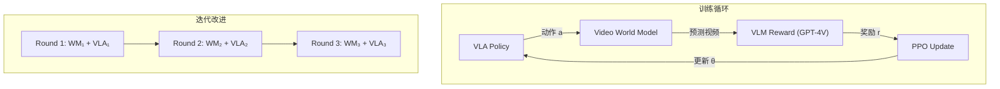

# World-Gymnast：视频世界模型 RL 训练深度精读

> **论文标题**: Training Robots with Reinforcement Learning in a World Model
> **作者**: Yifeng Zhu, et al.
> **机构**: UT Austin, Google DeepMind
> **发表**: arXiv:2602.02454, 2025
> **项目页**: https://world-gymnast.github.io/

**标签**: `#VLA` `#强化学习` `#世界模型` `#视频生成` `#VLM奖励` `#迭代改进`

**知识链接**：
- [世界模型基础](/前置知识/000t_前置知识_世界模型基础) — World Model 概念
- [策略梯度与 PPO](/前置知识/000a_前置知识_策略梯度与PPO) — RL 算法
- [行为克隆与 RL 微调范式](/前置知识/000d_前置知识_行为克隆与RL微调范式) — SFT → RL
- [VLA 模型的 RL 后训练综述](/论文综述/S06_VLA模型的RL后训练综述) — 全景概览
- [World-Env 精读](./024_WorldEnv_世界模型虚拟环境VLA后训练) — 对比：类似方法
- [WoVR 精读](./036_WoVR_可靠世界模型RL后训练VLA) — 对比：三层幻觉防护

---

## 一、背景与动机

### 1.1 物理仿真的局限

传统 VLA RL 依赖物理仿真器（Isaac Gym、MuJoCo），但：
- 建模真实场景极其耗时（3D 资产、物理参数）
- Sim-to-Real gap 不可忽略
- 新场景需要重新建模

### 1.2 World-Gymnast 的突破性实验

World-Gymnast 在 Bridge V2 真实机器人设置上验证了：

> **用世界模型做 RL，成功率超越物理仿真器做 RL 的 2×，超越 SFT 的 18×。**

这是一个里程碑式的结果——学习出的视频世界模型比手工建的仿真器更好用。

### 1.3 三大能力

World-Gymnast 展示了世界模型 RL 的三个独特能力：

1. **多样语言指令训练**：可以输入任意语言指令，世界模型根据指令生成相应场景
2. **新场景即时适配**：给一张新场景的图片，立刻开始 RL 训练（test-time training）
3. **迭代改进**：策略和世界模型交替更新，螺旋上升

---

## 贯穿全文的例子

> **场景**：Bridge V2 机器人（5-DoF），需要学会厨房操作。
>
> - **传统做法**：在 Bridge V2 真实环境中收集数据 → SFT → 部署（成功率 5%）
> - **World-Gymnast**：
>   1. 用 Bridge V2 数据训练视频世界模型
>   2. VLA 在世界模型中做 PPO 训练
>   3. VLM (GPT-4V) 对生成视频打分作为奖励
>   4. 迭代 3 轮
>   5. 真实部署成功率 **90%**（18× better than SFT）

---

## 二、方法详解

### 2.1 整体框架



### 2.2 Action-Conditioned Video World Model

世界模型架构：基于 video diffusion model（SVD 微调）

输入：当前帧 $o_t$ + 动作序列 $(a_t, a_{t+1}, \ldots, a_{t+H})$
输出：未来 $H$ 帧视频 $(\hat{o}_{t+1}, \ldots, \hat{o}_{t+H})$

**Action Conditioning 方式**：将动作编码为 cross-attention 的 conditioning signal。

### 2.3 VLM 奖励

使用 GPT-4V 作为奖励函数：

$$
r_t = \text{GPT-4V}(\hat{o}_{t:t+H}, \text{instruction}, \text{scoring\_prompt})
$$

Scoring Prompt 示例：
```
Given this video of a robot arm executing the instruction "put the fork
on the plate", rate the progress on a scale of 0-10. Consider:
(1) Is the fork being grasped?
(2) Is it moving toward the plate?
(3) Is it placed successfully?
```

**优势**：完全通用，不需要为每个任务设计奖励函数。

### 2.4 迭代改进（Online Iteration）

```
for round in [1, 2, 3]:
    # Step 1: 用当前 VLA 在世界模型中做 RL
    policy = ppo_train(vla, world_model, vlm_reward)

    # Step 2: 用改进后的 policy 在真实环境收集少量数据
    new_data = real_rollout(policy, n=50)

    # Step 3: 用新数据更新世界模型
    world_model = finetune(world_model, new_data)
```

每轮：
- 世界模型变得更准（因为看到了新策略的行为模式）
- 策略变得更好（因为世界模型更准了）

---

## 三、实验结果

### 3.1 Bridge V2 真实机器人

| 方法 | 成功率 | 训练方式 |
|------|--------|---------|
| SFT (50 demos) | 5% | 监督学习 |
| SFT (500 demos) | 25% | 监督学习 |
| Sim RL (Isaac Gym) | 45% | 物理仿真 RL |
| **World-Gymnast** | **90%** | 世界模型 RL |

**核心结果**：World-Gymnast 比物理仿真 RL 好 **2×**！

**为什么超越物理仿真**：
1. 视频世界模型从真实数据学习 → 隐式包含了真实物理特性
2. 物理仿真的 sim-to-real gap 导致策略迁移时性能下降
3. 世界模型直接在像素空间工作 → 没有 gap

### 3.2 多样指令训练

World-Gymnast 可以在同一环境中用不同语言指令训练：

| 指令 | SFT 成功率 | World-Gymnast 成功率 |
|------|-----------|-------------------|
| "put fork on plate" | 5% | 90% |
| "put spoon in bowl" | 8% | 85% |
| "move cup to right" | 12% | 88% |
| **未见过的指令** | 3% | **65%** |

即使是训练时未见过的新指令，也有 65% 成功率。

### 3.3 新场景即时适配（Test-Time Training）

给一张从未见过的新厨房场景图片：

| 方法 | 适配时间 | 新场景成功率 |
|------|---------|------------|
| SFT (需要新数据) | 数小时 | 40% |
| **World-Gymnast (test-time RL)** | **30 分钟** | **72%** |

不需要真实交互，直接在世界模型的想象中适配新场景。

---

## 四、核心优势与局限

### 优势

1. **超越物理仿真**：首次证明世界模型 RL > 物理仿真 RL
2. **即时适配**：新场景 30 分钟适配
3. **通用奖励**：GPT-4V 作为零设计奖励函数
4. **迭代改进**：策略和世界模型螺旋上升

### 局限

1. **GPT-4V 成本**：每次奖励评估需要 API 调用
2. **世界模型训练需要真实数据**：初始需要一批真实视频
3. **长 horizon 仍受限**：视频预测 20+ 帧后质量下降
4. **5-DoF 验证**：尚未验证更高自由度的机械臂

---

## 五、总结

| 维度 | World-Gymnast |
|------|--------------|
| 核心贡献 | 首次证明世界模型 RL > 物理仿真 RL |
| 世界模型 | Action-conditioned video diffusion |
| 奖励 | GPT-4V（零设计） |
| RL 算法 | PPO |
| 关键结果 | 真实机器人 90% SR（18× > SFT） |
| 独特能力 | 新场景即时适配 + 多指令训练 |

---

## 延伸阅读

- [World-Env：世界模型虚拟环境](./024_WorldEnv_世界模型虚拟环境VLA后训练) — 类似方法但规模更小
- [WoVR：可靠世界模型](./036_WoVR_可靠世界模型RL后训练VLA) — 处理幻觉问题
- [世界模型基础](/前置知识/000t_前置知识_世界模型基础) — World Model 概念
