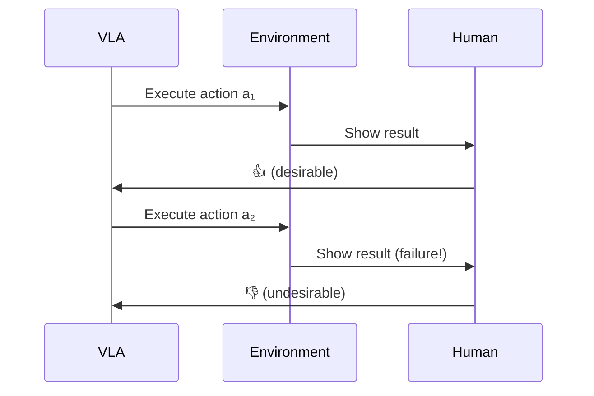

# HAPO：人类辅助动作偏好优化深度精读

> **论文标题**: Human-assisted Robotic Policy Refinement via Action Preference Optimization
> **作者**: ByteDance Robotics
> **机构**: ByteDance
> **发表**: arXiv:2506.07127, 2025
> **代码**: https://github.com/bytedance/human_assisted_preference_optimization

**标签**: `#VLA` `#偏好优化` `#HumanInTheLoop` `#在线适配` `#失败纠正` `#DPO变体`

**知识链接**：
- [KL 散度与策略约束](/前置知识/000j_前置知识_KL散度与策略约束) — DPO 的理论基础
- [行为克隆与 RL 微调范式](/前置知识/000d_前置知识_行为克隆与RL微调范式) — 后训练范式
- [策略梯度与 PPO](/前置知识/000a_前置知识_策略梯度与PPO) — 对比方法
- [VLA 模型的 RL 后训练综述](/论文综述/S06_VLA模型的RL后训练综述) — 全景概览
- [GRAPE 精读](./020_GRAPE_偏好对齐VLA泛化) — 对比：VLM 自动偏好
- [Dual-Actor 精读](./029_DualActor_人机协作VLA微调) — 对比：另一种人机协作方案

---

## 一、背景与动机

### 1.1 VLA 部署中的"最后一英里"问题

VLA 模型经过预训练 + SFT 后，在测试环境中仍有 20-40% 的失败率。这些失败通常是**系统性的**——同一类场景总是失败。

传统修复方式：
| 方式 | 成本 | 效果 |
|------|------|------|
| 收集更多示教 | 高（人类工时） | 不确定 |
| 全模型 RL | 高（计算 + 仿真） | 好但慢 |
| 人类纠正（DAgger） | 高（持续在线） | 好但不可扩展 |

### 1.2 HAPO 的核心思路

HAPO 的关键洞察：**只需要二元信号（好/坏）来纠正失败**。

人类操作员观察 VLA 执行，只需在失败时给出"这个动作不好"的信号：
- 不需要示教"正确动作是什么"（太难）
- 不需要设计奖励函数（太专业）
- 只需要标记"这个动作导致了失败"（任何人都能做）

然后用 **adaptive reweighting DPO** 来让策略避免这类失败动作。

---

## 贯穿全文的例子

> **场景**：VLA 部署在真实厨房，执行 "put the mug in the cabinet"。
>
> - **常见失败模式**：VLA 把杯子放到柜门边缘，松手时杯子滑落
> - **人类标记**：操作员看到杯子滑落时按下"bad"按钮
> - **HAPO 学到**：避免在柜门边缘松手（偏好内侧放置）
> - **结果**：10 次人类反馈后，该失败模式消除

---

## 二、方法详解

### 2.1 偏好数据收集

HAPO 的数据收集极其简单：



每个交互只需要一个二元信号：desirable (1) / undesirable (0)。

### 2.2 Adaptive Reweighting DPO

标准 DPO 假设所有偏好对的重要性相同。但在机器人操作中：
- 有些失败很严重（碰撞）→ 需要强烈避免
- 有些失败轻微（稍微偏了一点）→ 轻微修正即可

HAPO 引入自适应重加权：

$$
\mathcal{L}_{\text{HAPO}} = -\mathbb{E} \left[ w(a^-, s) \cdot \log \sigma\left(\beta \log \frac{\pi_\theta(a^+|s)}{\pi_{\text{ref}}(a^+|s)} - \beta \log \frac{\pi_\theta(a^-|s)}{\pi_{\text{ref}}(a^-|s)}\right)\right]
$$

权重 $w(a^-, s)$ 根据失败的严重程度调整：

$$
w(a^-, s) = 1 + \lambda \cdot \text{severity}(a^-, s)
$$

**severity 度量**：
- 碰撞/掉落 → severity = 1.0
- 抓空/偏移 → severity = 0.5
- 效率低但成功 → severity = 0.1

### 2.3 在线适配流程

HAPO 设计为**部署时持续运行**：

```
# 部署时在线适配
while deploying:
    # VLA 执行任务
    action = vla.predict(obs, instruction)
    result = env.step(action)

    # 人类监督（只在失败时标记）
    if human_marks_failure(result):
        buffer.add(obs, action, label="rejected")
    else:
        buffer.add(obs, action, label="chosen")

    # 定期更新（如每 10 个标记后）
    if buffer.size() >= batch_size:
        vla = hapo_update(vla, buffer)
        buffer.clear()
```

### 2.4 与 DAgger 的关键区别

| 维度 | DAgger | HAPO |
|------|--------|------|
| 人类提供什么 | 正确动作（示教） | 只需 good/bad 二元信号 |
| 人类技能需求 | 必须能操控机器人 | 只需能判断好坏 |
| 可扩展性 | 差（需要持续操作） | 好（标记很快） |
| 信号类型 | 正例（该怎么做） | 正/负例（做对了/做错了） |

---

## 三、实验结果

### 3.1 仿真实验

| 方法 | 人类交互次数 | 最终成功率 |
|------|------------|-----------|
| SFT baseline | 0 | 62% |
| DAgger (50 corrections) | 50 | 75% |
| Online PPO (1000 rollouts) | 0 (但需仿真) | 82% |
| **HAPO (20 labels)** | **20** | **80%** |
| **HAPO (50 labels)** | **50** | **85%** |

仅 20 个二元标记就能接近 PPO 水平，50 个标记超越 DAgger。

### 3.2 真实机器人

| 任务 | SFT | HAPO (30 labels) | 提升 |
|------|-----|-------------------|------|
| Mug placement | 55% | 82% | +27% |
| Drawer closing | 60% | 88% | +28% |
| Object stacking | 40% | 70% | +30% |

### 3.3 泛化到新场景

关键发现：HAPO 学到的不是"特定动作"而是"策略原则"：

| 训练场景 | 新场景（不同物体） | 新场景成功率 |
|---------|------------------|------------|
| 红杯→柜子 | 蓝杯→柜子 | 78%（只降 4%） |
| 红杯→柜子 | 红碗→柜子 | 72%（降 10%） |

HAPO 学到了"不要在边缘松手"的通用原则。

---

## 四、总结

| 维度 | HAPO |
|------|------|
| 核心创新 | 只需二元 good/bad 人类信号做 DPO 适配 |
| 人类成本 | 20-50 个二元标记 |
| 训练方式 | 部署时在线持续适配 |
| 性能 | 接近 PPO 水平（无需仿真） |
| 独特优势 | 任何非专业人员都能提供反馈 |
| 适用场景 | VLA 部署后的在线修复 |

---

## 延伸阅读

- [GRAPE：偏好对齐 VLA 泛化](./020_GRAPE_偏好对齐VLA泛化) — VLM 自动偏好（无人类）
- [Dual-Actor：人机协作 VLA](./029_DualActor_人机协作VLA微调) — 语言级人机交互
- [RECAP：从真实经验中学习](./016_RECAP_从真实部署经验中RL学习) — 真实部署经验利用
