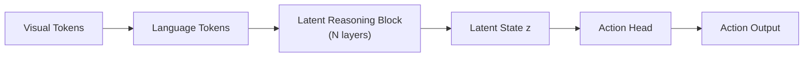

# LaST-R1：潜空间推理 RL 增强 VLA 深度精读

> **论文标题**: Reinforcing Action via Adaptive Physical Latent Reasoning for VLA Models
> **作者**: Anonymous
> **机构**: TBD
> **发表**: arXiv:2604.28192, 2025

**标签**: `#VLA` `#强化学习` `#潜空间推理` `#CoT` `#GRPO` `#物理动力学` `#99.8%`

**知识链接**：
- [GRPO](/前置知识/000m_前置知识_GRPO_Group_Relative_Policy_Optimization) — RL 优化算法
- [策略梯度与 PPO](/前置知识/000a_前置知识_策略梯度与PPO) — 对比方法
- [动作 Token 化与自回归策略](/前置知识/000l_前置知识_动作Token化与自回归策略) — VLA 动作表示
- [VLA 模型的 RL 后训练综述](/论文综述/S06_VLA模型的RL后训练综述) — 全景概览
- [VLA-R1 精读](./037_VLA_R1_推理增强VLA) — 对比：显式文本 CoT

---

## 一、背景与动机

### 1.1 显式 CoT 的问题

VLA-R1 等方法使用显式文本 CoT（`<think>I see the red cup at...</think>`）。但这有两个问题：

1. **推理延迟**：生成文本 CoT 需要额外 token → 增加推理时间 50-200ms
2. **文本瓶颈**：物理动力学（力、加速度、接触力学）很难用自然语言精确描述

### 1.2 LaST-R1 的思路：潜空间推理

不生成文本推理，而是在**连续潜空间**中做"物理思考"：

$$
z_{\text{reason}} = f_{\text{latent}}(o_t, \text{instruction}) \in \mathbb{R}^d
$$

这个潜空间向量编码了物理动力学先验——"如果我这样推，物体会怎样移动"。

**类比**：人类做操作时不会在脑中"用文字思考"——而是有一种直觉的、非语言的物理感知。LaST-R1 模拟的是这种直觉推理。

### 1.3 惊人的结果

> LaST-R1 在 LIBERO 基准上达到 **99.8%** 平均成功率，仅需 **one-shot** 监督热启动。

---

## 贯穿全文的例子

> **场景**：VLA 执行 "slide the block to the edge of the table"（需要理解力学：推多远、多大力）。
>
> - **普通 VLA**：不理解"边缘"是多远，经常推出桌子或推不够
> - **VLA-R1（文本 CoT）**："The table edge is about 20cm away..." → 延迟大，描述不精确
> - **LaST-R1（潜空间推理）**：潜变量 $z_{\text{reason}}$ 隐式编码"距离 20cm + 摩擦力 → 需要 0.3N 推力持续 2s" → 无延迟，精确

---

## 二、方法详解

### 2.1 架构：Latent Reasoning Block

在 VLA 的 transformer backbone 中插入 Latent Reasoning Block：

Latent Reasoning Block 由 N 层 transformer 组成，但不生成文本 token——直接输出连续向量：

$$
z_1, z_2, \ldots, z_K = \text{LatentBlock}(\text{visual\_tokens}, \text{language\_tokens})
$$

$K$ 个潜变量编码了多步推理的中间状态。

### 2.2 Latent-to-Action Policy Optimization (LAPO)

LaST-R1 提出专门的 RL 算法 LAPO，同时优化**推理质量**和**动作质量**：

$$
\mathcal{L}_{\text{LAPO}} = \mathcal{L}_{\text{action}} + \alpha \cdot \mathcal{L}_{\text{latent}}
$$

**动作 Loss（GRPO 风格）**：

$$
\mathcal{L}_{\text{action}} = -\mathbb{E}\left[ A(s, a) \cdot \log \pi_\theta(a | z, s) \right]
$$

**潜空间 Loss（推理质量约束）**：

$$
\mathcal{L}_{\text{latent}} = -\mathbb{E}\left[ A(s, a) \cdot \cos(z_\theta, z_{\text{target}}) \right]
$$

其中 $z_{\text{target}}$ 是成功轨迹对应的潜空间向量——鼓励推理状态靠近"成功的思考模式"。

### 2.3 Adaptive Physical Prior

潜空间推理需要"物理直觉"的种子。LaST-R1 通过**物理先验注入**：

训练时的额外监督：

$$
\mathcal{L}_{\text{physics}} = \| z_{\text{reason}} - \text{PhysicsEncoder}(\text{forces}, \text{velocities}, \text{contacts}) \|^2
$$

用仿真中的物理量（力、速度、接触）来训练潜空间编码器——让潜变量确实编码物理信息。

### 2.4 One-Shot Warm-up

LaST-R1 只需要**一条示教**做监督热启动：

1. 用 1 条示教训练 VLA 的基础动作能力（1 epoch SFT）
2. 立刻切入 LAPO RL 训练
3. 从几乎 0 开始通过 RL 自主探索提升

**为什么 one-shot 就够**：潜空间推理提供了强大的先验——即使只见过一条轨迹，物理推理能力让它举一反三。

---

## 三、实验结果

### 3.1 LIBERO 基准

| 方法 | 示教数据 | 成功率 |
|------|---------|--------|
| OpenVLA (SFT, 50 demos) | 50 | 76% |
| VLA-RL (PPO, 50 demos + RL) | 50 | 87% |
| VLA-R1 (CoT + GRPO) | 10 | 92% |
| **LaST-R1 (LAPO, 1 demo)** | **1** | **99.8%** |

One-shot 达到 99.8%——接近完美。

### 3.2 收敛速度

| 方法 | 达到 95% SR 所需 RL 步数 |
|------|------------------------|
| VLA-RL | 5000 |
| TGRPO | 2000 |
| VLA-R1 | 500 |
| **LaST-R1** | **150** |

LaST-R1 收敛极快——物理先验让探索极为高效。

### 3.3 推理延迟

| 方法 | 推理延迟 |
|------|---------|
| OpenVLA（无推理） | 100ms |
| VLA-R1（文本 CoT） | 250ms |
| **LaST-R1（潜空间）** | **110ms** |

潜空间推理几乎无额外延迟（只多 10ms）。

---

## 四、为什么潜空间推理 > 文本推理

| 维度 | 文本 CoT | 潜空间推理 |
|------|---------|-----------|
| 延迟 | +150ms | +10ms |
| 物理精度 | 文字描述不精确 | 连续向量精确编码 |
| RL 可优化性 | 文本 token 离散 → 梯度难传 | 连续向量 → 梯度直接传播 |
| 可解释性 | ✅ 可读 | ❌ 黑箱 |
| 性能上限 | 92% | 99.8% |

---

## 五、总结

| 维度 | LaST-R1 |
|------|---------|
| 核心创新 | 潜空间物理推理替代文本 CoT + 专用 LAPO 算法 |
| RL 算法 | LAPO（GRPO 变体 + 潜空间约束） |
| 数据需求 | 1 条示教（one-shot） |
| 最终性能 | LIBERO 99.8% |
| 推理延迟 | 仅 +10ms |
| 关键洞察 | 物理推理不需要文字，连续向量更精确 |

---

## 延伸阅读

- [VLA-R1：推理增强 VLA](./037_VLA_R1_推理增强VLA) — 文本 CoT 路线
- [TGRPO：轨迹级 GRPO](./019_TGRPO_轨迹级GRPO微调VLA) — 无推理的 GRPO
- [GRPO 前置知识](/前置知识/000m_前置知识_GRPO_Group_Relative_Policy_Optimization)
