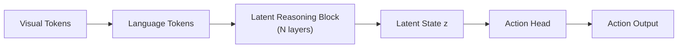

# LaST-R1：潜空间推理 RL 增强 VLA 深度精读

> **论文标题**: Reinforcing Action via Adaptive Physical Latent Reasoning for VLA Models
> **作者**: Anonymous
> **机构**: TBD
> **发表**: arXiv:2604.28192, 2025

**标签**: `#VLA` `#强化学习` `#潜空间推理` `#CoT` `#GRPO` `#物理动力学` `#99.8%`

**知识链接**：
- [GRPO](/前置知识/000m_前置知识_GRPO_Group_Relative_Policy_Optimization) — RL 优化算法
- [策略梯度与 PPO](/前置知识/000a_前置知识_策略梯度与PPO) — 对比方法
- [动作 Token 化与自回归策略](/前置知识/000l_前置知识_动作Token化与自回归策略) — VLA 动作表示
- [VLA 模型的 RL 后训练综述](/论文综述/S06_VLA模型的RL后训练综述) — 全景概览
- [VLA-R1 精读](./037_VLA_R1_推理增强VLA) — 对比：显式文本 CoT

---

## 一、背景与动机

### 1.1 显式 CoT 的问题

VLA-R1 等方法使用显式文本 CoT（`<think>I see the red cup at...</think>`）。但这有两个问题：

1. **推理延迟**：生成文本 CoT 需要额外 token → 增加推理时间 50-200ms
2. **文本瓶颈**：物理动力学（力、加速度、接触力学）很难用自然语言精确描述

### 1.2 LaST-R1 的思路：潜空间推理

不生成文本推理，而是在**连续潜空间**中做"物理思考"：

$$
z_{\text{reason}} = f_{\text{latent}}(o_t, \text{instruction}) \in \mathbb{R}^d
$$

**这个公式在做什么**：把当前观测和指令喂进一个网络，输出一个不是文字、而是连续向量的"物理直觉"——这个向量就代表模型对"接下来物理会怎样发生"的隐式思考结果。

::: details 📐 公式详解（点击展开）

| 子表达式 | 它是谁 | 它在干嘛 |
|---------|--------|---------|
| $o_t, \text{instruction}$ | **输入信息** | 当前时刻的视觉观测和语言指令 |
| $f_{\text{latent}}(\cdot)$ | **潜空间推理器** | 一个把观测+指令映射成一个向量的网络（内部是 transformer block） |
| $z_{\text{reason}} \in \mathbb{R}^d$ | **物理直觉向量** | 一个 $d$ 维连续向量，编码"如果这样操作，物体会怎样移动"这类物理先验 |

**用人话读**："把看到的画面和听到的指令一起喂给一个网络，网络吐出一个不是文字的'物理直觉'向量，代表它对接下来会发生什么的隐式判断。"

**为什么不用文字表示这个推理**：物理动力学（力、加速度、接触力学）很难用自然语言精确描述，且生成文字 token 会增加推理延迟；连续向量既能精确编码这些连续量，又不需要逐 token 生成，几乎无延迟。
:::

这个潜空间向量编码了物理动力学先验——"如果我这样推，物体会怎样移动"。

**类比**：人类做操作时不会在脑中"用文字思考"——而是有一种直觉的、非语言的物理感知。LaST-R1 模拟的是这种直觉推理。

### 1.3 惊人的结果

> LaST-R1 在 LIBERO 基准上达到 **99.8%** 平均成功率，仅需 **one-shot** 监督热启动。

---

## 贯穿全文的例子

> **场景**：VLA 执行 "slide the block to the edge of the table"（需要理解力学：推多远、多大力）。
>
> - **普通 VLA**：不理解"边缘"是多远，经常推出桌子或推不够
> - **VLA-R1（文本 CoT）**："The table edge is about 20cm away..." → 延迟大，描述不精确
> - **LaST-R1（潜空间推理）**：潜变量 $z_{\text{reason}}$ 隐式编码"距离 20cm + 摩擦力 → 需要 0.3N 推力持续 2s" → 无延迟，精确

---

## 二、方法详解

### 2.1 架构：Latent Reasoning Block

在 VLA 的 transformer backbone 中插入 Latent Reasoning Block：

```mermaid
flowchart LR
    A["Visual Tokens"] --> B["Language Tokens"] --> C["Latent Reasoning Block<br>(N layers)"]
    C --> D["Latent State z"]
    D --> E["Action Head"]
    E --> F["Action Output"]
```

Latent Reasoning Block 由 N 层 transformer 组成，但不生成文本 token——直接输出连续向量：

$$
z_1, z_2, \ldots, z_K = \text{LatentBlock}(\text{visual\_tokens}, \text{language\_tokens})
$$

**这个公式在做什么**：Latent Reasoning Block 一次性吃进视觉和语言 token，吐出 $K$ 个连续潜变量——相当于把"多步推理"拆成 $K$ 个中间思考状态，但每个状态都是向量而不是文字。

::: details 📐 公式详解（点击展开）

| 子表达式 | 它是谁 | 它在干嘛 |
|---------|--------|---------|
| $\text{visual\_tokens}, \text{language\_tokens}$ | **输入两路信息** | 视觉编码后的 token 序列和语言编码后的 token 序列 |
| $\text{LatentBlock}(\cdot)$ | **N 层推理堆栈** | N 层 transformer，不输出文字 token，只输出连续向量 |
| $z_1,\ldots,z_K$ | **多步中间思考状态** | $K$ 个潜变量，依次代表推理链条上的第 1 步到第 $K$ 步 |

**用人话读**："视觉和语言信息进入一个专门的推理模块，模块内部像做多步思考一样，依次吐出 $K$ 个思考状态向量，而不是吐出一句话。"

**为什么要输出多个 $z$ 而不是一个**：单一向量压缩能力有限，拆成 $K$ 步和文字 CoT 的"多步推理"在结构上对应，但每一步都用连续向量表示，兼顾了推理深度和无文字延迟。
:::

### 2.2 Latent-to-Action Policy Optimization (LAPO)

LaST-R1 提出专门的 RL 算法 LAPO，同时优化**推理质量**和**动作质量**：

$$
\mathcal{L}_{\text{LAPO}} = \mathcal{L}_{\text{action}} + \alpha \cdot \mathcal{L}_{\text{latent}}
$$

**这个公式在做什么**：把"动作要选好"和"潜空间推理要靠近成功模式"两个目标打包成一个总损失，用系数 $\alpha$ 平衡两者的权重。

::: details 📐 公式详解（点击展开）

| 子表达式 | 它是谁 | 它在干嘛 |
|---------|--------|---------|
| $\mathcal{L}_{\text{action}}$ | **动作打分员** | 约束"选出的动作要好"，见下方公式 |
| $\alpha \cdot \mathcal{L}_{\text{latent}}$ | **推理质量约束（带权重）** | 约束"潜空间的思考状态要靠近成功轨迹的思考模式"，$\alpha$ 控制这项的重要程度 |
| $\mathcal{L}_{\text{LAPO}}$ | **总训练目标** | 两项相加，一次反向传播同时优化动作策略和潜空间推理 |

**用人话读**："总损失 = 动作选得好不好的损失 + 一个权重乘以潜空间推理靠不靠谱的损失，两个一起优化。"

**为什么两项要联合优化而不是分开训**：动作质量依赖于潜空间推理是否准确（$\pi_\theta(a|z,s)$ 里 $z$ 是推理结果），如果只优化动作而不约束 $z$，模型可能学出"凑巧能生成好动作但物理上乱来"的 $z$；联合优化把两者绑在一起训练。
:::

**动作 Loss（GRPO 风格）**：

$$
\mathcal{L}_{\text{action}} = -\mathbb{E}\left[ A(s, a) \cdot \log \pi_\theta(a | z, s) \right]
$$

**这个公式在做什么**：用[优势函数](/前置知识/000o_前置知识_Q函数与Value函数) $A(s,a)$ 给动作打分，好动作（$A>0$）就提高它被选中的概率，差动作就压低——是标准策略梯度损失的写法。

::: details 📐 公式详解（点击展开）

| 子表达式 | 它是谁 | 它在干嘛 |
|---------|--------|---------|
| $A(s,a)$ | **动作打分器** | 优势函数，这个动作比平均水平好多少 |
| $\log \pi_\theta(a\mid z,s)$ | **策略的信心** | 策略在给定潜空间推理 $z$ 和状态 $s$ 下，选出动作 $a$ 的对数概率 |
| $-\mathbb{E}[\cdot]$ | **取负后求平均** | 优化器做梯度下降，取负号把"最大化收益"变成"最小化损失"；期望在实际训练中用一个 batch 的样本均值近似 |

**用人话读**："动作好就把选它的概率往上调，动作差就往下调，调的力度由这个动作比平均水平好多少来决定——这就是策略梯度的标准写法，只是策略额外条件在潜空间推理 $z$ 上。"

**为什么策略要额外条件在 $z$ 上**：$z$ 是 Latent Reasoning Block 输出的物理直觉，把动作策略写成 $\pi_\theta(a|z,s)$ 而不是 $\pi_\theta(a|s)$，意味着动作选择要经过潜空间推理这一步，动作质量因此依赖推理质量。
:::

**潜空间 Loss（推理质量约束）**：

$$
\mathcal{L}_{\text{latent}} = -\mathbb{E}\left[ A(s, a) \cdot \cos(z_\theta, z_{\text{target}}) \right]
$$

**这个公式在做什么**：奖励那些"带来好动作结果"的潜空间推理状态，让它们的方向靠近成功轨迹对应的推理状态——用余弦相似度衡量"思考方式像不像"。

::: details 📐 公式详解（点击展开）

| 子表达式 | 它是谁 | 它在干嘛 |
|---------|--------|---------|
| $z_\theta$ | **当前推理状态** | 当前策略网络在这一步输出的潜空间向量 |
| $z_{\text{target}}$ | **成功模板** | 成功轨迹对应的潜空间向量，代表"靠谱的思考方式" |
| $\cos(z_\theta, z_{\text{target}})$ | **像不像打分** | 两个向量的余弦相似度，方向越接近分数越高 |
| $A(s,a)$ | **结果权重** | 只有当这一步带来的动作结果好（$A>0$）时，才认为这个推理状态值得被强化 |

**用人话读**："如果这一步动作结果好，就把当前的潜空间推理状态往'成功轨迹的思考方式'那个方向拉近；结果不好就不这么拉，甚至推远。"

**为什么用余弦相似度而不是欧氏距离**：余弦相似度只关心方向、不关心尺度，避免推理向量被训练成"数值上接近但方向乱"的退化解，也让梯度更稳定。
:::

其中 $z_{\text{target}}$ 是成功轨迹对应的潜空间向量——鼓励推理状态靠近"成功的思考模式"。

### 2.3 Adaptive Physical Prior

潜空间推理需要"物理直觉"的种子。LaST-R1 通过**物理先验注入**：

训练时的额外监督：

$$
\mathcal{L}_{\text{physics}} = \| z_{\text{reason}} - \text{PhysicsEncoder}(\text{forces}, \text{velocities}, \text{contacts}) \|^2
$$

**这个公式在做什么**：强迫潜空间推理向量 $z_{\text{reason}}$ 逼近仿真里真实的物理量编码，防止它变成一个"看起来在推理但其实没编码物理信息"的黑箱向量。

::: details 📐 公式详解（点击展开）

| 子表达式 | 它是谁 | 它在干嘛 |
|---------|--------|---------|
| $z_{\text{reason}}$ | **模型自己算出的推理向量** | 前面公式定义的潜空间推理输出 |
| $\text{PhysicsEncoder}(\text{forces},\text{velocities},\text{contacts})$ | **物理真值编码** | 把仿真器里真实的力、速度、接触信息编码成同维度向量，作为监督标签 |
| $\|\cdot\|^2$ | **差距打分** | 两个向量的欧氏距离平方，越接近说明 $z_{\text{reason}}$ 越"懂物理" |

**用人话读**："让模型自己想出来的推理向量，尽量和仿真器里真实的力、速度、接触信息编码对齐——这样它才是真的在做物理推理，不是随便编个向量。"

**为什么需要这个额外监督**：只靠 RL 的奖励信号，潜变量可能学出一个能凑巧提升成功率但物理上不合理的表示（reward hacking）；直接用仿真物理量做监督，保证潜空间确实承载了物理直觉，这也是"one-shot 就能泛化"的关键先验来源。
:::

用仿真中的物理量（力、速度、接触）来训练潜空间编码器——让潜变量确实编码物理信息。

### 2.4 One-Shot Warm-up

LaST-R1 只需要**一条示教**做监督热启动：

1. 用 1 条示教训练 VLA 的基础动作能力（1 epoch SFT）
2. 立刻切入 LAPO RL 训练
3. 从几乎 0 开始通过 RL 自主探索提升

**为什么 one-shot 就够**：潜空间推理提供了强大的先验——即使只见过一条轨迹，物理推理能力让它举一反三。

---

## 三、实验结果

### 3.1 LIBERO 基准

| 方法 | 示教数据 | 成功率 |
|------|---------|--------|
| OpenVLA (SFT, 50 demos) | 50 | 76% |
| VLA-RL (PPO, 50 demos + RL) | 50 | 87% |
| VLA-R1 (CoT + GRPO) | 10 | 92% |
| **LaST-R1 (LAPO, 1 demo)** | **1** | **99.8%** |

One-shot 达到 99.8%——接近完美。

### 3.2 收敛速度

| 方法 | 达到 95% SR 所需 RL 步数 |
|------|------------------------|
| VLA-RL | 5000 |
| TGRPO | 2000 |
| VLA-R1 | 500 |
| **LaST-R1** | **150** |

LaST-R1 收敛极快——物理先验让探索极为高效。

### 3.3 推理延迟

| 方法 | 推理延迟 |
|------|---------|
| OpenVLA（无推理） | 100ms |
| VLA-R1（文本 CoT） | 250ms |
| **LaST-R1（潜空间）** | **110ms** |

潜空间推理几乎无额外延迟（只多 10ms）。

---

## 四、为什么潜空间推理 > 文本推理

| 维度 | 文本 CoT | 潜空间推理 |
|------|---------|-----------|
| 延迟 | +150ms | +10ms |
| 物理精度 | 文字描述不精确 | 连续向量精确编码 |
| RL 可优化性 | 文本 token 离散 → 梯度难传 | 连续向量 → 梯度直接传播 |
| 可解释性 | ✅ 可读 | ❌ 黑箱 |
| 性能上限 | 92% | 99.8% |

---

## 五、总结

| 维度 | LaST-R1 |
|------|---------|
| 核心创新 | 潜空间物理推理替代文本 CoT + 专用 LAPO 算法 |
| RL 算法 | LAPO（GRPO 变体 + 潜空间约束） |
| 数据需求 | 1 条示教（one-shot） |
| 最终性能 | LIBERO 99.8% |
| 推理延迟 | 仅 +10ms |
| 关键洞察 | 物理推理不需要文字，连续向量更精确 |

---

## 延伸阅读

- [VLA-R1：推理增强 VLA](./037_VLA_R1_推理增强VLA) — 文本 CoT 路线
- [TGRPO：轨迹级 GRPO](./019_TGRPO_轨迹级GRPO微调VLA) — 无推理的 GRPO
- [GRPO 前置知识](/前置知识/000m_前置知识_GRPO_Group_Relative_Policy_Optimization)
