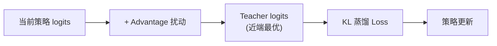

# ROAD-VLA：优势引导自蒸馏在线适配深度精读

> **论文标题**: ROAD-VLA: Robust Online Adaptation via Self-Distillation for Vision-Language-Action Models
> **作者**: Anonymous
> **机构**: TBD
> **发表**: arXiv:2606.25800, 2025

**标签**: `#VLA` `#强化学习` `#自蒸馏` `#在线适配` `#稀疏奖励` `#Token级`

**知识链接**：
- [策略梯度与 PPO](/前置知识/000a_前置知识_策略梯度与PPO) — 对比方法
- [KL 散度与策略约束](/前置知识/000j_前置知识_KL散度与策略约束) — 蒸馏约束
- [动作 Token 化与自回归策略](/前置知识/000l_前置知识_动作Token化与自回归策略) — 动作 token
- [Q 函数与 Value 函数](/前置知识/000o_前置知识_Q函数与Value函数) — Advantage 计算
- [VLA 模型的 RL 后训练综述](/论文综述/S06_VLA模型的RL后训练综述) — 全景概览
- [FORCE 精读](./026_FORCE_高效VLA_RL微调) — 对比：也用自蒸馏思想

---

## 一、背景与动机

### 1.1 PPO 在 VLA 上的不稳定性

PPO 做 VLA 后训练时，经常出现训练不稳定：

- **二元奖励 + 长 horizon**：200 步中只有最终 0/1 → Advantage 估计噪声大
- **Token 级更新**：PPO 对每个 action token 独立更新 → 相邻 token 可能被推向矛盾方向
- **策略崩溃**：某次更新过大 → 进入不可恢复的差状态

### 1.2 ROAD-VLA 的核心思想

ROAD-VLA 提出：**不用 PPO 的策略梯度，而是构造一个"优势引导的 teacher"来做蒸馏**。

核心流程：
1. 从当前策略的 action logits 出发
2. 用**校准的 advantage 估计**扰动 logits → 得到 "teacher logits"
3. 让策略学习 teacher logits（KL 蒸馏）

**效果**：将稀疏的 episode-level reward 转化为**密集的 token-level 监督**。



---

## 贯穿全文的例子

> **场景**：VLA 执行 200 步抓取任务，最终成功（reward=1）。
>
> - **PPO**：给所有 200×7=1400 个 token 同样的 advantage 信号 → 噪声大
> - **ROAD-VLA**：
>   - 估计每个 token 的贡献度（Advantage 校准）
>   - 对"关键 token"（如接近物体时的位置 token）给大扰动
>   - 对"无关 token"（如远离目标时的动作）给小扰动
>   - 结果：精准强化关键决策点

---

## 二、方法详解

### 2.1 Advantage-Guided Teacher Construction

对当前策略 $\pi_\theta$ 的 logits $l(s, i)$（状态 $s$，token 位置 $i$）：

$$
l_{\text{teacher}}(s, i) = l_\theta(s, i) + \eta \cdot \hat{A}(s, i)
$$

**这个公式在做什么**：在当前策略的 logits 上加一个和"这个 token 有多好"成正比的扰动，凭空造出一个比当前策略"稍微更好"的 teacher，而不需要额外训练一个新模型。

::: details 📐 公式详解（点击展开）

| 子表达式 | 它是谁 | 它在干嘛 |
|---------|--------|---------|
| $l_\theta(s, i)$ | **学生现在的想法** | 当前策略在状态 $s$、token 位置 $i$ 上输出的原始 logits（还没做任何修改） |
| $\hat{A}(s, i)$ | **这个 token 的成绩单** | 校准后的 token-level advantage，正数说明这个 token 选得好，负数说明选得差 |
| $\eta \cdot \hat{A}(s, i)$ | **改进方向的推力** | 用步长 $\eta$ 控制这个成绩单实际能推动 logits 移动多少 |
| $l_{\text{teacher}}(s,i)$ | **想象出来的更好版本** | 学生的 logits 加上推力后得到的"假想老师"，不是另一个独立训练的模型 |

**用人话读**："把学生自己现在的判断，按每个 token 的好坏程度往正确方向推一点，推出来的结果就当作'老师'的答案，让学生反过来去学这个老师。"

**为什么是这个形式**：直接在 logits 空间加扰动而不是重新训练一个 teacher，成本几乎为零；扰动幅度由 advantage 控制，好 token 被推得更用力、差 token 被压得更用力，天然实现了"精准强化关键决策点"的效果，同时步长 $\eta$ 保证这个 teacher 离当前策略足够近（不会一步走太远）。
:::

### 2.2 Token-Level Advantage 校准

如何从 episode reward 得到 token-level advantage？

**Step 1：Trajectory-level advantage**

$$
A_{\text{traj}} = R_{\text{episode}} - V(s_0)
$$

**这个公式在做什么**：算出整条轨迹（一整个 episode）到底比"预期水平"好了多少或差了多少——这是一个粗粒度的、整段轨迹共享的单一分数。

::: details 📐 公式详解（点击展开）

| 子表达式 | 它是谁 | 它在干嘛 |
|---------|--------|---------|
| $R_{\text{episode}}$ | **最终成绩** | 整个 episode 结束后拿到的真实奖励（比如成功=1，失败=0） |
| $V(s_0)$ | **起跑前的预期** | 从初始状态 $s_0$ 出发，[价值函数](/前置知识/000o_前置知识_Q函数与Value函数)对这条轨迹"通常能拿多少分"的预测 |
| $A_{\text{traj}}$ | **超出预期的部分** | 实际拿到的分数减去预期分数，正数说明这条轨迹比预期好，负数说明比预期差 |

**用人话读**："这条轨迹最终的实际得分，减去一开始就预测好的'平均水平'得分，剩下的差值就是这整条轨迹的优势分。"

**为什么是这个形式**：这是标准的 [Advantage](/前置知识/000o_前置知识_Q函数与Value函数) 定义在轨迹层面的应用——但它对 200 步、1400 个 token 只给出**一个**数字，粒度太粗，没法告诉网络"具体是哪几个 token 做对了/做错了"，因此需要下一步的 token-level attribution 把它细化。
:::

**Step 2：Token-level attribution**

使用 attention rollout 的思路估计每个 token 对最终结果的贡献：

$$
\hat{A}(s, i) = A_{\text{traj}} \cdot \frac{\text{grad\_norm}(l(s,i))}{\sum_j \text{grad\_norm}(l(s,j))}
$$

**这个公式在做什么**：把整条轨迹唯一的一个优势分，按"每个 token 对输出的影响力大小"重新分配到每个具体的 token 上，得到密集的 token 级别信号。

::: details 📐 公式详解（点击展开）

| 子表达式 | 它是谁 | 它在干嘛 |
|---------|--------|---------|
| $A_{\text{traj}}$ | **待分配的总奖金池** | 上一步算出的整条轨迹的优势分，是要拆给所有 token 的"总量" |
| $\text{grad\_norm}(l(s,i))$ | **第 $i$ 个 token 的影响力** | 这个 token 位置的梯度范数，梯度越大说明这个 token 对最终输出的影响越大 |
| $\sum_j \text{grad\_norm}(l(s,j))$ | **全体影响力总和** | 把状态 $s$ 下所有 token 的梯度范数加起来，作为归一化分母 |
| $\frac{\text{grad\_norm}(l(s,i))}{\sum_j \text{grad\_norm}(l(s,j))}$ | **这个 token 该拿的份额** | 归一化后的比例，介于 0 到 1 之间，代表第 $i$ 个 token 该分到总奖金池的多少比例 |
| $\hat{A}(s,i)$ | **分配到手的 token 级奖金** | 总奖金池乘以这个 token 的份额，就是它最终拿到的 advantage |

**用人话读**："把整条轨迹的优势分当成一笔总奖金，按每个 token 对结果的影响力大小（梯度范数）分配比例，影响力越大的 token 分到的奖金越多。"

**为什么是这个形式**：梯度范数直接反映了"改变这个 token 的输出，最终结果会跟着改变多少"，用它做分配权重，相当于让网络自己告诉我们"哪个决策点最关键"，不需要额外训练一个 attribution 模型，实现代价很低。
:::

### 2.3 Proximality Guarantee

ROAD-VLA 证明了一个理论下界：

$$
J(\pi_{\text{new}}) \geq J(\pi_\theta) - \epsilon_{\text{calibration}} - \epsilon_{\text{matching}}
$$

**这个公式在做什么**：给出一个理论下界，保证只要两类误差足够小，蒸馏后的新策略性能不会比旧策略差太多——这是 ROAD-VLA "不会崩溃"这个实验现象背后的理论依据。

::: details 📐 公式详解（点击展开）

| 子表达式 | 它是谁 | 它在干嘛 |
|---------|--------|---------|
| $J(\pi_{\text{new}})$ | **新策略的真实水平** | 蒸馏更新之后的策略，能拿到的期望回报 |
| $J(\pi_\theta)$ | **旧策略的真实水平** | 更新之前的策略，能拿到的期望回报，作为对比基准 |
| $\epsilon_{\text{calibration}}$ | **打分环节的误差** | Advantage 校准（Step 1+2 那两步）本身不够准的程度 |
| $\epsilon_{\text{matching}}$ | **模仿环节的误差** | 策略去学 teacher logits 时，没能完全学到位、留下的差距 |
| $J(\pi_\theta) - \epsilon_{\text{calibration}} - \epsilon_{\text{matching}}$ | **性能的安全底线** | 旧策略水平减去两类误差，新策略绝不会跌破这条底线 |

**用人话读**："只要打分环节和模仿环节两边都不出大错，新策略的表现最差也不会比旧策略差太多——不可能出现断崖式的性能崩溃。"

**为什么是这个形式**：这个下界把"策略会不会变差"拆成两个可以分别控制、分别优化的独立误差项——只要工程上把 advantage 估计做准、把蒸馏训练做到位，理论上就杜绝了 PPO 那种"一次更新过大导致进入不可恢复差状态"的风险，这正是实验中 ROAD-VLA 做到 0/7 崩溃的理论支撑。
:::

### 2.4 训练流程

```python
for rollout_batch in online_rollouts:
    # 1. 收集 rollout 并获得 episode reward
    trajectories = collect_rollouts(policy, env)

    # 2. 校准 token-level advantage
    advantages = calibrate_advantages(trajectories)

    # 3. 构造 teacher logits
    teacher_logits = policy.logits + eta * advantages

    # 4. KL 蒸馏更新
    loss = kl_divergence(policy.logits, teacher_logits)
    policy.update(loss)
```

---

## 三、实验结果

### 3.1 对比 PPO

在 7 个机器人操作环境中：

| 方法 | 平均成功率 | 训练稳定性 | 策略崩溃次数 |
|------|-----------|-----------|------------|
| PPO | 72% | ⚠️ 中等 | 3/7 |
| GRPO | 75% | ✅ 较好 | 1/7 |
| **ROAD-VLA** | **82%** | **✅ 最佳** | **0/7** |

ROAD-VLA 在所有 7 个环境中都没有策略崩溃。

### 3.2 分布偏移鲁棒性

| 测试条件 | PPO | ROAD-VLA |
|---------|-----|----------|
| In-distribution | 72% | 82% |
| 新物体颜色 | 60% | 75% |
| 新相机角度 | 55% | 72% |
| 新光照条件 | 58% | 74% |

ROAD-VLA 对 OOD 扰动的鲁棒性显著优于 PPO。

### 3.3 消融

| 组件 | 成功率 |
|------|--------|
| Full ROAD-VLA | 82% |
| - Token-level calibration（用 uniform advantage） | 75% |
| - Proximality constraint | 73% |
| Replace with PPO gradient | 72% |

Token-level calibration 贡献最大（+7%）。

---

## 四、ROAD-VLA vs PPO vs GRPO

| 维度 | PPO | GRPO | ROAD-VLA |
|------|-----|------|----------|
| 更新方式 | 策略梯度 | 组相对排序 | 自蒸馏 |
| 信号粒度 | Token-level（但噪声大） | Trajectory-level | Token-level（校准后） |
| 需要 Critic？ | ✅ | ❌ | ❌（用 gradient attribution 替代） |
| 训练稳定性 | ⚠️ | ✅ | ✅✅ |
| 理论保证 | 有（但实际常违反） | 无 | 有（Proximality bound） |

---

## 五、总结

| 维度 | ROAD-VLA |
|------|----------|
| 核心问题 | PPO 在稀疏奖励下对 VLA token 更新不稳定 |
| 核心方案 | Advantage 校准 + 近端 teacher 构造 + KL 蒸馏 |
| 关键效果 | 0/7 崩溃（vs PPO 3/7），+10% 成功率 |
| 理论贡献 | 证明了 policy improvement 下界 |
| 适用场景 | 稀疏奖励 + 需要训练稳定性的在线 VLA RL |

---

## 延伸阅读

- [FORCE：高效 VLA RL](./026_FORCE_高效VLA_RL微调) — 也使用自蒸馏（但作为正则化）
- [VLA-RL：PPO 直接训练](./006_VLA_RL_PPO直接训练自回归VLA) — 标准 PPO 对比
- [TGRPO：轨迹级 GRPO](./019_TGRPO_轨迹级GRPO微调VLA) — GRPO 路线对比
