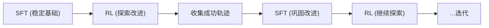

# iRe-VLA：迭代 RL + SFT 交替训练深度精读

> **论文标题**: Improving Vision-Language-Action Model with Online Reinforcement Learning
> **作者**: Yanjiang Guo, et al.
> **机构**: Tsinghua University, Shanghai AI Lab
> **发表**: arXiv:2501.16664, 2025

**标签**: `#VLA` `#强化学习` `#迭代训练` `#RL-SFT交替` `#在线改进` `#稳定训练`

**知识链接**：
- [策略梯度与 PPO](/前置知识/000a_前置知识_策略梯度与PPO) — RL 算法
- [行为克隆与 RL 微调范式](/前置知识/000d_前置知识_行为克隆与RL微调范式) — 范式基础
- [KL 散度与策略约束](/前置知识/000j_前置知识_KL散度与策略约束) — 防崩溃
- [动作 Token 化与自回归策略](/前置知识/000l_前置知识_动作Token化与自回归策略) — VLA 动作表示
- [VLA 模型的 RL 后训练综述](/论文综述/S06_VLA模型的RL后训练综述) — 全景概览
- [SimpleVLA-RL 精读](./012_SimpleVLA_RL_可扩展VLA_RL训练) — 对比：纯 RL 路线

---

## 一、背景与动机

### 1.1 纯 RL 训练 VLA 的不稳定性

直接对 VLA 做 PPO/GRPO 训练的经典问题：

| 问题 | 原因 | 后果 |
|------|------|------|
| 灾难性遗忘 | RL 改变 backbone | 丢失泛化能力 |
| 训练崩溃 | 策略进入差分布 | 回不来了 |
| 模式坍缩 | 只学会一种策略 | 多样性下降 |

### 1.2 iRe-VLA 的核心思路

**不要持续做 RL——RL 和 SFT 交替进行！**



**关键洞察**：
- RL 负责**探索新状态**，发现 SFT 数据中没有的好策略
- SFT 负责**巩固发现**，把 RL 探索到的好轨迹变成稳定的知识

两者交替 = 螺旋式上升，既有探索又有稳定。

---

## 贯穿全文的例子

> **场景**：OpenVLA 在 LIBERO 上做 10 个任务的在线改进。
>
> - **Round 1**：SFT (50 demos) → 成功率 65%
> - **Round 1 RL**：PPO 训练 200 步 → 成功率 75%（但开始不稳定）
> - **Round 2 SFT**：用 RL 阶段成功的轨迹做 SFT → 成功率稳定在 73%
> - **Round 2 RL**：从 73% 基础上继续 RL → 成功率 82%
> - **Round 3 SFT**：巩固 → 80%
> - **Round 3 RL**：继续 → 88%
>
> 每一轮 RL 推高上界，SFT 巩固下界。最终稳定在 88%。

---

## 二、方法详解

### 2.1 迭代训练框架

```python
for round in range(N_rounds):
    # Phase 1: RL exploration
    policy = ppo_train(policy, env, steps=200)

    # Phase 2: Collect success trajectories
    success_data = []
    for episode in rollout(policy, env, n=500):
        if episode.success:
            success_data.append(episode)

    # Phase 3: SFT consolidation
    policy = sft_train(policy, success_data + original_demos, epochs=3)
```

### 2.2 为什么 RL → SFT 不会丢失 RL 的收益

关键设计：SFT 用的数据**包含 RL 探索到的成功轨迹**。

所以 SFT 不是回退到初始状态，而是在"RL 发现的好策略"上做行为克隆——等于是**把 RL 的探索成果固化为稳定的模仿目标**。

### 2.3 选择性轨迹收集

不是所有成功轨迹都用于 SFT——需要筛选：

| 筛选条件 | 原因 |
|---------|------|
| 成功（reward=1） | 基本条件 |
| 步数 < 中位数 | 高效的轨迹 |
| 动作平滑度 > 阈值 | 避免"RL 抖动式成功" |
| 与初始分布 KL < 阈值 | 避免 RL 过度偏移的轨迹 |

### 2.4 RL 阶段的设计

每轮 RL 只做**短期训练**（200 步），不追求完全收敛：

| 参数 | 设置 | 原因 |
|------|------|------|
| RL 步数/轮 | 200 | 防止训练不稳定 |
| KL penalty | 强 ($\beta=0.1$) | 不要偏离太远 |
| Learning rate | 低 ($1e^{-5}$) | 保守更新 |

**核心思想**：每轮 RL 只"微微推一把"，然后用 SFT 稳定住。多轮累积 = 大幅改进。

### 2.5 SFT 阶段的设计

SFT 混合两种数据：

$$
\mathcal{D}_{\text{SFT}} = \underbrace{\mathcal{D}_{\text{original}}}_{\text{原始示教}} \cup \underbrace{\mathcal{D}_{\text{RL-success}}}_{\text{RL 成功轨迹}}
$$

混合比例随训练进行动态调整：

| Round | 原始数据比例 | RL 数据比例 |
|-------|------------|-----------|
| 1 | 80% | 20% |
| 2 | 60% | 40% |
| 3 | 40% | 60% |
| 4+ | 20% | 80% |

后期越来越依赖 RL 探索到的好数据。

---

## 三、实验结果

### 3.1 LIBERO 基准

| 方法 | 最终成功率 | 训练是否崩溃 | 训练时间 |
|------|-----------|------------|---------|
| SFT only | 65% | ❌ | 4h |
| PPO (连续) | 78% → 崩溃 → 65% | ✅ 崩溃 | 24h |
| GRPO (连续) | 80% | ⚠️ 偶尔 | 18h |
| **iRe-VLA (3 rounds)** | **88%** | **❌ 从不崩溃** | **20h** |
| **iRe-VLA (5 rounds)** | **91%** | **❌ 从不崩溃** | **30h** |

### 3.2 稳定性分析

训练过程中成功率的变化：

| 训练步 | PPO (连续) | iRe-VLA |
|--------|-----------|---------|
| 0 | 65% | 65% |
| 500 | 78% ↑ | 75% ↑ (R1 RL) |
| 700 | 72% ↓ | 73% (R1 SFT 巩固) |
| 1000 | 65% ↓↓ | 82% ↑ (R2 RL) |
| 1200 | 58% ↓↓↓ 崩溃 | 80% (R2 SFT 巩固) |
| 1500 | - | 88% ↑ (R3 RL) |

PPO 在 1200 步崩溃且无法恢复。iRe-VLA 单调递增。

### 3.3 泛化保持

| 测试集 | SFT | PPO (peak) | iRe-VLA |
|--------|-----|-----------|---------|
| In-domain | 65% | 78% | 88% |
| Unseen tasks | 48% | 42% ↓ | 52% ↑ |

PPO 的泛化能力下降（灾难性遗忘），iRe-VLA 的泛化能力反而提升（SFT 阶段保护了泛化特征）。

---

## 四、与其他方法的关系

| 方法 | RL 方式 | 稳定机制 | 核心区别 |
|------|---------|---------|---------|
| VLA-RL | 连续 PPO | KL penalty | 仅靠 KL，不够 |
| FORCE | PPO + Self-Distill | 自蒸馏约束 | 不重新做 SFT |
| **iRe-VLA** | RL + SFT 交替 | SFT 巩固 | 最稳定，单调递增 |
| PLD | Residual RL + 蒸馏 | 蒸馏回 VLA | 间接改 VLA |

---

## 五、总结

| 维度 | iRe-VLA |
|------|---------|
| 核心创新 | RL 和 SFT 交替迭代——RL 探索，SFT 巩固 |
| RL 算法 | PPO（短期，保守） |
| 稳定性 | 从不崩溃（vs PPO 连续训练经常崩溃） |
| 最终性能 | 5 轮后 91%（vs SFT 65%、连续 PPO 崩溃到 58%） |
| 泛化 | 保持甚至提升（SFT 阶段保护） |
| 核心哲学 | 小步快走比大步冒险更有效 |

---

## 延伸阅读

- [SimpleVLA-RL：可扩展 VLA RL](./012_SimpleVLA_RL_可扩展VLA_RL训练) — 连续 RL 路线对比
- [FORCE：高效 VLA RL](./026_FORCE_高效VLA_RL微调) — 另一种稳定训练方案
- [PLD：Residual RL 自改进](./015_PLD_Residual_RL自改进VLA) — 类似的迭代改进思路
