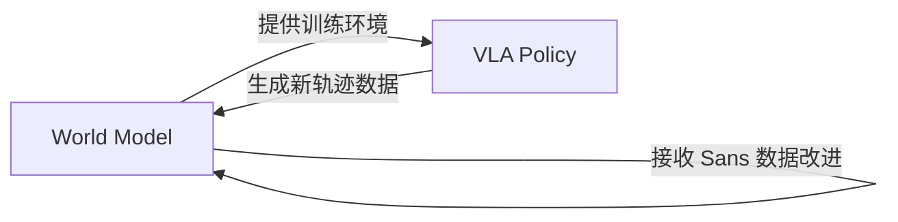

# World-VLA-Loop：闭环协同学习深度精读

> **论文标题**: Closed-Loop Learning of Video World Model and VLA Policy
> **作者**: Xiaokang Liu, et al.
> **机构**: ShowLab, National University of Singapore
> **发表**: arXiv:2602.06508, 2025
> **项目页**: https://showlab.github.io/World-VLA-Loop/

**标签**: `#VLA` `#强化学习` `#世界模型` `#闭环学习` `#视频扩散` `#状态感知`

**知识链接**：
- [世界模型基础](/前置知识/000t_前置知识_世界模型基础) — World Model 概念
- [策略梯度与 PPO](/前置知识/000a_前置知识_策略梯度与PPO) — RL 算法
- [扩散模型 DDPM](/前置知识/000b_前置知识_扩散模型DDPM) — 视频扩散基础
- [VLA 模型的 RL 后训练综述](/论文综述/S06_VLA模型的RL后训练综述) — 全景概览
- [World-Env 精读](./024_WorldEnv_世界模型虚拟环境VLA后训练) — 对比：单向学习
- [WoVR 精读](./036_WoVR_可靠世界模型RL后训练VLA) — 对比：防幻觉方案
- [World-Gymnast 精读](./038_WorldGymnast_视频世界模型RL训练机器人) — 对比：迭代改进

---

## 一、背景与动机

### 1.1 现有世界模型 RL 的单向问题

现有方法（World-Env、World-Gymnast）的世界模型和策略是**单向关系**：

```
World Model (固定或偶尔更新) → RL 训练 → Policy 改进
```

但世界模型有一个关键缺陷：**对"几乎成功"的关键决策点预测不准**。

- 训练数据中成功和失败轨迹混杂
- 在"差一点就成功/失败"的边界状态，世界模型不确定要生成什么
- 恰恰这些状态对策略学习最关键

### 1.2 World-VLA-Loop 的核心贡献

**闭环设计**：世界模型和策略**互相改进**，形成正反馈循环。


```mermaid
flowchart LR
    WM["World Model"] -->|"提供训练环境"| P["VLA Policy"]
    P -->|"生成新轨迹数据"| WM
    WM -->|"接收 Sans 数据改进"| WM
```

**关键创新**：引入 **Sans Dataset**（Near-Success Trajectory Dataset）——专门包含"几乎成功但最终失败"的轨迹，用来训练世界模型在关键边界状态的预测能力。

---

## 贯穿全文的例子

> **场景**：机器人执行 "place the cup on the saucer"。
>
> - **边界状态**：杯子已经在碟子上方 2mm，但角度偏了 5°
>   - 如果继续放 → 滑落（失败）
>   - 如果微调角度 → 成功
> - **普通世界模型**：对这种边界状态预测不准（有时生成成功，有时生成失败）
> - **World-VLA-Loop**：
>   1. 策略在世界模型中探索，产生大量"几乎成功"的轨迹
>   2. 用这些 Near-Success 数据改进世界模型 → 准确预测"5° 偏角 → 滑落"
>   3. 策略从改进的世界模型中学到"必须先微调角度"
>   4. 循环迭代，成功率持续上升

---

## 二、方法详解

### 2.1 State-Aware Video World Model

世界模型不只预测视觉帧，还同时预测**状态/奖励信号**：

$$
\hat{o}_{t+1}, \hat{r}_t, \hat{s}_{t+1} = \text{WM}(o_t, a_t)
$$

**这个公式在做什么**：世界模型看到当前观测和动作，一次性预测出下一帧画面、这一步的奖励、以及下一时刻的状态，而不是只会"画下一帧图"。

::: details 📐 公式详解（点击展开）

| 子表达式 | 它是谁 | 它在干嘛 |
|---------|--------|---------|
| $o_t, a_t$ | **输入：眼睛看到的+手做的** | 当前时刻的观测（图像）和策略执行的动作 |
| $\text{WM}(\cdot,\cdot)$ | **既能画画又懂物理的大脑** | 世界模型（World Model），一个统一的网络同时处理视觉预测和状态/奖励预测 |
| $\hat{o}_{t+1}$ | **预测的下一帧画面** | 世界模型"想象"出的下一时刻视觉观测 |
| $\hat{r}_t$ | **预测的这一步奖励** | 世界模型直接给出的 reward 信号，不用额外的评估模型打分 |
| $\hat{s}_{t+1}$ | **预测的下一时刻状态** | 更抽象的状态表示（如任务进度、成功/失败倾向） |

**用人话读**：给世界模型当前看到的画面和刚做的动作，它不仅能想象出下一帧长什么样，还能直接告诉你"这一步做得好不好、任务进展到哪了"。

**为什么是这个形式**：如果世界模型只预测画面（如 World-Env），策略训练时还需要额外的 VLM 或规则去判断"这帧算成功还是失败"；把奖励和状态预测也塞进同一个网络的输出，让世界模型对"什么变化意味着成功/失败"更敏感，这正是它能在后面章节里区分"几乎成功"和"彻底失败"轨迹的基础。
:::

**状态感知**的好处：
- 世界模型知道"什么状态变化会导致成功/失败"
- 可以直接输出 reward 信号，不需要额外的 VLM 评估
- 对关键状态转变更敏感

### 2.2 Sans Dataset（Near-Success Trajectories）

**数据收集**：在策略训练过程中，收集"进度 > 80% 但最终失败"的轨迹：

$$
\text{Sans} = \{ \tau : \text{progress}(\tau) > 0.8 \text{ AND } \text{success}(\tau) = 0 \}
$$

**这个公式在做什么**：从大量策略轨迹里，专门筛选出"进度已经超过 80% 但最终还是失败"的那一批，单独打包成一个数据集去改进世界模型。

::: details 📐 公式详解（点击展开）

| 子表达式 | 它是谁 | 它在干嘛 |
|---------|--------|---------|
| $\tau$ | **一条完整轨迹** | 策略执行任务从开始到结束的完整记录 |
| $\text{progress}(\tau)>0.8$ | **筛选条件一：差一点就成功** | 任务完成度超过 80%，说明轨迹走到了非常接近成功的边界 |
| $\text{success}(\tau)=0$ | **筛选条件二：但最后失败了** | 尽管进度很高，最终判定仍是失败 |
| $\text{Sans}$ | **"几乎成功"数据集** | 同时满足两个条件的轨迹全体，即 Near-Success Trajectory Dataset |

**用人话读**：把所有"走到最后一步之前看起来都快成功了，结果还是翻车"的轨迹挑出来，单独收集成一份数据。

**为什么是这个形式**：世界模型最容易预测错的地方恰恰是"接近成功的边界状态"——这里的一点点偏差决定成败，而普通的随机失败轨迹（一开始就跑偏的）对这个边界没有信息量；用 progress 和 success 两个条件联合筛选，精确定位到"差之毫厘"的那批数据，让世界模型专门在这些最容易出错的边界上得到强化训练。
:::

**为什么重要**：
- 这些轨迹包含了关键的"失败边界"信息
- 世界模型学习这些数据后，能准确预测"什么操作会导致最后时刻失败"
- 策略就能学会"避免那些导致失败的微小偏差"

### 2.3 闭环训练流程

```python
for loop_iter in range(max_loops):
    # Step 1: Policy RL in World Model
    for rl_step in range(200):
        imagined_rollout = world_model.rollout(policy)
        reward = world_model.predict_reward(imagined_rollout)
        policy = ppo_update(policy, imagined_rollout, reward)

    # Step 2: Collect Sans data from improved policy
    real_rollouts = env.rollout(policy, n=100)
    near_success = filter_sans(real_rollouts)

    # Step 3: Improve World Model with Sans data
    world_model = finetune(world_model, near_success + success_data)

    # Step 4: Verify improvement
    eval_success = evaluate(policy, env)
    print(f"Loop {loop_iter}: {eval_success}%")
```

### 2.4 关键设计：奖励信号联合预测

世界模型同时预测视频帧和奖励，使用多任务学习：

$$
\mathcal{L}_{\text{WM}} = \underbrace{\mathcal{L}_{\text{video}}}_{\text{帧预测}} + \lambda_r \underbrace{\mathcal{L}_{\text{reward}}}_{\text{奖励预测}} + \lambda_s \underbrace{\mathcal{L}_{\text{state}}}_{\text{状态预测}}
$$

**这个公式在做什么**：把"画面预测准不准"、"奖励预测准不准"、"状态预测准不准"三个目标加权相加成一个总损失，一次训练同时逼世界模型在三方面都学好。

::: details 📐 公式详解（点击展开）

| 子表达式 | 它是谁 | 它在干嘛 |
|---------|--------|---------|
| $\mathcal{L}_{\text{video}}$ | **画面裁判** | 衡量预测出的下一帧 $\hat{o}_{t+1}$ 和真实下一帧差多少，逼世界模型"画得对" |
| $\lambda_r\mathcal{L}_{\text{reward}}$ | **奖励裁判（带权重）** | 衡量预测奖励 $\hat{r}_t$ 和真实奖励差多少，权重 $\lambda_r$ 控制它相对画面损失的重要程度 |
| $\lambda_s\mathcal{L}_{\text{state}}$ | **状态裁判（带权重）** | 衡量预测状态 $\hat{s}_{t+1}$ 和真实状态差多少，权重 $\lambda_s$ 控制其相对重要程度 |
| $\mathcal{L}_{\text{WM}}$ | **世界模型的总训练目标** | 三项加总后一起反向传播，同一套参数同时被三个信号驱动 |

**用人话读**：世界模型的总损失 = 画面画得准不准 + 按权重算的奖励猜得准不准 + 按权重算的状态猜得准不准，三项加起来一起优化。

**为什么是多任务联合训练而不是分开训练**：只优化 $\mathcal{L}_{\text{video}}$ 的世界模型可能"画面很逼真但物理语义错了"（比如画出杯子放稳了，但实际会滑落）；把奖励和状态预测也作为监督信号加进来，强迫网络的内部表示同时编码"看起来像什么"和"接下来会不会成功"，这正是 2.1 节 $\text{WM}(o_t,a_t)$ 需要同时输出三个量的训练依据。
:::

这保证世界模型不仅"画面好看"，而且"物理语义正确"。

---

## 三、实验结果

### 3.1 与单向方法对比

| 方法 | 世界模型更新？ | 用 Sans 数据？ | 成功率 |
|------|-------------|-------------|--------|
| World-Env (单向) | ❌ | ❌ | 65% |
| World-Gymnast (偶尔更新) | 偶尔 | ❌ | 78% |
| WoVR (防幻觉) | ✅ | ❌ | 80% |
| **World-VLA-Loop** | **✅ 每轮** | **✅** | **88%** |

### 3.2 Sans Dataset 的效果

| 配置 | 成功率 |
|------|--------|
| Loop without Sans | 82% |
| Loop with random failure data | 83% |
| **Loop with Sans (near-success)** | **88%** |

Near-Success 数据比随机失败数据有效得多（+5%），因为它精确描述了失败边界。

### 3.3 真实机器人

| 任务 | World-Env | World-VLA-Loop | 提升 |
|------|----------|---------------|------|
| Precise placement | 48% | 72% | +24% |
| Multi-step assembly | 30% | 55% | +25% |
| Deformable object | 35% | 58% | +23% |

在精密操作上优势特别大——因为这些任务的"成功/失败边界"特别窄。

---

## 四、总结

| 维度 | World-VLA-Loop |
|------|---------------|
| 核心问题 | 世界模型在关键决策边界预测不准 |
| 核心方案 | 闭环协同学习 + Sans (Near-Success) Dataset |
| 独特贡献 | 策略和世界模型互相改进的正反馈机制 |
| 关键数据 | Near-Success 轨迹（进度>80% 但失败的） |
| vs 单向方法 | +8-23% 成功率提升 |
| 适用场景 | 精密操作（窄成功边界） |

---

## 延伸阅读

- [World-Env：世界模型虚拟环境](./024_WorldEnv_世界模型虚拟环境VLA后训练) — 单向方法
- [WoVR：可靠世界模型](./036_WoVR_可靠世界模型RL后训练VLA) — 防幻觉方案
- [World-Gymnast：迭代改进](./038_WorldGymnast_视频世界模型RL训练机器人) — 偶尔更新世界模型
- [世界模型基础](/前置知识/000t_前置知识_世界模型基础) — 概念入门
