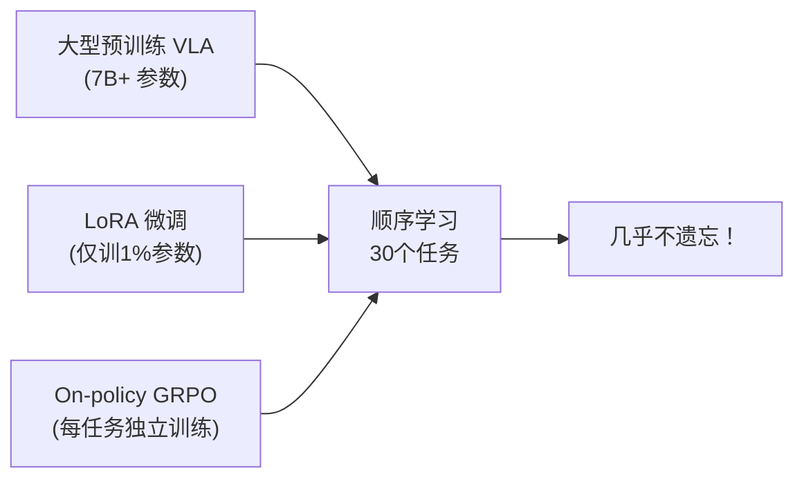
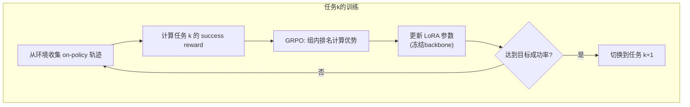
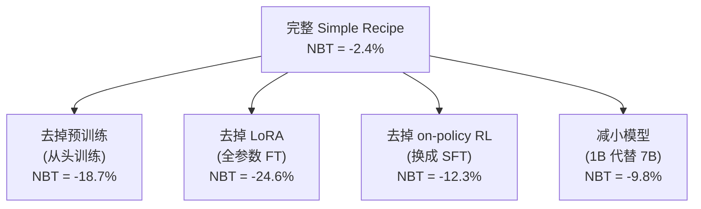

# Simple Recipe Works：大型 VLA + LoRA + On-policy RL = 天然持续学习者

> **论文**: *Vision-Language-Action Models are Natural Continual Learners with Reinforcement Learning* 
> **作者**: Sony AI + UT Austin 联合团队 
> **版本**: arXiv:2603.11653, 2025 
> **一句话**: 大预训练 VLA 用 LoRA 做 on-policy GRPO 顺序微调时，几乎不遗忘旧任务，胜过 EWC、replay 等所有专门的持续学习方法。

---

## 相关阅读

| 类型 | 链接 |
|------|------|
| 前置知识 | [策略梯度与PPO](/前置知识/000a_前置知识_策略梯度与PPO) |
| 前置知识 | [GRPO：Group Relative Policy Optimization](/前置知识/000m_前置知识_GRPO_Group_Relative_Policy_Optimization) |
| 前置知识 | [KL散度与策略约束](/前置知识/000j_前置知识_KL散度与策略约束) |
| 论文精读 | [LifeLong-RFT：VLA 持续学习 RL 微调](./025_LifeLongRFT_持续学习VLA_RL微调) |
| 综述 | [VLA 模型的 RL 后训练综述](/论文综述/S06_VLA模型的RL后训练综述) |
| 综述 | [持续/终身 VLA 强化学习综述](./S07_持续终身VLA强化学习综述) |

---

## 贯穿全文的例子

> **设定**：一个 7B 参数的预训练 VLA（类似 OpenVLA），需要在 LIBERO 环境中**按顺序**学习 30 个桌面操作任务。任务 1 是"打开微波炉门"，任务 15 是"把杯子放入抽屉"，任务 30 是"堆叠三个方块"。学完任务 30 后，我们回头测试任务 1，期望成功率不掉。
>
> 我们将用这个设定来理解：为什么 LoRA + GRPO 的组合天然具有持续学习能力。

---

## 一、问题背景：持续学习为什么难

### 1.1 灾难性遗忘的本质

当神经网络依次在不同任务上训练时，后面任务的梯度会覆盖前面任务学到的参数。形式化地说，在任务 $T_k$ 上优化时，目标是：

$$
\theta^* = \arg\min_\theta \mathcal{L}_{T_k}(\theta)
$$

但这个优化完全不考虑前面任务 $T_1, \ldots, T_{k-1}$ 的性能。如果 $\mathcal{L}_{T_k}$ 的最优解远离 $\mathcal{L}_{T_1}$ 的最优解，则切换后任务 1 的性能会急剧下降。

**数值例子**：假设任务 1 需要参数 $\theta_1 = [2.0, 3.0]$，任务 2 需要 $\theta_2 = [5.0, 1.0]$。如果完全按任务 2 训练到收敛，那 $\theta$ 从 $[2.0, 3.0]$ 变成 $[5.0, 1.0]$，任务 1 就完全废了。

### 1.2 传统持续学习方法

| 方法 | 思路 | 局限 |
|------|------|------|
| EWC | 用 Fisher 信息矩阵惩罚重要参数变化 | 任务多时可塑性不足 |
| Experience Replay | 保留旧数据回放 | 存储成本高，off-policy 问题 |
| PackNet | 为每个任务分配不同子网络 | 容量有限 |
| Dynamic Expansion | 增加参数 | 模型膨胀 |

本文的核心发现是：**如果模型足够大且预训练足够好，配合 LoRA + on-policy RL，根本不需要这些方法**。

---

## 二、核心方法：Simple Recipe

### 2.1 三个关键成分

本文的方法极其简单——没有新算法，只是正确组合了三个已有成分：

**成分一：大型预训练 VLA**

预训练提供了一个强大的初始化点。用我们的例子：7B VLA 在数十万个机器人轨迹上预训练后，它的参数已经学会了"通用机器人操作"的表示空间。这个空间足够大，以至于不同任务的最优参数方向**可以共存**，不需要互相覆盖。

**成分二：LoRA（Low-Rank Adaptation）**

LoRA 冻结原始预训练权重 $W_0$，只训练低秩增量：

$$
W = W_0 + \Delta W = W_0 + BA
$$

其中 $B \in \mathbb{R}^{d \times r}$，$A \in \mathbb{R}^{r \times d}$，秩 $r \ll d$。

**为什么 LoRA 有助于抗遗忘？**

关键在于参数空间的约束。假设模型有 $d = 4096$ 维参数空间，LoRA rank $r = 16$，则实际可训练方向只有 $r \times d + d \times r = 2rd$ 个参数（约 131K vs 原始的 16.8M 每层）。

**数值例子**：7B VLA 全参数 = 70 亿。LoRA rank=16 时可训练参数约 7000 万（1%）。这意味着每次训练新任务时，只有 1% 的"旋钮"在转动，99% 的知识被冻结保护。

**成分三：On-policy GRPO**

[GRPO](/前置知识/000m_前置知识_GRPO_Group_Relative_Policy_Optimization) 的核心是组内相对排名，对当前状态采样 $G$ 个动作，按奖励排名计算优势：

$$
A_i = \frac{r_i - \text{mean}(\{r_j\}_{j=1}^G)}{\text{std}(\{r_j\}_{j=1}^G)}
$$

然后用 clip 策略梯度更新：

$$
\mathcal{L}_{\text{GRPO}}(\theta) = -\mathbb{E}\left[\min\left(\frac{\pi_\theta(a_i|s)}{\pi_{\theta_{\text{old}}}(a_i|s)} A_i, \; \text{clip}\left(\frac{\pi_\theta(a_i|s)}{\pi_{\theta_{\text{old}}}(a_i|s)}, 1-\epsilon, 1+\epsilon\right) A_i\right)\right]
$$

**为什么 on-policy RL 比 SFT 更不容易遗忘？** 这是本文最核心的洞察：

1. **On-policy 数据来自当前策略本身**：不会强制模型去拟合一个外部专家的"硬标签"
2. **优势加权**：只强化"比平均好"的动作，不是全面改写输出分布
3. **隐式 KL 约束**：[RL's Razor](./047_RLsRazor_在线RL为什么不遗忘) 证明了 on-policy RL 在所有能解决新任务的策略中，倾向选择与原策略 KL 距离最小的那个

### 2.2 训练流程详解

**具体到我们的例子**：

- 任务 1（打开微波炉门）：从 VLA 采样 $G=8$ 个 action chunk，环境判断成功/失败，GRPO 更新 LoRA。训练 500 个 episode 后成功率达到 95%。
- 切换到任务 2（关上抽屉）：**不保存任务 1 的任何数据**，直接在新环境中重新开始 on-policy 采样。
- 学完 30 个任务后，回测任务 1：成功率仍有 92%（仅下降 3%）。

### 2.3 奖励设计

本文使用简单的**稀疏成功奖励**：

$$
r = \begin{cases} 1 & \text{if task completed successfully} \\ 0 & \text{otherwise} \end{cases}
$$

配合 GRPO 的组内排名，即使奖励是 0/1 二值的，只要一组中有部分成功的 rollout，就能产生有意义的梯度。

**数值例子**：假设 $G = 8$ 个 rollout 中有 3 个成功（$r=1$），5 个失败（$r=0$）：
- mean = 3/8 = 0.375
- std = $\sqrt{0.375 \times 0.625}$ ≈ 0.484
- 成功 rollout 的 advantage = $(1 - 0.375)/0.484$ ≈ $1.29$
- 失败 rollout 的 advantage = $(0 - 0.375)/0.484$ ≈ $-0.77$

---

## 三、实验：30 个任务的顺序学习

### 3.1 实验设置

| 项目 | 详情 |
|------|------|
| 基座模型 | 7B 预训练 VLA |
| 微调方式 | LoRA rank=16 |
| RL 算法 | GRPO，group size=8 |
| 环境 | LIBERO (10 tasks), RoboCasa (10 tasks), ManiSkill (10 tasks) |
| 总任务数 | 最多 30 个顺序任务 |
| 评估指标 | Final AVG, NBT (Negative Backward Transfer), FWT |

### 3.2 关键指标定义

**Final Average Success Rate**：学完所有 $T$ 个任务后的平均成功率：

$$
\text{Final AVG} = \frac{1}{T}\sum_{i=1}^{T} S_{T,i}
$$

其中 $S_{T,i}$ 表示学完第 $T$ 个任务后在任务 $i$ 上的成功率。

**Negative Backward Transfer (NBT)**：衡量遗忘程度：

$$
\text{NBT} = \frac{1}{T-1}\sum_{i=1}^{T-1}\left(S_{T,i} - S_{i,i}\right)
$$

其中 $S_{i,i}$ 是刚学完任务 $i$ 时在该任务上的成功率。NBT 越接近 0 越好，负值越大表示遗忘越严重。

**数值例子**（我们的 30 任务设定）：
- 刚学完任务 1 时，任务 1 成功率 $S_{1,1} = 95\%$
- 学完 30 个任务后，任务 1 成功率 $S_{30,1} = 92\%$
- 这一个任务的 backward transfer = $92\% - 95\% = -3\%$
- 对所有 29 个旧任务平均后得到 NBT ≈ $-2.4\%$

### 3.3 方法对比结果

| 方法 | Final AVG ↑ | NBT ↓ | 额外存储 |
|------|-----------|-------|---------|
| Multi-task Oracle | 91.2% | N/A | 全部数据 |
| **Seq LoRA + GRPO (本文)** | **88.5%** | **-2.4%** | **0** |
| EWC | 82.3% | -5.1% | Fisher矩阵 |
| Expert Replay | 85.7% | -3.8% | 每任务100条 |
| Dark Experience Replay | 84.9% | -4.2% | logits + 数据 |
| SLCA | 83.1% | -6.2% | class means |
| Dynamic Weight Expansion | 86.4% | -3.5% | 新参数 |
| Sequential SFT (LoRA) | 74.8% | -12.3% | 0 |
| Sequential Full FT | 62.1% | -24.6% | 0 |

**关键发现**：

1. Simple Recipe (Seq LoRA + GRPO) 以 **0 额外存储**达到了接近 multi-task oracle 的性能
2. 传统持续学习方法（EWC, Replay）反而不如直接顺序训练
3. **SFT 会严重遗忘**：同样用 LoRA，如果换成 SFT 目标，NBT 恶化 5 倍

### 3.4 消融实验：每个成分都不可或缺

| 消融条件 | NBT | 说明 |
|---------|-----|------|
| 完整 recipe | -2.4% | ✓ |
| 无预训练 | -18.7% | 随机初始化的模型没有好的表示空间 |
| 全参数 FT | -24.6% | 所有参数都可变 → 旧知识无保护 |
| SFT 代替 RL | -12.3% | SFT 强制拟合硬标签，偏移更大 |
| 小模型 (1B) | -9.8% | 表示空间不够"宽裕" |

---

## 四、为什么有效：理论直觉

### 4.1 参数空间视角

想象 7B VLA 的参数空间是一个 70 亿维的超球面。预训练后，模型处于一个"通用操作"区域。每个新任务的最优解分布在这个区域的不同方向上。

$$
\theta_{\text{task}_k}^* = \theta_0 + \Delta\theta_k
$$

关键问题是：$\Delta\theta_k$ 有多大？方向之间有多少冲突？

**LoRA 的贡献**：限制 $\|\Delta\theta_k\|$ 的大小。因为只能在 $r$-维子空间中搜索，找到的解天然离 $\theta_0$ 更近。

**On-policy RL 的贡献**：在可行解集合中，选择 $\|\Delta\theta_k\|$ 最小的那个。[RL's Razor](./047_RLsRazor_在线RL为什么不遗忘) 严格证明了这一点。

**大模型的贡献**：70 亿维的空间中，30 个任务各需要的参数子空间"几乎不重叠"，就像 70 亿维空间中放 30 条线段——它们碰上的概率极低。

### 4.2 信息论视角

从 [KL散度](/前置知识/000j_前置知识_KL散度与策略约束) 角度理解：

对于 SFT，损失函数是：

$$
\mathcal{L}_{\text{SFT}} = -\sum_t \log \pi_\theta(a_t^*|s_t)
$$

这要求 $\pi_\theta$ 在 $a_t^*$ 处概率尽量高——可能需要大幅改变分布形状。

对于 on-policy RL (GRPO)，更新方向是：

$$
\nabla_\theta J \propto \mathbb{E}_{a \sim \pi_\theta}\left[A(s,a) \nabla_\theta \log \pi_\theta(a|s)\right]
$$

只增加"比平均好"的动作的概率，对"已经足够好"的动作不施加梯度。这导致参数变化更小。

**数值对比**：假设原始策略 $\pi_0$ 在某状态下，正确动作的概率已经是 0.6（预训练已经学到了一些）：
- SFT 目标：把 0.6 推到尽量接近 1.0 → 需要大改动
- GRPO 目标：0.6 已经比组内很多 rollout 好 → advantage 不大 → 小改动即可

### 4.3 与 RL's Razor 的联系

[RL's Razor](./047_RLsRazor_在线RL为什么不遗忘) 提出了一个理论框架：在所有能解决任务 $k$ 的策略集合 $\Pi_k = \{\pi : J_k(\pi) \geq \eta\}$ 中，on-policy RL 收敛到的 $\pi^*$ 满足：

$$
\pi^* = \arg\min_{\pi \in \Pi_k} D_{\text{KL}}(\pi \| \pi_{\text{ref}})
$$

即离参考策略（预训练初始化）最近的那个成功策略。这从理论上解释了为什么 Simple Recipe 能在不用任何显式正则化的情况下实现低遗忘。

---

## 五、与其他方法的定位对比

| 维度 | Simple Recipe (本文) | [LifeLong-RFT](./025_LifeLongRFT_持续学习VLA_RL微调) | [Forget Me Not](./046_ForgetMeNot_预训练VLA抗遗忘) | [Stellar VLA](./048_StellarVLA_技能知识空间持续进化) |
|------|-----|-----|-----|-----|
| 训练目标 | On-policy RL (GRPO) | Off-policy RFT (GRPO) | SFT/BC | SFT/BC |
| 需要 replay | **否** | 5条/任务 | 2%/任务 | 1%/任务 |
| 最多任务数 | 30 | 10 | 10 | 10 |
| 核心抗遗忘机制 | 隐式 (LoRA + on-policy) | 过程奖励 + replay | 显式 replay | 技能路由 + replay |
| 额外组件 | 无 | 过程奖励设计 | 无 | 知识空间 + router |

---

## 六、局限性与开放问题

### 6.1 30 任务是否够？

目前实验最多只到 30 个任务。按照理论直觉，当任务数量继续增长（如 100+），低秩子空间可能开始冲突。本文没有回答：

- 遗忘是否会在某个阈值后突然加剧？
- LoRA rank 是否需要随任务数增长？

### 6.2 任务相似性假设

LIBERO 的 30 个任务都在**同一个厨房场景**，共享视觉结构和动作空间。如果任务跨越不同机器人本体（如从桌面臂切换到人形机器人），这个结论是否成立？

### 6.3 On-policy 的采样效率

GRPO 需要大量环境交互。在真实机器人上，每个 rollout 成本很高。本文主要在仿真中验证，真机部署时的样本效率是实际障碍。

### 6.4 与显式正则化的组合

如果将 Simple Recipe 与轻量级 EWC 或少量 replay 结合，是否能推到 100+ 任务？这是 [持续终身 VLA RL 综述](./S07_持续终身VLA强化学习综述) 中列出的开放选题。

---

## 七、总结

| 贡献 | 意义 |
|------|------|
| 发现大 VLA + LoRA + on-policy GRPO 天然抗遗忘 | 省去复杂的持续学习算法 |
| 系统消融三个成分 | 明确每个成分的必要性 |
| 对比 7 种持续学习方法 | 建立新的 baseline |
| 扩展到 30 个顺序任务 | 当前最长的 continual VLA-RL 实验 |

**核心洞察**：不是"持续学习需要新方法"，而是"正确选择训练范式后，持续学习可以是免费的"。大模型预训练 + 低秩适配 + on-policy 更新的协同作用，让遗忘变得不再是核心瓶颈。

---

## 延伸阅读

- [RL's Razor：在线 RL 为什么天然不容易遗忘](./047_RLsRazor_在线RL为什么不遗忘)：理论解释 on-policy RL 的隐式正则化
- [Forget Me Not：预训练 VLA 惊人的抗遗忘能力](./046_ForgetMeNot_预训练VLA抗遗忘)：从 SFT/BC 角度证明大模型的抗遗忘性
- [MergeVLA：跨技能模型合并](./049_MergeVLA_跨技能模型合并)：当任务冲突严重时的进阶方案
- [Stellar VLA：技能知识空间持续进化](./048_StellarVLA_技能知识空间持续进化)：用任务-技能图谱做结构化抗遗忘
