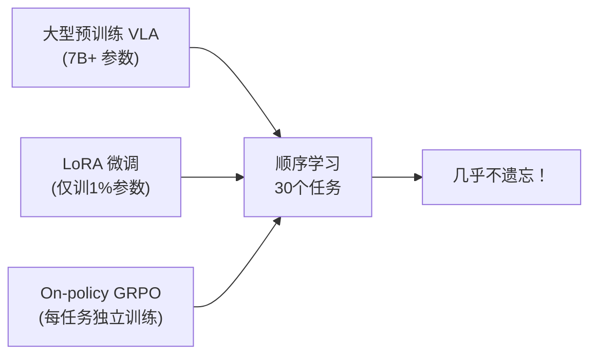
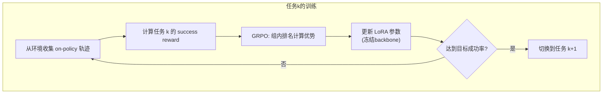
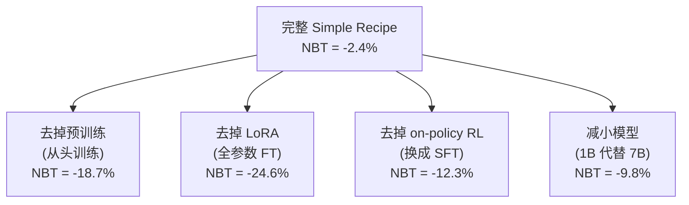

# Simple Recipe Works：大型 VLA + LoRA + On-policy RL = 天然持续学习者

> **论文**: *Vision-Language-Action Models are Natural Continual Learners with Reinforcement Learning* 
> **作者**: Sony AI + UT Austin 联合团队 
> **版本**: arXiv:2603.11653, 2025 
> **一句话**: 大预训练 VLA 用 LoRA 做 on-policy GRPO 顺序微调时，几乎不遗忘旧任务，胜过 EWC、replay 等所有专门的持续学习方法。

---

## 相关阅读

| 类型 | 链接 |
|------|------|
| 前置知识 | [策略梯度与PPO](/前置知识/000a_前置知识_策略梯度与PPO) |
| 前置知识 | [GRPO：Group Relative Policy Optimization](/前置知识/000m_前置知识_GRPO_Group_Relative_Policy_Optimization) |
| 前置知识 | [KL散度与策略约束](/前置知识/000j_前置知识_KL散度与策略约束) |
| 论文精读 | [LifeLong-RFT：VLA 持续学习 RL 微调](./025_LifeLongRFT_持续学习VLA_RL微调) |
| 综述 | [VLA 模型的 RL 后训练综述](/论文综述/S06_VLA模型的RL后训练综述) |
| 综述 | [持续/终身 VLA 强化学习综述](./S07_持续终身VLA强化学习综述) |

---

## 贯穿全文的例子

> **设定**：一个 7B 参数的预训练 VLA（类似 OpenVLA），需要在 LIBERO 环境中**按顺序**学习 30 个桌面操作任务。任务 1 是"打开微波炉门"，任务 15 是"把杯子放入抽屉"，任务 30 是"堆叠三个方块"。学完任务 30 后，我们回头测试任务 1，期望成功率不掉。
>
> 我们将用这个设定来理解：为什么 LoRA + GRPO 的组合天然具有持续学习能力。

---

## 一、问题背景：持续学习为什么难

### 1.1 灾难性遗忘的本质

当神经网络依次在不同任务上训练时，后面任务的梯度会覆盖前面任务学到的参数。形式化地说，在任务 $T_k$ 上优化时，目标是：

$$
\theta^* = \arg\min_\theta \mathcal{L}_{T_k}(\theta)
$$

**这个公式在做什么**：告诉模型"只管把当前任务 $T_k$ 做到最好"——完全没有任何机制去照顾之前学过的任务。

::: details 📐 公式详解（点击展开）

| 子表达式 | 它是谁 | 它在干嘛 |
|---------|--------|---------|
| $\mathcal{L}_{T_k}(\theta)$ | **当前任务的考卷** | 只衡量参数 $\theta$ 在任务 $T_k$ 上的表现好坏，对其他任务视而不见 |
| $\arg\min_\theta$ | **找最优答案的动作** | 在所有可能的参数取值里，挑出让当前考卷分数最低（loss 最小）的那一个 |
| $\theta^*$ | **本轮训练的终点** | 优化收敛后的参数，会直接成为下一个任务训练的起点 |

**用人话读**："训练时唯一的目标就是把眼前这个任务做好，压根没告诉优化器'别忘了以前学的东西'。"

**为什么是这个形式**：标准的监督学习/强化学习目标本身就是任务局部的——它只在当前任务的数据分布上定义，这正是灾难性遗忘的根源：没有任何显式约束把新旧任务的最优解绑在一起。
:::

但这个优化完全不考虑前面任务 $T_1, \ldots, T_{k-1}$ 的性能。如果 $\mathcal{L}_{T_k}$ 的最优解远离 $\mathcal{L}_{T_1}$ 的最优解，则切换后任务 1 的性能会急剧下降。

**数值例子**：假设任务 1 需要参数 $\theta_1 = [2.0, 3.0]$，任务 2 需要 $\theta_2 = [5.0, 1.0]$。如果完全按任务 2 训练到收敛，那 $\theta$ 从 $[2.0, 3.0]$ 变成 $[5.0, 1.0]$，任务 1 就完全废了。

### 1.2 传统持续学习方法

| 方法 | 思路 | 局限 |
|------|------|------|
| EWC | 用 Fisher 信息矩阵惩罚重要参数变化 | 任务多时可塑性不足 |
| Experience Replay | 保留旧数据回放 | 存储成本高，off-policy 问题 |
| PackNet | 为每个任务分配不同子网络 | 容量有限 |
| Dynamic Expansion | 增加参数 | 模型膨胀 |

本文的核心发现是：**如果模型足够大且预训练足够好，配合 LoRA + on-policy RL，根本不需要这些方法**。

---

## 二、核心方法：Simple Recipe

### 2.1 三个关键成分

本文的方法极其简单——没有新算法，只是正确组合了三个已有成分：

```mermaid
flowchart LR
    A["大型预训练 VLA\n(7B+ 参数)"] --> D["顺序学习\n30个任务"]
    B["LoRA 微调\n(仅训1%参数)"] --> D
    C["On-policy GRPO\n(每任务独立训练)"] --> D
    D --> E["几乎不遗忘！"]
```

**成分一：大型预训练 VLA**

预训练提供了一个强大的初始化点。用我们的例子：7B VLA 在数十万个机器人轨迹上预训练后，它的参数已经学会了"通用机器人操作"的表示空间。这个空间足够大，以至于不同任务的最优参数方向**可以共存**，不需要互相覆盖。

**成分二：LoRA（Low-Rank Adaptation）**

LoRA 冻结原始预训练权重 $W_0$，只训练低秩增量：

$$
W = W_0 + \Delta W = W_0 + BA
$$

**这个公式在做什么**：把"要学的新知识"从一个和原权重一样大的矩阵，压缩成两个又瘦又长的小矩阵相乘——原权重原封不动地保留，新知识只叠加在旁边一条"小路"上。

::: details 📐 公式详解（点击展开）

| 子表达式 | 它是谁 | 它在干嘛 |
|---------|--------|---------|
| $W_0$ | **冻结的老知识** | 预训练学到的原始权重，训练新任务时全程不参与梯度更新 |
| $\Delta W = BA$ | **新任务的小补丁** | 用两个低秩矩阵相乘出来的增量，是训练中唯一会变化的部分 |
| $B \in \mathbb{R}^{d\times r}$，$A \in \mathbb{R}^{r\times d}$ | **两个瘦长的搭档** | 秩 $r$ 远小于原始维度 $d$，它们相乘后维度和 $W_0$ 一样，但自由度被压得很小 |
| $W$ | **实际生效的权重** | 推理/训练时真正参与前向计算的权重，是老知识和小补丁的叠加 |

**用人话读**："原来的大权重原样保留不动，新任务只允许在一个很窄的通道里学一点点补丁，补丁加回原权重上就是最终生效的权重。"

**为什么是这个形式**：把 $\Delta W$ 分解成 $B \times A$ 两个秩为 $r$ 的矩阵，可训练参数从 $d\times d$ 降到 $2rd$（$r\ll d$ 时省很多），这个"通道很窄"的约束正是后面解释抗遗忘能力的关键——旧知识占据的方向根本没被触碰。
:::

**为什么 LoRA 有助于抗遗忘？**

关键在于参数空间的约束。假设模型有 $d = 4096$ 维参数空间，LoRA rank $r = 16$，则实际可训练方向只有 $r \times d + d \times r = 2rd$ 个参数（约 131K vs 原始的 16.8M 每层）。

**数值例子**：7B VLA 全参数 = 70 亿。LoRA rank=16 时可训练参数约 7000 万（1%）。这意味着每次训练新任务时，只有 1% 的"旋钮"在转动，99% 的知识被冻结保护。

**成分三：On-policy GRPO**

[GRPO](/前置知识/000m_前置知识_GRPO_Group_Relative_Policy_Optimization) 的核心是组内相对排名，对当前状态采样 $G$ 个动作，按奖励排名计算优势：

$$
A_i = \frac{r_i - \text{mean}(\{r_j\}_{j=1}^G)}{\text{std}(\{r_j\}_{j=1}^G)}
$$

**这个公式在做什么**：把一组同学（$G$ 个采样动作）的原始分数换算成"比班级平均水平高出多少个标准差"，让优势值有统一的尺度，不受某一批奖励绝对大小的影响。

::: details 📐 公式详解（点击展开）

| 子表达式 | 它是谁 | 它在干嘛 |
|---------|--------|---------|
| $r_i$ | **这个动作的原始成绩** | 第 $i$ 个采样动作实际拿到的奖励值 |
| $\text{mean}(\{r_j\}_{j=1}^G)$ | **这组的班级平均分** | 同一个状态下采样出的 $G$ 个动作的奖励均值，当作"及格线" |
| $\text{std}(\{r_j\}_{j=1}^G)$ | **这组分数的离散程度** | 组内奖励的标准差，用来把差值归一化成统一尺度 |
| $A_i$ | **归一化后的优势分** | 正数表示这个动作比组内平均水平好，负数表示更差，数值大小体现"好/差多少个标准差" |

**用人话读**："这个动作的分数减去这一组的平均分，再除以这一组分数的波动幅度，得到一个'比同伴好多少个标准差'的相对分。"

**为什么是这个形式**：GRPO 不需要单独训练一个 Critic 网络来估计基线，而是直接用组内其他采样动作互相打分——这样省掉了 Critic，也天然把奖励尺度统一了，即使原始奖励是稀疏的 0/1，也能算出有区分度的优势值。
:::

然后用 clip 策略梯度更新：

$$
\mathcal{L}_{\text{GRPO}}(\theta) = -\mathbb{E}\left[\min\left(\frac{\pi_\theta(a_i|s)}{\pi_{\theta_{\text{old}}}(a_i|s)} A_i, \; \text{clip}\left(\frac{\pi_\theta(a_i|s)}{\pi_{\theta_{\text{old}}}(a_i|s)}, 1-\epsilon, 1+\epsilon\right) A_i\right)\right]
$$

**这个公式在做什么**：用上面算出的优势分去调整策略——好动作（$A_i>0$）就提高它被选中的概率，差动作就压低，但用 clip 卡住每次调整的幅度，防止一步走太猛。

::: details 📐 公式详解（点击展开）

| 子表达式 | 它是谁 | 它在干嘛 |
|---------|--------|---------|
| $\frac{\pi_\theta(a_i\|s)}{\pi_{\theta_{\text{old}}}(a_i\|s)}$ | **新旧策略的喜好比** | 新策略选这个动作的概率除以旧策略选它的概率，大于 1 说明新策略更偏好这个动作 |
| $\cdot A_i$ | **不设限的调整幅度** | 喜好比乘以优势分，得到"自由发挥"版本的目标值 |
| $\text{clip}(\cdot, 1-\epsilon, 1+\epsilon) A_i$ | **限速版本的调整幅度** | 把喜好比强行卡在 $[1-\epsilon,1+\epsilon]$ 区间内再乘优势分 |
| $\min(\cdot,\cdot)$ | **保守裁判** | 两个版本取较小值，确保策略更新不会因为某个动作优势特别大就冲得太远 |
| $-\mathbb{E}[\cdot]$ | **可优化的总损失** | 对一个 batch 内所有采样动作取平均并取负号，交给优化器做梯度下降 |

**用人话读**："对每个采样动作算'不限速'和'限速'两个版本的收益，取较小的作为目标，让好动作的概率稳步提高、差动作的概率稳步降低，但每次都只挪一小步。"

**为什么是这个形式**：这就是 PPO 的 clip 机制搬到 GRPO 场景——用组内相对排名代替 Critic 给出的优势估计，同时保留 clip 对更新幅度的硬约束，这是后文解释"on-policy RL 为什么比 SFT 更不容易遗忘"的关键机制之一。
:::

**为什么 on-policy RL 比 SFT 更不容易遗忘？** 这是本文最核心的洞察：

1. **On-policy 数据来自当前策略本身**：不会强制模型去拟合一个外部专家的"硬标签"
2. **优势加权**：只强化"比平均好"的动作，不是全面改写输出分布
3. **隐式 KL 约束**：[RL's Razor](./047_RLsRazor_在线RL为什么不遗忘) 证明了 on-policy RL 在所有能解决新任务的策略中，倾向选择与原策略 KL 距离最小的那个

### 2.2 训练流程详解

```mermaid
flowchart TD
    subgraph 任务k的训练
        S1["从环境收集 on-policy 轨迹"] --> S2["计算任务 k 的 success reward"]
        S2 --> S3["GRPO: 组内排名计算优势"]
        S3 --> S4["更新 LoRA 参数\n(冻结backbone)"]
        S4 --> S5{"达到目标成功率?"}
        S5 -->|否| S1
        S5 -->|是| S6["切换到任务 k+1"]
    end
```

**具体到我们的例子**：

- 任务 1（打开微波炉门）：从 VLA 采样 $G=8$ 个 action chunk，环境判断成功/失败，GRPO 更新 LoRA。训练 500 个 episode 后成功率达到 95%。
- 切换到任务 2（关上抽屉）：**不保存任务 1 的任何数据**，直接在新环境中重新开始 on-policy 采样。
- 学完 30 个任务后，回测任务 1：成功率仍有 92%（仅下降 3%）。

### 2.3 奖励设计

本文使用简单的**稀疏成功奖励**：

$$
r = \begin{cases} 1 & \text{if task completed successfully} \\ 0 & \text{otherwise} \end{cases}
$$

**这个公式在做什么**：奖励设计极简——任务成功给满分，失败给零分，中间没有任何"做得不错但没完成"的过渡分数。

::: details 📐 公式详解（点击展开）

| 子表达式 | 它是谁 | 它在干嘛 |
|---------|--------|---------|
| $r=1$（success） | **满分判决** | 只要环境判断任务达成目标条件，直接给 1 分，不管过程效率高低 |
| $r=0$（otherwise） | **零分判决** | 只要没有完成任务，无论差一点还是完全没沾边，都给 0 分 |

**用人话读**："这个奖励只回答一个问题——任务到底完成了没有，完成就是 1 分，没完成就是 0 分。"

**为什么是这个形式**：稀疏的 0/1 奖励最贴近任务的真实定义，不需要人工设计中间过程的 reward shaping（容易引入偏差）；配合 GRPO 的组内相对排名（上一个公式），即使奖励只有两个值，只要一组采样里有成功有失败，也能算出有区分度的优势信号。
:::

配合 GRPO 的组内排名，即使奖励是 0/1 二值的，只要一组中有部分成功的 rollout，就能产生有意义的梯度。

**数值例子**：假设 $G = 8$ 个 rollout 中有 3 个成功（$r=1$），5 个失败（$r=0$）：
- mean = 3/8 = 0.375
- std = $\sqrt{0.375 \times 0.625}$ ≈ 0.484
- 成功 rollout 的 advantage = $(1 - 0.375)/0.484$ ≈ $1.29$
- 失败 rollout 的 advantage = $(0 - 0.375)/0.484$ ≈ $-0.77$

---

## 三、实验：30 个任务的顺序学习

### 3.1 实验设置

| 项目 | 详情 |
|------|------|
| 基座模型 | 7B 预训练 VLA |
| 微调方式 | LoRA rank=16 |
| RL 算法 | GRPO，group size=8 |
| 环境 | LIBERO (10 tasks), RoboCasa (10 tasks), ManiSkill (10 tasks) |
| 总任务数 | 最多 30 个顺序任务 |
| 评估指标 | Final AVG, NBT (Negative Backward Transfer), FWT |

### 3.2 关键指标定义

**Final Average Success Rate**：学完所有 $T$ 个任务后的平均成功率：

$$
\text{Final AVG} = \frac{1}{T}\sum_{i=1}^{T} S_{T,i}
$$

**这个公式在做什么**：把"学完全部 $T$ 个任务之后，回头测每一个任务的成功率"取平均，得到一个衡量"整体最终水平"的单一数字。

::: details 📐 公式详解（点击展开）

| 子表达式 | 它是谁 | 它在干嘛 |
|---------|--------|---------|
| $S_{T,i}$ | **期末总测成绩单** | 全部 $T$ 个任务都学完之后，模型在任务 $i$ 上重新测出的成功率 |
| $\sum_{i=1}^{T}$ | **逐一加总** | 把每个任务 $i$ 的期末成绩单加起来 |
| $\frac{1}{T}$ | **求平均** | 除以任务总数，得到一个综合分数 |

**用人话读**："训练全部结束后，把每个任务重新测一遍，把所有任务的成功率平均起来，就是最终成绩。"

**为什么是这个形式**：单独看某一个任务的最终成绩容易被这个任务本身的难度掩盖，取全体任务的平均才能反映"顺序学完所有任务后，模型整体到底还剩多少能力"，这正是持续学习最终想要优化的目标。
:::

其中 $S_{T,i}$ 表示学完第 $T$ 个任务后在任务 $i$ 上的成功率。

**Negative Backward Transfer (NBT)**：衡量遗忘程度：

$$
\text{NBT} = \frac{1}{T-1}\sum_{i=1}^{T-1}\left(S_{T,i} - S_{i,i}\right)
$$

**这个公式在做什么**：对每一个旧任务，比较"刚学完它时的成绩"和"学完所有后续任务再回测的成绩"，取差值再平均——差值越负，说明遗忘越严重。

::: details 📐 公式详解（点击展开）

| 子表达式 | 它是谁 | 它在干嘛 |
|---------|--------|---------|
| $S_{i,i}$ | **刚出炉的成绩** | 刚学完任务 $i$ 时，立刻在任务 $i$ 上测出的成功率（这是这个任务的历史最高水平） |
| $S_{T,i}$ | **多年后的成绩** | 学完全部 $T$ 个任务之后，再回头测任务 $i$ 的成功率 |
| $S_{T,i} - S_{i,i}$ | **单个任务的退步幅度** | 负数表示退步了多少，正数表示反而学得更好了（罕见但可能） |
| $\frac{1}{T-1}\sum_{i=1}^{T-1}$ | **对所有旧任务求平均退步** | 把除最后一个任务外，其余每个旧任务的退步幅度加总再平均 |

**用人话读**："对每个学过的旧任务，看它'刚学完时'和'现在再测'的成绩差了多少，把这些差值平均起来，就是整体的遗忘程度。"

**为什么是这个形式**：比起只看最终成绩，NBT 直接对齐"同一任务的历史最好成绩"，能精确量化"因为学了后面的任务，这个旧任务掉了多少"，这正是灾难性遗忘要衡量的核心量。NBT 越接近 0 越好，负值越大表示遗忘越严重。
:::

**数值例子**（我们的 30 任务设定）：
- 刚学完任务 1 时，任务 1 成功率 $S_{1,1} = 95\%$
- 学完 30 个任务后，任务 1 成功率 $S_{30,1} = 92\%$
- 这一个任务的 backward transfer = $92\% - 95\% = -3\%$
- 对所有 29 个旧任务平均后得到 NBT ≈ $-2.4\%$

### 3.3 方法对比结果

| 方法 | Final AVG ↑ | NBT ↓ | 额外存储 |
|------|-----------|-------|---------|
| Multi-task Oracle | 91.2% | N/A | 全部数据 |
| **Seq LoRA + GRPO (本文)** | **88.5%** | **-2.4%** | **0** |
| EWC | 82.3% | -5.1% | Fisher矩阵 |
| Expert Replay | 85.7% | -3.8% | 每任务100条 |
| Dark Experience Replay | 84.9% | -4.2% | logits + 数据 |
| SLCA | 83.1% | -6.2% | class means |
| Dynamic Weight Expansion | 86.4% | -3.5% | 新参数 |
| Sequential SFT (LoRA) | 74.8% | -12.3% | 0 |
| Sequential Full FT | 62.1% | -24.6% | 0 |

**关键发现**：

1. Simple Recipe (Seq LoRA + GRPO) 以 **0 额外存储**达到了接近 multi-task oracle 的性能
2. 传统持续学习方法（EWC, Replay）反而不如直接顺序训练
3. **SFT 会严重遗忘**：同样用 LoRA，如果换成 SFT 目标，NBT 恶化 5 倍

### 3.4 消融实验：每个成分都不可或缺

```mermaid
flowchart TD
    A["完整 Simple Recipe\nNBT = -2.4%"] --> B["去掉预训练\n(从头训练)\nNBT = -18.7%"]
    A --> C["去掉 LoRA\n(全参数 FT)\nNBT = -24.6%"]
    A --> D["去掉 on-policy RL\n(换成 SFT)\nNBT = -12.3%"]
    A --> E["减小模型\n(1B 代替 7B)\nNBT = -9.8%"]
```

| 消融条件 | NBT | 说明 |
|---------|-----|------|
| 完整 recipe | -2.4% | ✓ |
| 无预训练 | -18.7% | 随机初始化的模型没有好的表示空间 |
| 全参数 FT | -24.6% | 所有参数都可变 → 旧知识无保护 |
| SFT 代替 RL | -12.3% | SFT 强制拟合硬标签，偏移更大 |
| 小模型 (1B) | -9.8% | 表示空间不够"宽裕" |

---

## 四、为什么有效：理论直觉

### 4.1 参数空间视角

想象 7B VLA 的参数空间是一个 70 亿维的超球面。预训练后，模型处于一个"通用操作"区域。每个新任务的最优解分布在这个区域的不同方向上。

$$
\theta_{\text{task}_k}^* = \theta_0 + \Delta\theta_k
$$

**这个公式在做什么**：把"学完任务 $k$ 后的参数"拆成两部分——预训练给的起点，加上为了这个任务专门走出的一小步偏移。

::: details 📐 公式详解（点击展开）

| 子表达式 | 它是谁 | 它在干嘛 |
|---------|--------|---------|
| $\theta_0$ | **共同的出发点** | 所有任务都从同一个预训练好的参数点出发，这部分不属于任何单个任务 |
| $\Delta\theta_k$ | **任务 $k$ 专属的位移** | 为了学会任务 $k$，参数从 $\theta_0$ 出发额外走的那一小步 |
| $\theta_{\text{task}_k}^*$ | **学完任务 $k$ 后的落脚点** | 起点加上专属位移，就是这个任务训练结束时的参数 |

**用人话读**："每个任务学完后的参数，都是从同一个预训练起点出发，再往各自的方向挪一小步。"

**为什么是这个形式**：把参数变化显式拆成"共享起点 + 任务专属偏移"，才能问出关键问题——不同任务的 $\Delta\theta_k$ 到底有多大、彼此方向冲不冲突，这正是下面讨论 LoRA 和大模型如何降低冲突的出发点。
:::

关键问题是：$\Delta\theta_k$ 有多大？方向之间有多少冲突？

**LoRA 的贡献**：限制 $\|\Delta\theta_k\|$ 的大小。因为只能在 $r$-维子空间中搜索，找到的解天然离 $\theta_0$ 更近。

**On-policy RL 的贡献**：在可行解集合中，选择 $\|\Delta\theta_k\|$ 最小的那个。[RL's Razor](./047_RLsRazor_在线RL为什么不遗忘) 严格证明了这一点。

**大模型的贡献**：70 亿维的空间中，30 个任务各需要的参数子空间"几乎不重叠"，就像 70 亿维空间中放 30 条线段——它们碰上的概率极低。

### 4.2 信息论视角

从 [KL散度](/前置知识/000j_前置知识_KL散度与策略约束) 角度理解：

对于 SFT，损失函数是：

$$
\mathcal{L}_{\text{SFT}} = -\sum_t \log \pi_\theta(a_t^*|s_t)
$$

**这个公式在做什么**：强行要求模型在专家给的"标准答案"$a_t^*$ 处把概率尽量提高，不管模型原本对这个答案的把握有多大。

::: details 📐 公式详解（点击展开）

| 子表达式 | 它是谁 | 它在干嘛 |
|---------|--------|---------|
| $a_t^*$ | **专家的标准答案** | 数据集里给定的"正确动作"，不是模型自己采样出来的 |
| $\pi_\theta(a_t^*\|s_t)$ | **模型对标准答案的把握** | 模型当前认为标准答案应该出现的概率 |
| $-\log \pi_\theta(a_t^*\|s_t)$ | **答错的惩罚** | 把握越低（概率越接近 0），惩罚越大，逼着模型不断把概率往 1 推 |
| $\sum_t$ | **整条轨迹加总** | 把轨迹上每个时间步的惩罚加起来 |

**用人话读**："不管模型原来觉得这个答案有多大可能，都硬逼着它把这个标准答案的概率尽量顶到最高。"

**为什么会导致更大的参数变化**：即使模型原本已经给标准答案打了不低的概率（比如 0.6），SFT 仍会持续施加梯度把它推向 1.0，这种"没有止损点"的拉扯需要更大幅度的参数改动，这正是下文对比 RL 时遗忘更严重的根源。
:::

对于 on-policy RL (GRPO)，更新方向是：

$$
\nabla_\theta J \propto \mathbb{E}_{a \sim \pi_\theta}\left[A(s,a) \nabla_\theta \log \pi_\theta(a|s)\right]
$$

**这个公式在做什么**：只朝着"能提高好动作概率"的方向调整参数，动作越好（优势越大）推得越猛，已经足够好的动作几乎不再推。

::: details 📐 公式详解（点击展开）

| 子表达式 | 它是谁 | 它在干嘛 |
|---------|--------|---------|
| $A(s,a)$ | **动作的好坏刻度** | 这个动作比平均水平好多少，好动作为正、差动作为负，数值大小决定推力强弱 |
| $\nabla_\theta \log \pi_\theta(a\|s)$ | **提高这个动作概率的方向** | 沿着这个方向走一步，会让模型选这个动作的概率变大 |
| $A(s,a)\nabla_\theta \log \pi_\theta(a\|s)$ | **按好坏加权的推力** | 好动作被大力推、差动作被反向推、已经很好的动作（优势接近 0）几乎不推 |
| $\mathbb{E}_{a\sim\pi_\theta}[\cdot]$ | **对当前策略采样求平均** | 实际训练中用当前策略采样出来的一批动作做蒙特卡洛平均来近似这个期望 |

**用人话读**："只对'比平均水平好'的动作使劲推概率，好多少就推多大力，已经足够好的动作干脆不再推。"

**为什么这样参数变化更小**：这是策略梯度的核心机制（详见[策略梯度与 PPO](/前置知识/000a_前置知识_策略梯度与PPO)）——推力大小由相对优势 $A(s,a)$ 决定，不是像 SFT 那样无止境地把概率推向 1，所以模型只在"确实还能变好"的地方小幅移动，天然比 SFT 改动更小、更不容易破坏旧任务已经学到的知识。
:::

只增加"比平均好"的动作的概率，对"已经足够好"的动作不施加梯度。这导致参数变化更小。

**数值对比**：假设原始策略 $\pi_0$ 在某状态下，正确动作的概率已经是 0.6（预训练已经学到了一些）：
- SFT 目标：把 0.6 推到尽量接近 1.0 → 需要大改动
- GRPO 目标：0.6 已经比组内很多 rollout 好 → advantage 不大 → 小改动即可

### 4.3 与 RL's Razor 的联系

[RL's Razor](./047_RLsRazor_在线RL为什么不遗忘) 提出了一个理论框架：在所有能解决任务 $k$ 的策略集合 $\Pi_k = \{\pi : J_k(\pi) \geq \eta\}$ 中，on-policy RL 收敛到的 $\pi^*$ 满足：

$$
\pi^* = \arg\min_{\pi \in \Pi_k} D_{\text{KL}}(\pi \| \pi_{\text{ref}})
$$

**这个公式在做什么**：在所有"能把任务 $k$ 做好"的候选策略里，专挑离预训练起点最近的那一个——这不是刻意设计出来的约束，而是 on-policy RL 训练过程自然收敛到的结果。

::: details 📐 公式详解（点击展开）

| 子表达式 | 它是谁 | 它在干嘛 |
|---------|--------|---------|
| $\Pi_k = \{\pi : J_k(\pi)\geq\eta\}$ | **合格候选池** | 所有能把任务 $k$ 的表现做到至少 $\eta$ 水平的策略集合，池子里可能有很多个"都及格"的策略 |
| $D_{\text{KL}}(\pi\|\pi_{\text{ref}})$ | **离老家有多远** | 候选策略 $\pi$ 和参考策略（预训练初始化）$\pi_{\text{ref}}$ 之间的[KL 散度](/前置知识/000j_前置知识_KL散度与策略约束)，衡量两者差多远 |
| $\arg\min_{\pi\in\Pi_k}$ | **挑离家最近的合格生** | 在及格的候选池里，挑出离预训练起点距离最小的那一个 |
| $\pi^*$ | **on-policy RL 实际收敛到的策略** | 理论上证明 on-policy RL 训练最终会落在这个策略附近 |

**用人话读**："在所有能解决新任务的策略里，on-policy RL 天然会选中那个跟预训练起点差别最小的解，不需要额外加约束去强迫它这样做。"

**为什么是这个形式**：这是[RL's Razor](./047_RLsRazor_在线RL为什么不遗忘)给出的理论结论——on-policy 策略梯度的更新方向本身就带有"就近改动"的隐式偏好，不需要像 EWC 那样显式惩罚参数偏移，也能自然实现"离旧知识最近的新解"，这正是 Simple Recipe 不需要任何显式抗遗忘正则化的理论根基。
:::

即离参考策略（预训练初始化）最近的那个成功策略。这从理论上解释了为什么 Simple Recipe 能在不用任何显式正则化的情况下实现低遗忘。

---

## 五、与其他方法的定位对比

| 维度 | Simple Recipe (本文) | [LifeLong-RFT](./025_LifeLongRFT_持续学习VLA_RL微调) | [Forget Me Not](./046_ForgetMeNot_预训练VLA抗遗忘) | [Stellar VLA](./048_StellarVLA_技能知识空间持续进化) |
|------|-----|-----|-----|-----|
| 训练目标 | On-policy RL (GRPO) | Off-policy RFT (GRPO) | SFT/BC | SFT/BC |
| 需要 replay | **否** | 5条/任务 | 2%/任务 | 1%/任务 |
| 最多任务数 | 30 | 10 | 10 | 10 |
| 核心抗遗忘机制 | 隐式 (LoRA + on-policy) | 过程奖励 + replay | 显式 replay | 技能路由 + replay |
| 额外组件 | 无 | 过程奖励设计 | 无 | 知识空间 + router |

---

## 六、局限性与开放问题

### 6.1 30 任务是否够？

目前实验最多只到 30 个任务。按照理论直觉，当任务数量继续增长（如 100+），低秩子空间可能开始冲突。本文没有回答：

- 遗忘是否会在某个阈值后突然加剧？
- LoRA rank 是否需要随任务数增长？

### 6.2 任务相似性假设

LIBERO 的 30 个任务都在**同一个厨房场景**，共享视觉结构和动作空间。如果任务跨越不同机器人本体（如从桌面臂切换到人形机器人），这个结论是否成立？

### 6.3 On-policy 的采样效率

GRPO 需要大量环境交互。在真实机器人上，每个 rollout 成本很高。本文主要在仿真中验证，真机部署时的样本效率是实际障碍。

### 6.4 与显式正则化的组合

如果将 Simple Recipe 与轻量级 EWC 或少量 replay 结合，是否能推到 100+ 任务？这是 [持续终身 VLA RL 综述](./S07_持续终身VLA强化学习综述) 中列出的开放选题。

---

## 七、总结

| 贡献 | 意义 |
|------|------|
| 发现大 VLA + LoRA + on-policy GRPO 天然抗遗忘 | 省去复杂的持续学习算法 |
| 系统消融三个成分 | 明确每个成分的必要性 |
| 对比 7 种持续学习方法 | 建立新的 baseline |
| 扩展到 30 个顺序任务 | 当前最长的 continual VLA-RL 实验 |

**核心洞察**：不是"持续学习需要新方法"，而是"正确选择训练范式后，持续学习可以是免费的"。大模型预训练 + 低秩适配 + on-policy 更新的协同作用，让遗忘变得不再是核心瓶颈。

---

## 延伸阅读

- [RL's Razor：在线 RL 为什么天然不容易遗忘](./047_RLsRazor_在线RL为什么不遗忘)：理论解释 on-policy RL 的隐式正则化
- [Forget Me Not：预训练 VLA 惊人的抗遗忘能力](./046_ForgetMeNot_预训练VLA抗遗忘)：从 SFT/BC 角度证明大模型的抗遗忘性
- [MergeVLA：跨技能模型合并](./049_MergeVLA_跨技能模型合并)：当任务冲突严重时的进阶方案
- [Stellar VLA：技能知识空间持续进化](./048_StellarVLA_技能知识空间持续进化)：用任务-技能图谱做结构化抗遗忘
