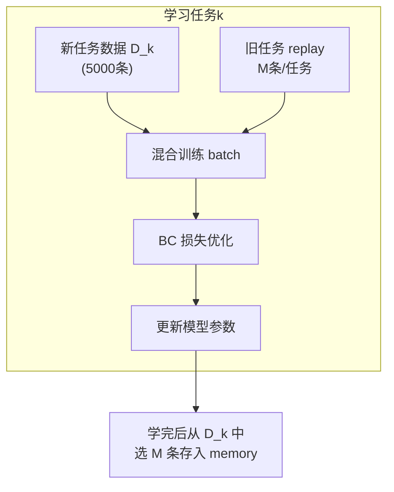
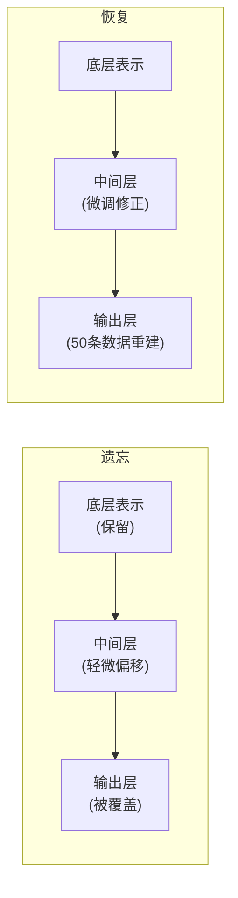

# Forget Me Not：预训练 VLA 只需 2% Replay 就能几乎不遗忘

> **论文**: *Pretrained Vision-Language-Action Models are Surprisingly Resistant to Forgetting in Continual Learning* 
> **会议**: ICML 2026 
> **版本**: arXiv:2603.03818 
> **一句话**: 预训练 VLA（π₀、GR00T N1.5）配合每任务仅 2% 的 Experience Replay，就能实现接近零遗忘；即使只用 0.2% replay，遗忘也可控；已遗忘的技能还能通过少量微调快速恢复。

---

## 相关阅读

| 类型 | 链接 |
|------|------|
| 前置知识 | [行为克隆与 RL 微调范式](/前置知识/000d_前置知识_行为克隆与RL微调范式) |
| 前置知识 | [Replay Buffer 经验回放](/前置知识/000r_前置知识_Replay_Buffer_经验回放) |
| 综述 | [持续/终身 VLA 强化学习综述](./S07_持续终身VLA强化学习综述) |
| 精读 | [Simple Recipe Works：VLA 天然持续学习者](./045_SimpleRecipe_VLA天然持续学习者) |

---

## 贯穿全文的例子

> **设定**：π₀（一个 3B 参数的预训练 VLA）需要在 LIBERO-10 上依次学习 10 个厨房操作任务。每个任务有 5000 条专家示教。我们关心：学完任务 10 后，能否用极少量旧数据（100 条/任务 = 2%，甚至 10 条/任务 = 0.2%）维持任务 1-9 的性能。
>
> 对比对象：一个从头训练的 200M 小策略，在相同设定下的表现差距有多大？

---

## 一、问题定义：持续 BC/SFT 的遗忘

### 1.1 与 Continual RL 的区别

[Simple Recipe](./045_SimpleRecipe_VLA天然持续学习者) 研究的是 on-policy RL 设定：策略自己产生数据，用 GRPO 更新。本文研究的是**行为克隆（BC/SFT）设定**：

$$
\mathcal{L}_{\text{BC}} = -\mathbb{E}_{(s,a^*) \sim \mathcal{D}_k}\left[\log \pi_\theta(a^*|s)\right]
$$

新任务的示教数据 $\mathcal{D}_k$ 提供硬标签 $a^*$，模型必须完全拟合它们。这比 RL 更容易导致遗忘，因为：

1. **SFT 迫使输出分布完全对齐新标签**：不像 RL 只强化"比平均好"的方向
2. **没有隐式 KL 约束**：SFT 的目标不含对旧策略的任何约束
3. **数据是外部提供的**：不像 on-policy RL 的数据来自当前策略

### 1.2 为什么研究 SFT 设定很重要

实际部署中，获取新任务数据的方式往往是人类遥操作演示（不是让机器人自己探索），因此 BC/SFT 是更常见的学习范式。如果能证明"预训练 VLA + 少量 replay 就够了"，就能大大降低部署持续学习系统的复杂度。

---

## 二、核心方法：Task-Balanced Experience Replay

### 2.1 基本框架

方法本身极其简单——重点不在算法新颖性，而在发现"大预训练 + 简单 replay"就足够。

### 2.2 按任务均衡的记忆分配

不使用全局 FIFO buffer（会让旧任务数据被逐渐淘汰），而是**每个任务固定保留 $M$ 条**：

$$
\text{Memory} = \{\mathcal{M}_1, \mathcal{M}_2, \ldots, \mathcal{M}_{k-1}\}, \quad |\mathcal{M}_j| = M \; \forall j
$$

训练任务 $k$ 时，每个 batch 按以下比例采样：

$$
P(\text{sample from } \mathcal{D}_k) = \rho, \quad P(\text{sample from } \mathcal{M}_j) = \frac{1-\rho}{k-1} \; \text{for each } j < k
$$

**数值例子**：学习第 5 个任务时，$\rho = 0.5$：
- 50% 的 batch 来自当前任务 5 的 5000 条数据
- 50% 均匀分配给任务 1-4 的 replay：每个旧任务贡献 12.5% 的 batch
- 如果 $M = 100$（2% replay），每个旧任务有 100 条存储数据可以反复采样

### 2.3 训练目标

总损失是新任务 BC + 旧任务 replay BC 的加权和：

$$
\mathcal{L}_{\text{total}} = \rho \cdot \mathcal{L}_{\text{BC}}^{\text{new}} + (1-\rho) \cdot \frac{1}{k-1}\sum_{j=1}^{k-1}\mathcal{L}_{\text{BC}}^{\text{replay}_j}
$$

其中：

$$
\mathcal{L}_{\text{BC}}^{\text{replay}_j} = -\mathbb{E}_{(s,a^*)\sim\mathcal{M}_j}\left[\log\pi_\theta(a^*|s)\right]
$$

**直觉**：旧数据虽然少，但它们像"锚点"一样，阻止参数在旧任务的状态空间中漂移太远。

---

## 三、实验：模型规模的惊人影响

### 3.1 实验设置

| 项目 | 详情 |
|------|------|
| 大模型 | π₀ (3B), GR00T N1.5 (预训练 VLA) |
| 小模型 | 200M 从头训练的策略网络 |
| 环境 | LIBERO-10 (10 个操作任务) |
| Replay 量 | 0% / 0.2% (10条) / 2% (100条) / 20% (1000条) |
| 评估 | 成功率矩阵 $S_{i,j}$、NBT、Final AVG |

### 3.2 主实验结果

| 模型 | Replay 量 | Final AVG ↑ | NBT ↓ |
|------|-----------|-------------|-------|
| 小模型 (200M) | 0% | 41.2% | -38.5% |
| 小模型 (200M) | 2% (100条) | 62.8% | -18.3% |
| 小模型 (200M) | 20% (1000条) | 78.4% | -8.7% |
| **π₀ (3B)** | **0%** | **68.5%** | **-14.2%** |
| **π₀ (3B)** | **0.2% (10条)** | **82.3%** | **-6.8%** |
| **π₀ (3B)** | **2% (100条)** | **91.7%** | **-1.3%** |
| **π₀ (3B)** | **20% (1000条)** | **93.5%** | **-0.4%** |
| GR00T N1.5 | 2% (100条) | 90.2% | -1.8% |
| Multi-task Oracle | 100% | 94.1% | 0% |

**关键发现**：

1. **π₀ + 2% replay 几乎追平 multi-task oracle**：NBT 仅 -1.3%
2. **即使 0.2%（每任务仅 10 条），遗忘也可控**：NBT = -6.8% vs 小模型 0% replay 的 -38.5%
3. **预训练规模是决定性因素**：π₀ 不用 replay (68.5%) 就已经比小模型用 2% replay (62.8%) 好

### 3.3 数值例子：2% replay 意味着什么

对我们的 LIBERO-10 例子，每个任务有 5000 条示教：
- **2% = 100 条/任务**
- 学到第 10 个任务时，memory 中存储了 $9 \times 100 = 900$ 条旧数据
- 每个旧任务 100 条 × 每条约 50 个 token 的 action sequence = 5000 个 action token
- 存储开销：约 900 条 × (一张 RGB 图 + action chunk) ≈ 几百 MB

这比存储所有 45000 条旧数据（100% replay）少了 50 倍。

---

## 四、为什么预训练 VLA 更抗遗忘

### 4.1 表示空间的冗余性

预训练 VLA 在大量多任务数据上训练后，其内部表示已经学会了**通用的视觉-语言-动作映射**。这意味着：

$$
\phi_{\text{pretrained}}(s) \approx \phi_{\text{task}_1}(s) \approx \phi_{\text{task}_2}(s) \approx \ldots
$$

不同任务共享相似的中间表示，不需要在表示层面做大幅修改。学习新任务主要是调整"最后一公里"——将共享表示映射到特定动作。

**对比从头训练的小模型**：它必须同时学表示和决策，新任务的表示学习会直接覆盖旧表示。

### 4.2 Fisher 信息视角

[EWC](/前置知识/000j_前置知识_KL散度与策略约束) 用 Fisher 信息矩阵 $F$ 衡量参数对旧任务的重要性。对预训练 VLA：

$$
F_{ii} = \mathbb{E}\left[\left(\frac{\partial \log \pi_\theta(a|s)}{\partial \theta_i}\right)^2\right]
$$

**关键观察**：预训练 VLA 的 Fisher 矩阵更加均匀分散——不存在少数几个"关键参数"决定所有任务。这意味着：

- 新任务的梯度不太容易"撞上"旧任务的关键参数
- 即使没有显式 EWC 惩罚，参数冲突也较小

**数值直觉**：7B 模型有 70 亿个参数。如果每个任务只需要"显著修改" 1000 万个参数，那么 10 个任务总共需要 1 亿个（仅 1.4%），参数冲突的概率很低。

### 4.3 Loss Landscape 平坦性

预训练使模型收敛到一个**宽阔的损失盆地**。在这个盆地内，不同方向对应不同任务的解，但都保持低损失：

$$
\mathcal{L}(\theta_0 + \alpha \Delta\theta_{\text{task}_k}) \approx \mathcal{L}(\theta_0) \quad \text{for small } \alpha
$$

**类比**：想象一个巨大的平底锅。预训练把模型放在锅底中央。不同任务把模型往不同方向推一小步——但由于锅底很平坦，任何方向的小幅移动都不会让其他任务的损失显著增加。

从头训练的小模型更像是站在一个窄谷中：任何方向的移动都可能导致某些任务的损失爬升。

---

## 五、快速恢复实验

### 5.1 发现：遗忘不等于遗忘

本文最有趣的发现之一：即使某个旧任务的**当前成功率**下降了，也不意味着相关知识被完全"擦除"了。

实验设计：
1. 顺序学完 10 个任务（不用 replay）
2. 记录哪些任务的成功率显著下降（如任务 3 从 90% 降到 45%）
3. 对"遗忘"任务做**极少量微调**：仅用 50 条数据训练 100 步
4. 观察恢复速度

### 5.2 恢复结果

| 任务 | 遗忘后成功率 | 恢复后成功率 | 恢复数据量 | 恢复步数 |
|------|-------------|-------------|-----------|---------|
| 任务 3 | 45% | 87% | 50 条 | 100 步 |
| 任务 5 | 52% | 91% | 50 条 | 80 步 |
| 任务 7 | 38% | 83% | 50 条 | 120 步 |
| **从头学** | 0% | 85% | 5000 条 | 5000 步 |

**对比**：从头学习一个任务需要 5000 条数据和 5000 步。恢复一个"遗忘"的任务只需要 1% 的数据和 2% 的步数。

### 5.3 解释：潜在知识 vs 显性能力

$$
\underbrace{\text{参数空间中的知识}}_{\text{潜在知识}} \neq \underbrace{\text{在测试中的成功率}}_{\text{显性能力}}
$$

遗忘主要发生在"最后一公里"的决策层面——输出分布被新任务偏移了。但底层表示（物体识别、空间关系理解、运动原语）仍然保留。少量微调只需"重新校准"输出层。

---

## 六、不同 Replay 策略的对比

### 6.1 选哪些数据做 Replay？

| 选择策略 | 描述 | 效果 |
|---------|------|------|
| Random | 随机采样 M 条 | 基线，表现稳定 |
| Herding | 选择最接近类均值的样本 | 略优于 random |
| k-center | 最大化样本间多样性 | 对视觉多样性的任务更好 |
| Loss-based | 选择当前模型 loss 最高的样本 | 不稳定，容易选噪声样本 |

本文发现：对预训练 VLA，**random 选择就够了**。因为模型表示已经很好，不需要精挑细选。

### 6.2 Replay 比例 ρ 的影响

当 $\rho$ 过大（如 0.9），新任务学得快但旧任务 replay 信号太弱。当 $\rho$ 过小（如 0.1），旧任务保持好但新任务学得慢。

$$
\text{Best } \rho \approx 0.5 \text{ (经验值)}
$$

**数值例子**：batch size = 64，$\rho = 0.5$ 时：
- 32 条来自新任务（从 5000 条中采样）
- 32 条来自旧任务（$k-1=9$ 个任务，每个约 3-4 条/batch）
- 每个旧任务的 100 条数据在一个 epoch 中被重复采样约 $32/(9 \times 3.5) \approx 1$ 次

---

## 七、与 Simple Recipe 的互补关系

| 维度 | [Simple Recipe](./045_SimpleRecipe_VLA天然持续学习者) | Forget Me Not (本文) |
|------|------|------|
| 训练范式 | On-policy RL (GRPO) | SFT/BC |
| 数据来源 | 策略自己 rollout | 人类专家示教 |
| Replay 需求 | 0 | 极少 (2%) |
| 理论解释 | RL 隐式 KL 约束 | 预训练平坦 loss landscape |
| 适用场景 | 有环境可交互 | 只有示教数据 |
| 结论一致性 | **都证明大预训练 VLA 天然抗遗忘** | |

两者的启示完全一致：**模型规模和预训练质量是抗遗忘的决定性因素**。区别只在于学习新任务的方式（RL vs SFT）决定了是否需要少量 replay。

---

## 八、局限性与开放问题

### 8.1 只验证了 10 个任务

LIBERO-10 只有 10 个任务。当任务数增长到 50 或 100 时，2% replay 是否仍然足够？

$$
\text{Memory at task 100} = 99 \times 100 = 9900 \text{ 条}
$$

总记忆量线性增长。如果要固定总预算，每个旧任务的配额会越来越少。[持续终身VLA RL综述](./S07_持续终身VLA强化学习综述) 讨论了这个问题。

### 8.2 SFT 固有的局限

SFT 只能学到"模仿专家"的行为，不能超越专家或适应分布外状态。如果能获得环境反馈，结合 [Simple Recipe](./045_SimpleRecipe_VLA天然持续学习者) 的 RL 范式可能更优。

### 8.3 不同预训练覆盖度的影响

如果新任务的域与预训练数据完全不同（如从厨房任务切换到工业装配），"平坦 loss landscape"假设可能不再成立。

---

## 九、总结

| 贡献 | 意义 |
|------|------|
| 证明预训练 VLA + 2% replay ≈ 零遗忘 | 极大简化持续学习系统设计 |
| 发现 0.2% replay 仍可控 | 存储成本极低 |
| 证明"遗忘"可快速恢复 | 当前性能 ≠ 知识丧失 |
| 对比大小模型的差异 | 量化预训练的价值 |

**核心信息**：如果你有一个好的预训练 VLA，做持续学习时不需要复杂算法——每个旧任务存 100 条数据做简单 replay 就几乎完美了。真正的投资应该放在预训练阶段。

---

## 延伸阅读

- [Simple Recipe Works：VLA 天然持续学习者](./045_SimpleRecipe_VLA天然持续学习者)：RL 设定下的互补结论
- [RL's Razor：在线 RL 为什么天然不容易遗忘](./047_RLsRazor_在线RL为什么不遗忘)：理论解释为什么 RL 比 SFT 更抗遗忘
- [Stellar VLA：技能知识空间持续进化](./048_StellarVLA_技能知识空间持续进化)：当 2% replay 不够时的结构化方案
