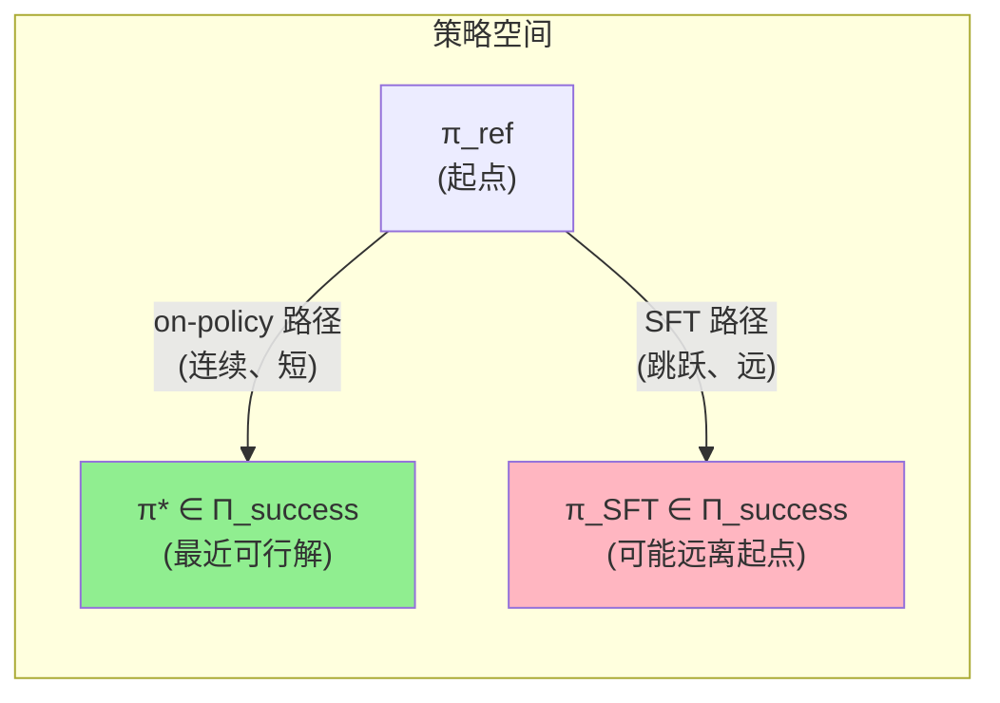
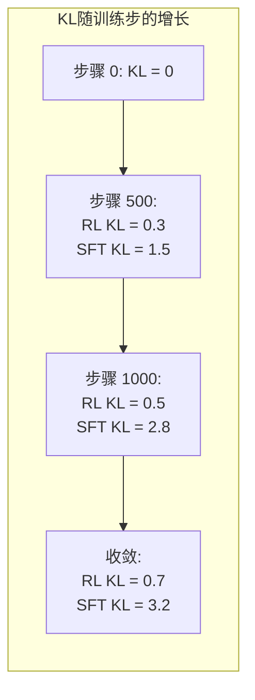

# RL's Razor：On-policy RL 天然选择最小 KL 偏移的策略

> **论文**: *RL's Razor: Why Online Reinforcement Learning Forgets Less* 
> **版本**: arXiv:2509.04259, 2025 
> **一句话**: On-policy RL（如 PPO/GRPO）在所有能解决新任务的策略中，会收敛到与原始策略 KL 距离最小的那个。这种隐式正则化是 RL 微调比 SFT 更少遗忘的根本原因。

---

## 相关阅读

| 类型 | 链接 |
|------|------|
| 前置知识 | [策略梯度与 PPO](/前置知识/000a_前置知识_策略梯度与PPO) |
| 前置知识 | [KL散度与策略约束](/前置知识/000j_前置知识_KL散度与策略约束) |
| 综述 | [持续/终身 VLA 强化学习综述](./S07_持续终身VLA强化学习综述) |
| 精读 | [Simple Recipe Works：VLA 天然持续学习者](./045_SimpleRecipe_VLA天然持续学习者) |

---

## 贯穿全文的例子

> **设定**：一个预训练好的 7B VLA $\pi_{\text{ref}}$，当前对"打开微波炉门"的成功率已经有 30%（预训练有一些泛化能力但不完美）。现在我们要把这个任务的成功率提到 90%+。
>
> 有很多策略 $\pi$ 能达到 90% 成功率——有的策略动作幅度很大（机械臂大力甩动），有的策略很保守（轻柔精确地打开）。问题是：on-policy RL 会收敛到哪一个？答案是**离 $\pi_{\text{ref}}$ 最近的那个**。
>
> 我们将用这个例子来理解"RL's Razor"的含义：像奥卡姆剃刀一样，RL 倾向选择"改动最小"的解。

---

## 一、核心问题：SFT 和 RL 为什么遗忘程度不同

### 1.1 经验观察

[Simple Recipe](./045_SimpleRecipe_VLA天然持续学习者) 和 [Forget Me Not](./046_ForgetMeNot_预训练VLA抗遗忘) 都观察到：

$$
\text{Forgetting}_{\text{SFT}} \gg \text{Forgetting}_{\text{RL}}
$$

在相同的 LoRA 约束下，同样学习新任务到 90% 成功率：
- Sequential SFT 的 NBT ≈ -12.3%
- Sequential GRPO 的 NBT ≈ -2.4%

为什么？直觉上我们知道"RL 的更新更温和"，但能否给出严格的理论解释？

### 1.2 本文的回答

**RL's Razor 定理**（非正式版）：在满足特定条件的 on-policy RL 中，策略序列 $\{\pi_t\}$ 收敛到的解 $\pi^*$ 满足：

$$
\pi^* \approx \arg\min_{\pi \in \Pi_{\text{success}}} D_{\text{KL}}(\pi \| \pi_{\text{ref}})
$$

其中 $\Pi_{\text{success}} = \{\pi : J(\pi) \geq \eta\}$ 是所有成功率超过阈值 $\eta$ 的策略集合。

**通俗翻译**：RL 不只是找到一个能完成任务的策略——它找到的是"改动最少就能完成任务"的策略。

---

## 二、理论分析

### 2.1 On-policy 策略梯度的隐式偏好

考虑标准策略梯度更新：

$$
\theta_{t+1} = \theta_t + \alpha \nabla_\theta J(\pi_\theta)\big|_{\theta=\theta_t}
$$

其中期望回报为：

$$
J(\pi_\theta) = \mathbb{E}_{\tau \sim \pi_\theta}\left[\sum_{t=0}^T \gamma^t r_t\right]
$$

策略梯度为（REINFORCE 形式）：

$$
\nabla_\theta J = \mathbb{E}_{s \sim d^{\pi_\theta}, a \sim \pi_\theta}\left[A^{\pi_\theta}(s,a) \nabla_\theta \log \pi_\theta(a|s)\right]
$$

**关键点**：状态分布 $d^{\pi_\theta}$ 和动作采样都来自当前策略 $\pi_\theta$。这意味着：

1. 只有当前策略**会实际访问到**的状态-动作对才产生梯度
2. 如果当前策略在某个状态空间区域表现已经"足够好"（advantage ≈ 0），就不会产生大梯度

### 2.2 形式化：Mirror Descent 视角

本文的核心理论工具是将策略优化看作**策略空间中的 Mirror Descent**。

对于 [PPO](/前置知识/000a_前置知识_策略梯度与PPO) 的 clip 目标，每步更新可以近似为：

$$
\pi_{t+1} = \arg\max_\pi \left\{\langle \nabla_\pi J(\pi_t), \pi - \pi_t \rangle - \frac{1}{\alpha} D_{\text{KL}}(\pi \| \pi_t)\right\}
$$

这是一个 KL-正则化的线性近似优化。其解为：

$$
\pi_{t+1}(a|s) \propto \pi_t(a|s) \cdot \exp\left(\alpha \cdot A^{\pi_t}(s,a)\right)
$$

**直觉**：每步只对当前策略做**小幅指数倾斜**，advantage 大的动作概率乘以大于 1 的因子，advantage 小或负的动作概率乘以小于 1 的因子。

### 2.3 累积效应：链式 KL 分解

经过 $N$ 步更新后，总 KL 偏移可以用链式法则分解：

$$
D_{\text{KL}}(\pi_N \| \pi_0) \leq \sum_{t=0}^{N-1} D_{\text{KL}}(\pi_{t+1} \| \pi_t)
$$

每步的 KL 变化受限于学习率和 clip 范围：

$$
D_{\text{KL}}(\pi_{t+1} \| \pi_t) \leq \frac{\epsilon^2}{2} \cdot \text{Var}_{a \sim \pi_t}[A^{\pi_t}(s,a)]
$$

其中 $\epsilon$ 是 PPO 的 clip 参数（通常 0.2）。

**数值例子**：假设 $\epsilon = 0.2$，advantage 的方差为 1.0：
- 每步最大 KL 变化 ≈ $0.04/2 = 0.02$ nats
- 1000 步训练后总 KL 上界 ≈ $20$ nats

但实际中，一旦任务被解决（advantage → 0），KL 增长就自动停止。

### 2.4 核心定理（简化版）

**定理 (RL's Razor)**：设 $\pi_0 = \pi_{\text{ref}}$ 为初始策略，$\{\pi_t\}$ 为 on-policy RL 产生的策略序列。如果训练在首次达到性能阈值 $J(\pi_{t^*}) \geq \eta$ 时停止，则：

$$
D_{\text{KL}}(\pi_{t^*} \| \pi_{\text{ref}}) \leq D_{\text{KL}}(\hat{\pi} \| \pi_{\text{ref}}) + \mathcal{O}(\alpha)
$$

对所有 $\hat{\pi} \in \Pi_{\text{success}}$。即 $\pi_{t^*}$ 近似是成功策略中离 $\pi_{\text{ref}}$ 最近的。

**证明直觉**：
1. On-policy RL 每步只能沿当前策略的采样方向移动（不能跳跃）
2. 这形成了策略空间中的一条**连续路径**
3. 路径从 $\pi_{\text{ref}}$ 出发，首次碰到 $\Pi_{\text{success}}$ 边界时停止
4. 连续路径首次碰到凸集边界的点，就是该边界上离起点最近的点

---

## 三、为什么 SFT 不具备这个性质

### 3.1 SFT 的更新机制

SFT 目标：

$$
\mathcal{L}_{\text{SFT}} = -\mathbb{E}_{(s,a^*)\sim\mathcal{D}}\left[\log \pi_\theta(a^*|s)\right]
$$

梯度为：

$$
\nabla_\theta \mathcal{L}_{\text{SFT}} = -\mathbb{E}_{(s,a^*)\sim\mathcal{D}}\left[\nabla_\theta \log \pi_\theta(a^*|s)\right]
$$

**关键区别**：
- 数据分布 $\mathcal{D}$ 是**外部固定的**（专家演示），不随当前策略变化
- 不管当前策略在 $a^*$ 上的概率有多高，只要不是 1，就持续有梯度
- 没有 advantage 加权——所有示教点等权贡献

### 3.2 SFT 为什么造成更大偏移

**情况一**：如果专家行为 $a^*$ 碰巧和 $\pi_{\text{ref}}$ 的模式很不同：

$$
\pi_{\text{ref}}(a^*|s) = 0.01 \quad \Rightarrow \quad -\log(0.01) = 4.6 \quad \text{(很大的loss)}
$$

SFT 会产生巨大的梯度，强迫模型大幅改变分布。

**情况二**：on-policy RL 在相同状态下：
- 如果 $\pi_\theta$ 已经有 30% 概率执行正确动作，这些 rollout 中有些会成功
- advantage 不会特别大（因为 30% 的基线已经不低）
- 梯度相对温和

**数值对比**：

假设某状态下正确动作的初始概率为 $p_0 = 0.3$：

| 方法 | 目标概率 | 所需 KL 变化 |
|------|---------|-------------|
| SFT | → 0.99 | $\Delta \text{KL} \approx \log(0.99/0.3) \approx 1.2$ nats |
| RL (到 90% 成功率) | → 0.7 (够了) | $\Delta \text{KL} \approx \log(0.7/0.3) \approx 0.85$ nats |

RL 不需要把每个动作都推到接近 1——只要整体成功率够高就停止。

### 3.3 Off-policy vs On-policy 的区别

即使是 off-policy RL（如用旧数据做 importance sampling），也不具备 RL's Razor 的性质：

$$
\nabla_\theta J_{\text{off-policy}} = \mathbb{E}_{s \sim d^{\pi_{\text{old}}}, a \sim \pi_{\text{old}}}\left[\frac{\pi_\theta(a|s)}{\pi_{\text{old}}(a|s)} A(s,a) \nabla_\theta \log \pi_\theta(a|s)\right]
$$

数据来自旧策略 $\pi_{\text{old}}$，不来自当前策略。这意味着更新方向不受"当前策略实际访问的状态"约束，可能推动策略到远离 $\pi_{\text{ref}}$ 的区域。

---

## 四、实证验证

### 4.1 实验设计

为了验证理论预测，本文设计了受控实验：

1. 固定一个预训练策略 $\pi_{\text{ref}}$
2. 在新任务上分别用 SFT 和 on-policy RL 训练到**相同的成功率**
3. 测量最终策略与 $\pi_{\text{ref}}$ 的 KL 距离
4. 测量在其他（未训练）任务上的性能保持

### 4.2 KL 距离测量

$$
D_{\text{KL}}(\pi_{\text{final}} \| \pi_{\text{ref}}) = \mathbb{E}_{s \sim d^{\pi_{\text{ref}}}}\left[\sum_a \pi_{\text{final}}(a|s) \log \frac{\pi_{\text{final}}(a|s)}{\pi_{\text{ref}}(a|s)}\right]
$$

实际中，对连续动作空间的 VLA，使用蒙特卡洛估计：

$$
\hat{D}_{\text{KL}} \approx \frac{1}{N}\sum_{i=1}^N \left[\log \pi_{\text{final}}(a_i|s_i) - \log \pi_{\text{ref}}(a_i|s_i)\right], \quad a_i \sim \pi_{\text{final}}
$$

### 4.3 结果

| 方法 | 新任务成功率 | $D_{\text{KL}}(\pi \| \pi_{\text{ref}})$ | 旧任务保持率 |
|------|------------|-------|------------|
| PPO (on-policy) | 92% | 0.8 nats | 95% |
| GRPO (on-policy) | 91% | 0.7 nats | 96% |
| SFT | 93% | 3.2 nats | 78% |
| Off-policy RL | 90% | 2.1 nats | 84% |

**关键发现**：
- 达到相似的新任务成功率时，on-policy RL 的 KL 偏移比 SFT **小 4 倍**
- KL 偏移与旧任务保持率**高度负相关**：KL 越小，旧任务掉得越少
- Off-policy RL 介于两者之间，印证了"on-policy 数据"是关键因素

### 4.4 训练过程中的 KL 轨迹

关键观察：
- **RL 的 KL 增长会自动饱和**：一旦任务被解决，advantage → 0，梯度消失，KL 停止增长
- **SFT 的 KL 会持续增长**：只要没到 $\log \pi(a^*) = 0$（概率=1），就持续有梯度

---

## 五、推论与实践指导

### 5.1 RL's Razor 对持续学习的意义

将 RL's Razor 与持续学习结合：

如果每个新任务的 RL 训练都产生最小 KL 偏移，那么 $T$ 个顺序任务后的总偏移可以被约束为：

$$
D_{\text{KL}}(\pi_T \| \pi_0) \leq \sum_{k=1}^T D_{\text{KL}}(\pi_k \| \pi_{k-1}) \leq T \cdot \delta_{\min}
$$

其中 $\delta_{\min}$ 是每个任务的最小必要 KL 变化。如果 $\delta_{\min}$ 很小（预训练已经覆盖了大部分能力），则即使 $T = 30$，总偏移也很小。

**数值例子**（我们的 30 任务设定）：
- 每个任务最小 KL 变化 $\delta_{\min} \approx 0.7$ nats
- 30 个任务后总 KL 上界 ≈ $30 \times 0.7 = 21$ nats
- 但实际中任务间有共享结构，后面任务的 $\delta$ 更小
- 实测总 KL ≈ 8 nats（远低于上界）

### 5.2 什么时候 RL's Razor 失效

1. **任务与预训练差异太大**：$\delta_{\min}$ 可能很大（如从抓取切换到飞行）
2. **奖励很稀疏**：收敛慢，实际训练中可能 overshoot
3. **模型太小**：表示空间不够，多任务的最优解必须"挤"在一起
4. **Off-policy 数据混入**：破坏了 on-policy 的隐式约束

### 5.3 实践建议

基于 RL's Razor，做持续 VLA 训练时应该：

1. **优先用 on-policy RL 而非 SFT 学新任务**
2. **训练到"刚好够"就停止**——不要过度优化单任务性能
3. **监控训练过程中的 KL 偏移**——如果 KL 异常增长，说明任务偏离预训练覆盖
4. **大模型 + LoRA 进一步减小 $\delta_{\min}$**——预训练越好、可训练参数越少，每步 KL 变化越小

---

## 六、与显式 KL 正则化的关系

### 6.1 显式 KL penalty

很多 RL 算法（如 RLHF 中的 PPO）会加入显式 KL 惩罚：

$$
J_{\text{KL}}(\pi) = J(\pi) - \beta \cdot D_{\text{KL}}(\pi \| \pi_{\text{ref}})
$$

RL's Razor 说明：**on-policy RL 本身就有隐式的 KL 约束，显式 penalty 可能是多余的。**

### 6.2 隐式 vs 显式的比较

| 维度 | 隐式 (RL's Razor) | 显式 ($\beta$ KL penalty) |
|------|------|------|
| 约束来源 | on-policy 采样 + 梯度路径 | 目标函数中的惩罚项 |
| 需要调参吗 | 不需要 | 需要调 $\beta$ |
| 约束强度 | 自适应（任务简单时弱，难时强） | 固定 |
| 可能的问题 | 对困难任务可能约束不够 | $\beta$ 太大导致新任务学不好 |

**实验发现**：在 [Simple Recipe](./045_SimpleRecipe_VLA天然持续学习者) 的 30 任务实验中，加入显式 KL penalty **没有进一步改善** NBT。这说明 on-policy GRPO 的隐式约束已经足够。

---

## 七、与其他"为什么 RL 不遗忘"解释的对比

| 解释 | 来源 | 机制 | 充分吗 |
|------|------|------|--------|
| RL's Razor (本文) | On-policy 梯度路径 | 隐式选择最小 KL 解 | 理论最完整 |
| Advantage 加权 | GRPO/PPO 本身 | 只更新正 advantage 动作 | 不解释为什么 KL 小 |
| On-policy 数据 | Retaining by Doing | 不引入分布外梯度 | 部分解释 |
| LoRA 约束 | 参数空间限制 | 可训练方向少 | 辅助因素，非根因 |
| 大模型表示 | 预训练平坦性 | 参数子空间不冲突 | 辅助因素 |

本文认为 RL's Razor 是**最根本的解释**，其他因素（LoRA、大模型）是放大隐式正则化效果的辅助条件。

---

## 八、总结

| 贡献 | 意义 |
|------|------|
| 提出 RL's Razor 理论 | 首次严格解释 on-policy RL 的隐式 KL 约束 |
| Mirror Descent 形式化 | 将直觉转化为可证明的定理 |
| 实证验证 KL 与遗忘的因果关系 | 不只是相关性 |
| 对比 on/off-policy 和 SFT | 明确区分三种范式的遗忘机制 |

**核心信息**：On-policy RL 像奥卡姆剃刀一样"简洁"——在能完成任务的所有策略中，它天然选择改动最小的那个。这不是偶然的经验发现，而是 on-policy 梯度更新的数学必然。

---

## 延伸阅读

- [Simple Recipe Works：VLA 天然持续学习者](./045_SimpleRecipe_VLA天然持续学习者)：RL's Razor 的最大受益者
- [Forget Me Not：预训练 VLA 抗遗忘](./046_ForgetMeNot_预训练VLA抗遗忘)：SFT 不具备 RL's Razor 时需要 replay
- [GRPO：Group Relative Policy Optimization](/前置知识/000m_前置知识_GRPO_Group_Relative_Policy_Optimization)：Simple Recipe 使用的具体 RL 算法
- [KL散度与策略约束](/前置知识/000j_前置知识_KL散度与策略约束)：理解 KL 距离的物理含义
