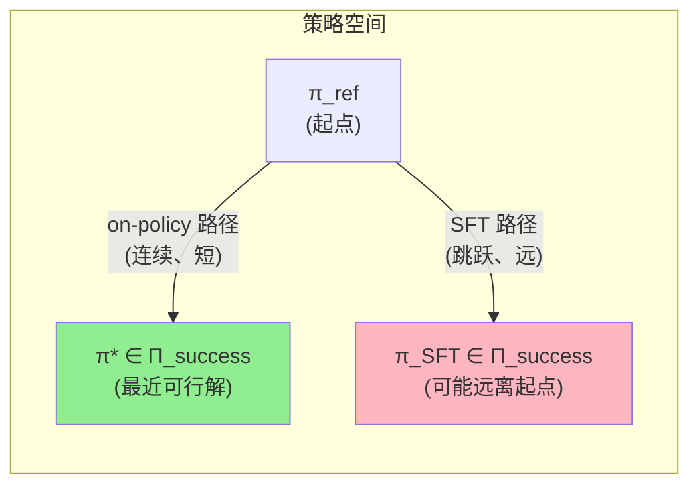
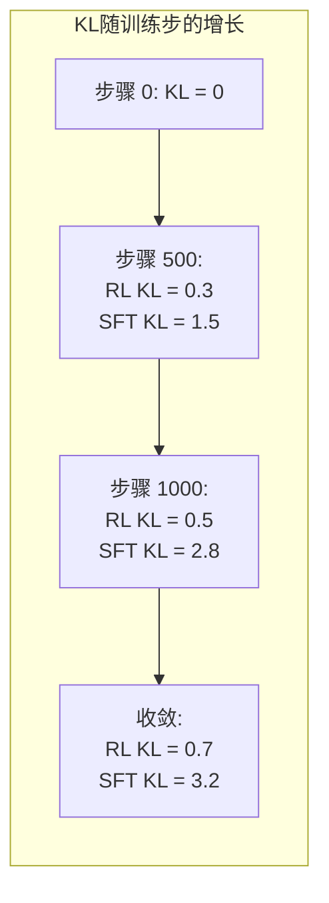

# RL's Razor：On-policy RL 天然选择最小 KL 偏移的策略

> **论文**: *RL's Razor: Why Online Reinforcement Learning Forgets Less* 
> **版本**: arXiv:2509.04259, 2025 
> **一句话**: On-policy RL（如 PPO/GRPO）在所有能解决新任务的策略中，会收敛到与原始策略 KL 距离最小的那个。这种隐式正则化是 RL 微调比 SFT 更少遗忘的根本原因。

---

## 相关阅读

| 类型 | 链接 |
|------|------|
| 前置知识 | [策略梯度与 PPO](/前置知识/000a_前置知识_策略梯度与PPO) |
| 前置知识 | [KL散度与策略约束](/前置知识/000j_前置知识_KL散度与策略约束) |
| 综述 | [持续/终身 VLA 强化学习综述](./S07_持续终身VLA强化学习综述) |
| 精读 | [Simple Recipe Works：VLA 天然持续学习者](./045_SimpleRecipe_VLA天然持续学习者) |

---

## 贯穿全文的例子

> **设定**：一个预训练好的 7B VLA $\pi_{\text{ref}}$，当前对"打开微波炉门"的成功率已经有 30%（预训练有一些泛化能力但不完美）。现在我们要把这个任务的成功率提到 90%+。
>
> 有很多策略 $\pi$ 能达到 90% 成功率——有的策略动作幅度很大（机械臂大力甩动），有的策略很保守（轻柔精确地打开）。问题是：on-policy RL 会收敛到哪一个？答案是**离 $\pi_{\text{ref}}$ 最近的那个**。
>
> 我们将用这个例子来理解"RL's Razor"的含义：像奥卡姆剃刀一样，RL 倾向选择"改动最小"的解。

---

## 一、核心问题：SFT 和 RL 为什么遗忘程度不同

### 1.1 经验观察

[Simple Recipe](./045_SimpleRecipe_VLA天然持续学习者) 和 [Forget Me Not](./046_ForgetMeNot_预训练VLA抗遗忘) 都观察到：

$$
\text{Forgetting}_{\text{SFT}} \gg \text{Forgetting}_{\text{RL}}
$$

**这个公式在做什么**：给出一个已被反复观察到的经验现象——用监督微调（SFT）学新任务比用 RL 学新任务，对旧任务的遗忘要严重得多。

::: details 📐 公式详解（点击展开）

| 子表达式 | 它是谁 | 它在干嘛 |
|---------|--------|---------|
| $\text{Forgetting}_{\text{SFT}}$ | **遗忘较重的一方** | 用监督微调学新任务后，旧任务性能下降的幅度 |
| $\text{Forgetting}_{\text{RL}}$ | **遗忘较轻的一方** | 用 RL（如 PPO/GRPO）学新任务后，旧任务性能下降的幅度 |
| $\gg$ | **量级远大于** | 不是小幅差异，是数量级上的明显差距 |

**用人话读**："学新任务时，用 SFT 会让旧任务的表现掉得多得多，用 RL 掉得少得多。"

**为什么是这个形式**：这是本文要解释的核心经验现象——本文接下来提出 RL's Razor 定理，从数学上说明为什么会有这个差距。
:::

在相同的 LoRA 约束下，同样学习新任务到 90% 成功率：
- Sequential SFT 的 NBT ≈ -12.3%
- Sequential GRPO 的 NBT ≈ -2.4%

为什么？直觉上我们知道"RL 的更新更温和"，但能否给出严格的理论解释？

### 1.2 本文的回答

**RL's Razor 定理**（非正式版）：在满足特定条件的 on-policy RL 中，策略序列 $\{\pi_t\}$ 收敛到的解 $\pi^*$ 满足：

$$
\pi^* \approx \arg\min_{\pi \in \Pi_{\text{success}}} D_{\text{KL}}(\pi \| \pi_{\text{ref}})
$$

**这个公式在做什么**：这是全文的核心定理——on-policy RL 最终收敛到的策略，近似是"所有能完成新任务的策略"里离原始策略最近的那一个。

::: details 📐 公式详解（点击展开）

| 子表达式 | 它是谁 | 它在干嘛 |
|---------|--------|---------|
| $\Pi_{\text{success}}$ | **及格策略的候选池** | 所有能把新任务成功率做到阈值以上的策略集合 |
| $D_{\text{KL}}(\pi \| \pi_{\text{ref}})$ | **改动量表** | 候选策略 $\pi$ 相对原始策略 $\pi_{\text{ref}}$ 改变了多少 |
| $\arg\min_{\pi \in \Pi_{\text{success}}}$ | **挑改动最小的** | 在及格候选池里，挑出改动量最小的那一个 |
| $\pi^*$ | **RL 实际收敛到的策略** | 训练结束后模型实际停在的地方 |

**用人话读**："在所有能完成新任务的策略里，RL 实际找到的是那个和原始模型改动最小的策略——不是随便一个能过关的解，是最省力的那个。"

**为什么是这个形式**：这不是刻意设计出来的目标函数，而是 on-policy 梯度更新过程的数学必然结果（详见第二节的 Mirror Descent 推导）——RL 每步只能沿着策略自身采样出的方向小幅移动，这条路径自然会在"刚好达标"时停在离起点最近的边界点。
:::

其中 $\Pi_{\text{success}} = \{\pi : J(\pi) \geq \eta\}$ 是所有成功率超过阈值 $\eta$ 的策略集合。

**通俗翻译**：RL 不只是找到一个能完成任务的策略——它找到的是"改动最少就能完成任务"的策略。

---

## 二、理论分析

### 2.1 On-policy 策略梯度的隐式偏好

考虑标准策略梯度更新：

$$
\theta_{t+1} = \theta_t + \alpha \nabla_\theta J(\pi_\theta)\big|_{\theta=\theta_t}
$$

**这个公式在做什么**：标准的梯度上升更新规则——参数沿着梯度方向、按步长 $\alpha$ 移动一小步。

::: details 📐 公式详解（点击展开）

| 子表达式 | 它是谁 | 它在干嘛 |
|---------|--------|---------|
| $\theta_t$ | **当前这一步的参数** | 训练进行到第 $t$ 步时的网络参数 |
| $\nabla_\theta J(\pi_\theta)\big\|_{\theta=\theta_t}$ | **当前位置的爬坡方向** | 在 $\theta_t$ 处，让期望回报变大最快的方向 |
| $\alpha$ | **步子大小** | 学习率，控制每次移动的幅度 |
| $\theta_{t+1}$ | **下一步的参数** | 沿梯度方向走一小步后得到的新参数 |

**用人话读**："每一步都往'能让回报变大'的方向挪一小步，挪多远由学习率 $\alpha$ 决定。"

**为什么是这个形式**：这是最基础的梯度上升公式，本文用它作为起点，重点在于接下来展开 $\nabla_\theta J$ 到底怎么算，以及这个更新方式为什么天然带有"离起点近"的隐式偏好。
:::

其中期望回报为：

$$
J(\pi_\theta) = \mathbb{E}_{\tau \sim \pi_\theta}\left[\sum_{t=0}^T \gamma^t r_t\right]
$$

**这个公式在做什么**：定义策略的打分标准——用当前策略反复跑，把每次跑出的折扣总奖励平均起来。

::: details 📐 公式详解（点击展开）

| 子表达式 | 它是谁 | 它在干嘛 |
|---------|--------|---------|
| $\tau \sim \pi_\theta$ | **自己跑出来的轨迹** | 用当前策略 $\pi_\theta$ 实际交互产生的一整局记录 |
| $\gamma^t r_t$ | **打折后的单步奖励** | 第 $t$ 步的奖励，越晚发生打的折越多 |
| $\sum_{t=0}^T$ | **整局累加** | 把一整局所有步骤的折扣奖励加总 |
| $\mathbb{E}_{\tau\sim\pi_\theta}[\cdot]$ | **多局取平均** | 对策略的随机性求期望，实践中用采样几条轨迹的均值近似 |

**用人话读**："用当前策略反复玩很多局，把每局的折扣总奖励平均起来，就是这个策略的打分 $J(\pi_\theta)$。"

**为什么是这个形式**：这是策略梯度方法（详见 [策略梯度与 PPO](/前置知识/000a_前置知识_策略梯度与PPO)）的标准目标函数定义，本文沿用它作为后续推导 $\nabla_\theta J$ 的起点。
:::

策略梯度为（REINFORCE 形式）：

$$
\nabla_\theta J = \mathbb{E}_{s \sim d^{\pi_\theta}, a \sim \pi_\theta}\left[A^{\pi_\theta}(s,a) \nabla_\theta \log \pi_\theta(a|s)\right]
$$

**这个公式在做什么**：给出上面 $J(\pi_\theta)$ 对参数的梯度——这个梯度只由"当前策略自己会访问到"的状态和动作构成，是本文理论的关键出发点。

::: details 📐 公式详解（点击展开）

| 子表达式 | 它是谁 | 它在干嘛 |
|---------|--------|---------|
| $s \sim d^{\pi_\theta}$ | **当前策略的地盘** | 状态是按当前策略的状态访问分布采样出来的 |
| $a \sim \pi_\theta$ | **当前策略自己的选择** | 动作也是按当前策略采样出来的，不是别的策略给的 |
| $A^{\pi_\theta}(s,a)$ | **好坏打分** | 这个动作比当前策略在该状态的平均水平好多少 |
| $\nabla_\theta \log \pi_\theta(a\|s)$ | **调整方向** | 让这个动作概率增大的参数调整方向 |

**用人话读**："梯度只由当前策略自己采样出的状态和动作构成，好的动作往上调、差的往下调，调整力度由 advantage 决定。"

**为什么是这个形式**：这正是本文理论的核心前提——状态分布 $d^{\pi_\theta}$ 和动作采样都锁定在当前策略自身，意味着梯度不会作用在当前策略"根本不会走到"的地方，这是下面推出"隐式 KL 最小化"性质的关键。
:::

**关键点**：状态分布 $d^{\pi_\theta}$ 和动作采样都来自当前策略 $\pi_\theta$。这意味着：

1. 只有当前策略**会实际访问到**的状态-动作对才产生梯度
2. 如果当前策略在某个状态空间区域表现已经"足够好"（advantage ≈ 0），就不会产生大梯度

### 2.2 形式化：Mirror Descent 视角

本文的核心理论工具是将策略优化看作**策略空间中的 Mirror Descent**。

对于 [PPO](/前置知识/000a_前置知识_策略梯度与PPO) 的 clip 目标，每步更新可以近似为：

$$
\pi_{t+1} = \arg\max_\pi \left\{\langle \nabla_\pi J(\pi_t), \pi - \pi_t \rangle - \frac{1}{\alpha} D_{\text{KL}}(\pi \| \pi_t)\right\}
$$

**这个公式在做什么**：把 PPO 的每一步更新重新表述为一个"Mirror Descent"优化问题——在朝着梯度方向改进的同时，惩罚离上一步策略太远的选择。

::: details 📐 公式详解（点击展开）

| 子表达式 | 它是谁 | 它在干嘛 |
|---------|--------|---------|
| $\langle \nabla_\pi J(\pi_t), \pi - \pi_t \rangle$ | **线性改进项** | 用当前梯度方向估计"往 $\pi$ 移动能改进多少"，只是一个线性近似 |
| $\frac{1}{\alpha} D_{\text{KL}}(\pi \| \pi_t)$ | **距离惩罚项** | 惩罚新策略 $\pi$ 离上一步策略 $\pi_t$ 太远，权重由 $1/\alpha$ 控制 |
| $\arg\max_\pi\{\cdot\}$ | **每步的搜索目标** | 在"改进"和"别走太远"之间找平衡点 |
| $\pi_{t+1}$ | **这一步选出的新策略** | 优化问题的解 |

**用人话读**："每一步不是无脑往梯度方向冲，而是在'改进多少'和'离上一步策略多远'之间找一个折中点，走一步。"

**为什么是这个形式**：这是 Mirror Descent 的标准框架——用 KL 散度作为"距离"度量，比欧氏距离更适合概率分布空间；这个框架恰好能解释 PPO 的 clip 机制在做什么，也是后面推出隐式 KL 最小化性质的理论工具。
:::

这是一个 KL-正则化的线性近似优化。其解为：

$$
\pi_{t+1}(a|s) \propto \pi_t(a|s) \cdot \exp\left(\alpha \cdot A^{\pi_t}(s,a)\right)
$$

**这个公式在做什么**：给出上面优化问题的解析解——新策略等于旧策略乘上一个"按 advantage 指数放大/缩小"的因子。

::: details 📐 公式详解（点击展开）

| 子表达式 | 它是谁 | 它在干嘛 |
|---------|--------|---------|
| $\pi_t(a\|s)$ | **上一步的习惯** | 更新前，策略在状态 $s$ 选动作 $a$ 的概率 |
| $\exp(\alpha \cdot A^{\pi_t}(s,a))$ | **指数倾斜因子** | advantage 为正就把概率乘大（$>1$），为负就乘小（$<1$） |
| $\propto$ | **正比，需要归一化** | 乘完之后还要除以归一化常数，让所有动作概率和为 1 |
| $\pi_{t+1}(a\|s)$ | **这一步更新后的习惯** | 在旧概率基础上，按 advantage 微调后的新概率 |

**用人话读**："新策略 = 旧策略的概率，按这个动作的好坏分做指数级的小幅放大或缩小，再归一化。"

**为什么是这个形式**：这是 Mirror Descent 在 KL 散度作为距离度量时的标准闭式解（类似指数梯度下降）——它保证了每一步都是"小幅"调整（$\alpha$ 通常很小），而不是跳跃式的大改动，这正是"每步 KL 变化有限"这一性质的来源。
:::

**直觉**：每步只对当前策略做**小幅指数倾斜**，advantage 大的动作概率乘以大于 1 的因子，advantage 小或负的动作概率乘以小于 1 的因子。

### 2.3 累积效应：链式 KL 分解

经过 $N$ 步更新后，总 KL 偏移可以用链式法则分解：

$$
D_{\text{KL}}(\pi_N \| \pi_0) \leq \sum_{t=0}^{N-1} D_{\text{KL}}(\pi_{t+1} \| \pi_t)
$$

**这个公式在做什么**：把"训练 $N$ 步后总的策略偏移"用三角不等式拆成"每一步偏移量的加总"——控制住每一步的偏移，就能控制住总偏移。

::: details 📐 公式详解（点击展开）

| 子表达式 | 它是谁 | 它在干嘛 |
|---------|--------|---------|
| $D_{\text{KL}}(\pi_N \| \pi_0)$ | **总偏移量** | 训练 $N$ 步后最终策略相对初始策略的总变化 |
| $D_{\text{KL}}(\pi_{t+1} \| \pi_t)$ | **单步偏移量** | 第 $t$ 步到第 $t+1$ 步这一次更新产生的变化 |
| $\sum_{t=0}^{N-1}$ | **逐步累加** | 把 $N$ 次单步偏移加总，作为总偏移的上界 |
| $\leq$ | **上界关系** | 总偏移不会超过各步偏移之和（KL 散度满足类似三角不等式的性质） |

**用人话读**："训练 $N$ 步后策略总共变了多少，不会超过每一步各自变化量的总和。"

**为什么是这个形式**：这一步的目的是把"控制总偏移"的问题，转化为"控制每一步偏移"的问题——只要证明每步偏移有一个小上界（下一个公式），就能推出整个训练过程的偏移是可控的。
:::

每步的 KL 变化受限于学习率和 clip 范围：

$$
D_{\text{KL}}(\pi_{t+1} \| \pi_t) \leq \frac{\epsilon^2}{2} \cdot \text{Var}_{a \sim \pi_t}[A^{\pi_t}(s,a)]
$$

**这个公式在做什么**：给出单步 KL 偏移的具体上界——偏移量由 clip 范围 $\epsilon$ 的平方和当前 advantage 的方差共同决定。

::: details 📐 公式详解（点击展开）

| 子表达式 | 它是谁 | 它在干嘛 |
|---------|--------|---------|
| $\epsilon$ | **安全绳松紧度** | PPO 的 clip 参数，通常取 0.2，限制单步概率比的变化范围 |
| $\frac{\epsilon^2}{2}$ | **偏移系数** | clip 范围决定的一个固定放大系数 |
| $\text{Var}_{a\sim\pi_t}[A^{\pi_t}(s,a)]$ | **动作打分的分散程度** | 当前策略下，不同动作的 advantage 差异有多大 |
| $D_{\text{KL}}(\pi_{t+1} \| \pi_t)$ | **这一步的偏移** | 本次更新造成的 KL 变化，被上式给出上界 |

**用人话读**："这一步策略变化多大，取决于 clip 范围有多宽和当前动作打分的分散程度——clip 越紧、advantage 越集中，这一步变化就越小。"

**为什么是这个形式**：clip 机制本身就是为了限制单步更新幅度设计的，这个上界把"clip 参数 $\epsilon$"和"advantage 方差"两个因素精确联系起来——当 advantage 方差趋近于 0（任务已经解决好，动作好坏差异很小）时，即使不改变 $\epsilon$，单步 KL 偏移也会自动趋于 0，这正是"KL 增长会自动饱和"现象的数学来源。
:::

其中 $\epsilon$ 是 PPO 的 clip 参数（通常 0.2）。

**数值例子**：假设 $\epsilon = 0.2$，advantage 的方差为 1.0：
- 每步最大 KL 变化 ≈ $0.04/2 = 0.02$ nats
- 1000 步训练后总 KL 上界 ≈ $20$ nats

但实际中，一旦任务被解决（advantage → 0），KL 增长就自动停止。

### 2.4 核心定理（简化版）

**定理 (RL's Razor)**：设 $\pi_0 = \pi_{\text{ref}}$ 为初始策略，$\{\pi_t\}$ 为 on-policy RL 产生的策略序列。如果训练在首次达到性能阈值 $J(\pi_{t^*}) \geq \eta$ 时停止，则：

$$
D_{\text{KL}}(\pi_{t^*} \| \pi_{\text{ref}}) \leq D_{\text{KL}}(\hat{\pi} \| \pi_{\text{ref}}) + \mathcal{O}(\alpha)
$$

**这个公式在做什么**：这是 RL's Razor 定理的正式表述——训练停止时得到的策略 $\pi_{t^*}$ 相对参考策略的 KL 偏移，不会比任何其他能成功完成任务的策略 $\hat\pi$ 差太多（最多多出一个随学习率变小的误差项）。

::: details 📐 公式详解（点击展开）

| 子表达式 | 它是谁 | 它在干嘛 |
|---------|--------|---------|
| $\pi_{t^*}$ | **RL 实际停在的策略** | 训练首次达到性能阈值 $\eta$ 时刻的策略 |
| $D_{\text{KL}}(\pi_{t^*} \| \pi_{\text{ref}})$ | **RL 解的改动量** | 实际训练结果相对参考策略的偏移 |
| $D_{\text{KL}}(\hat{\pi} \| \pi_{\text{ref}})$ | **任意及格解的改动量** | 任何一个能完成任务的策略 $\hat\pi$ 相对参考策略的偏移 |
| $\mathcal{O}(\alpha)$ | **步长误差** | 学习率越小，这个误差项越小，趋于 0 |

**用人话读**："RL 实际找到的解，改动量不会比任何一个能完成任务的解差太多——最多多一点点误差，这个误差还会随着训练步子变小而消失。"

**为什么是这个形式**：这正是"离起点最近的可行解"的严格数学化——因为 on-policy 路径是连续的、每步偏移有界（前两个公式已证明），路径从 $\pi_{\text{ref}}$ 出发首次碰到"及格区域"边界时停下，这个停下的点必然近似是边界上离起点最近的点（详见下面的证明直觉）。
:::

对所有 $\hat{\pi} \in \Pi_{\text{success}}$。即 $\pi_{t^*}$ 近似是成功策略中离 $\pi_{\text{ref}}$ 最近的。

**证明直觉**：
1. On-policy RL 每步只能沿当前策略的采样方向移动（不能跳跃）
2. 这形成了策略空间中的一条**连续路径**
3. 路径从 $\pi_{\text{ref}}$ 出发，首次碰到 $\Pi_{\text{success}}$ 边界时停止
4. 连续路径首次碰到凸集边界的点，就是该边界上离起点最近的点

```mermaid
flowchart LR
    subgraph 策略空间
        A["π_ref\n(起点)"] -->|"on-policy 路径\n(连续、短)"| B["π* ∈ Π_success\n(最近可行解)"]
        A -->|"SFT 路径\n(跳跃、远)"| C["π_SFT ∈ Π_success\n(可能远离起点)"]
    end
    style B fill:#90EE90
    style C fill:#FFB6C1
```

---

## 三、为什么 SFT 不具备这个性质

### 3.1 SFT 的更新机制

SFT 目标：

$$
\mathcal{L}_{\text{SFT}} = -\mathbb{E}_{(s,a^*)\sim\mathcal{D}}\left[\log \pi_\theta(a^*|s)\right]
$$

**这个公式在做什么**：定义 SFT（监督微调）的损失——让模型给专家演示的动作打的对数概率尽量高。

::: details 📐 公式详解（点击展开）

| 子表达式 | 它是谁 | 它在干嘛 |
|---------|--------|---------|
| $(s,a^*)\sim\mathcal{D}$ | **外部固定的示教数据** | 从一个固定的专家演示数据集里采样出的状态-动作对，不依赖当前策略 |
| $\log \pi_\theta(a^*\|s)$ | **模型给专家动作打的分** | 当前策略在状态 $s$ 下给专家动作 $a^*$ 分配的对数概率 |
| $-\mathbb{E}[\cdot]$ | **取负再求平均** | 最小化负对数概率，等价于最大化专家动作的概率 |
| $\mathcal{L}_{\text{SFT}}$ | **要最小化的损失** | 训练目标：让模型尽量模仿专家在每个状态下的选择 |

**用人话读**："在专家演示的每个状态动作对上，让模型给那个专家动作打的概率尽量高——这就是最基本的监督微调损失。"

**为什么是这个形式**：这是标准的最大似然估计（交叉熵）损失，与 on-policy RL 的关键区别是数据集 $\mathcal{D}$ 是外部固定的，不随当前策略 $\pi_\theta$ 变化——这正是下面要论证的"SFT 不具备隐式 KL 约束"的根源。
:::

梯度为：

$$
\nabla_\theta \mathcal{L}_{\text{SFT}} = -\mathbb{E}_{(s,a^*)\sim\mathcal{D}}\left[\nabla_\theta \log \pi_\theta(a^*|s)\right]
$$

**这个公式在做什么**：对上面的损失求梯度——不管当前策略在专家动作上的概率有多高，只要不是 1，梯度就一直存在。

::: details 📐 公式详解（点击展开）

| 子表达式 | 它是谁 | 它在干嘛 |
|---------|--------|---------|
| $\nabla_\theta \log \pi_\theta(a^*\|s)$ | **调整方向** | 让专家动作的概率变大的参数调整方向 |
| $(s,a^*)\sim\mathcal{D}$ | **固定的采样来源** | 状态动作对始终来自外部数据集，和当前策略状态无关 |
| $-\mathbb{E}[\cdot]$ | **取负再平均** | 梯度下降时朝着"让专家动作概率变大"的方向走 |

**用人话读**："每个专家数据点都会持续产生梯度，一直推着模型把专家动作的概率往 1 靠，不管现在的概率已经多高。"

**为什么是这个形式**：这正是和 on-policy 策略梯度（2.1 节）最本质的区别——这里没有 advantage 加权、没有"当前策略是否已经表现足够好"这个判断，所有示教点等权贡献梯度，直到概率逼近 1 才会停止，这是导致 KL 偏移更大的直接原因。
:::

**关键区别**：
- 数据分布 $\mathcal{D}$ 是**外部固定的**（专家演示），不随当前策略变化
- 不管当前策略在 $a^*$ 上的概率有多高，只要不是 1，就持续有梯度
- 没有 advantage 加权——所有示教点等权贡献

### 3.2 SFT 为什么造成更大偏移

**情况一**：如果专家行为 $a^*$ 碰巧和 $\pi_{\text{ref}}$ 的模式很不同：

$$
\pi_{\text{ref}}(a^*|s) = 0.01 \quad \Rightarrow \quad -\log(0.01) = 4.6 \quad \text{(很大的loss)}
$$

**这个公式在做什么**：用一个具体数值展示"专家动作和原始策略习惯差异大时，SFT 损失会有多大"。

::: details 📐 公式详解（点击展开）

| 子表达式 | 它是谁 | 它在干嘛 |
|---------|--------|---------|
| $\pi_{\text{ref}}(a^*\|s)=0.01$ | **原始策略的冷淡态度** | 原始模型只给这个"正确动作"1% 的概率，说明这个动作和预训练习惯很不一样 |
| $-\log(0.01)$ | **对应的损失值** | 概率越低，负对数损失越大 |
| $=4.6$ | **很大的初始 loss** | 这个数值远大于概率接近 1 时的损失（接近 0），意味着一开始就有很强的梯度信号 |

**用人话读**："如果专家动作和原模型的习惯差得很远（原模型只给 1% 概率），SFT 一开始的损失会很大，梯度会很猛烈地把模型往这个专家动作的方向拉。"

**为什么是这个形式**：这个数值例子直接说明了 SFT 为什么会造成大幅 KL 偏移——损失函数（负对数概率）在概率很低时梯度非常陡峭，会强迫模型做出剧烈调整，而不像 on-policy RL 那样"够用就停"。
:::

SFT 会产生巨大的梯度，强迫模型大幅改变分布。

**情况二**：on-policy RL 在相同状态下：
- 如果 $\pi_\theta$ 已经有 30% 概率执行正确动作，这些 rollout 中有些会成功
- advantage 不会特别大（因为 30% 的基线已经不低）
- 梯度相对温和

**数值对比**：

假设某状态下正确动作的初始概率为 $p_0 = 0.3$：

| 方法 | 目标概率 | 所需 KL 变化 |
|------|---------|-------------|
| SFT | → 0.99 | $\Delta \text{KL} \approx \log(0.99/0.3) \approx 1.2$ nats |
| RL (到 90% 成功率) | → 0.7 (够了) | $\Delta \text{KL} \approx \log(0.7/0.3) \approx 0.85$ nats |

RL 不需要把每个动作都推到接近 1——只要整体成功率够高就停止。

### 3.3 Off-policy vs On-policy 的区别

即使是 off-policy RL（如用旧数据做 importance sampling），也不具备 RL's Razor 的性质：

$$
\nabla_\theta J_{\text{off-policy}} = \mathbb{E}_{s \sim d^{\pi_{\text{old}}}, a \sim \pi_{\text{old}}}\left[\frac{\pi_\theta(a|s)}{\pi_{\text{old}}(a|s)} A(s,a) \nabla_\theta \log \pi_\theta(a|s)\right]
$$

**这个公式在做什么**：给出 off-policy 版本的策略梯度——用重要性权重修正"数据来自旧策略"带来的偏差，但状态和动作的采样来源已经不再是当前策略。

::: details 📐 公式详解（点击展开）

| 子表达式 | 它是谁 | 它在干嘛 |
|---------|--------|---------|
| $s \sim d^{\pi_{\text{old}}}, a \sim \pi_{\text{old}}$ | **别人的地盘** | 状态和动作都是旧策略 $\pi_{\text{old}}$ 采出来的，不是当前策略 |
| $\frac{\pi_\theta(a\|s)}{\pi_{\text{old}}(a\|s)}$ | **重要性权重** | 修正"用旧策略采样却要评估当前策略"带来的偏差 |
| $A(s,a) \nabla_\theta \log \pi_\theta(a\|s)$ | **梯度核心项** | 结构上和 on-policy 一样，好坏打分乘调整方向 |

**用人话读**："数据是旧策略采的，加一个重要性权重修正后，结构上和 on-policy 梯度一样，但采样范围不再受当前策略约束。"

**为什么是这个形式**：这是为了说明——即使加了重要性采样让梯度估计在数学上依然无偏，采样范围 $d^{\pi_{\text{old}}}$ 依然可能覆盖当前策略根本不会访问的状态区域，导致更新推动策略偏离 $\pi_{\text{ref}}$ 更远，这正是 off-policy RL 不具备 RL's Razor 性质的原因。
:::

数据来自旧策略 $\pi_{\text{old}}$，不来自当前策略。这意味着更新方向不受"当前策略实际访问的状态"约束，可能推动策略到远离 $\pi_{\text{ref}}$ 的区域。

---

## 四、实证验证

### 4.1 实验设计

为了验证理论预测，本文设计了受控实验：

1. 固定一个预训练策略 $\pi_{\text{ref}}$
2. 在新任务上分别用 SFT 和 on-policy RL 训练到**相同的成功率**
3. 测量最终策略与 $\pi_{\text{ref}}$ 的 KL 距离
4. 测量在其他（未训练）任务上的性能保持

### 4.2 KL 距离测量

$$
D_{\text{KL}}(\pi_{\text{final}} \| \pi_{\text{ref}}) = \mathbb{E}_{s \sim d^{\pi_{\text{ref}}}}\left[\sum_a \pi_{\text{final}}(a|s) \log \frac{\pi_{\text{final}}(a|s)}{\pi_{\text{ref}}(a|s)}\right]
$$

**这个公式在做什么**：定义如何测量"训练结束后的策略"和"原始参考策略"之间到底差了多少——这是验证 RL's Razor 定理的核心测量指标。

::: details 📐 公式详解（点击展开）

| 子表达式 | 它是谁 | 它在干嘛 |
|---------|--------|---------|
| $s \sim d^{\pi_{\text{ref}}}$ | **在原始策略的地盘上测量** | 用参考策略的状态分布来做这个测量，保证测的是同一批状态 |
| $\pi_{\text{final}}(a\|s) \log \frac{\pi_{\text{final}}(a\|s)}{\pi_{\text{ref}}(a\|s)}$ | **单个状态下的差异度** | 标准 KL 散度定义，衡量两个分布在这个状态下差多少 |
| $\sum_a$ | **对所有动作累加** | 把这个状态下所有可能动作的差异贡献加总 |
| $D_{\text{KL}}(\pi_{\text{final}} \| \pi_{\text{ref}})$ | **总偏移量** | 最终结果，衡量训练完的策略离参考策略有多远 |

**用人话读**："在参考策略常去的那些状态上，比较训练完的策略和参考策略给每个动作分配的概率差多远，这个差距的加权总和就是 KL 偏移。"

**为什么是这个形式**：这是标准的 KL 散度定义（详见 [KL 散度前置知识](/前置知识/000j_前置知识_KL散度与策略约束)），本文用它作为实验中直接测量的量，对应理论部分证明的 $D_{\text{KL}}(\pi_{t^*} \| \pi_{\text{ref}})$。
:::

实际中，对连续动作空间的 VLA，使用蒙特卡洛估计：

$$
\hat{D}_{\text{KL}} \approx \frac{1}{N}\sum_{i=1}^N \left[\log \pi_{\text{final}}(a_i|s_i) - \log \pi_{\text{ref}}(a_i|s_i)\right], \quad a_i \sim \pi_{\text{final}}
$$

**这个公式在做什么**：给出上面 KL 散度在连续动作空间下的实际可计算近似——因为动作是连续的，没法对所有动作求和，只能靠采样求平均。

::: details 📐 公式详解（点击展开）

| 子表达式 | 它是谁 | 它在干嘛 |
|---------|--------|---------|
| $a_i \sim \pi_{\text{final}}$ | **采样出的具体动作** | 用训练完的策略实际采样出 $N$ 个动作 |
| $\log \pi_{\text{final}}(a_i\|s_i) - \log \pi_{\text{ref}}(a_i\|s_i)$ | **单个样本的对数比值** | 两个策略给这个具体动作打的对数概率之差 |
| $\frac{1}{N}\sum_{i=1}^N$ | **蒙特卡罗平均** | 用 $N$ 个采样点的均值近似真实的期望 |
| $\hat{D}_{\text{KL}}$ | **估计出的 KL 值** | 实际实验中报告的数值 |

**用人话读**："连续动作没法直接求和，就采样一批动作，把两个策略给这些动作打分的对数差取平均，近似算出 KL 散度。"

**为什么是这个形式**：这是标准的蒙特卡罗 KL 估计——对于连续动作空间（如机械臂的关节角度），$\sum_a$ 变成不可计算的积分，只能靠采样近似，这是实验部分（4.3 节表格）里报告的 KL 数值的实际计算方式。
:::

### 4.3 结果

| 方法 | 新任务成功率 | $D_{\text{KL}}(\pi \| \pi_{\text{ref}})$ | 旧任务保持率 |
|------|------------|-------|------------|
| PPO (on-policy) | 92% | 0.8 nats | 95% |
| GRPO (on-policy) | 91% | 0.7 nats | 96% |
| SFT | 93% | 3.2 nats | 78% |
| Off-policy RL | 90% | 2.1 nats | 84% |

**关键发现**：
- 达到相似的新任务成功率时，on-policy RL 的 KL 偏移比 SFT **小 4 倍**
- KL 偏移与旧任务保持率**高度负相关**：KL 越小，旧任务掉得越少
- Off-policy RL 介于两者之间，印证了"on-policy 数据"是关键因素

### 4.4 训练过程中的 KL 轨迹

```mermaid
flowchart LR
    subgraph KL随训练步的增长
        direction TB
        A["步骤 0: KL = 0"] --> B["步骤 500: \nRL KL = 0.3\nSFT KL = 1.5"]
        B --> C["步骤 1000:\nRL KL = 0.5\nSFT KL = 2.8"]
        C --> D["收敛:\nRL KL = 0.7\nSFT KL = 3.2"]
    end
```

关键观察：
- **RL 的 KL 增长会自动饱和**：一旦任务被解决，advantage → 0，梯度消失，KL 停止增长
- **SFT 的 KL 会持续增长**：只要没到 $\log \pi(a^*) = 0$（概率=1），就持续有梯度

---

## 五、推论与实践指导

### 5.1 RL's Razor 对持续学习的意义

将 RL's Razor 与持续学习结合：

如果每个新任务的 RL 训练都产生最小 KL 偏移，那么 $T$ 个顺序任务后的总偏移可以被约束为：

$$
D_{\text{KL}}(\pi_T \| \pi_0) \leq \sum_{k=1}^T D_{\text{KL}}(\pi_k \| \pi_{k-1}) \leq T \cdot \delta_{\min}
$$

**这个公式在做什么**：把 RL's Razor 定理扩展到多任务顺序学习场景——学完 $T$ 个任务后总的策略偏移，被每个任务最小必要偏移量的 $T$ 倍所约束。

::: details 📐 公式详解（点击展开）

| 子表达式 | 它是谁 | 它在干嘛 |
|---------|--------|---------|
| $D_{\text{KL}}(\pi_T \| \pi_0)$ | **学完所有任务后的总偏移** | 顺序学完 $T$ 个任务后，最终策略相对最初预训练策略的总变化 |
| $\sum_{k=1}^T D_{\text{KL}}(\pi_k \| \pi_{k-1})$ | **逐任务偏移之和** | 每学一个新任务产生的偏移，累加起来 |
| $\delta_{\min}$ | **单任务最小代价** | 学好一个任务所需的最小 KL 变化（由 RL's Razor 保证，RL 会找到这个最小值附近的解） |
| $T \cdot \delta_{\min}$ | **总偏移上界** | 假设每个任务代价差不多，$T$ 个任务的总代价上界 |

**用人话读**："顺序学 $T$ 个任务后的总偏移，不会比每个任务学一次所需的最小改动量乘以任务数量还多。"

**为什么是这个形式**：这是第一个不等式（多步累加，来自 2.3 节链式 KL 分解）和 RL's Razor 定理（每步 RL 都找到最小必要偏移 $\delta_{\min}$）的组合结果——只要单任务代价小，就算任务数量多，总遗忘也能保持可控。
:::

其中 $\delta_{\min}$ 是每个任务的最小必要 KL 变化。如果 $\delta_{\min}$ 很小（预训练已经覆盖了大部分能力），则即使 $T = 30$，总偏移也很小。

**数值例子**（我们的 30 任务设定）：
- 每个任务最小 KL 变化 $\delta_{\min} \approx 0.7$ nats
- 30 个任务后总 KL 上界 ≈ $30 \times 0.7 = 21$ nats
- 但实际中任务间有共享结构，后面任务的 $\delta$ 更小
- 实测总 KL ≈ 8 nats（远低于上界）

### 5.2 什么时候 RL's Razor 失效

1. **任务与预训练差异太大**：$\delta_{\min}$ 可能很大（如从抓取切换到飞行）
2. **奖励很稀疏**：收敛慢，实际训练中可能 overshoot
3. **模型太小**：表示空间不够，多任务的最优解必须"挤"在一起
4. **Off-policy 数据混入**：破坏了 on-policy 的隐式约束

### 5.3 实践建议

基于 RL's Razor，做持续 VLA 训练时应该：

1. **优先用 on-policy RL 而非 SFT 学新任务**
2. **训练到"刚好够"就停止**——不要过度优化单任务性能
3. **监控训练过程中的 KL 偏移**——如果 KL 异常增长，说明任务偏离预训练覆盖
4. **大模型 + LoRA 进一步减小 $\delta_{\min}$**——预训练越好、可训练参数越少，每步 KL 变化越小

---

## 六、与显式 KL 正则化的关系

### 6.1 显式 KL penalty

很多 RL 算法（如 RLHF 中的 PPO）会加入显式 KL 惩罚：

$$
J_{\text{KL}}(\pi) = J(\pi) - \beta \cdot D_{\text{KL}}(\pi \| \pi_{\text{ref}})
$$

**这个公式在做什么**：给出很多 RL 算法（如 RLHF 中的 PPO）常用的显式 KL 惩罚目标——除了追求回报最大化，还额外扣掉一项"离参考策略太远"的惩罚。

::: details 📐 公式详解（点击展开）

| 子表达式 | 它是谁 | 它在干嘛 |
|---------|--------|---------|
| $J(\pi)$ | **主目标** | 策略本身要最大化的期望回报 |
| $D_{\text{KL}}(\pi \| \pi_{\text{ref}})$ | **偏移量表** | 当前策略和参考策略之间差多远 |
| $\beta$ | **惩罚力度旋钮** | 手动设置的超参数，控制惩罚项的权重 |
| $J_{\text{KL}}(\pi)$ | **折中后的目标** | 回报和"别离参考策略太远"之间的加权组合 |

**用人话读**："除了想让回报变高，还额外扣掉一项'和参考策略差多远'的惩罚，惩罚力度由手动设置的 $\beta$ 决定。"

**为什么是这个形式**：这是显式加一个 KL 正则项的常见做法。本文的观点是：既然 on-policy RL 天然就有隐式 KL 约束（RL's Razor），这个显式惩罚项很可能是多余的——需要手动调 $\beta$，还可能因为 $\beta$ 设置不当而妨碍新任务学习（详见 6.2 节对比表）。
:::

RL's Razor 说明：**on-policy RL 本身就有隐式的 KL 约束，显式 penalty 可能是多余的。**

### 6.2 隐式 vs 显式的比较

| 维度 | 隐式 (RL's Razor) | 显式 ($\beta$ KL penalty) |
|------|------|------|
| 约束来源 | on-policy 采样 + 梯度路径 | 目标函数中的惩罚项 |
| 需要调参吗 | 不需要 | 需要调 $\beta$ |
| 约束强度 | 自适应（任务简单时弱，难时强） | 固定 |
| 可能的问题 | 对困难任务可能约束不够 | $\beta$ 太大导致新任务学不好 |

**实验发现**：在 [Simple Recipe](./045_SimpleRecipe_VLA天然持续学习者) 的 30 任务实验中，加入显式 KL penalty **没有进一步改善** NBT。这说明 on-policy GRPO 的隐式约束已经足够。

---

## 七、与其他"为什么 RL 不遗忘"解释的对比

| 解释 | 来源 | 机制 | 充分吗 |
|------|------|------|--------|
| RL's Razor (本文) | On-policy 梯度路径 | 隐式选择最小 KL 解 | 理论最完整 |
| Advantage 加权 | GRPO/PPO 本身 | 只更新正 advantage 动作 | 不解释为什么 KL 小 |
| On-policy 数据 | Retaining by Doing | 不引入分布外梯度 | 部分解释 |
| LoRA 约束 | 参数空间限制 | 可训练方向少 | 辅助因素，非根因 |
| 大模型表示 | 预训练平坦性 | 参数子空间不冲突 | 辅助因素 |

本文认为 RL's Razor 是**最根本的解释**，其他因素（LoRA、大模型）是放大隐式正则化效果的辅助条件。

---

## 八、总结

| 贡献 | 意义 |
|------|------|
| 提出 RL's Razor 理论 | 首次严格解释 on-policy RL 的隐式 KL 约束 |
| Mirror Descent 形式化 | 将直觉转化为可证明的定理 |
| 实证验证 KL 与遗忘的因果关系 | 不只是相关性 |
| 对比 on/off-policy 和 SFT | 明确区分三种范式的遗忘机制 |

**核心信息**：On-policy RL 像奥卡姆剃刀一样"简洁"——在能完成任务的所有策略中，它天然选择改动最小的那个。这不是偶然的经验发现，而是 on-policy 梯度更新的数学必然。

---

## 延伸阅读

- [Simple Recipe Works：VLA 天然持续学习者](./045_SimpleRecipe_VLA天然持续学习者)：RL's Razor 的最大受益者
- [Forget Me Not：预训练 VLA 抗遗忘](./046_ForgetMeNot_预训练VLA抗遗忘)：SFT 不具备 RL's Razor 时需要 replay
- [GRPO：Group Relative Policy Optimization](/前置知识/000m_前置知识_GRPO_Group_Relative_Policy_Optimization)：Simple Recipe 使用的具体 RL 算法
- [KL散度与策略约束](/前置知识/000j_前置知识_KL散度与策略约束)：理解 KL 距离的物理含义
