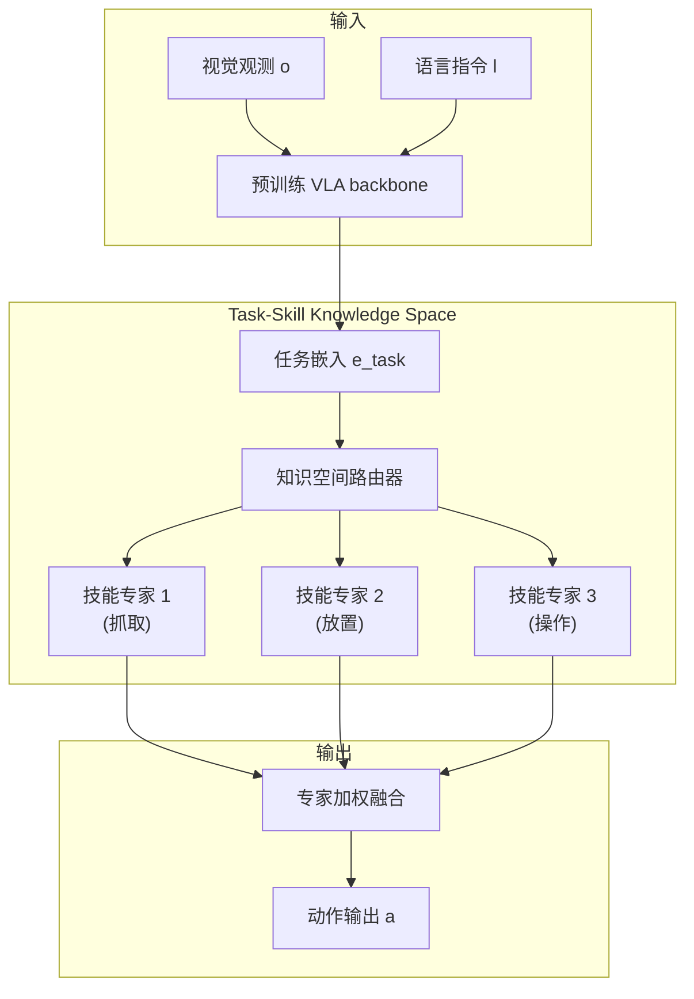
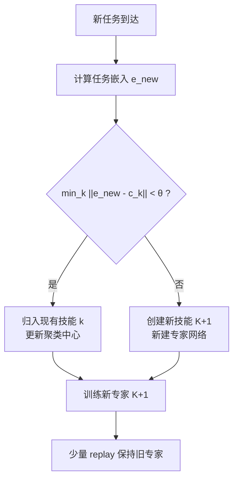
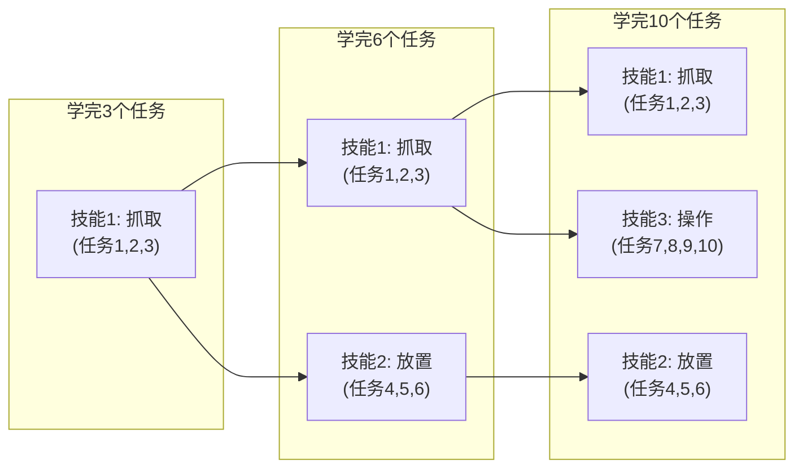

# Stellar VLA：用任务-技能知识图谱实现 VLA 的持续进化

> **论文**: *Continually Evolving Skill Knowledge in Vision Language Action Model* 
> **版本**: arXiv:2511.18085, 2025 
> **一句话**: Stellar VLA 维护一个持续生长的任务-技能知识空间（Task-Skill Knowledge Space），通过语义驱动的专家路由机制实现任务特化，只需 1% 的经验回放即可在新任务到来时不遗忘旧技能。

---

## 相关阅读

| 类型 | 链接 |
|------|------|
| 前置知识 | [动作Token化与自回归策略](/前置知识/000l_前置知识_动作Token化与自回归策略) |
| 前置知识 | [行为克隆与 RL 微调范式](/前置知识/000d_前置知识_行为克隆与RL微调范式) |
| 综述 | [持续/终身 VLA 强化学习综述](./S07_持续终身VLA强化学习综述) |
| 精读 | [MergeVLA：跨技能模型合并](./049_MergeVLA_跨技能模型合并) |

---

## 贯穿全文的例子

> **设定**：一个桌面机器人需要顺序学习 10 个任务：
> - 任务 1-3："抓取"类（抓杯子、抓瓶子、抓盒子）
> - 任务 4-6："放置"类（放入抽屉、放到架子上、放进碗里）
> - 任务 7-10："操作"类（开门、关门、按按钮、旋转旋钮）
>
> 关键洞察：任务 1-3 共享"抓取"技能，任务 4-6 共享"放置"技能。Stellar VLA 会自动发现这种结构，将知识组织为**技能层面**而非任务层面，从而实现更高效的知识复用和保护。

---

## 一、问题：为什么需要"技能"这个抽象层

### 1.1 现有方法的不足

| 方法 | 粒度 | 问题 |
|------|------|------|
| EWC/Replay | 任务级保护 | 不同任务的相似技能被独立处理 |
| Per-task LoRA | 任务级隔离 | 参数随任务数线性增长，无跨任务迁移 |
| [Simple Recipe](./045_SimpleRecipe_VLA天然持续学习者) | 无显式结构 | 30+ 任务后隐式共享可能不够 |

**核心问题**：如果"抓杯子"和"抓瓶子"共享 80% 的底层技能（接近→对准→闭合夹爪），为什么要把它们当完全独立的任务来保护或学习？

### 1.2 任务 vs 技能

$$
\underbrace{\text{Task}}_{\text{完整目标}} = \underbrace{\text{Skill}_1 \circ \text{Skill}_2 \circ \ldots \circ \text{Skill}_m}_{\text{原子技能的组合}}
$$

**数值例子**：
- "把杯子放入抽屉" = 抓取(杯子) → 移动(到抽屉) → 放置(进入抽屉)
- "把瓶子放到架子上" = 抓取(瓶子) → 移动(到架子) → 放置(到架子)

两个任务中，"抓取"和"移动"技能几乎相同，只是参数（目标物体、目标位置）不同。如果能在技能层面做知识管理，就能同时保护共享技能并允许新任务快速复用。

---

## 二、方法架构

### 2.1 整体框架

### 2.2 任务-技能知识空间

知识空间由三个部分组成：

**（1）任务嵌入层**

将每个任务映射为一个语义向量：

$$
e_{\text{task}} = f_{\text{embed}}(o, l) \in \mathbb{R}^d
$$

其中 $f_{\text{embed}}$ 是从 VLA backbone 的中间层提取的特征，$d = 256$。

**数值例子**：
- "抓杯子"的任务嵌入 $e_1 = [0.8, 0.2, 0.1, \ldots]$
- "抓瓶子"的任务嵌入 $e_2 = [0.75, 0.25, 0.12, \ldots]$
- "开门"的任务嵌入 $e_7 = [0.1, 0.1, 0.9, \ldots]$

注意 $e_1$ 和 $e_2$ 很相似（都是抓取），而 $e_7$ 差别很大。

**（2）技能聚类中心**

维护 $K$ 个技能原型（prototype）：

$$
\{c_1, c_2, \ldots, c_K\} \in \mathbb{R}^{K \times d}
$$

这些聚类中心通过在线 k-means 更新。当新任务到来时：
- 如果新任务嵌入接近某个现有聚类 → 归入该技能
- 如果距离所有聚类都很远 → 创建新的技能聚类

$$
\text{assignment}(e_{\text{task}}) = \arg\min_k \|e_{\text{task}} - c_k\|_2
$$

**数值例子**：假设初始 $K=2$，$c_1 = [0.8, 0.2, 0.1]$（抓取中心），$c_2 = [0.1, 0.1, 0.9]$（操作中心）。
- 新任务"抓盒子"嵌入 = $[0.78, 0.22, 0.11]$
- 距离 $c_1$：$\sqrt{0.02^2 + 0.02^2 + 0.01^2} \approx 0.03$ → 很近，归入技能 1
- 距离 $c_2$：$\sqrt{0.68^2 + 0.12^2 + 0.79^2} \approx 1.06$ → 很远

**（3）技能专家网络**

每个技能聚类对应一个轻量级专家（类似 MoE 中的 expert）：

$$
\text{Expert}_k: \mathbb{R}^{d_{\text{hidden}}} \rightarrow \mathbb{R}^{d_{\text{action}}}
$$

在实现上，每个专家是一个 LoRA adapter，rank=8，约占模型参数的 0.1%。

### 2.3 知识引导的专家路由

给定新的观测-指令对 $(o, l)$，路由过程为：

$$
w_k = \text{softmax}\left(\frac{e_{\text{task}} \cdot c_k}{\tau}\right), \quad k = 1, \ldots, K
$$

其中 $\tau = 0.1$ 是温度参数。输出动作为专家的加权平均：

$$
a = \sum_{k=1}^K w_k \cdot \text{Expert}_k(h)
$$

其中 $h$ 是 VLA backbone 的最后一层隐藏状态。

**数值例子**：对"抓杯子"任务：
- $e_{\text{task}} \cdot c_1 = 0.8 \times 0.8 + 0.2 \times 0.2 + 0.1 \times 0.1 = 0.69$
- $e_{\text{task}} \cdot c_2 = 0.8 \times 0.1 + 0.2 \times 0.1 + 0.1 \times 0.9 = 0.19$
- softmax with $\tau=0.1$：$w_1 = \frac{e^{6.9}}{e^{6.9}+e^{1.9}} \approx 0.993$，$w_2 \approx 0.007$

几乎完全路由到专家 1（抓取专家），这正是我们期望的。

### 2.4 知识空间的持续演化

当新任务到来时，知识空间按以下流程更新：

**阈值 $\theta$ 的选择**：论文中使用 $\theta = 0.5$（归一化后的余弦距离）。

---

## 三、训练细节

### 3.1 新任务训练

对归入技能 $k$ 的新任务，只更新：
1. 技能专家 $k$ 的 LoRA 参数
2. 路由器中与技能 $k$ 相关的权重
3. 技能聚类中心 $c_k$（在线 k-means 移动平均）

$$
c_k \leftarrow (1-\alpha) c_k + \alpha \cdot e_{\text{new}}
$$

其中 $\alpha = 0.01$ 是移动平均系数。

**其他专家完全冻结**——这是抗遗忘的核心机制。

### 3.2 Replay 策略

虽然冻结其他专家已经提供了强保护，但路由器的更新仍可能间接影响旧任务。因此保留少量 replay：

$$
|\mathcal{M}_j| = 0.01 \times |\mathcal{D}_j| \quad \text{(1% per task)}
$$

**数值例子**：每个任务 5000 条数据，1% = 50 条。10 个旧任务共 500 条 replay 数据。

Replay 的训练目标不只是 BC loss，还包括**路由一致性约束**：

$$
\mathcal{L}_{\text{route}} = D_{\text{KL}}\left(w^{\text{new}}(o,l) \| w^{\text{old}}(o,l)\right)
$$

确保旧任务的路由权重不因新任务训练而改变。

### 3.3 总训练目标

$$
\mathcal{L}_{\text{total}} = \underbrace{\mathcal{L}_{\text{BC}}^{\text{new}}}_{\text{新任务BC}} + \lambda_1 \underbrace{\mathcal{L}_{\text{BC}}^{\text{replay}}}_{\text{旧任务保持}} + \lambda_2 \underbrace{\mathcal{L}_{\text{route}}}_{\text{路由一致性}}
$$

其中 $\lambda_1 = 0.5$，$\lambda_2 = 0.1$。

---

## 四、实验结果

### 4.1 主要对比

| 方法 | Final AVG ↑ | NBT ↓ | 额外参数 | Replay |
|------|------------|-------|---------|--------|
| Sequential FT | 58.3% | -28.4% | 0 | 0 |
| EWC | 72.1% | -11.2% | Fisher | 0 |
| Simple Replay (2%) | 81.5% | -5.8% | 0 | 2% |
| Per-task LoRA | 85.2% | -2.1% | K×LoRA | 0 |
| **Stellar VLA** | **87.8%** | **-1.5%** | 自适应专家 | **1%** |
| Multi-task Oracle | 91.0% | 0 | 0 | 100% |

### 4.2 与 Per-task LoRA 的关键差异

Per-task LoRA 为每个任务分配独立 adapter——虽然不遗忘，但：
1. 参数量随任务数线性增长（10 任务 = 10 个 LoRA）
2. 推理时需要知道当前是哪个任务才能选择正确 adapter
3. 没有跨任务正迁移（"抓杯子"的经验不帮助"抓瓶子"）

Stellar VLA 的优势：
1. 参数量随**技能数**增长，不随任务数（10 任务可能只有 3 个技能）
2. 路由器自动判断使用哪个专家
3. 同一技能专家服务多个任务 → 天然实现正迁移

**数值例子**：10 个任务但只有 3 个技能族：
- Per-task LoRA：10 × rank16 参数 = 10 × 70M = 700M 额外参数
- Stellar VLA：3 × rank8 专家 + 路由器 = 3 × 35M + 1M ≈ 106M 额外参数

### 4.3 Forward Transfer 验证

| 学习到第 N 个任务 | 任务 N 的初始成功率（训练前） |
|---------|------|
| N=1 (抓杯子) | 28% (仅预训练) |
| N=2 (抓瓶子) | 45% (复用抓取专家!) |
| N=3 (抓盒子) | 52% (进一步复用) |
| N=4 (放入抽屉) | 30% (新技能，不复用) |

当新任务被路由到已有技能时，该技能专家已经学会了基础能力，新任务只需少量样本即可达到高性能——这就是正迁移。

---

## 五、知识空间的可视化

### 5.1 技能聚类的动态演化

### 5.2 路由权重矩阵

学完 10 个任务后的路由矩阵 $W \in \mathbb{R}^{10 \times 3}$：

| 任务 | 抓取专家 | 放置专家 | 操作专家 |
|------|---------|---------|---------|
| 1-抓杯子 | **0.95** | 0.03 | 0.02 |
| 2-抓瓶子 | **0.93** | 0.05 | 0.02 |
| 3-抓盒子 | **0.91** | 0.06 | 0.03 |
| 4-放入抽屉 | 0.15 | **0.80** | 0.05 |
| 5-放到架子 | 0.12 | **0.83** | 0.05 |
| 6-放进碗 | 0.18 | **0.77** | 0.05 |
| 7-开门 | 0.05 | 0.08 | **0.87** |
| 8-关门 | 0.04 | 0.07 | **0.89** |
| 9-按按钮 | 0.03 | 0.05 | **0.92** |
| 10-旋转旋钮 | 0.06 | 0.04 | **0.90** |

对角结构非常清晰：每个任务主要激活对应技能的专家。

---

## 六、局限性与讨论

### 6.1 技能数 K 的增长

当任务足够多样时，技能数会持续增长。如果 100 个任务产生 30 个技能：
- 30 个 LoRA 专家 ≈ 30 × 35M = 1.05B 额外参数
- 推理时需要计算与所有 30 个聚类中心的距离

相比之下，[MergeVLA](./049_MergeVLA_跨技能模型合并) 通过稀疏激活解决了推理开销问题。

### 6.2 技能边界的模糊性

有些任务可能跨越多个技能（如"抓起杯子后打开抽屉放入"需要抓取+操作+放置）。当前的 softmax 路由允许混合使用多个专家，但无法处理**序列性技能组合**。

### 6.3 与 Simple Recipe 的互补

[Simple Recipe](./045_SimpleRecipe_VLA天然持续学习者) 证明了在 30 个相对同质的任务中，不需要显式结构就能抗遗忘。Stellar VLA 更适合的场景是：

- 任务之间有明确的技能共享结构
- 需要 forward transfer（新任务复用旧技能）
- 任务域差异较大，单个 LoRA 难以覆盖

---

## 七、总结

| 贡献 | 意义 |
|------|------|
| 引入 Task-Skill Knowledge Space | 在任务和参数之间加入"技能"中间层 |
| 知识引导的专家路由 | 自动发现和复用技能结构 |
| 仅 1% replay 实现低遗忘 | 比纯 replay 方法更结构化 |
| 正迁移验证 | 新任务可直接受益于旧技能 |

**核心洞察**：持续学习不应该在"任务"粒度做保护——应该在"技能"粒度做。多个任务可能共享技能，保护技能比保护任务更高效、更有利于正迁移。

---

## 延伸阅读

- [MergeVLA：跨技能模型合并](./049_MergeVLA_跨技能模型合并)：另一种处理多技能 VLA 的方案
- [Simple Recipe Works：VLA 天然持续学习者](./045_SimpleRecipe_VLA天然持续学习者)：更简单的无结构方案
- [Forget Me Not：预训练 VLA 抗遗忘](./046_ForgetMeNot_预训练VLA抗遗忘)：纯 replay 的极限在哪里
- [持续/终身 VLA RL 综述](./S07_持续终身VLA强化学习综述)：系统对比所有方案
