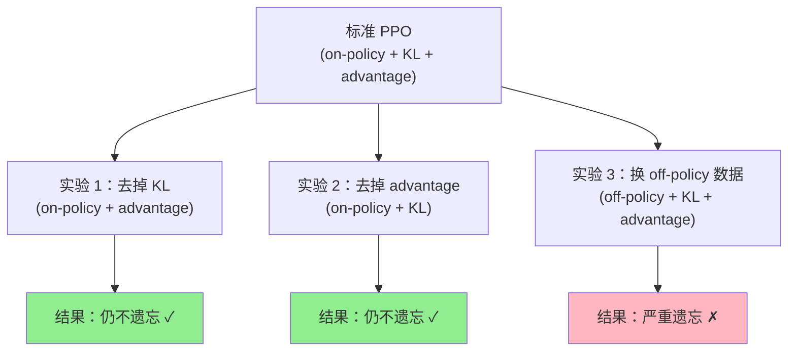
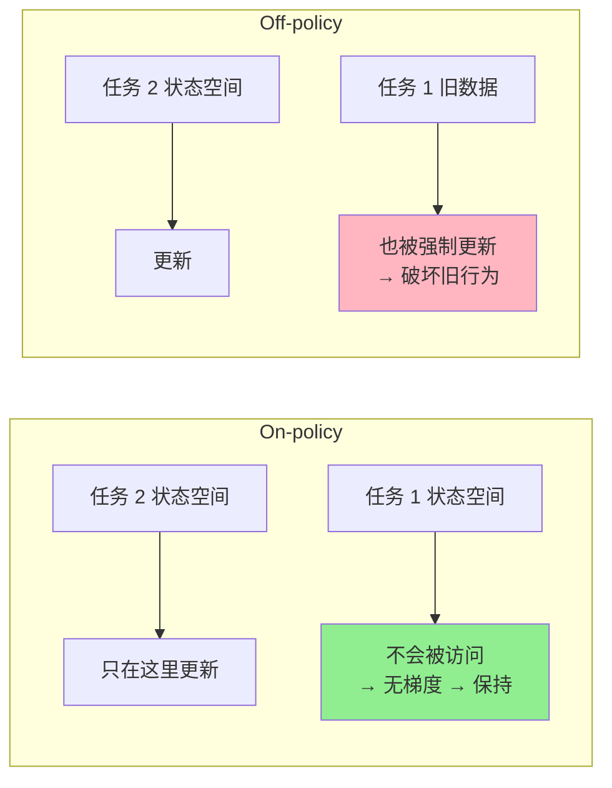
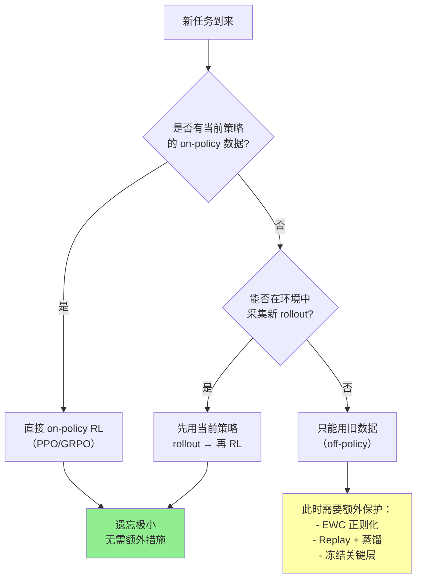

# Retaining by Doing：On-policy 数据是防止遗忘的关键因素

> **论文**: *Retaining by Doing: On-policy Data is Key to Catastrophic Forgetting in RL* 
> **版本**: arXiv:2510.18874, 2025 
> **一句话**: 通过精心设计的受控实验，逐一拆解 on-policy RL 中的三个因素（数据分布、KL penalty、advantage 形式），发现 **on-policy 数据本身**才是防止遗忘的真正原因——不是 KL 惩罚，也不是 advantage 加权。用 off-policy 数据训练时，即使加 KL penalty 也会遗忘。

---

## 相关阅读

| 类型 | 链接 |
|------|------|
| 前置知识 | [策略梯度与 PPO](/前置知识/000a_前置知识_策略梯度与PPO) |
| 前置知识 | [KL 散度与策略约束](/前置知识/000j_前置知识_KL散度与策略约束) |
| 前置知识 | [Replay Buffer（经验回放）](/前置知识/000r_前置知识_Replay_Buffer_经验回放) |
| 精读 | [RL's Razor：在线RL为什么不遗忘](./047_RLsRazor_在线RL为什么不遗忘) |
| 精读 | [Simple Recipe：VLA天然持续学习者](./045_SimpleRecipe_VLA天然持续学习者) |
| 综述 | [持续/终身 VLA 强化学习综述](./S07_持续终身VLA强化学习综述) |

---

## 贯穿全文的例子

> **设定**：一个 VLA 模型 $\pi_\theta$，依次学习三个机器人操作任务：
> - 任务 1：推红色方块到目标位置（已学好，成功率 95%）
> - 任务 2：打开抽屉（当前正在学）
> - 任务 3：旋转水龙头（未来要学）
>
> 问题：学任务 2 时，任务 1 的成功率从 95% 降到了多少？
>
> 本文的核心发现：关键不在于你用什么算法（PPO or REINFORCE）、加不加 KL 惩罚，而在于**你用什么数据来更新策略**。如果用任务 2 的 on-policy 数据（当前策略自己采集的），任务 1 几乎不受影响；如果用存储在 [Replay Buffer](/前置知识/000r_前置知识_Replay_Buffer_经验回放) 中的旧数据（off-policy），任务 1 就会遗忘。

---

## 一、核心问题：On-policy RL 为什么不遗忘

### 1.1 已知现象

多项实证研究（[Simple Recipe](./045_SimpleRecipe_VLA天然持续学习者)、[RL's Razor](./047_RLsRazor_在线RL为什么不遗忘)）一致观察到：

$$
\text{Forgetting}_{\text{on-policy RL}} \ll \text{Forgetting}_{\text{SFT}} \ll \text{Forgetting}_{\text{off-policy RL}}
$$

但 on-policy RL（如 PPO/GRPO）包含多个可能贡献防遗忘的因素：

1. **On-policy 数据分布**：训练数据来自当前策略自己的 rollout
2. **KL 正则化/clip**：PPO 的 clip 或显式 KL penalty 限制更新步长
3. **Advantage 加权**：只朝"好于平均"的方向更新

到底哪个因素才是关键？之前的工作无法区分，因为这三者总是同时出现。

### 1.2 本文的方法论贡献

设计了**因素分离实验（Ablation by Isolation）**：构造人工算法变体，每次只保留一个因素、控制其他两个：

---

## 二、实验设计：分离三个因素

### 2.1 因素一：On-policy 数据分布

On-policy 意味着用于计算梯度的轨迹来自当前策略 $\pi_\theta$：

$$
\nabla_\theta J = \mathbb{E}_{\tau \sim \pi_\theta}\left[\sum_t \nabla_\theta \log \pi_\theta(a_t|s_t) \cdot A^{\pi_\theta}(s_t, a_t)\right]
$$

Off-policy 则用旧策略 $\pi_{\text{old}}$ 的数据加重要性采样：

$$
\nabla_\theta J_{\text{off}} = \mathbb{E}_{\tau \sim \pi_{\text{old}}}\left[\sum_t \frac{\pi_\theta(a_t|s_t)}{\pi_{\text{old}}(a_t|s_t)} \nabla_\theta \log \pi_\theta(a_t|s_t) \cdot A(s_t, a_t)\right]
$$

**关键区别**：on-policy 时状态分布 $d^{\pi_\theta}$ 随策略一起变化；off-policy 时状态分布是固定的 $d^{\pi_{\text{old}}}$。

### 2.2 因素二：KL 约束

PPO 的 clip 机制本质上限制了单步策略更新的幅度：

$$
L^{\text{CLIP}} = \mathbb{E}\left[\min\left(r_t A_t, \text{clip}(r_t, 1-\epsilon, 1+\epsilon) A_t\right)\right]
$$

其中 $r_t = \pi_\theta(a_t|s_t) / \pi_{\theta_{\text{old}}}(a_t|s_t)$，$\epsilon = 0.2$。

也可以用显式 KL penalty 替代：

$$
J_{\text{KL}} = J(\pi) - \beta \cdot D_{\text{KL}}(\pi_\theta \| \pi_{\text{ref}})
$$

### 2.3 因素三：Advantage 加权

Advantage $A(s,a) = Q(s,a) - V(s)$ 只对"好于基线"的动作产生正梯度。与之对比的是 SFT 式更新——对所有示教动作等权更新，不管它是否比平均好。

### 2.4 受控实验的六种配置

| 编号 | 数据 | KL 约束 | Advantage | 遗忘程度 |
|------|------|---------|-----------|----------|
| 1 | On-policy | ✓ clip | ✓ | 低（-2.1%） |
| 2 | On-policy | ✗ 无 | ✓ | 低（-2.8%） |
| 3 | On-policy | ✓ clip | ✗ 均匀权重 | 低（-3.5%） |
| 4 | Off-policy | ✓ clip | ✓ | 高（-14.7%） |
| 5 | Off-policy | ✓ KL penalty ($\beta=0.1$) | ✓ | 高（-11.2%） |
| 6 | Off-policy | ✗ 无 | ✓ | 极高（-18.3%） |

**结论清晰可见**：
- 去掉 KL（#2 vs #1）：遗忘几乎没变 → KL 不是关键
- 去掉 advantage（#3 vs #1）：遗忘几乎没变 → advantage 不是关键
- 换成 off-policy 数据（#4 vs #1）：遗忘暴增 7 倍 → **数据分布是关键**
- Off-policy + KL penalty（#5）：仍然遗忘 → KL 惩罚无法补救 off-policy 的遗忘

---

## 三、为什么 On-policy 数据防止遗忘

### 3.1 状态分布自适应

On-policy 训练中，策略只能访问**当前策略自然会到达的状态**：

$$
s \sim d^{\pi_\theta}(s) = (1-\gamma)\sum_{t=0}^\infty \gamma^t P(s_t = s | \pi_\theta)
$$

如果当前策略对旧任务（推红色方块）仍有高成功率，那它在旧任务环境中的状态分布就和训练时几乎一样。此时梯度更新不会"破坏"旧行为——因为在旧任务状态上，策略的 advantage ≈ 0（已经很好了），几乎不产生梯度。

### 3.2 Off-policy 数据为什么有害

Off-policy 数据来自旧策略或其他策略的 rollout。这些数据中的状态-动作对可能：

1. 对应当前策略**不会自然访问**的状态区域
2. 在这些区域产生的梯度会把策略**推离**旧任务好的区域

**数值例子**：

假设旧策略 $\pi_{\text{old}}$ 在某状态 $s_7$ 选择动作 $a_3$ 的概率是 0.8，当前策略 $\pi_\theta$ 在同一状态选择 $a_3$ 的概率是 0.3。

重要性权重：$w = 0.3 / 0.8 = 0.375$

这个 off-policy 数据点对参数更新的贡献：

$$
\Delta\theta \propto w \cdot A(s_7, a_3) \cdot \nabla_\theta \log \pi_\theta(a_3 | s_7) = 0.375 \cdot A \cdot \nabla \log \pi
$$

问题是：$s_7$ 可能是当前策略**根本不会到达**的状态（因为在更早的时间步就走了不同路径）。在这种"幻影状态"上强行更新策略，可能破坏在实际会访问的状态上的行为。

### 3.3 隐式状态空间隔离

On-policy 训练有一个隐式的"安全机制"：

$$
\text{实际梯度} = \sum_{s \in \text{当前策略会访问的状态}} \text{梯度贡献}(s)
$$

如果新任务（开抽屉）的状态空间和旧任务（推方块）的状态空间**不重叠**，那么学新任务时：
- 只在"开抽屉"相关状态上产生梯度
- "推方块"相关状态上的策略完全不受影响
- 自然实现了任务间的隔离

**这就是"Retaining by Doing"（通过做来保持）的含义**：只要你在"做"当前任务（on-policy），就不会干扰到其他任务的已学行为。

---

## 四、理论分析

### 4.1 形式化：梯度对旧任务的干扰

定义"任务 $k$ 的干扰"为学习任务 $j$ 时对任务 $k$ 性能的影响：

$$
\text{Interference}(k, j) = \nabla_\theta J_k(\theta)^\top \cdot \nabla_\theta J_j(\theta)
$$

如果内积为负——两个梯度方向冲突——就会遗忘。

### 4.2 On-policy 梯度的正交性

对 on-policy 数据，当任务 $k$ 和 $j$ 的状态空间不重叠时：

$$
\nabla_\theta J_k = \mathbb{E}_{s \sim d_k^{\pi}}\left[...\right], \quad \nabla_\theta J_j = \mathbb{E}_{s \sim d_j^{\pi}}\left[...\right]
$$

如果 $d_k^{\pi}$ 和 $d_j^{\pi}$ 的支撑集不相交，则在函数空间中梯度近似正交：

$$
\nabla_\theta J_k^\top \cdot \nabla_\theta J_j \approx 0
$$

这不要求参数空间正交——只要状态空间分离就够。

**代入数字**：

假设任务 1（推方块）的梯度主要作用于网络参数中的 $\theta_{50:100}$（因为只在推方块的观测上有信号），任务 2（开抽屉）的梯度主要作用于 $\theta_{100:150}$。那么：

$$
\nabla J_1 = [0,...,0, g_{50},...,g_{100}, 0,...,0]
$$
$$
\nabla J_2 = [0,...,0, 0,...,0, h_{100},...,h_{150}, 0,...,0]
$$
$$
\nabla J_1^\top \nabla J_2 = 0 \quad \text{(完全正交)}
$$

### 4.3 Off-policy 打破正交性

Off-policy 数据强制在任务 1 的旧状态上也产生梯度。此时：

$$
\nabla_\theta J_j^{\text{off}} = \mathbb{E}_{s \sim d_{\text{buffer}}}\left[...\right]
$$

$d_{\text{buffer}}$ 包含所有旧任务的状态，因此梯度不再局限于新任务的状态空间，正交性被破坏。

### 4.4 KL penalty 为什么救不了 off-policy

加入 KL penalty 后的目标：

$$
J_{\text{KL-off}} = \mathbb{E}_{s \sim d_{\text{buffer}}}\left[A(s,a)\right] - \beta \cdot D_{\text{KL}}(\pi_\theta \| \pi_{\text{ref}})
$$

KL penalty 限制了策略在**整体分布**上的偏移，但无法区分"在哪些状态上偏移是安全的"。它对所有状态施加相同的约束——这对不同任务的状态一视同仁，既限制了有害偏移（好事），也限制了必要的新任务学习（坏事）。

更关键的是，off-policy 数据中的重要性采样引入了高方差：

$$
\text{Var}\left[\frac{\pi_\theta(a|s)}{\pi_{\text{old}}(a|s)} A(s,a)\right] \gg \text{Var}\left[A(s,a)\right]
$$

高方差梯度即使配上 KL penalty，也会导致参数在随机方向上震荡，间接破坏旧行为。

---

## 五、实证验证

### 5.1 实验环境

- 基础环境：Meta-World 10 个操作任务，顺序学习
- 模型：7B VLA + LoRA (rank=16)
- 指标：
  - **FWT（Forward Transfer）**：学新任务时的初始能力
  - **BWT（Backward Transfer / Forgetting）**：学新任务后旧任务成功率的下降

### 5.2 主要结果

| 方法 | 平均新任务成功率 | 平均 BWT（遗忘） | 最大单任务遗忘 |
|------|----------------|-----------------|--------------|
| On-policy PPO | 89.2% | -2.1% | -5.3% |
| On-policy GRPO | 90.1% | -1.8% | -4.7% |
| On-policy (无 KL) | 87.5% | -2.8% | -6.1% |
| On-policy (无 advantage) | 85.3% | -3.5% | -7.2% |
| Off-policy (有 KL, $\beta$=0.01) | 86.7% | -14.7% | -28.3% |
| Off-policy (有 KL, $\beta$=0.1) | 82.1% | -11.2% | -22.6% |
| Off-policy (无 KL) | 84.5% | -18.3% | -35.1% |
| SFT | 91.5% | -12.3% | -25.8% |

### 5.3 关键发现总结

1. **On-policy 数据是防遗忘的充分条件**：即使去掉 KL 和 advantage，遗忘仍然很小
2. **KL penalty 是必要但不充分的**：有 KL 时 off-policy 稍好（-11.2% vs -18.3%），但远不如 on-policy（-2.1%）
3. **Off-policy + 强 KL 会牺牲新任务学习**：$\beta=0.1$ 时新任务成功率下降到 82%
4. **SFT 的遗忘模式与 off-policy RL 类似**：SFT 本质上也是 off-policy（数据来自专家，不来自当前策略）

### 5.4 KL 随训练步数的变化

实验还跟踪了 $D_{\text{KL}}(\pi_\theta \| \pi_{\text{ref}})$ 在训练过程中的变化：

| 训练步数 | On-policy KL | Off-policy KL | Off-policy+KL penalty |
|----------|-------------|---------------|----------------------|
| 0 | 0 | 0 | 0 |
| 500 | 0.3 | 1.2 | 0.8 |
| 1000 | 0.5 | 2.8 | 1.5 |
| 2000 | 0.6 | 4.5 | 2.1 |
| 5000 | 0.7 (饱和) | 7.2 (持续增长) | 2.8 (缓慢增长) |

**观察**：On-policy 的 KL 自然饱和（任务解决后 advantage → 0），而 off-policy 的 KL 持续增长（因为一直在非当前策略访问的状态上更新）。

---

## 六、对持续 VLA 训练的指导

### 6.1 设计原则

基于本文的发现，持续 VLA 训练应遵循：

### 6.2 何时需要额外保护

On-policy 训练的前提是**能和环境交互**。在以下场景无法满足这一前提：
- 真实机器人维护期间（无法 rollout）
- 旧任务环境已不可用
- 模拟器不支持旧任务

此时必须依赖 off-policy 数据，就需要额外的防遗忘措施。本文建议：
- 与其用 KL penalty（效果有限），不如用 [Dark Experience Replay](./052_DarkExperienceReplay_暗经验回放)（存 logits 并蒸馏）
- 或者用 [EWC](/前置知识/000w_前置知识_EWC弹性权重巩固) 保护关键参数

### 6.3 与 RL's Razor 的关系

[RL's Razor](./047_RLsRazor_在线RL为什么不遗忘) 从"隐式 KL 最小化"角度解释 on-policy RL 不遗忘。本文从"数据分布"角度给出了互补解释：

| 视角 | RL's Razor | Retaining by Doing (本文) |
|------|-----------|--------------------------|
| 核心机制 | 策略路径选择最近可行解 | 梯度只作用于当前状态 |
| 解释层面 | 优化几何 | 数据分布 |
| 可操作性 | 用 on-policy + 早停 | 避免 off-policy 数据 |
| 局限 | 假设凸可行集 | 假设状态空间可分 |

两者不矛盾，是同一现象的不同视角。

---

## 七、与 Replay Buffer 的微妙关系

### 7.1 Replay ≠ Off-policy

一个常见误解：[经验回放](/前置知识/000r_前置知识_Replay_Buffer_经验回放) 就是 off-policy，所以一定会遗忘。

**实际更细致**：
- 如果 replay 中的数据来自**近期策略**（策略差异很小），效果接近 on-policy
- 如果 replay 中的数据来自**很久以前的策略**（策略差异大），则是真正的 off-policy

### 7.2 安全使用 Replay 的条件

$$
\text{安全条件}: D_{\text{KL}}(\pi_{\text{replay}} \| \pi_{\text{current}}) < \delta
$$

实验发现，当 replay 数据与当前策略的 KL 散度 < 0.5 nats 时，遗忘仍然可控（< 5%）。超过这个阈值后遗忘急剧增加。

**实践建议**：
- 定期刷新 replay buffer（每 N 步用当前策略重新采集）
- 或者只回放最近 K 步内的数据

---

## 八、总结

| 贡献 | 意义 |
|------|------|
| 因素分离实验设计 | 首次干净地区分数据分布、KL、advantage 的贡献 |
| 证明 on-policy 数据是关键 | 给出明确的设计指导：优先保证 on-policy |
| 证明 KL penalty 不够 | 挑战了"加 KL 就能防遗忘"的常见假设 |
| 对 replay 的重新审视 | 不是所有 replay 都有害，关键看新旧策略差异 |

**核心信息**：防遗忘的关键不是"约束策略变化幅度"（KL penalty），而是"只在相关状态上更新策略"（on-policy 数据）。这是一个数据分布的问题，不是优化器的问题。

---

## 延伸阅读

- [RL's Razor：在线 RL 为什么不遗忘](./047_RLsRazor_在线RL为什么不遗忘)：从优化几何的互补视角
- [Simple Recipe：VLA 天然持续学习者](./045_SimpleRecipe_VLA天然持续学习者)：on-policy 训练在实践中的验证
- [Dark Experience Replay](./052_DarkExperienceReplay_暗经验回放)：当不得不用 off-policy 数据时的最佳方案
- [KL 散度与策略约束](/前置知识/000j_前置知识_KL散度与策略约束)：理解 KL penalty 的数学含义
- [Replay Buffer](/前置知识/000r_前置知识_Replay_Buffer_经验回放)：经验回放的基础机制
