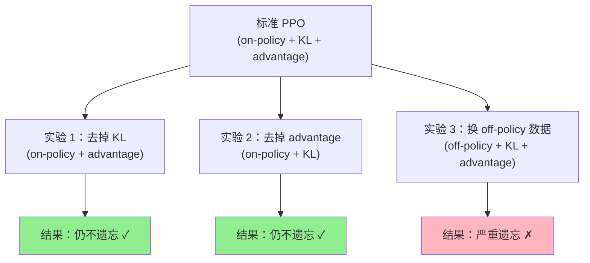
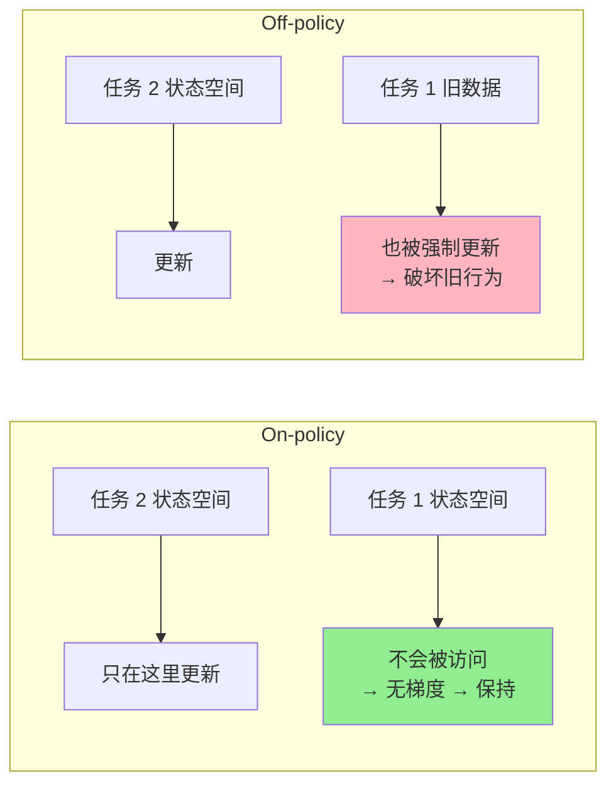
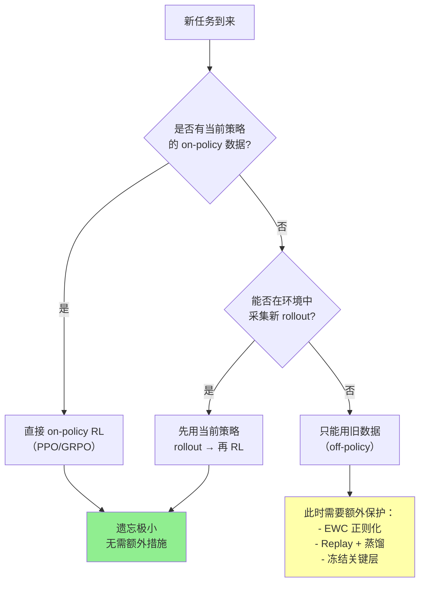

# Retaining by Doing：On-policy 数据是防止遗忘的关键因素

> **论文**: *Retaining by Doing: On-policy Data is Key to Catastrophic Forgetting in RL* 
> **版本**: arXiv:2510.18874, 2025 
> **一句话**: 通过精心设计的受控实验，逐一拆解 on-policy RL 中的三个因素（数据分布、KL penalty、advantage 形式），发现 **on-policy 数据本身**才是防止遗忘的真正原因——不是 KL 惩罚，也不是 advantage 加权。用 off-policy 数据训练时，即使加 KL penalty 也会遗忘。

---

## 相关阅读

| 类型 | 链接 |
|------|------|
| 前置知识 | [策略梯度与 PPO](/前置知识/000a_前置知识_策略梯度与PPO) |
| 前置知识 | [KL 散度与策略约束](/前置知识/000j_前置知识_KL散度与策略约束) |
| 前置知识 | [Replay Buffer（经验回放）](/前置知识/000r_前置知识_Replay_Buffer_经验回放) |
| 精读 | [RL's Razor：在线RL为什么不遗忘](./047_RLsRazor_在线RL为什么不遗忘) |
| 精读 | [Simple Recipe：VLA天然持续学习者](./045_SimpleRecipe_VLA天然持续学习者) |
| 综述 | [持续/终身 VLA 强化学习综述](./S07_持续终身VLA强化学习综述) |

---

## 贯穿全文的例子

> **设定**：一个 VLA 模型 $\pi_\theta$，依次学习三个机器人操作任务：
> - 任务 1：推红色方块到目标位置（已学好，成功率 95%）
> - 任务 2：打开抽屉（当前正在学）
> - 任务 3：旋转水龙头（未来要学）
>
> 问题：学任务 2 时，任务 1 的成功率从 95% 降到了多少？
>
> 本文的核心发现：关键不在于你用什么算法（PPO or REINFORCE）、加不加 KL 惩罚，而在于**你用什么数据来更新策略**。如果用任务 2 的 on-policy 数据（当前策略自己采集的），任务 1 几乎不受影响；如果用存储在 [Replay Buffer](/前置知识/000r_前置知识_Replay_Buffer_经验回放) 中的旧数据（off-policy），任务 1 就会遗忘。

---

## 一、核心问题：On-policy RL 为什么不遗忘

### 1.1 已知现象

多项实证研究（[Simple Recipe](./045_SimpleRecipe_VLA天然持续学习者)、[RL's Razor](./047_RLsRazor_在线RL为什么不遗忘)）一致观察到：

$$
\text{Forgetting}_{\text{on-policy RL}} \ll \text{Forgetting}_{\text{SFT}} \ll \text{Forgetting}_{\text{off-policy RL}}
$$

**这个公式在做什么**：给出三种训练方式的遗忘程度排名——on-policy RL 遗忘最少，SFT 中等，off-policy RL 遗忘最严重。

::: details 📐 公式详解（点击展开）

| 子表达式 | 它是谁 | 它在干嘛 |
|---------|--------|---------|
| $\text{Forgetting}_{\text{on-policy RL}}$ | **模范生** | 用当前策略自己采集的数据训练，旧任务性能几乎不掉 |
| $\text{Forgetting}_{\text{SFT}}$ | **中等生** | 用固定的示教数据做监督微调，遗忘程度居中 |
| $\text{Forgetting}_{\text{off-policy RL}}$ | **问题生** | 用旧策略/其他策略采集的数据训练，遗忘最严重 |
| $\ll$ | **量级远小于** | 不是"差一点"，是数量级上的明显差距 |

**用人话读**："用自己刚采的数据训练几乎不遗忘，用示教数据训练遗忘一些，用别人/旧策略采的数据训练遗忘最严重。"

**为什么是这个形式**：这是对已有实证研究结果的总结陈述，作为全文要解释的核心现象——本文接下来的所有实验都在回答"为什么会有这个排序"。
:::

但 on-policy RL（如 PPO/GRPO）包含多个可能贡献防遗忘的因素：

1. **On-policy 数据分布**：训练数据来自当前策略自己的 rollout
2. **KL 正则化/clip**：PPO 的 clip 或显式 KL penalty 限制更新步长
3. **Advantage 加权**：只朝"好于平均"的方向更新

到底哪个因素才是关键？之前的工作无法区分，因为这三者总是同时出现。

### 1.2 本文的方法论贡献

设计了**因素分离实验（Ablation by Isolation）**：构造人工算法变体，每次只保留一个因素、控制其他两个：

```mermaid
flowchart TB
    A["标准 PPO\n(on-policy + KL + advantage)"] --> B["实验 1：去掉 KL\n(on-policy + advantage)"]
    A --> C["实验 2：去掉 advantage\n(on-policy + KL)"]
    A --> D["实验 3：换 off-policy 数据\n(off-policy + KL + advantage)"]
    B --> E["结果：仍不遗忘 ✓"]
    C --> F["结果：仍不遗忘 ✓"]
    D --> G["结果：严重遗忘 ✗"]
    style G fill:#FFB6C1
    style E fill:#90EE90
    style F fill:#90EE90
```

---

## 二、实验设计：分离三个因素

### 2.1 因素一：On-policy 数据分布

On-policy 意味着用于计算梯度的轨迹来自当前策略 $\pi_\theta$：

$$
\nabla_\theta J = \mathbb{E}_{\tau \sim \pi_\theta}\left[\sum_t \nabla_\theta \log \pi_\theta(a_t|s_t) \cdot A^{\pi_\theta}(s_t, a_t)\right]
$$

**这个公式在做什么**：这是标准的 [策略梯度](/前置知识/000a_前置知识_策略梯度与PPO) 公式——用当前策略自己跑出来的轨迹，算出参数该往哪调。

::: details 📐 公式详解（点击展开）

| 子表达式 | 它是谁 | 它在干嘛 |
|---------|--------|---------|
| $\tau \sim \pi_\theta$ | **自产自销的数据** | 轨迹是用当前策略 $\pi_\theta$ 亲自跑出来的，不是用别的策略采的 |
| $\nabla_\theta \log \pi_\theta(a_t\|s_t)$ | **调整方向** | 让这个动作在这个状态下概率增大的参数调整方向 |
| $A^{\pi_\theta}(s_t, a_t)$ | **好坏打分** | 这个动作比当前策略在该状态的平均水平好多少 |
| $\sum_t$ | **逐步累加** | 把轨迹里每一步的贡献加总 |

**用人话读**："用当前策略自己跑出来的数据，算出每一步动作的好坏分，按这个分数调整参数——这是最标准的 on-policy 策略梯度。"

**为什么是这个形式**：因为数据是当前策略自己产生的，不需要任何修正项（重要性权重），这是 on-policy 方法最干净的形式，也是本文要论证的"防遗忘功臣"。
:::

Off-policy 则用旧策略 $\pi_{\text{old}}$ 的数据加重要性采样：

$$
\nabla_\theta J_{\text{off}} = \mathbb{E}_{\tau \sim \pi_{\text{old}}}\left[\sum_t \frac{\pi_\theta(a_t|s_t)}{\pi_{\text{old}}(a_t|s_t)} \nabla_\theta \log \pi_\theta(a_t|s_t) \cdot A(s_t, a_t)\right]
$$

**这个公式在做什么**：数据不是当前策略采的，而是旧策略 $\pi_{\text{old}}$ 采的，所以要用重要性采样比例做修正，才能让梯度估计仍然对应"当前策略"这个目标。

::: details 📐 公式详解（点击展开）

| 子表达式 | 它是谁 | 它在干嘛 |
|---------|--------|---------|
| $\tau \sim \pi_{\text{old}}$ | **别人（旧策略）采的数据** | 轨迹不是当前策略产生的，可能是很久之前的策略，或存在 buffer 里的历史数据 |
| $\frac{\pi_\theta(a_t\|s_t)}{\pi_{\text{old}}(a_t\|s_t)}$ | **重要性权重** | 修正"用旧策略采样却要评估当前策略"带来的分布偏差 |
| $\nabla_\theta \log \pi_\theta(a_t\|s_t) \cdot A(s_t,a_t)$ | **和 on-policy 一样的核心项** | 结构上和上一个公式的调整方向、打分完全相同 |

**用人话读**："数据是旧策略采的，所以每一步梯度都要乘一个'新旧策略喜好这个动作的比值'来修正，其余部分和 on-policy 一样。"

**为什么是这个形式**：重要性采样是唯一能让"用分布 A 采样的数据"去估计"分布 B 下的期望"保持无偏的数学工具，但代价是权重比值可能剧烈波动（详见 3.4 节的方差分析）。
:::

**关键区别**：on-policy 时状态分布 $d^{\pi_\theta}$ 随策略一起变化；off-policy 时状态分布是固定的 $d^{\pi_{\text{old}}}$。

### 2.2 因素二：KL 约束

PPO 的 clip 机制本质上限制了单步策略更新的幅度：

$$
L^{\text{CLIP}} = \mathbb{E}\left[\min\left(r_t A_t, \text{clip}(r_t, 1-\epsilon, 1+\epsilon) A_t\right)\right]
$$

**这个公式在做什么**：这是 [PPO 的 clip 目标](/前置知识/000a_前置知识_策略梯度与PPO)——用一个安全上限限制单步策略更新的幅度，防止一次更新走太远。

::: details 📐 公式详解（点击展开）

| 子表达式 | 它是谁 | 它在干嘛 |
|---------|--------|---------|
| $r_t A_t$ | **不限速收益** | 新旧策略概率比乘以优势分，不加任何限制的更新目标 |
| $\text{clip}(r_t, 1-\epsilon, 1+\epsilon) A_t$ | **限速收益** | 把概率比强行卡在 $[0.8, 1.2]$ 区间内再乘优势分 |
| $\min(\cdot,\cdot)$ | **保守裁判** | 两个版本取较小值，确保更新幅度不会失控 |
| $\mathbb{E}[\cdot]$ | **batch 平均** | 对采样到的一批状态动作对取平均 |

**用人话读**："算出新旧策略对这个动作喜好程度的比值，乘以动作的好坏分，但比值超出安全区间就不再给额外奖励。"

**为什么是这个形式**：clip 是 TRPO 的 KL 硬约束的廉价替代品，本文用它作为"限制更新步长"这一因素的代表，检验它是否是防遗忘的关键。
:::

其中 $r_t = \pi_\theta(a_t|s_t) / \pi_{\theta_{\text{old}}}(a_t|s_t)$，$\epsilon = 0.2$。

也可以用显式 KL penalty 替代：

$$
J_{\text{KL}} = J(\pi) - \beta \cdot D_{\text{KL}}(\pi_\theta \| \pi_{\text{ref}})
$$

**这个公式在做什么**：把"策略变好"和"策略别离参考策略太远"两个目标合并成一个总目标，用 $\beta$ 控制两者的权衡。

::: details 📐 公式详解（点击展开）

| 子表达式 | 它是谁 | 它在干嘛 |
|---------|--------|---------|
| $J(\pi)$ | **主目标** | 策略本身要最大化的期望回报 |
| $D_{\text{KL}}(\pi_\theta \| \pi_{\text{ref}})$ | **偏移量表** | 当前策略和参考策略（通常是训练前的策略）之间差多远 |
| $\beta$ | **惩罚力度旋钮** | 越大越限制策略偏离参考策略，越小越自由 |
| $J(\pi) - \beta \cdot D_{\text{KL}}(\cdot)$ | **折中后的目标** | 既想让回报变高，又不想离参考策略太远 |

**用人话读**："在最大化回报的同时，额外扣掉一项'和参考策略差多远'的惩罚，惩罚力度由 $\beta$ 控制。"

**为什么是这个形式**：这是 clip 机制的显式替代方案，用一个连续的惩罚项代替硬性截断，本文用它作为"KL 约束"这一因素的另一种实现方式，纳入受控实验对比（见 2.4 节表格中的配置 5）。
:::

### 2.3 因素三：Advantage 加权

Advantage $A(s,a) = Q(s,a) - V(s)$ 只对"好于基线"的动作产生正梯度。与之对比的是 SFT 式更新——对所有示教动作等权更新，不管它是否比平均好。

### 2.4 受控实验的六种配置

| 编号 | 数据 | KL 约束 | Advantage | 遗忘程度 |
|------|------|---------|-----------|----------|
| 1 | On-policy | ✓ clip | ✓ | 低（-2.1%） |
| 2 | On-policy | ✗ 无 | ✓ | 低（-2.8%） |
| 3 | On-policy | ✓ clip | ✗ 均匀权重 | 低（-3.5%） |
| 4 | Off-policy | ✓ clip | ✓ | 高（-14.7%） |
| 5 | Off-policy | ✓ KL penalty ($\beta=0.1$) | ✓ | 高（-11.2%） |
| 6 | Off-policy | ✗ 无 | ✓ | 极高（-18.3%） |

**结论清晰可见**：
- 去掉 KL（#2 vs #1）：遗忘几乎没变 → KL 不是关键
- 去掉 advantage（#3 vs #1）：遗忘几乎没变 → advantage 不是关键
- 换成 off-policy 数据（#4 vs #1）：遗忘暴增 7 倍 → **数据分布是关键**
- Off-policy + KL penalty（#5）：仍然遗忘 → KL 惩罚无法补救 off-policy 的遗忘

---

## 三、为什么 On-policy 数据防止遗忘

### 3.1 状态分布自适应

On-policy 训练中，策略只能访问**当前策略自然会到达的状态**：

$$
s \sim d^{\pi_\theta}(s) = (1-\gamma)\sum_{t=0}^\infty \gamma^t P(s_t = s | \pi_\theta)
$$

**这个公式在做什么**：定义"当前策略眼中的状态出场率"——不同状态被访问的频率不一样，越常被访问、越早被访问（折扣少）的状态权重越高。

::: details 📐 公式详解（点击展开）

| 子表达式 | 它是谁 | 它在干嘛 |
|---------|--------|---------|
| $P(s_t = s \| \pi_\theta)$ | **单步命中率** | 用策略 $\pi_\theta$ 跑，第 $t$ 步恰好落在状态 $s$ 的概率 |
| $\gamma^t$ | **时间折扣器** | 越晚访问到的状态，权重按指数衰减 |
| $\sum_{t=0}^\infty$ | **全时间累加** | 把所有时间步命中这个状态的（折扣）概率加总 |
| $(1-\gamma)$ | **归一化常数** | 保证 $d^{\pi_\theta}(s)$ 整体加起来等于 1，变成一个合法的概率分布 |
| $d^{\pi_\theta}(s)$ | **状态出场率** | 最终结果：这个状态在当前策略的"人生"里占多大比重 |

**用人话读**："把这个状态在所有时间步被访问到的概率按越晚折扣越多的规则加起来，再归一化，就是这个状态在当前策略眼里的出场率。"

**为什么是这个形式**：这是标准的折扣状态占用分布（discounted state occupancy measure）定义，本文用它来精确刻画"on-policy 训练只在策略自己会走到的状态上产生梯度"这一核心论点。
:::

如果当前策略对旧任务（推红色方块）仍有高成功率，那它在旧任务环境中的状态分布就和训练时几乎一样。此时梯度更新不会"破坏"旧行为——因为在旧任务状态上，策略的 advantage ≈ 0（已经很好了），几乎不产生梯度。

### 3.2 Off-policy 数据为什么有害

Off-policy 数据来自旧策略或其他策略的 rollout。这些数据中的状态-动作对可能：

1. 对应当前策略**不会自然访问**的状态区域
2. 在这些区域产生的梯度会把策略**推离**旧任务好的区域

**数值例子**：

假设旧策略 $\pi_{\text{old}}$ 在某状态 $s_7$ 选择动作 $a_3$ 的概率是 0.8，当前策略 $\pi_\theta$ 在同一状态选择 $a_3$ 的概率是 0.3。

重要性权重：$w = 0.3 / 0.8 = 0.375$

这个 off-policy 数据点对参数更新的贡献：

$$
\Delta\theta \propto w \cdot A(s_7, a_3) \cdot \nabla_\theta \log \pi_\theta(a_3 | s_7) = 0.375 \cdot A \cdot \nabla \log \pi
$$

**这个公式在做什么**：代入具体数值，展示 off-policy 数据点对参数更新的实际贡献——即使重要性权重把梯度缩小了，这个更新依然发生在一个"可能不存在于当前策略真实轨迹中"的状态上。

::: details 📐 公式详解（点击展开）

| 子表达式 | 它是谁 | 它在干嘛 |
|---------|--------|---------|
| $w = 0.375$ | **打折系数** | 新策略选这个动作的概率只有旧策略的 37.5%，所以这条数据的权重被打折 |
| $A(s_7, a_3)$ | **好坏打分** | 在状态 $s_7$ 选动作 $a_3$ 的优势值 |
| $\nabla_\theta \log \pi_\theta(a_3\|s_7)$ | **调整方向** | 让 $\pi_\theta(a_3\|s_7)$ 变大的参数调整方向 |
| $\Delta\theta$ | **实际更新量** | 三者相乘后，参数真正被推动的方向和幅度 |

**用人话读**："即使权重打了折，这条来自旧策略的数据依然会在状态 $s_7$ 上产生一个实际的参数更新——问题是 $s_7$ 未必是当前策略会走到的地方。"

**为什么是这个形式**：这是重要性采样梯度公式（2.1 节）在具体数值上的展开，用来说明"权重缩小"并不能消除"更新发生在错误状态上"这个根本问题。
:::

问题是：$s_7$ 可能是当前策略**根本不会到达**的状态（因为在更早的时间步就走了不同路径）。在这种"幻影状态"上强行更新策略，可能破坏在实际会访问的状态上的行为。

### 3.3 隐式状态空间隔离

On-policy 训练有一个隐式的"安全机制"：

$$
\text{实际梯度} = \sum_{s \in \text{当前策略会访问的状态}} \text{梯度贡献}(s)
$$

**这个公式在做什么**：强调 on-policy 训练的梯度求和范围——只涵盖当前策略实际会走到的状态，其他状态（哪怕是旧任务的状态）不在求和范围内，天然被排除在更新之外。

::: details 📐 公式详解（点击展开）

| 子表达式 | 它是谁 | 它在干嘛 |
|---------|--------|---------|
| $s \in \text{当前策略会访问的状态}$ | **求和范围的边界** | 只有当前策略真实轨迹上出现过的状态才参与求和 |
| $\text{梯度贡献}(s)$ | **单状态的更新量** | 这个状态上产生的梯度分量 |
| $\sum$ | **累加成总梯度** | 把所有会被访问到的状态的贡献加起来 |

**用人话读**："总的参数更新只由当前策略真的会走到的那些状态贡献，走不到的状态压根不参与计算。"

**为什么是这个形式**：这是对 3.1-3.2 节内容的形式化总结——它不是一个新的数学定理，而是把"梯度期望是对 $d^{\pi_\theta}$ 求的"这一事实，翻译成"隔离机制"的直白表述，为下面的任务隔离讨论铺垫。
:::

如果新任务（开抽屉）的状态空间和旧任务（推方块）的状态空间**不重叠**，那么学新任务时：
- 只在"开抽屉"相关状态上产生梯度
- "推方块"相关状态上的策略完全不受影响
- 自然实现了任务间的隔离

**这就是"Retaining by Doing"（通过做来保持）的含义**：只要你在"做"当前任务（on-policy），就不会干扰到其他任务的已学行为。

```mermaid
flowchart LR
    subgraph On-policy
        A1["任务 2 状态空间"] --> B1["只在这里更新"]
        C1["任务 1 状态空间"] --> D1["不会被访问\n→ 无梯度 → 保持"]
    end
    subgraph Off-policy
        A2["任务 2 状态空间"] --> B2["更新"]
        C2["任务 1 旧数据"] --> D2["也被强制更新\n→ 破坏旧行为"]
    end
    style D1 fill:#90EE90
    style D2 fill:#FFB6C1
```

---

## 四、理论分析

### 4.1 形式化：梯度对旧任务的干扰

定义"任务 $k$ 的干扰"为学习任务 $j$ 时对任务 $k$ 性能的影响：

$$
\text{Interference}(k, j) = \nabla_\theta J_k(\theta)^\top \cdot \nabla_\theta J_j(\theta)
$$

**这个公式在做什么**：用两个任务梯度的内积衡量"学任务 $j$ 会不会伤害任务 $k$"——内积为正说明两个任务在互相帮助，为负说明在互相拖后腿。

::: details 📐 公式详解（点击展开）

| 子表达式 | 它是谁 | 它在干嘛 |
|---------|--------|---------|
| $\nabla_\theta J_k(\theta)$ | **任务 $k$ 的方向诉求** | 任务 $k$ 希望参数往哪个方向调整才能表现更好 |
| $\nabla_\theta J_j(\theta)$ | **任务 $j$ 的方向诉求** | 任务 $j$ 希望参数往哪个方向调整才能表现更好 |
| $(\cdot)^\top \cdot (\cdot)$ | **方向一致性检验** | 两个梯度向量的内积，衡量两个方向是否指向相似方向 |
| $\text{Interference}(k,j)$ | **干扰度打分** | 结果为正代表协作，为负代表冲突（学 $j$ 会让 $k$ 变差） |

**用人话读**："把两个任务各自想要的参数调整方向做内积，正数说明两者互相帮忙，负数说明学一个会伤害另一个。"

**为什么是这个形式**：这是持续学习理论中衡量任务间梯度冲突的标准定义（梯度内积），本文用它来量化"遗忘"的根本原因——遗忘就是学新任务的梯度和保持旧任务的梯度方向冲突。
:::

如果内积为负——两个梯度方向冲突——就会遗忘。

### 4.2 On-policy 梯度的正交性

对 on-policy 数据，当任务 $k$ 和 $j$ 的状态空间不重叠时：

$$
\nabla_\theta J_k = \mathbb{E}_{s \sim d_k^{\pi}}\left[...\right], \quad \nabla_\theta J_j = \mathbb{E}_{s \sim d_j^{\pi}}\left[...\right]
$$

**这个公式在做什么**：分别写出任务 $k$ 和任务 $j$ 的 on-policy 梯度，强调两者的期望是在各自任务的状态分布 $d_k^\pi$、$d_j^\pi$ 上求的——这是下面证明"梯度近似正交"的前提。

::: details 📐 公式详解（点击展开）

| 子表达式 | 它是谁 | 它在干嘛 |
|---------|--------|---------|
| $d_k^{\pi}$ | **任务 $k$ 的地盘** | 当前策略在任务 $k$ 环境中会访问到的状态分布 |
| $d_j^{\pi}$ | **任务 $j$ 的地盘** | 当前策略在任务 $j$ 环境中会访问到的状态分布 |
| $\mathbb{E}_{s\sim d_k^\pi}[\cdot]$ | **只在自己地盘内求平均** | 任务 $k$ 的梯度期望只对任务 $k$ 会访问的状态求 |

**用人话读**："两个任务各自的梯度，都只是在各自会访问的状态范围内求平均，谁的地盘归谁管。"

**为什么是这个形式**：这一步是为了让读者看清楚，梯度的"求和范围"天然被状态分布圈定，一旦两个任务的地盘不重叠，两个梯度自然不会互相干扰——这正是下一步要证明的正交性的来源。
:::

如果 $d_k^{\pi}$ 和 $d_j^{\pi}$ 的支撑集不相交，则在函数空间中梯度近似正交：

$$
\nabla_\theta J_k^\top \cdot \nabla_\theta J_j \approx 0
$$

**这个公式在做什么**：得出核心结论——只要两个任务的状态空间不重叠，它们各自的梯度内积近似为 0，也就是彼此不冲突、不干扰。

::: details 📐 公式详解（点击展开）

| 子表达式 | 它是谁 | 它在干嘛 |
|---------|--------|---------|
| $\nabla_\theta J_k^\top \cdot \nabla_\theta J_j$ | **干扰度**（4.1 节定义） | 两个任务梯度方向的一致性打分 |
| $\approx 0$ | **近似无冲突** | 数值上接近 0，说明学一个任务基本不会影响另一个任务 |

**用人话读**："只要两个任务碰不到同一批状态，它们的梯度基本互不干扰，学一个不会影响另一个。"

**为什么是这个形式**：这是"支撑集不相交"这个几何条件在梯度空间中的直接后果——每个梯度分量只在各自任务的状态上非零，两个梯度向量的"非零区域"不重叠，内积自然趋于 0。
:::

这不要求参数空间正交——只要状态空间分离就够。

**代入数字**：

假设任务 1（推方块）的梯度主要作用于网络参数中的 $\theta_{50:100}$（因为只在推方块的观测上有信号），任务 2（开抽屉）的梯度主要作用于 $\theta_{100:150}$。那么：

$$
\nabla J_1 = [0,...,0, g_{50},...,g_{100}, 0,...,0]
$$

**这个公式在做什么**：给出任务 1 的梯度向量的具体形式——只在参数下标 50~100 这个区块非零，其余全是 0。

::: details 📐 公式详解（点击展开）

| 子表达式 | 它是谁 | 它在干嘛 |
|---------|--------|---------|
| $g_{50},...,g_{100}$ | **任务 1 的有效更新分量** | 只有这一段参数坐标上，任务 1 的梯度才有非零取值 |
| $0,...,0$（两侧） | **任务 1 管不到的区域** | 参数向量的其余坐标上，任务 1 的梯度贡献恒为 0 |

**用人话读**："任务 1 只对参数第 50 到 100 号位置有梯度，其他位置它完全不动。"

**为什么是这个形式**：这是教学假设——真实网络梯度不会如此干净分块，但用来直观展示"状态空间不重叠 → 参数更新区域不重叠"这一关系。
:::

$$
\nabla J_2 = [0,...,0, 0,...,0, h_{100},...,h_{150}, 0,...,0]
$$

**这个公式在做什么**：给出任务 2 的梯度向量的具体形式——只在参数下标 100~150 这个区块非零。

::: details 📐 公式详解（点击展开）

| 子表达式 | 它是谁 | 它在干嘛 |
|---------|--------|---------|
| $h_{100},...,h_{150}$ | **任务 2 的有效更新分量** | 只有这一段参数坐标上，任务 2 的梯度才有非零取值 |
| $0,...,0$（两侧） | **任务 2 管不到的区域** | 参数向量的其余坐标上，任务 2 的梯度贡献恒为 0 |

**用人话读**："任务 2 只对参数第 100 到 150 号位置有梯度，和任务 1 的非零区域几乎不重叠（只在 100 这一点有极小交集）。"

**为什么是这个形式**：与任务 1 的梯度设计成相邻但几乎不重叠的区块，用来在下一步直接算出两者内积为 0。
:::

$$
\nabla J_1^\top \nabla J_2 = 0 \quad \text{(完全正交)}
$$

**这个公式在做什么**：用一个具体的参数向量例子，展示"两个任务的梯度只在互不重叠的参数区块上非零"，从而直接算出内积为 0。

::: details 📐 公式详解（点击展开）

| 子表达式 | 它是谁 | 它在干嘛 |
|---------|--------|---------|
| $\nabla J_1 = [0,...,0, g_{50},...,g_{100}, 0,...,0]$ | **任务 1 的稀疏梯度** | 只在参数下标 50~100 这个区块非零（$g_{50},...,g_{100}$），其余全是 0 |
| $\nabla J_2 = [0,...,0,0,...,0, h_{100},...,h_{150}, 0,...,0]$ | **任务 2 的稀疏梯度** | 只在参数下标 100~150 这个区块非零，其余全是 0 |
| $\nabla J_1^\top \nabla J_2$ | **逐元素相乘再求和** | 把两个向量对应位置相乘再加总，得到内积 |
| $=0$ | **完全正交的结果** | 因为两个向量的非零区块几乎不重叠（只在 100 这一点有交集，取值极小），内积算出来是 0 |

**用人话读**："任务 1 只动参数的第 50 到 100 号，任务 2 只动第 100 到 150 号，两者几乎没有共同动的参数，所以两个梯度方向的内积就是 0，互不干扰。"

**为什么是这个形式**：这是上一个抽象公式（支撑集不相交 → 内积近似 0）的具体数值化版本，让读者直观看到"状态空间分离"是怎样在参数梯度层面表现为"稀疏且不重叠"的。
:::

### 4.3 Off-policy 打破正交性

Off-policy 数据强制在任务 1 的旧状态上也产生梯度。此时：

$$
\nabla_\theta J_j^{\text{off}} = \mathbb{E}_{s \sim d_{\text{buffer}}}\left[...\right]
$$

**这个公式在做什么**：展示 off-policy 训练的梯度期望不再局限于任务 $j$ 自己的状态分布，而是覆盖整个 replay buffer 里混杂的所有历史状态。

::: details 📐 公式详解（点击展开）

| 子表达式 | 它是谁 | 它在干嘛 |
|---------|--------|---------|
| $d_{\text{buffer}}$ | **大杂烩状态分布** | Replay buffer 里存的所有历史状态的混合分布，可能来自很多不同任务的旧策略 |
| $\mathbb{E}_{s\sim d_{\text{buffer}}}[\cdot]$ | **在杂烩上求平均** | 梯度期望现在要在这个混杂分布上求，而不是任务 $j$ 自己干净的地盘上 |
| $\nabla_\theta J_j^{\text{off}}$ | **被污染的梯度** | 相比 4.2 节 $\nabla_\theta J_j$（只在 $d_j^\pi$ 上求），这里的求和范围扩大了 |

**用人话读**："这次求梯度的平均范围不再是任务 $j$ 自己的地盘，而是整个 replay buffer 里各种任务混在一起的状态，边界被打破了。"

**为什么是这个形式**：这正是 4.2 节"正交性"论证成立的前提——状态空间不重叠——被打破的地方：一旦求和范围扩大到 $d_{\text{buffer}}$，就可能覆盖到任务 $k$（旧任务）的状态区域，产生非零的干扰梯度。
:::

$d_{\text{buffer}}$ 包含所有旧任务的状态，因此梯度不再局限于新任务的状态空间，正交性被破坏。

### 4.4 KL penalty 为什么救不了 off-policy

加入 KL penalty 后的目标：

$$
J_{\text{KL-off}} = \mathbb{E}_{s \sim d_{\text{buffer}}}\left[A(s,a)\right] - \beta \cdot D_{\text{KL}}(\pi_\theta \| \pi_{\text{ref}})
$$

**这个公式在做什么**：把 2.2 节的 KL penalty 目标套用在 off-policy 场景——训练目标仍是"提高优势 + 限制偏离参考策略"，但优势的期望是在整个 buffer 混杂分布上求的。

::: details 📐 公式详解（点击展开）

| 子表达式 | 它是谁 | 它在干嘛 |
|---------|--------|---------|
| $\mathbb{E}_{s \sim d_{\text{buffer}}}[A(s,a)]$ | **在杂烩上的收益** | 对 buffer 里所有历史状态求优势的期望，试图提高整体收益 |
| $\beta \cdot D_{\text{KL}}(\pi_\theta \| \pi_{\text{ref}})$ | **全局偏移惩罚** | 惩罚项，限制当前策略整体上偏离参考策略太远 |
| $J_{\text{KL-off}}$ | **off-policy 版折中目标** | 两项相减，希望收益变高的同时整体偏移变小 |

**用人话读**："想在整个历史数据上提高收益，同时用一个全局的 KL 惩罚限制策略整体偏离参考策略太多。"

**为什么是这个形式**：这是检验"KL penalty 能不能补救 off-policy 遗忘问题"的关键构造——它保留了 KL 约束，但优势项的求和范围仍是被污染的 $d_{\text{buffer}}$，下面马上论证这个全局约束为什么救不了局部的破坏。
:::

KL penalty 限制了策略在**整体分布**上的偏移，但无法区分"在哪些状态上偏移是安全的"。它对所有状态施加相同的约束——这对不同任务的状态一视同仁，既限制了有害偏移（好事），也限制了必要的新任务学习（坏事）。

更关键的是，off-policy 数据中的重要性采样引入了高方差：

$$
\text{Var}\left[\frac{\pi_\theta(a|s)}{\pi_{\text{old}}(a|s)} A(s,a)\right] \gg \text{Var}\left[A(s,a)\right]
$$

**这个公式在做什么**：指出重要性采样比值会大幅放大梯度估计的方差——加了重要性权重之后的方差远大于不加权重时优势本身的方差。

::: details 📐 公式详解（点击展开）

| 子表达式 | 它是谁 | 它在干嘛 |
|---------|--------|---------|
| $\frac{\pi_\theta(a\|s)}{\pi_{\text{old}}(a\|s)}$ | **重要性权重** | 新旧策略对同一动作的喜好比值，可能远大于 1 或远小于 1 |
| $\text{Var}[\cdot]$ | **抖动程度测量** | 衡量这个量在不同采样下波动有多大 |
| $\text{Var}[A(s,a)]$ | **基准抖动** | 不加重要性权重时，优势本身自带的方差 |
| $\gg$ | **远大于** | 数量级上的明显放大，不是小幅增加 |

**用人话读**："给优势乘上一个新旧策略喜好比值之后，这份数据带来的抖动会比不乘权重时大得多。"

**为什么是这个形式**：重要性权重的比值在两个策略差异较大时可能取到很大或很小的值（比如 0.01 或 100），乘进梯度估计后会让方差急剧放大——这是重要性采样的经典缺陷，本文用它解释"为什么高方差梯度即使配 KL penalty 依然会破坏旧行为"。
:::

高方差梯度即使配上 KL penalty，也会导致参数在随机方向上震荡，间接破坏旧行为。

---

## 五、实证验证

### 5.1 实验环境

- 基础环境：Meta-World 10 个操作任务，顺序学习
- 模型：7B VLA + LoRA (rank=16)
- 指标：
  - **FWT（Forward Transfer）**：学新任务时的初始能力
  - **BWT（Backward Transfer / Forgetting）**：学新任务后旧任务成功率的下降

### 5.2 主要结果

| 方法 | 平均新任务成功率 | 平均 BWT（遗忘） | 最大单任务遗忘 |
|------|----------------|-----------------|--------------|
| On-policy PPO | 89.2% | -2.1% | -5.3% |
| On-policy GRPO | 90.1% | -1.8% | -4.7% |
| On-policy (无 KL) | 87.5% | -2.8% | -6.1% |
| On-policy (无 advantage) | 85.3% | -3.5% | -7.2% |
| Off-policy (有 KL, $\beta$=0.01) | 86.7% | -14.7% | -28.3% |
| Off-policy (有 KL, $\beta$=0.1) | 82.1% | -11.2% | -22.6% |
| Off-policy (无 KL) | 84.5% | -18.3% | -35.1% |
| SFT | 91.5% | -12.3% | -25.8% |

### 5.3 关键发现总结

1. **On-policy 数据是防遗忘的充分条件**：即使去掉 KL 和 advantage，遗忘仍然很小
2. **KL penalty 是必要但不充分的**：有 KL 时 off-policy 稍好（-11.2% vs -18.3%），但远不如 on-policy（-2.1%）
3. **Off-policy + 强 KL 会牺牲新任务学习**：$\beta=0.1$ 时新任务成功率下降到 82%
4. **SFT 的遗忘模式与 off-policy RL 类似**：SFT 本质上也是 off-policy（数据来自专家，不来自当前策略）

### 5.4 KL 随训练步数的变化

实验还跟踪了 $D_{\text{KL}}(\pi_\theta \| \pi_{\text{ref}})$ 在训练过程中的变化：

| 训练步数 | On-policy KL | Off-policy KL | Off-policy+KL penalty |
|----------|-------------|---------------|----------------------|
| 0 | 0 | 0 | 0 |
| 500 | 0.3 | 1.2 | 0.8 |
| 1000 | 0.5 | 2.8 | 1.5 |
| 2000 | 0.6 | 4.5 | 2.1 |
| 5000 | 0.7 (饱和) | 7.2 (持续增长) | 2.8 (缓慢增长) |

**观察**：On-policy 的 KL 自然饱和（任务解决后 advantage → 0），而 off-policy 的 KL 持续增长（因为一直在非当前策略访问的状态上更新）。

---

## 六、对持续 VLA 训练的指导

### 6.1 设计原则

基于本文的发现，持续 VLA 训练应遵循：

```mermaid
flowchart TD
    A["新任务到来"] --> B{"是否有当前策略\n的 on-policy 数据?"}
    B -->|是| C["直接 on-policy RL\n（PPO/GRPO）"]
    B -->|否| D{"能否在环境中\n采集新 rollout?"}
    D -->|是| E["先用当前策略\nrollout → 再 RL"]
    D -->|否| F["只能用旧数据\n（off-policy）"]
    F --> G["此时需要额外保护：\n- EWC 正则化\n- Replay + 蒸馏\n- 冻结关键层"]
    C --> H["遗忘极小\n无需额外措施"]
    E --> H
    style H fill:#90EE90
    style G fill:#FFFFAA
```

### 6.2 何时需要额外保护

On-policy 训练的前提是**能和环境交互**。在以下场景无法满足这一前提：
- 真实机器人维护期间（无法 rollout）
- 旧任务环境已不可用
- 模拟器不支持旧任务

此时必须依赖 off-policy 数据，就需要额外的防遗忘措施。本文建议：
- 与其用 KL penalty（效果有限），不如用 [Dark Experience Replay](./052_DarkExperienceReplay_暗经验回放)（存 logits 并蒸馏）
- 或者用 [EWC](/前置知识/000w_前置知识_EWC弹性权重巩固) 保护关键参数

### 6.3 与 RL's Razor 的关系

[RL's Razor](./047_RLsRazor_在线RL为什么不遗忘) 从"隐式 KL 最小化"角度解释 on-policy RL 不遗忘。本文从"数据分布"角度给出了互补解释：

| 视角 | RL's Razor | Retaining by Doing (本文) |
|------|-----------|--------------------------|
| 核心机制 | 策略路径选择最近可行解 | 梯度只作用于当前状态 |
| 解释层面 | 优化几何 | 数据分布 |
| 可操作性 | 用 on-policy + 早停 | 避免 off-policy 数据 |
| 局限 | 假设凸可行集 | 假设状态空间可分 |

两者不矛盾，是同一现象的不同视角。

---

## 七、与 Replay Buffer 的微妙关系

### 7.1 Replay ≠ Off-policy

一个常见误解：[经验回放](/前置知识/000r_前置知识_Replay_Buffer_经验回放) 就是 off-policy，所以一定会遗忘。

**实际更细致**：
- 如果 replay 中的数据来自**近期策略**（策略差异很小），效果接近 on-policy
- 如果 replay 中的数据来自**很久以前的策略**（策略差异大），则是真正的 off-policy

### 7.2 安全使用 Replay 的条件

$$
\text{安全条件}: D_{\text{KL}}(\pi_{\text{replay}} \| \pi_{\text{current}}) < \delta
$$

**这个公式在做什么**：给出"何时可以安全使用 replay 数据"的判定标准——只要 replay 里的旧策略和当前策略差得不远（KL 散度小于阈值 $\delta$），这批数据就近似等价于 on-policy 数据。

::: details 📐 公式详解（点击展开）

| 子表达式 | 它是谁 | 它在干嘛 |
|---------|--------|---------|
| $\pi_{\text{replay}}$ | **采集这批数据时的策略** | Replay buffer 里这批数据当初是用哪个策略采的 |
| $\pi_{\text{current}}$ | **现在的策略** | 正在训练、马上要用这批数据更新的策略 |
| $D_{\text{KL}}(\pi_{\text{replay}} \| \pi_{\text{current}})$ | **新旧差距尺** | 衡量两个策略之间差多远 |
| $\delta$ | **安全阈值** | 一个预设的容忍上限，实验中约为 0.5 nats |

**用人话读**："只要采数据时的旧策略和现在的策略差距小于某个阈值，这批 replay 数据用起来就是安全的，不会导致明显遗忘。"

**为什么是这个形式**：这把"on-policy vs off-policy"从一个二元判断，变成了一个连续的可操作指标——只要 KL 散度够小，replay 数据的效果就和 on-policy 数据没有本质区别，这为"定期刷新 replay buffer"这类工程实践提供了理论依据。
:::

实验发现，当 replay 数据与当前策略的 KL 散度 < 0.5 nats 时，遗忘仍然可控（< 5%）。超过这个阈值后遗忘急剧增加。

**实践建议**：
- 定期刷新 replay buffer（每 N 步用当前策略重新采集）
- 或者只回放最近 K 步内的数据

---

## 八、总结

| 贡献 | 意义 |
|------|------|
| 因素分离实验设计 | 首次干净地区分数据分布、KL、advantage 的贡献 |
| 证明 on-policy 数据是关键 | 给出明确的设计指导：优先保证 on-policy |
| 证明 KL penalty 不够 | 挑战了"加 KL 就能防遗忘"的常见假设 |
| 对 replay 的重新审视 | 不是所有 replay 都有害，关键看新旧策略差异 |

**核心信息**：防遗忘的关键不是"约束策略变化幅度"（KL penalty），而是"只在相关状态上更新策略"（on-policy 数据）。这是一个数据分布的问题，不是优化器的问题。

---

## 延伸阅读

- [RL's Razor：在线 RL 为什么不遗忘](./047_RLsRazor_在线RL为什么不遗忘)：从优化几何的互补视角
- [Simple Recipe：VLA 天然持续学习者](./045_SimpleRecipe_VLA天然持续学习者)：on-policy 训练在实践中的验证
- [Dark Experience Replay](./052_DarkExperienceReplay_暗经验回放)：当不得不用 off-policy 数据时的最佳方案
- [KL 散度与策略约束](/前置知识/000j_前置知识_KL散度与策略约束)：理解 KL penalty 的数学含义
- [Replay Buffer](/前置知识/000r_前置知识_Replay_Buffer_经验回放)：经验回放的基础机制
