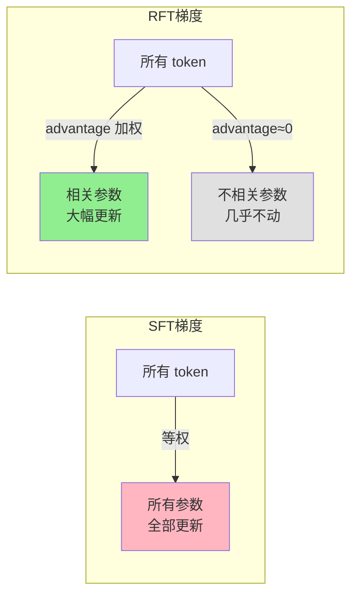
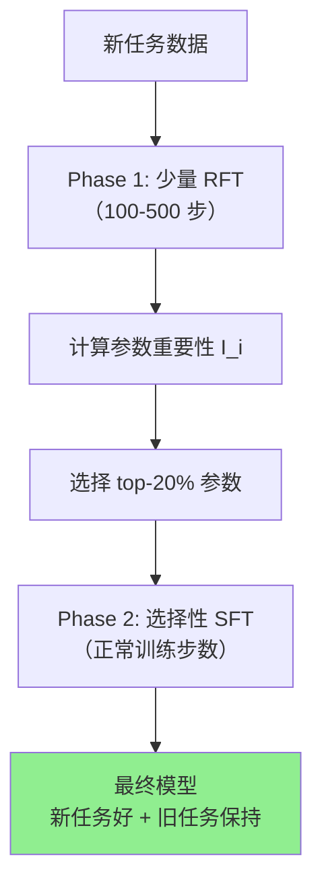

# RIF-RFT：强化微调天然缓解遗忘

> **论文**: *Reinforcement Fine-Tuning Naturally Mitigates Forgetting* 
> **版本**: arXiv:2507.05386, 2025 
> **一句话**: 在多模态基础模型上系统比较 SFT 和 RFT（强化微调），发现 RFT 遗忘更少是因为**选择性参数更新**——只有对奖励信号有贡献的参数才获得梯度，其他参数几乎不动。据此提出 RIF-RFT（Reinforcement-Informed Forgetting-free RFT）方法。

---

## 相关阅读

| 类型 | 链接 |
|------|------|
| 前置知识 | [策略梯度与 PPO](/前置知识/000a_前置知识_策略梯度与PPO) |
| 前置知识 | [GRPO](/前置知识/000m_前置知识_GRPO_Group_Relative_Policy_Optimization) |
| 前置知识 | [行为克隆与 RL 微调范式](/前置知识/000d_前置知识_行为克隆与RL微调范式) |
| 精读 | [Simple Recipe：VLA 天然持续学习者](./045_SimpleRecipe_VLA天然持续学习者) |
| 精读 | [RL's Razor：在线 RL 为什么不遗忘](./047_RLsRazor_在线RL为什么不遗忘) |

---

## 贯穿全文的例子

> **设定**：一个多模态基础模型（类似 Qwen-VL），需要依次学习三个能力：
> - 能力 A：数学推理（已学好）
> - 能力 B：图表理解（正在学）
> - 能力 C：代码生成（未来学）
>
> 两种学图表理解的方式：
> - **SFT**：给一批(图表, 正确答案)，最大化答案的对数似然
> - **RFT**：让模型自己生成答案，对正确答案给奖励 +1，用 [GRPO](/前置知识/000m_前置知识_GRPO_Group_Relative_Policy_Optimization) 更新
>
> 学完后测数学推理：SFT 方式下数学分数从 82 降到 68（-14）；RFT 方式下从 82 降到 79（-3）。为什么？

---

## 一、核心发现：RFT vs SFT 的遗忘差异

### 1.1 系统性对比实验

本文在 3 个多模态基础模型（2B/7B/14B）、6 个下游任务上进行了系统对比：

| 模型 | 微调方式 | 新任务提升 | 旧任务遗忘 | 遗忘/提升比 |
|------|---------|-----------|-----------|------------|
| 2B | SFT | +15.2% | -11.8% | 0.78 |
| 2B | RFT (GRPO) | +12.7% | -3.2% | 0.25 |
| 7B | SFT | +18.1% | -14.3% | 0.79 |
| 7B | RFT (GRPO) | +16.5% | -4.1% | 0.25 |
| 14B | SFT | +19.8% | -12.1% | 0.61 |
| 14B | RFT (GRPO) | +18.2% | -2.8% | 0.15 |

**遗忘/提升比**（越低越好）：衡量"每获得 1% 新能力要付出多少旧能力"。RFT 的比值是 SFT 的 1/3 到 1/5。

### 1.2 核心差异不是"学得少"

有人可能猜测：RFT 遗忘少是因为新任务学得不好。但表格显示：**RFT 的新任务提升只比 SFT 差 1-3 个百分点，但遗忘少了 3-5 倍**。这不是"没学会所以没忘"——是"学会了且没忘"。

---

## 二、为什么 RFT 遗忘少：选择性参数更新

### 2.1 SFT 的梯度模式

SFT 损失：

$$
\mathcal{L}_{\text{SFT}} = -\frac{1}{|y|}\sum_{t=1}^{|y|} \log \pi_\theta(y_t | x, y_{<t})
$$

梯度：

$$
\nabla_\theta \mathcal{L}_{\text{SFT}} = -\frac{1}{|y|}\sum_t \nabla_\theta \log \pi_\theta(y_t | x, y_{<t})
$$

**特征**：每个 token 都等权贡献梯度。无论模型在某个 token 上的预测已经有多好（概率 0.9 vs 0.1），梯度信号都相当——只要不是概率 1 就持续更新。

**结果**：所有与生成过程相关的参数都被大幅更新，包括那些"对旧任务很重要但对新任务贡献不大"的参数。

### 2.2 RFT 的梯度模式

以 [GRPO](/前置知识/000m_前置知识_GRPO_Group_Relative_Policy_Optimization) 为例，梯度为：

$$
\nabla_\theta J_{\text{GRPO}} = \frac{1}{G}\sum_{i=1}^G \hat{A}_i \cdot \nabla_\theta \log \pi_\theta(y_i | x)
$$

其中 $\hat{A}_i = \frac{R_i - \text{mean}(R)}{\text{std}(R)}$ 是归一化优势。

**关键区别**：梯度被 advantage 加权。

- 如果模型已经能以高概率生成正确答案（大多数 $R_i$ 都高），则 $\hat{A}_i$ 的方差很小 → 梯度很小
- 只有那些"当前做错但有些样本做对"的情况才产生大的 advantage 方差 → 大梯度

**结果**：只有真正需要改进的"能力模块"获得有意义的梯度，其他部分几乎不更新。

### 2.3 数值对比

假设模型有 7B 参数，用 LoRA (rank=16) 微调。看各层参数在训练后的 L2 变化：

$$
\Delta_l = \|\theta_l^{\text{final}} - \theta_l^{\text{init}}\|_2
$$

| 层 | 功能 | $\Delta_l$ (SFT) | $\Delta_l$ (RFT) | RFT/SFT 比 |
|----|------|------|------|------|
| Layers 0-8 | 视觉编码 | 2.3 | 0.4 | 0.17 |
| Layers 9-16 | 多模态融合 | 3.1 | 2.8 | 0.90 |
| Layers 17-24 | 语言推理 | 2.8 | 0.6 | 0.21 |
| Layers 25-32 | 输出投影 | 1.9 | 1.7 | 0.89 |

**观察**：
- RFT 主要更新了多模态融合层（9-16）和输出投影（25-32）——这些是学"图表理解"真正需要的
- SFT 则**全面更新**所有层——包括不需要改的视觉编码和语言推理层
- 视觉编码层被 SFT 改了 2.3，被 RFT 只改了 0.4——SFT 不必要地破坏了视觉特征

### 2.4 选择性更新的数学解释

为什么 advantage 加权会导致选择性更新？

考虑参数 $\theta_i$ 对某个任务的梯度。如果这个参数**不影响**该任务的奖励，则：

$$
\frac{\partial R}{\partial \theta_i} \approx 0 \quad \Rightarrow \quad \frac{\partial A}{\partial \theta_i} \approx 0
$$

由链式法则：

$$
\nabla_{\theta_i} J = \mathbb{E}[A \cdot \nabla_{\theta_i} \log \pi] = \mathbb{E}[A] \cdot \mathbb{E}[\nabla_{\theta_i} \log \pi] + \text{Cov}(A, \nabla_{\theta_i} \log \pi)
$$

如果 $A$ 和 $\nabla_{\theta_i} \log \pi$ 不相关（参数不影响奖励），则：
- $\mathbb{E}[A] = 0$（归一化后均值为 0）
- $\text{Cov}(A, \nabla_{\theta_i} \log \pi) \approx 0$

所以 $\nabla_{\theta_i} J \approx 0$。**不相关的参数自动获得零梯度。**

SFT 没有这个机制——所有 token 的梯度不经 advantage 过滤，直接累加到所有参数上。

---

## 三、RIF-RFT 方法

### 3.1 动机

纯 RFT 虽然遗忘少，但有两个局限：
1. 需要设计奖励函数（不是所有任务都容易定义奖励）
2. 训练效率比 SFT 低（需要多次 rollout）

能否把 RFT 的"选择性更新"特性**迁移到 SFT** 中？

### 3.2 核心思想

RIF-RFT（Reinforcement-Informed Forgetting-free RFT）的做法：

1. **先用少量 RFT 训练**识别"对新任务重要的参数"
2. **然后只对这些参数做 SFT**，冻结其他参数

### 3.3 参数重要性的计算

用 RFT 训练 $K$ 步后，计算每个参数的累积梯度幅度：

$$
I_i = \frac{1}{K}\sum_{k=1}^K |\nabla_{\theta_i} J_{\text{GRPO}}^{(k)}|
$$

**代入数字**：假设参数 $\theta_7$ 在 100 步 RFT 中的梯度幅度为：

$$
I_7 = \frac{1}{100}\sum_{k=1}^{100} |g_7^{(k)}| = 0.003
$$

而参数 $\theta_{42}$ 的为：

$$
I_{42} = \frac{1}{100}\sum_{k=1}^{100} |g_{42}^{(k)}| = 0.15
$$

$\theta_{42}$ 比 $\theta_7$ 重要 50 倍。

### 3.4 选择性 SFT

根据重要性分数，选择 top-$p$% 的参数做 SFT，其他冻结：

$$
\text{mask}_i = \begin{cases} 1 & \text{if } I_i \geq \text{threshold}(p) \\ 0 & \text{otherwise} \end{cases}
$$

$$
\theta_i^{(t+1)} = \theta_i^{(t)} - \eta \cdot \text{mask}_i \cdot \nabla_{\theta_i} \mathcal{L}_{\text{SFT}}
$$

实验发现 $p = 20\%$（只更新 20% 的参数）就能达到接近全参数 SFT 的新任务性能，同时遗忘降低 60%。

### 3.5 完整流程

---

## 四、RIF-RFT 的效果

### 4.1 主要结果

| 方法 | 新任务分数 | 旧任务保持 | 训练时间（相对） |
|------|-----------|-----------|----------------|
| Full SFT | 92.3 | 74.2 | 1.0× |
| Full RFT | 89.5 | 93.8 | 3.2× |
| RIF-RFT | 91.1 | 90.5 | 1.3× |
| SFT + EWC | 90.8 | 82.1 | 1.1× |
| SFT + Replay | 91.5 | 85.7 | 1.5× |

**RIF-RFT 的优势**：
- 新任务能力仅比 Full SFT 低 1.2 分
- 旧任务保持接近 Full RFT（90.5 vs 93.8）
- 训练时间只比 SFT 多 30%（Phase 1 的 100-500 步 RFT 开销很小）
- 比 [EWC](/前置知识/000w_前置知识_EWC弹性权重巩固) 和 Replay 都好

### 4.2 参数稀疏性分析

不同任务"真正需要"更新的参数比例：

| 任务类型 | 需更新参数比例 | 说明 |
|---------|--------------|------|
| 数学推理 → 图表理解 | 18% | 主要是多模态融合层 |
| 图表理解 → 代码生成 | 25% | 需要更新语言生成层 |
| 英文 → 中文 | 35% | 需要大量更新 embedding 和 LM head |
| 通用 → 领域专精 | 12% | 只需微调注意力权重 |

**结论**：大多数任务切换只需更新 15-35% 的参数。SFT 更新 100% 是巨大的浪费，也是遗忘的根源。

---

## 五、深入分析：为什么"选择性"就能防遗忘

### 5.1 参数空间的功能分区

大型预训练模型的参数不是混沌的——不同参数组承担不同功能：

$$
\theta = [\underbrace{\theta_{\text{vision}}}_{\text{视觉编码}}, \underbrace{\theta_{\text{fusion}}}_{\text{模态融合}}, \underbrace{\theta_{\text{lang}}}_{\text{语言推理}}, \underbrace{\theta_{\text{head}}}_{\text{输出}}]
$$

如果新任务只需要改 $\theta_{\text{fusion}}$，但 SFT 把 $\theta_{\text{lang}}$ 也大幅改了，就会破坏依赖 $\theta_{\text{lang}}$ 的旧能力（如数学推理）。

### 5.2 与 LoRA 的协同效应

LoRA 已经限制了可训练参数（约 1-2%），RIF-RFT 在此基础上进一步选择：

$$
\text{实际更新的参数} = \text{LoRA 参数} \times \text{RIF mask} = 1\% \times 20\% = 0.2\%
$$

只有 0.2% 的等效参数被更新，但仍能达到 91% 的新任务性能。这印证了"过参数化网络中学习任何单一能力所需的参数改动极少"。

### 5.3 信息瓶颈视角

从信息论角度，RFT 的 advantage 加权相当于一个**信息瓶颈**：

$$
I(\theta; \text{new task}) = I(\theta; R) \leq H(R)
$$

奖励信号 $R$ 的信息量（$H(R)$）远小于完整标注的信息量（$H(y^*)$）。因此通过奖励信号传递的梯度信息更少、更聚焦——只传递"什么是对的"，不传递"具体怎么做"。

**类比**：
- SFT 就像给学生**逐字抄写**答案——即使答案的字体、格式都要模仿
- RFT 就像只告诉学生"这个答案对了"——学生用自己的方式写出正确答案，不改变书写风格

---

## 六、与其他防遗忘方法的对比

| 方法 | 防遗忘机制 | 需要旧数据 | 额外超参 | 与 RFT 兼容 |
|------|-----------|-----------|---------|------------|
| RFT (本身) | 选择性更新 | ✗ | 奖励函数 | — |
| RIF-RFT | RFT 指导的选择性 SFT | ✗ | top-p% | ✓ |
| [EWC](/前置知识/000w_前置知识_EWC弹性权重巩固) | Fisher 加权正则化 | 少量旧数据 | $\lambda$ | ✓ |
| Replay | 混合旧数据训练 | 需存旧数据 | 回放比例 | ✓ |
| [Dark ER](./052_DarkExperienceReplay_暗经验回放) | 回放 logits 蒸馏 | 存旧 logits | 蒸馏权重 | ✓ |
| On-policy 隐式 | 状态空间隔离 | ✗ | 无 | — |

---

## 七、局限性与开放问题

### 7.1 奖励函数依赖

RIF-RFT 的 Phase 1 仍需奖励函数。对于难以定义奖励的任务（如创意写作），需要：
- 用 LLM-as-judge 做近似奖励
- 或用偏好数据做 DPO 替代

### 7.2 Phase 1 步数敏感性

重要性估计的质量取决于 Phase 1 的步数。太少（<50 步）估计不准，太多（>1000 步）就回到了完整 RFT 的开销。

实验发现 200-500 步是甜点区。

### 7.3 对任务顺序的敏感性

RIF-RFT 假设"当前重要参数"和"未来任务需要的参数"不冲突。如果未来任务恰好需要大量更新当前被选中的参数，可能导致连锁冲突。

---

## 八、总结

| 贡献 | 意义 |
|------|------|
| 系统对比 SFT vs RFT 的遗忘 | 定量证明 RFT 遗忘少 3-5 倍 |
| 选择性参数更新机制解释 | 从梯度层面解释为什么 |
| RIF-RFT 方法 | 将 RFT 的优势迁移到 SFT，兼得两者长处 |
| 参数稀疏性发现 | 大多数任务只需更新 15-35% 参数 |

**核心信息**：RFT 不遗忘的秘密是"选择性更新"——advantage 加权自动将梯度集中在真正需要改进的参数上。RIF-RFT 显式利用这一发现，用少量 RFT 做"参数侦察"，指导高效且不遗忘的 SFT。

---

## 延伸阅读

- [GRPO](/前置知识/000m_前置知识_GRPO_Group_Relative_Policy_Optimization)：RFT 使用的具体 RL 算法
- [行为克隆与 RL 微调范式](/前置知识/000d_前置知识_行为克隆与RL微调范式)：SFT 和 RFT 的范式对比
- [RL's Razor](./047_RLsRazor_在线RL为什么不遗忘)：从不同角度解释 RL 不遗忘
- [Simple Recipe](./045_SimpleRecipe_VLA天然持续学习者)：on-policy RFT 在机器人上的实践
