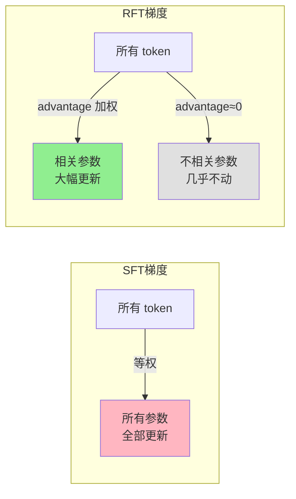
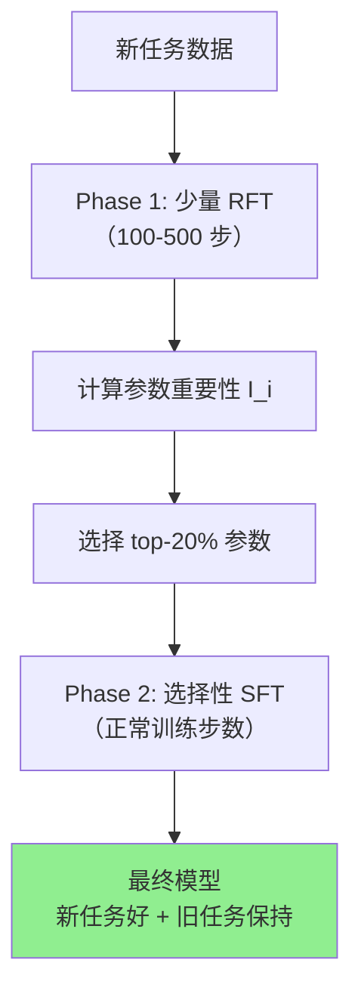

# RIF-RFT：强化微调天然缓解遗忘

> **论文**: *Reinforcement Fine-Tuning Naturally Mitigates Forgetting* 
> **版本**: arXiv:2507.05386, 2025 
> **一句话**: 在多模态基础模型上系统比较 SFT 和 RFT（强化微调），发现 RFT 遗忘更少是因为**选择性参数更新**——只有对奖励信号有贡献的参数才获得梯度，其他参数几乎不动。据此提出 RIF-RFT（Reinforcement-Informed Forgetting-free RFT）方法。

---

## 相关阅读

| 类型 | 链接 |
|------|------|
| 前置知识 | [策略梯度与 PPO](/前置知识/000a_前置知识_策略梯度与PPO) |
| 前置知识 | [GRPO](/前置知识/000m_前置知识_GRPO_Group_Relative_Policy_Optimization) |
| 前置知识 | [行为克隆与 RL 微调范式](/前置知识/000d_前置知识_行为克隆与RL微调范式) |
| 精读 | [Simple Recipe：VLA 天然持续学习者](./045_SimpleRecipe_VLA天然持续学习者) |
| 精读 | [RL's Razor：在线 RL 为什么不遗忘](./047_RLsRazor_在线RL为什么不遗忘) |

---

## 贯穿全文的例子

> **设定**：一个多模态基础模型（类似 Qwen-VL），需要依次学习三个能力：
> - 能力 A：数学推理（已学好）
> - 能力 B：图表理解（正在学）
> - 能力 C：代码生成（未来学）
>
> 两种学图表理解的方式：
> - **SFT**：给一批(图表, 正确答案)，最大化答案的对数似然
> - **RFT**：让模型自己生成答案，对正确答案给奖励 +1，用 [GRPO](/前置知识/000m_前置知识_GRPO_Group_Relative_Policy_Optimization) 更新
>
> 学完后测数学推理：SFT 方式下数学分数从 82 降到 68（-14）；RFT 方式下从 82 降到 79（-3）。为什么？

---

## 一、核心发现：RFT vs SFT 的遗忘差异

### 1.1 系统性对比实验

本文在 3 个多模态基础模型（2B/7B/14B）、6 个下游任务上进行了系统对比：

| 模型 | 微调方式 | 新任务提升 | 旧任务遗忘 | 遗忘/提升比 |
|------|---------|-----------|-----------|------------|
| 2B | SFT | +15.2% | -11.8% | 0.78 |
| 2B | RFT (GRPO) | +12.7% | -3.2% | 0.25 |
| 7B | SFT | +18.1% | -14.3% | 0.79 |
| 7B | RFT (GRPO) | +16.5% | -4.1% | 0.25 |
| 14B | SFT | +19.8% | -12.1% | 0.61 |
| 14B | RFT (GRPO) | +18.2% | -2.8% | 0.15 |

**遗忘/提升比**（越低越好）：衡量"每获得 1% 新能力要付出多少旧能力"。RFT 的比值是 SFT 的 1/3 到 1/5。

### 1.2 核心差异不是"学得少"

有人可能猜测：RFT 遗忘少是因为新任务学得不好。但表格显示：**RFT 的新任务提升只比 SFT 差 1-3 个百分点，但遗忘少了 3-5 倍**。这不是"没学会所以没忘"——是"学会了且没忘"。

---

## 二、为什么 RFT 遗忘少：选择性参数更新

### 2.1 SFT 的梯度模式

SFT 损失：

$$
\mathcal{L}_{\text{SFT}} = -\frac{1}{|y|}\sum_{t=1}^{|y|} \log \pi_\theta(y_t | x, y_{<t})
$$

**这个公式在做什么**：让模型对标注答案 $y$ 里每一个 token 的预测概率都尽量接近 1——这是 SFT（监督微调，Supervised Fine-Tuning）最基础的目标函数，也叫交叉熵损失。

::: details 📐 公式详解（点击展开）

| 子表达式 | 它是谁 | 它在干嘛 |
|---------|--------|---------|
| $\pi_\theta(y_t \| x, y_{<t})$ | **逐字模仿分数** | 模型看到输入 $x$ 和前面已生成的 $y_{<t}$ 后，给"标准答案的下一个字" $y_t$ 打的概率 |
| $\log \pi_\theta(\cdot)$ | **打分转换器** | 把概率转成对数，概率越接近 1，$\log$ 值越接近 0（损失越小） |
| $\sum_{t=1}^{|y|}$ | **逐字累加** | 把答案里每一个 token 的打分加起来，一个不漏 |
| $-\frac{1}{|y|}$ | **取平均再翻转** | 除以长度做平均，加负号把"最大化概率"变成"最小化损失" |

**用人话读**："把标准答案从头到尾逐字过一遍，每个字都要求模型给出的概率尽量高，取负对数平均作为损失。"

**为什么是这个形式**：这是标准的最大似然估计——让模型生成的分布尽可能贴近训练数据里"专家怎么写"这一条唯一路径。
:::

梯度：

$$
\nabla_\theta \mathcal{L}_{\text{SFT}} = -\frac{1}{|y|}\sum_t \nabla_\theta \log \pi_\theta(y_t | x, y_{<t})
$$

**这个公式在做什么**：把上面的损失对参数求导，得到每一步该往哪个方向调整参数——这是 SFT 实际反向传播时用的梯度公式。

::: details 📐 公式详解（点击展开）

| 子表达式 | 它是谁 | 它在干嘛 |
|---------|--------|---------|
| $\nabla_\theta \log \pi_\theta(y_t\|x,y_{<t})$ | **单个 token 的调整方向** | 告诉参数往哪个方向挪，能让模型对 $y_t$ 的预测概率变大 |
| $\sum_t(\cdot)$ | **逐字梯度叠加** | 把答案里每个 token 产生的调整方向直接加总，不做任何筛选 |
| $-\frac{1}{|y|}$ | **平均并定向** | 取平均并翻转符号，配合梯度下降使用 |

**用人话读**："每个 token 都产生一份'该往哪调'的梯度，不管这个 token 模型原本预测得好不好，全部等权重加起来更新参数。"

**为什么是这个形式**：直接对交叉熵损失求导即可，SFT 没有任何机制去区分"这个 token 模型已经学得很好"和"这个 token 模型还很差"——这正是后面对比 RFT 时的关键差异点。
:::

**特征**：每个 token 都等权贡献梯度。无论模型在某个 token 上的预测已经有多好（概率 0.9 vs 0.1），梯度信号都相当——只要不是概率 1 就持续更新。

**结果**：所有与生成过程相关的参数都被大幅更新，包括那些"对旧任务很重要但对新任务贡献不大"的参数。

### 2.2 RFT 的梯度模式

以 [GRPO](/前置知识/000m_前置知识_GRPO_Group_Relative_Policy_Optimization) 为例，梯度为：

$$
\nabla_\theta J_{\text{GRPO}} = \frac{1}{G}\sum_{i=1}^G \hat{A}_i \cdot \nabla_\theta \log \pi_\theta(y_i | x)
$$

**这个公式在做什么**：不再对每个 token 一视同仁，而是先看这个样本整体做得好不好（优势 $\hat A_i$），再决定要不要把它的梯度方向放大或缩小——这是 [GRPO](/前置知识/000m_前置知识_GRPO_Group_Relative_Policy_Optimization) 的核心梯度公式。

::: details 📐 公式详解（点击展开）

| 子表达式 | 它是谁 | 它在干嘛 |
|---------|--------|---------|
| $\hat{A}_i$ | **优劣打分器** | 这个回答 $y_i$ 比同组其他回答好还是差，好→正数，差→负数 |
| $\nabla_\theta \log \pi_\theta(y_i\|x)$ | **调整方向** | 和 SFT 里一样，指出让模型更偏向生成 $y_i$ 的参数调整方向 |
| $\hat{A}_i \cdot \nabla_\theta \log \pi_\theta(y_i\|x)$ | **加权后的调整** | 好回答的调整方向被放大执行，差回答的调整方向被反向执行 |
| $\frac{1}{G}\sum_{i=1}^G$ | **组内平均** | 对同一个输入采样出的 $G$ 个回答，把加权梯度取平均 |

**用人话读**："对同一个问题采样一组回答，按'比组内平均水平好多少'给每个回答的梯度加权，好的多学、差的反着学，然后取平均。"

**为什么是这个形式**：这是策略梯度定理（见[策略梯度与 PPO](/前置知识/000a_前置知识_策略梯度与PPO)）在 GRPO 里的具体形式——用组内相对排名代替单独的价值网络估计优势，省掉了 Critic。
:::

其中 $\hat{A}_i = \frac{R_i - \text{mean}(R)}{\text{std}(R)}$ 是归一化优势。

**关键区别**：梯度被 advantage 加权。

- 如果模型已经能以高概率生成正确答案（大多数 $R_i$ 都高），则 $\hat{A}_i$ 的方差很小 → 梯度很小
- 只有那些"当前做错但有些样本做对"的情况才产生大的 advantage 方差 → 大梯度

**结果**：只有真正需要改进的"能力模块"获得有意义的梯度，其他部分几乎不更新。

### 2.3 数值对比

假设模型有 7B 参数，用 LoRA (rank=16) 微调。看各层参数在训练后的 L2 变化：

$$
\Delta_l = \|\theta_l^{\text{final}} - \theta_l^{\text{init}}\|_2
$$

**这个公式在做什么**：量化第 $l$ 层的参数在训练前后到底挪动了多远，用这个数字判断 SFT 和 RFT 分别"动了哪些层"。

::: details 📐 公式详解（点击展开）

| 子表达式 | 它是谁 | 它在干嘛 |
|---------|--------|---------|
| $\theta_l^{\text{init}}$ | **出发点** | 该层参数在微调开始前的取值（预训练权重） |
| $\theta_l^{\text{final}}$ | **终点** | 该层参数在微调结束后的取值 |
| $\theta_l^{\text{final}} - \theta_l^{\text{init}}$ | **位移向量** | 训练过程中这一层参数实际移动的方向和距离 |
| $\|\cdot\|_2$ | **距离计** | 把位移向量压缩成一个标量，即挪动的总幅度 |

**用人话读**："看第 $l$ 层的参数训练前后差了多少，用一个数字表示这一层被改动的程度。"

**为什么是这个形式**：L2 范数是最直接的"参数变了多少"的度量，方便逐层对比 SFT 和 RFT 谁改得更多、改得更集中。
:::

| 层 | 功能 | $\Delta_l$ (SFT) | $\Delta_l$ (RFT) | RFT/SFT 比 |
|----|------|------|------|------|
| Layers 0-8 | 视觉编码 | 2.3 | 0.4 | 0.17 |
| Layers 9-16 | 多模态融合 | 3.1 | 2.8 | 0.90 |
| Layers 17-24 | 语言推理 | 2.8 | 0.6 | 0.21 |
| Layers 25-32 | 输出投影 | 1.9 | 1.7 | 0.89 |

**观察**：
- RFT 主要更新了多模态融合层（9-16）和输出投影（25-32）——这些是学"图表理解"真正需要的
- SFT 则**全面更新**所有层——包括不需要改的视觉编码和语言推理层
- 视觉编码层被 SFT 改了 2.3，被 RFT 只改了 0.4——SFT 不必要地破坏了视觉特征

### 2.4 选择性更新的数学解释

为什么 advantage 加权会导致选择性更新？

考虑参数 $\theta_i$ 对某个任务的梯度。如果这个参数**不影响**该任务的奖励，则：

$$
\frac{\partial R}{\partial \theta_i} \approx 0 \quad \Rightarrow \quad \frac{\partial A}{\partial \theta_i} \approx 0
$$

**这个公式在做什么**：说明如果一个参数根本不影响奖励，那它也不会影响优势值——这是后面推导"无关参数自动获得零梯度"的第一步。

::: details 📐 公式详解（点击展开）

| 子表达式 | 它是谁 | 它在干嘛 |
|---------|--------|---------|
| $\frac{\partial R}{\partial \theta_i}$ | **参数对奖励的影响力** | 微调参数 $\theta_i$ 一点点，最终奖励 $R$ 会变化多少 |
| $\approx 0$（第一处） | **无关判定** | 如果这个影响力几乎为零，说明 $\theta_i$ 不参与"做对这件事"的计算 |
| $\frac{\partial A}{\partial \theta_i}$ | **参数对优势的影响力** | 优势 $A$（本质是奖励的归一化版本）对 $\theta_i$ 的敏感程度 |
| $\Rightarrow$ | **推导箭头** | 因为 $A$ 是 $R$ 的函数，$R$ 不受影响则 $A$ 也不受影响 |

**用人话读**："如果改这个参数根本不会影响任务做得好不好，那它对优势分数的影响也几乎是零。"

**为什么是这个形式**：这是链式法则的直接推论，是为下面证明"该参数最终梯度约等于零"打基础的前提条件。
:::

由链式法则：

$$
\nabla_{\theta_i} J = \mathbb{E}[A \cdot \nabla_{\theta_i} \log \pi] = \mathbb{E}[A] \cdot \mathbb{E}[\nabla_{\theta_i} \log \pi] + \text{Cov}(A, \nabla_{\theta_i} \log \pi)
$$

**这个公式在做什么**：把"优势加权梯度"的期望，拆成"均值项"和"协方差项"两部分——这一拆解是解释 RFT 为何能自动屏蔽无关参数的关键数学工具。

::: details 📐 公式详解（点击展开）

| 子表达式 | 它是谁 | 它在干嘛 |
|---------|--------|---------|
| $\mathbb{E}[A \cdot \nabla_{\theta_i}\log\pi]$ | **原始梯度期望** | 参数 $\theta_i$ 实际收到的、经过优势加权的平均梯度 |
| $\mathbb{E}[A]\cdot\mathbb{E}[\nabla_{\theta_i}\log\pi]$ | **独立假设下的乘积** | 如果 $A$ 和梯度方向互不相关，两者期望可以拆开单独相乘 |
| $\text{Cov}(A,\nabla_{\theta_i}\log\pi)$ | **相关性补偿项** | 补上"两者到底有没有联动"这一部分，真实梯度 = 乘积项 + 这个协方差 |

**用人话读**："一个加权梯度的平均值，可以写成'两边各自的平均值相乘'再加上'两边联动程度'这两部分之和。"

**为什么是这个形式**：这是协方差的标准恒等式 $\mathbb{E}[XY]=\mathbb{E}[X]\mathbb{E}[Y]+\text{Cov}(X,Y)$，套用在 $X=A, Y=\nabla_{\theta_i}\log\pi$ 上，目的是把梯度拆成"可能不为零的部分"方便逐项分析。
:::

如果 $A$ 和 $\nabla_{\theta_i} \log \pi$ 不相关（参数不影响奖励），则：
- $\mathbb{E}[A] = 0$（归一化后均值为 0）
- $\text{Cov}(A, \nabla_{\theta_i} \log \pi) \approx 0$

所以 $\nabla_{\theta_i} J \approx 0$。**不相关的参数自动获得零梯度。**

SFT 没有这个机制——所有 token 的梯度不经 advantage 过滤，直接累加到所有参数上。

```mermaid
flowchart LR
    subgraph SFT梯度
        A1["所有 token"] -->|等权| B1["所有参数\n全部更新"]
    end
    subgraph RFT梯度
        A2["所有 token"] -->|advantage 加权| B2["相关参数\n大幅更新"]
        A2 -->|advantage≈0| C2["不相关参数\n几乎不动"]
    end
    style B1 fill:#FFB6C1
    style B2 fill:#90EE90
    style C2 fill:#E0E0E0
```

---

## 三、RIF-RFT 方法

### 3.1 动机

纯 RFT 虽然遗忘少，但有两个局限：
1. 需要设计奖励函数（不是所有任务都容易定义奖励）
2. 训练效率比 SFT 低（需要多次 rollout）

能否把 RFT 的"选择性更新"特性**迁移到 SFT** 中？

### 3.2 核心思想

RIF-RFT（Reinforcement-Informed Forgetting-free RFT）的做法：

1. **先用少量 RFT 训练**识别"对新任务重要的参数"
2. **然后只对这些参数做 SFT**，冻结其他参数

### 3.3 参数重要性的计算

用 RFT 训练 $K$ 步后，计算每个参数的累积梯度幅度：

$$
I_i = \frac{1}{K}\sum_{k=1}^K |\nabla_{\theta_i} J_{\text{GRPO}}^{(k)}|
$$

**这个公式在做什么**：给每个参数打一个"重要性分数"——统计它在 RFT 训练过程中平均收到多大的梯度，梯度越大说明这个参数对学新任务越关键。

::: details 📐 公式详解（点击展开）

| 子表达式 | 它是谁 | 它在干嘛 |
|---------|--------|---------|
| $\nabla_{\theta_i} J_{\text{GRPO}}^{(k)}$ | **第 $k$ 步的梯度** | 第 $k$ 步 RFT 训练时，参数 $\theta_i$ 实际收到的梯度值 |
| $\|\cdot\|$ | **只看幅度不看方向** | 取绝对值，因为这里只关心"改动力度"大小，不关心往哪个方向改 |
| $\sum_{k=1}^K$ | **多步累积** | 把 $K$ 步训练里每一步的梯度幅度加起来 |
| $\frac{1}{K}$ | **求平均** | 除以步数，得到平均每步收到多大的梯度冲击 |

**用人话读**："看这个参数在 $K$ 步 RFT 训练里平均每步被推动了多大力气，力气越大说明它越重要。"

**为什么是这个形式**：累积梯度幅度是衡量参数重要性最直接的信号——单步梯度可能因随机采样波动很大，取多步平均更稳健。
:::

**代入数字**：假设参数 $\theta_7$ 在 100 步 RFT 中的梯度幅度为：

$$
I_7 = \frac{1}{100}\sum_{k=1}^{100} |g_7^{(k)}| = 0.003
$$

**这个公式在做什么**：把上面的重要性公式代入一个具体参数 $\theta_7$，算出它在 100 步训练里的平均梯度幅度只有 0.003——非常小，说明它几乎不参与这次任务的学习。

::: details 📐 公式详解（点击展开）

| 子表达式 | 它是谁 | 它在干嘛 |
|---------|--------|---------|
| $g_7^{(k)}$ | **具体取值** | 参数 $\theta_7$ 在第 $k$ 步训练中实际收到的梯度值（$I_i$ 公式里 $\nabla_{\theta_i}J^{(k)}$ 的具体实例） |
| $\frac{1}{100}\sum_{k=1}^{100}$ | **对 100 步取平均** | 沿用上面通用公式，代入 $K=100$ 这个具体步数 |
| $=0.003$ | **计算结果** | 平均梯度幅度很小，说明 $\theta_7$ 大概率是"和这次任务无关"的参数 |

**用人话读**："算出来 $\theta_7$ 这个参数在 100 步里平均只被推了 0.003 的力气，几乎没动。"

**为什么要给出具体数值**：用真实数字对比才能直观感受"重要"和"不重要"参数之间的量级差异（后面对比 $\theta_{42}$ 会看到 50 倍的差距）。
:::

而参数 $\theta_{42}$ 的为：

$$
I_{42} = \frac{1}{100}\sum_{k=1}^{100} |g_{42}^{(k)}| = 0.15
$$

**这个公式在做什么**：同样代入参数 $\theta_{42}$，算出它的平均梯度幅度是 0.15，比 $\theta_7$ 大了 50 倍——用来直观展示"重要"和"不重要"参数之间的悬殊差距。

::: details 📐 公式详解（点击展开）

| 子表达式 | 它是谁 | 它在干嘛 |
|---------|--------|---------|
| $g_{42}^{(k)}$ | **另一个参数的取值** | 参数 $\theta_{42}$ 在第 $k$ 步训练中收到的梯度值 |
| $\frac{1}{100}\sum_{k=1}^{100}$ | **同样的平均操作** | 和 $\theta_7$ 用完全相同的公式和步数计算，确保可比 |
| $=0.15$ | **计算结果** | 平均梯度幅度是 $\theta_7$ 的 50 倍，说明 $\theta_{42}$ 对这次任务非常关键 |

**用人话读**："同样的算法套在 $\theta_{42}$ 上，算出来平均力气是 0.15，比 $\theta_7$ 大 50 倍。"

**为什么要对比这两个参数**：直接用真实量级的差异说明"参数重要性差异巨大"这一事实，为后面"只更新 top-20% 参数"的做法提供数值依据。
:::

$\theta_{42}$ 比 $\theta_7$ 重要 50 倍。

### 3.4 选择性 SFT

根据重要性分数，选择 top-$p$% 的参数做 SFT，其他冻结：

$$
\text{mask}_i = \begin{cases} 1 & \text{if } I_i \geq \text{threshold}(p) \\ 0 & \text{otherwise} \end{cases}
$$

**这个公式在做什么**：根据重要性分数 $I_i$，给每个参数发一张"通行证"——分数够高的允许更新（mask=1），分数不够的直接冻结（mask=0）。

::: details 📐 公式详解（点击展开）

| 子表达式 | 它是谁 | 它在干嘛 |
|---------|--------|---------|
| $I_i$ | **准入分数** | 上一步算出的参数重要性，分数越高越该被更新 |
| $\text{threshold}(p)$ | **门槛线** | 根据想保留的比例 $p$（如 top-20%）算出的分数门槛 |
| $\text{mask}_i=1$ | **通行证** | $I_i$ 超过门槛，这个参数在后续 SFT 阶段允许更新 |
| $\text{mask}_i=0$ | **禁止牌** | $I_i$ 没过门槛，这个参数被冻结，SFT 不会碰它 |

**用人话读**："把所有参数按重要性排序，只给排名前 $p$% 的参数发'允许更新'的通行证，剩下全部冻结。"

**为什么是这个形式**：直接沿用 RFT 阶段暴露出的重要性信息，用一个简单的二值门限就能把"选择性更新"从 RFT 迁移到 SFT，不需要额外训练一个筛选器。
:::

$$
\theta_i^{(t+1)} = \theta_i^{(t)} - \eta \cdot \text{mask}_i \cdot \nabla_{\theta_i} \mathcal{L}_{\text{SFT}}
$$

**这个公式在做什么**：这是 RIF-RFT 第二阶段真正执行的参数更新规则——用 mask 把 SFT 的梯度过滤一遍，只让被选中的参数真正移动。

::: details 📐 公式详解（点击展开）

| 子表达式 | 它是谁 | 它在干嘛 |
|---------|--------|---------|
| $\theta_i^{(t)}$ | **当前参数值** | 第 $t$ 步时参数 $\theta_i$ 的取值 |
| $\eta$ | **步长** | 学习率，控制每次更新挪动的幅度 |
| $\text{mask}_i \cdot \nabla_{\theta_i}\mathcal{L}_{\text{SFT}}$ | **过滤后的梯度** | 如果 mask=0，梯度直接被清零；如果 mask=1，梯度原样通过 |
| $\theta_i^{(t)} - \eta\cdot(\cdot)$ | **梯度下降一步** | 标准的参数更新公式，只是这次梯度经过了 mask 过滤 |

**用人话读**："正常做梯度下降更新参数，唯一区别是被冻结的参数梯度永远是零，不会被更新。"

**为什么是这个形式**：这样既保留了 SFT 训练流程和代码不变（还是标准梯度下降），又能通过一个简单的乘法开关实现选择性更新，工程实现成本极低。
:::

实验发现 $p = 20\%$（只更新 20% 的参数）就能达到接近全参数 SFT 的新任务性能，同时遗忘降低 60%。

### 3.5 完整流程

```mermaid
flowchart TB
    A["新任务数据"] --> B["Phase 1: 少量 RFT\n（100-500 步）"]
    B --> C["计算参数重要性 I_i"]
    C --> D["选择 top-20% 参数"]
    D --> E["Phase 2: 选择性 SFT\n（正常训练步数）"]
    E --> F["最终模型\n新任务好 + 旧任务保持"]
    style F fill:#90EE90
```

---

## 四、RIF-RFT 的效果

### 4.1 主要结果

| 方法 | 新任务分数 | 旧任务保持 | 训练时间（相对） |
|------|-----------|-----------|----------------|
| Full SFT | 92.3 | 74.2 | 1.0× |
| Full RFT | 89.5 | 93.8 | 3.2× |
| RIF-RFT | 91.1 | 90.5 | 1.3× |
| SFT + EWC | 90.8 | 82.1 | 1.1× |
| SFT + Replay | 91.5 | 85.7 | 1.5× |

**RIF-RFT 的优势**：
- 新任务能力仅比 Full SFT 低 1.2 分
- 旧任务保持接近 Full RFT（90.5 vs 93.8）
- 训练时间只比 SFT 多 30%（Phase 1 的 100-500 步 RFT 开销很小）
- 比 [EWC](/前置知识/000w_前置知识_EWC弹性权重巩固) 和 Replay 都好

### 4.2 参数稀疏性分析

不同任务"真正需要"更新的参数比例：

| 任务类型 | 需更新参数比例 | 说明 |
|---------|--------------|------|
| 数学推理 → 图表理解 | 18% | 主要是多模态融合层 |
| 图表理解 → 代码生成 | 25% | 需要更新语言生成层 |
| 英文 → 中文 | 35% | 需要大量更新 embedding 和 LM head |
| 通用 → 领域专精 | 12% | 只需微调注意力权重 |

**结论**：大多数任务切换只需更新 15-35% 的参数。SFT 更新 100% 是巨大的浪费，也是遗忘的根源。

---

## 五、深入分析：为什么"选择性"就能防遗忘

### 5.1 参数空间的功能分区

大型预训练模型的参数不是混沌的——不同参数组承担不同功能：

$$
\theta = [\underbrace{\theta_{\text{vision}}}_{\text{视觉编码}}, \underbrace{\theta_{\text{fusion}}}_{\text{模态融合}}, \underbrace{\theta_{\text{lang}}}_{\text{语言推理}}, \underbrace{\theta_{\text{head}}}_{\text{输出}}]
$$

**这个公式在做什么**：把模型的全部参数按功能拆成四个区块，强调"参数空间不是混沌一片，而是有功能分区的"——这是理解为什么选择性更新有效的前提。

::: details 📐 公式详解（点击展开）

| 子表达式 | 它是谁 | 它在干嘛 |
|---------|--------|---------|
| $\theta_{\text{vision}}$ | **视觉编码区** | 负责把图像变成特征向量的那部分参数 |
| $\theta_{\text{fusion}}$ | **模态融合区** | 负责把视觉特征和文本特征结合在一起的参数 |
| $\theta_{\text{lang}}$ | **语言推理区** | 负责逻辑推理、生成语言的参数 |
| $\theta_{\text{head}}$ | **输出投影区** | 负责把内部特征映射成最终输出（词表概率等）的参数 |
| $[\cdot,\cdot,\cdot,\cdot]$ | **整体拼接** | 说明完整参数 $\theta$ 就是这四块拼在一起，各自承担不同职责 |

**用人话读**："把模型的全部参数按功能划分成视觉、融合、语言推理、输出四块，各管各的事。"

**为什么是这个形式**：这不是严格的数学定义，而是一个概念性划分，用来解释"新任务通常只需要动某一块，SFT 却把所有块都动了"这一现象的直觉基础。
:::

如果新任务只需要改 $\theta_{\text{fusion}}$，但 SFT 把 $\theta_{\text{lang}}$ 也大幅改了，就会破坏依赖 $\theta_{\text{lang}}$ 的旧能力（如数学推理）。

### 5.2 与 LoRA 的协同效应

LoRA 已经限制了可训练参数（约 1-2%），RIF-RFT 在此基础上进一步选择：

$$
\text{实际更新的参数} = \text{LoRA 参数} \times \text{RIF mask} = 1\% \times 20\% = 0.2\%
$$

**这个公式在做什么**：算出 LoRA 和 RIF-RFT 的 mask 叠加后，真正被更新的参数占全模型的比例——两层筛选叠加，最终只动了 0.2% 的等效参数。

::: details 📐 公式详解（点击展开）

| 子表达式 | 它是谁 | 它在干嘛 |
|---------|--------|---------|
| $\text{LoRA 参数} = 1\%$ | **第一层筛选** | LoRA（低秩适配，只在原模型旁挂一组小的低秩矩阵）本身就只引入约 1% 的可训练参数 |
| $\text{RIF mask} = 20\%$ | **第二层筛选** | 在 LoRA 参数里，RIF-RFT 又只挑出重要性排名前 20% 的部分真正更新 |
| $1\% \times 20\%$ | **两层叠乘** | 两次筛选是独立叠加的，比例直接相乘 |
| $= 0.2\%$ | **最终结果** | 相对全模型参数量，真正被更新的部分只有 0.2% |

**用人话读**："LoRA 先把可训练参数砍到 1%，RIF-RFT 再从这 1% 里挑出 20% 真正去动，最终只碰了全模型 0.2% 的参数。"

**为什么是这个形式**：两种技术的筛选机制彼此独立、可以直接叠乘，说明 RIF-RFT 和 LoRA 完全兼容，能进一步压缩训练成本而不损失太多性能。
:::

只有 0.2% 的等效参数被更新，但仍能达到 91% 的新任务性能。这印证了"过参数化网络中学习任何单一能力所需的参数改动极少"。

### 5.3 信息瓶颈视角

从信息论角度，RFT 的 advantage 加权相当于一个**信息瓶颈**：

$$
I(\theta; \text{new task}) = I(\theta; R) \leq H(R)
$$

**这个公式在做什么**：从信息论角度给"RFT 传递给参数的信息量"设一个上限——这个上限就是奖励信号本身携带的信息量，天然比完整标注答案少得多。

::: details 📐 公式详解（点击展开）

| 子表达式 | 它是谁 | 它在干嘛 |
|---------|--------|---------|
| $I(\theta; \text{new task})$ | **参数吸收的任务信息量** | 训练后参数里到底携带了多少关于"新任务该怎么做"的信息 |
| $I(\theta; R)$ | **通过奖励传递的信息量** | RFT 只能通过奖励信号 $R$ 把任务信息传给参数，不能直接传更多 |
| $H(R)$ | **奖励信号本身的信息熵** | 奖励信号（比如只有对/错两种取值）能携带的信息量上限 |
| $\leq$ | **信息瓶颈约束** | 参数能吸收的信息，不可能超过传递媒介本身携带的信息 |

**用人话读**："RFT 能教给参数的东西，被'奖励信号本身能装多少信息'这个瓶颈卡死了上限。"

**为什么是这个形式**：这是信息论中数据处理不等式的直接应用——信息只能通过一个"管道"（这里是奖励 $R$）传递，管道容量决定了下游能获得的信息上限，从而解释了为什么 RFT 传递的信息天然比 SFT（直接用完整标注 $y^*$ 监督）更少更聚焦。
:::

奖励信号 $R$ 的信息量（$H(R)$）远小于完整标注的信息量（$H(y^*)$）。因此通过奖励信号传递的梯度信息更少、更聚焦——只传递"什么是对的"，不传递"具体怎么做"。

**类比**：
- SFT 就像给学生**逐字抄写**答案——即使答案的字体、格式都要模仿
- RFT 就像只告诉学生"这个答案对了"——学生用自己的方式写出正确答案，不改变书写风格

---

## 六、与其他防遗忘方法的对比

| 方法 | 防遗忘机制 | 需要旧数据 | 额外超参 | 与 RFT 兼容 |
|------|-----------|-----------|---------|------------|
| RFT (本身) | 选择性更新 | ✗ | 奖励函数 | — |
| RIF-RFT | RFT 指导的选择性 SFT | ✗ | top-p% | ✓ |
| [EWC](/前置知识/000w_前置知识_EWC弹性权重巩固) | Fisher 加权正则化 | 少量旧数据 | $\lambda$ | ✓ |
| Replay | 混合旧数据训练 | 需存旧数据 | 回放比例 | ✓ |
| [Dark ER](./052_DarkExperienceReplay_暗经验回放) | 回放 logits 蒸馏 | 存旧 logits | 蒸馏权重 | ✓ |
| On-policy 隐式 | 状态空间隔离 | ✗ | 无 | — |

---

## 七、局限性与开放问题

### 7.1 奖励函数依赖

RIF-RFT 的 Phase 1 仍需奖励函数。对于难以定义奖励的任务（如创意写作），需要：
- 用 LLM-as-judge 做近似奖励
- 或用偏好数据做 DPO 替代

### 7.2 Phase 1 步数敏感性

重要性估计的质量取决于 Phase 1 的步数。太少（<50 步）估计不准，太多（>1000 步）就回到了完整 RFT 的开销。

实验发现 200-500 步是甜点区。

### 7.3 对任务顺序的敏感性

RIF-RFT 假设"当前重要参数"和"未来任务需要的参数"不冲突。如果未来任务恰好需要大量更新当前被选中的参数，可能导致连锁冲突。

---

## 八、总结

| 贡献 | 意义 |
|------|------|
| 系统对比 SFT vs RFT 的遗忘 | 定量证明 RFT 遗忘少 3-5 倍 |
| 选择性参数更新机制解释 | 从梯度层面解释为什么 |
| RIF-RFT 方法 | 将 RFT 的优势迁移到 SFT，兼得两者长处 |
| 参数稀疏性发现 | 大多数任务只需更新 15-35% 参数 |

**核心信息**：RFT 不遗忘的秘密是"选择性更新"——advantage 加权自动将梯度集中在真正需要改进的参数上。RIF-RFT 显式利用这一发现，用少量 RFT 做"参数侦察"，指导高效且不遗忘的 SFT。

---

## 延伸阅读

- [GRPO](/前置知识/000m_前置知识_GRPO_Group_Relative_Policy_Optimization)：RFT 使用的具体 RL 算法
- [行为克隆与 RL 微调范式](/前置知识/000d_前置知识_行为克隆与RL微调范式)：SFT 和 RFT 的范式对比
- [RL's Razor](./047_RLsRazor_在线RL为什么不遗忘)：从不同角度解释 RL 不遗忘
- [Simple Recipe](./045_SimpleRecipe_VLA天然持续学习者)：on-policy RFT 在机器人上的实践
