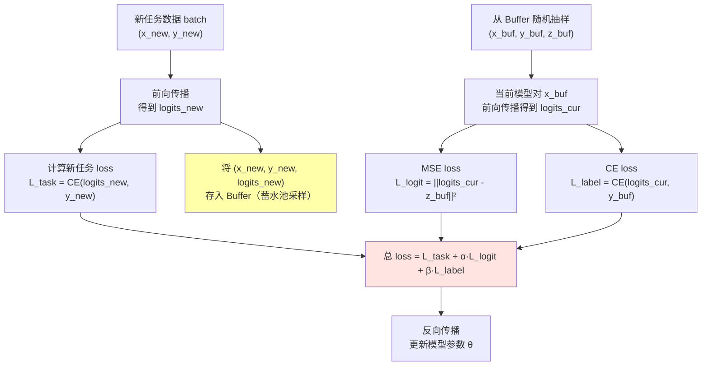
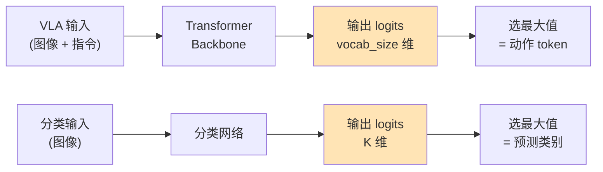
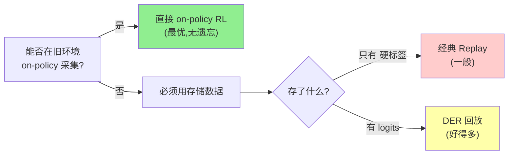

# Dark Experience Replay：回放 Logits 比回放样本更有效

> **论文**: *Dark Experience for General Continual Learning: a Strong, Simple Baseline*<br>
> **版本**: arXiv:2004.07211, NeurIPS 2020<br>
> **一句话**: 经验回放时不只存 $(x, y)$ 对，还存模型当时的输出 logits $z$。回放时用 MSE 对齐当前模型和旧 logits，利用 [知识蒸馏](/前置知识/000v_前置知识_知识蒸馏基础) 中的"暗知识"（Hinton, 2015）来保持旧能力。简单、通用、效果强劲。

---

## 相关阅读

| 类型 | 链接 |
|------|------|
| 前置知识 | [KL 散度与策略约束](/前置知识/000j_前置知识_KL散度与策略约束) |
| 前置知识 | [Replay Buffer（经验回放）](/前置知识/000r_前置知识_Replay_Buffer_经验回放) |
| 前置知识 | [知识蒸馏基础](/前置知识/000v_前置知识_知识蒸馏基础) |
| 精读 | [Forget Me Not：预训练 VLA 抗遗忘](./046_ForgetMeNot_预训练VLA抗遗忘) |
| 综述 | [持续/终身 VLA 强化学习综述](./S07_持续终身VLA强化学习综述) |

---

## ⚠️ 先澄清：这篇论文原本是做分类的，不是做 VLA 的

**这篇论文的原始场景是图像分类的持续学习**（如依次学习猫/狗/鸟 → 汽车/火车/飞机 → ...）。它的核心 idea——"存旧模型的 logits 而非硬标签"——是一个**通用思想**，可以迁移到任何有"输出分布"的场景，包括 VLA 中的动作 token 预测。

本文先在原始的分类场景中完整讲解 DER 的设计思想和数学原理（因为分类是最简单、最直觉的场景），然后在第五节专门讲解如何迁移到 VLA/机器人策略场景。

---

## 贯穿全文的例子

> **设定**：一个分类模型依次学习 3 个任务：
> - 任务 1：区分猫/狗/鸟（3 类）→ 模型输出一个 3 维向量（logits）
> - 任务 2：区分汽车/火车/飞机（3 类）→ 输出变成 6 维
> - 任务 3：区分苹果/香蕉/橙子（3 类）→ 输出变成 9 维
>
> Buffer 容量有限（只能存 200 个样本）。学完任务 2 后，任务 1 的数据已不可访问。
>
> **核心问题**：学任务 2 时，如何不忘任务 1？

---

## 一、经典经验回放的局限

### 1.1 硬标签的信息贫乏

经典 [经验回放](/前置知识/000r_前置知识_Replay_Buffer_经验回放) 的做法：在学每个任务时，随机选一些样本存进 Buffer，格式是 $(x_i, y_i)$——即"输入"和"正确答案"。

当学新任务时，从 Buffer 中抽取旧样本，用**交叉熵**损失训练模型：

$$
\mathcal{L}_{\text{replay}} = -\sum_{(x,y) \in \text{Buffer}} \log f_\theta(y | x)
$$

**为什么用交叉熵**：这里做的是分类任务。交叉熵是分类任务的标准损失函数——它衡量"模型预测的概率分布"和"真实标签"之间的差距。对于回放来说，意思是：让当前模型在旧样本上仍然能输出正确类别。

> **一句话直觉**：拿出旧题目，让模型重新做一遍，要求它还能答对。

**逐项拆解**：

| 符号 | 含义 | 具体例子 |
|------|------|---------|
| $(x, y)$ | 旧样本和它的硬标签 | $x$ = 一张猫的图片，$y$ = "猫"（one-hot: [1, 0, 0]） |
| $f_\theta(y \| x)$ | 模型对输入 $x$ 预测为类别 $y$ 的概率 | softmax 输出中"猫"对应位置的值，比如 0.85 |
| $\log f_\theta(y \| x)$ | 对数概率 | $\log(0.85) = -0.163$（越接近 0 越好） |
| 前面的负号 | 取负变成"损失"（越小越好） | $-(-0.163) = 0.163$（很小=预测很对） |
| $\sum$ 对 Buffer 求和 | 对所有存储的旧样本累加 | 200 个样本的 loss 加起来 |

**数值例子**：Buffer 中有一张猫图片（$y$ = 猫 = [1, 0, 0]）

学完任务 1 后模型对这张图输出 softmax = [0.92, 0.06, 0.02]（很确定是猫，✓）

学完任务 2 后模型对同一张图输出 softmax = [0.45, 0.30, 0.25]（不确定了！遗忘了）

- 回放 loss（学完后）= $-\log(0.45) = 0.80$（较大 → 说明遗忘了）
- 回放 loss（刚学完任务 1 时）= $-\log(0.92) = 0.08$（很小 → 没遗忘）

通过最小化这个 loss，模型会被"拉回"到能正确分类猫的状态。

**问题在哪**：$y$ 是 one-hot 标签，信息量只有 $\log_2 K$ bits（$K$ 类分类）。

- 3 类分类：$\log_2(3) = 1.58$ bits/样本
- 10 类分类：$\log_2(10) = 3.32$ bits/样本
- 1000 类分类：$\log_2(1000) = 9.97$ bits/样本

不管多复杂的图片，硬标签只能告诉你"这是第几类"。模型当时对这张图的全部"理解"——比如"这只猫有 30% 像小老虎"——全部丢失了。

### 1.2 回放的"时间错位"问题

更微妙的问题：经典回放试图让当前模型**完美匹配旧标签**。但标签只是一个粗暴的整数。

想象这个场景：

学完任务 1 后，模型对一张"像老虎的猫"输出：
```
logits = [5.2, 3.8, 0.1]  →  softmax = [0.80, 0.19, 0.01]
             猫    狗    鸟
```

模型"知道"这张图 80% 是猫，但也有 19% 像狗（因为老虎花纹像某些狗）。这个 19% 包含了丰富的语义信息——**类间相似性**。

但硬标签只存了 $y$ = 猫 = [1, 0, 0]。回放时交叉熵会要求模型输出 $P(\text{猫}|x) \to 1$，完全不在乎模型对"像不像狗"这件事的理解是否保持。

**信息丢失**：
- 硬标签："这是猫" → 1.58 bits
- Logits：$[5.2, 3.8, 0.1]$ → 3 个 float32 = 96 bits

96 bits vs 1.58 bits——差距 60 倍。这就是 DER 要解决的核心问题。

### 1.3 需要多少样本才有效

经典回放要足够多的样本才能覆盖旧任务的数据分布。对于复杂任务，200 个样本远不够恢复完整的决策边界。

但如果每个样本附带了更多信息（logits），少量样本也能传递足够知识。这是 DER 的第二个优势：**信息效率高**。

---

## 二、Dark Experience Replay (DER)

### 2.1 核心思想：存"当时的理解"而不只是"正确答案"

在存储时，除了 $(x, y)$，**额外存储模型当时对这个输入的完整输出**——即 logit 向量 $z$：

$$
\text{Buffer} = \{(x_i, y_i, z_i)\}, \quad z_i = f_{\theta_{\text{old}}}(x_i) \in \mathbb{R}^K
$$

> **一句话直觉**：不只记住"这道题答案是 A"，还记住"当时我认为 A 有 80% 把握、B 有 15% 把握、C 有 5% 把握"。

**逐项拆解**：

| 符号 | 含义 | 具体例子 |
|------|------|---------|
| $x_i$ | 旧样本的输入 | 一张猫的图片 |
| $y_i$ | 硬标签（正确答案） | "猫" = [1, 0, 0] |
| $z_i$ | **旧模型在当时对 $x_i$ 的 logit 输出** | [5.2, 3.8, 0.1]（猫>狗>>鸟） |
| $f_{\theta_{\text{old}}}$ | **存储时那个时刻**的模型 | 刚学完任务 1 时的模型参数 |
| $\mathbb{R}^K$ | K 维实数向量（K = 类别数） | 3 维向量（猫/狗/鸟） |

**关键区别**：$y_i$ 是人给的标签（外部知识），$z_i$ 是模型自己的输出（内部知识）。$z_i$ 包含了模型对类间关系的全部理解。

### 2.2 DER 的训练损失

回放时，用 MSE（均方误差）对齐当前 logits 与旧 logits：

$$
\mathcal{L}_{\text{DER}} = \mathcal{L}_{\text{task}}(\theta) + \alpha \cdot \frac{1}{|\mathcal{B}|} \sum_{(x,z) \in \mathcal{B}} \|f_\theta(x) - z\|_2^2
$$

**为什么需要这个公式**：学新任务时，模型参数会变化，导致对旧样本的输出"漂移"。我们需要一个力来阻止这种漂移——让当前模型在旧样本上的输出尽可能接近"当时"的输出。

> **一句话直觉**：学新东西的时候，同时要求自己在旧题目上的"理解"不能变。不只是答案对，连"这道题有多少把握、哪个选项有迷惑性"这些理解都要保持。

**逐项拆解**：

| 项 | 含义 | 直觉 |
|---|---|---|
| $\mathcal{L}_{\text{task}}(\theta)$ | 新任务的正常训练 loss（如交叉熵） | "正常学新课" |
| $\alpha$ | 回放正则化强度（超参数，通常 0.1~1.0） | "多大力气复习旧知识" |
| $\mathcal{B}$ | 从 Buffer 中随机抽取的一个 mini-batch | "抽出一些旧题目" |
| $f_\theta(x)$ | **当前模型**对旧样本 $x$ 的 logit 输出 | "现在的我对这道旧题的理解" |
| $z$ | **存储的旧 logits**（当时的模型输出） | "当初的我对这道旧题的理解" |
| $\|f_\theta(x) - z\|_2^2$ | 当前输出和旧输出的欧氏距离平方 | "我现在的理解和当初差了多少" |
| $\frac{1}{|\mathcal{B}|}$ 求平均 | 对 mini-batch 取平均 | 避免 batch 大小影响 loss 量级 |

**为什么用 MSE 而不是交叉熵**：交叉熵比较的是"标签和预测"——一个是固定的 one-hot，一个是概率分布。但这里我们要比较的是**两个 logit 向量之间的距离**——旧的 logits 不是 one-hot，它是一个连续向量。MSE 是比较两个连续向量距离的最自然选择。

**具体数值例子**：

学完任务 1 时（旧模型），对一张"像老虎的猫"：
- 旧 logits $z = [5.2, 3.8, 0.1]$（猫 5.2, 狗 3.8, 鸟 0.1）

学了一会儿任务 2 后（当前模型），对同一张图：
- 当前 logits $f_\theta(x) = [3.1, 2.5, 0.3]$（漂移了！猫的置信度下降了）

MSE loss：
$$
\|f_\theta(x) - z\|^2 = (3.1 - 5.2)^2 + (2.5 - 3.8)^2 + (0.3 - 0.1)^2
$$
$$
= (-2.1)^2 + (-1.3)^2 + (0.2)^2 = 4.41 + 1.69 + 0.04 = 6.14
$$

这个 loss = 6.14 会产生梯度，把模型"拉回"到旧的输出。如果 $\alpha = 0.5$，这一项贡献 $0.5 \times 6.14 = 3.07$ 到总 loss。

**注意**：MSE 不只惩罚"猫的分数下降了"（4.41），也惩罚"狗的分数下降了"（1.69）。这就是 logits 回放比硬标签回放更好的原因——它保护的是整个输出分布的形状，不只是最大值。

### 2.3 为什么 Logits 比 Labels 好：信息量对比

假设 10 类分类：

| 存什么 | 内容 | 信息量 |
|--------|------|--------|
| 硬标签 $y$ | 一个整数（0~9） | $\log_2(10) = 3.3$ bits |
| 10 维 logit 向量 $z$ | 10 个 float32 | $10 \times 32 = 320$ bits |
| 量化 logits（8-bit） | 10 个 int8 | 80 bits |

Logits 包含的信息量是标签的 **24-97 倍**。

**具体存了什么额外信息**：

以"像老虎的猫"为例，logits $z = [5.2, 3.8, 0.1, -2.3, ...]$：
- **类间相似性**："猫和狗比猫和鸟更像"（$z_{\text{猫}} - z_{\text{狗}} = 1.4$，很接近）
- **模型的不确定性**：logits 很平坦 = 不确定；一个值特别大 = 很确定
- **决策边界的精确位置**：logits 的相对大小刻画了决策边界的几何形状
- **负类信息**：$z_{\text{鸟}} = 0.1$（几乎不可能是鸟）也是有用的信息

这就是 Hinton (2015) 所说的 **"暗知识（Dark Knowledge）"**——隐藏在非最大输出中的知识。标签只告诉你"赢家是谁"，logits 告诉你"整个竞争格局"。

### 2.4 DER++（增强版）：同时用 logits + 硬标签

DER++ 在 DER 的基础上，额外加了一项经典交叉熵 replay：

$$
\mathcal{L}_{\text{DER++}} = \underbrace{\mathcal{L}_{\text{new task}}}_{\text{学新任务}} + \underbrace{\alpha \cdot \frac{1}{|\mathcal{B}|}\sum_{(x,z)\in\mathcal{B}} \|f_\theta(x) - z\|_2^2}_{\text{logits 对齐（保持理解）}} + \underbrace{\beta \cdot \frac{1}{|\mathcal{B}|}\sum_{(x,y)\in\mathcal{B}} \text{CE}(f_\theta(x), y)}_{\text{硬标签回放（保持正确性）}}
$$

> **一句话直觉**：两层保护——logits 对齐保证"理解不变"，交叉熵保证"答案不错"。双保险。

**为什么要同时用两个**：

- 只用 logits 对齐：保持了输出的"形状"，但如果旧 logits 本身就是错的（模型当时还没完全学好），就会锁定在错误上
- 只用交叉熵：保持正确性，但丢失暗知识
- 两者结合：既保持暗知识，又用真实标签做"底线保证"

**数值例子**：$\alpha = 0.5$, $\beta = 0.5$

对某个旧样本（真实标签 = 猫，旧 logits $z = [5.2, 3.8, 0.1]$）：
- 当前 logits：$f_\theta(x) = [3.1, 2.5, 0.3]$
- MSE 贡献：$\|[3.1-5.2, 2.5-3.8, 0.3-0.1]\|^2 = 4.41 + 1.69 + 0.04 = 6.14$
- CE 贡献：$-\log(\text{softmax}([3.1, 2.5, 0.3])_{\text{猫}}) = -\log(0.597) = 0.516$
- 总回放 loss：$0.5 \times 6.14 + 0.5 \times 0.516 = 3.07 + 0.258 = 3.33$

可以看到 MSE 项（3.07）比 CE 项（0.258）大得多——logits 漂移产生的惩罚远大于"答案有没有错"的惩罚。这说明 logits 对齐是主要的防遗忘力量。

### 2.5 完整训练流程



**关键细节**：
1. 存储时机：**每次处理新样本时**，都把当前模型对它的 logits 一起存进 Buffer
2. 存储策略：Buffer 满时用蓄水池采样（Reservoir Sampling）决定替换哪个旧样本
3. 训练时两个 batch 并行：一个来自新任务数据，一个来自 Buffer

---

## 三、数学分析：为什么 Logit 匹配有效

### 3.1 函数空间正则化 vs 参数空间正则化

DER 的 MSE logit 匹配等价于在**函数空间**（模型的输入-输出映射）对模型施加约束：

$$
\|f_\theta(x) - z_{\text{old}}\|^2 \approx 0 \quad \Rightarrow \quad f_\theta(x) \approx f_{\theta_{\text{old}}}(x)
$$

> **一句话直觉**：不管参数怎么变（学新任务需要改参数），只要在旧样本上的**输出行为**不变就行。

对比 [EWC](/前置知识/000w_前置知识_EWC弹性权重巩固) 的参数空间约束 $\|\theta - \theta_{\text{old}}\|^2_F$：

| | DER（函数空间） | EWC（参数空间） |
|---|---|---|
| 约束对象 | 模型输出 $f_\theta(x)$ | 模型参数 $\theta$ |
| 哲学 | "行为不变就行" | "参数不能动" |
| 优点 | 更直接——真正关心的是行为 | 不需要存旧数据 |
| 缺点 | 需要存旧样本 | 参数不动 ≠ 行为不变（存在等价参数化） |
| 灵活性 | 高——参数可以大幅变化 | 低——重要参数被锁死 |

**为什么函数空间约束更好**：神经网络有大量冗余参数。学新任务可能需要改变很多参数，但不需要改变在旧输入上的输出。EWC 限制参数变化，可能不必要地限制了学新东西的能力。DER 只要求"输出不变"，参数随便怎么改都行。

### 3.2 与知识蒸馏的关系

DER 本质上就是**自蒸馏**——旧模型是教师，当前模型是学生，但它们是同一个模型的不同时间版本。

如果用 [KL 散度](/前置知识/000j_前置知识_KL散度与策略约束) 代替 MSE：

$$
\mathcal{L}_{\text{KL}} = D_{\text{KL}}\left(\text{softmax}(z_{\text{old}}/T) \;\|\; \text{softmax}(f_\theta(x)/T)\right)
$$

> **一句话直觉**：让当前模型在旧样本上的概率分布尽量接近旧模型的概率分布。温度 $T$ 越高，越关注非最大类别的细微差异。

**逐项拆解**：

| 符号 | 含义 | 作用 |
|------|------|------|
| $z_{\text{old}}/T$ | 旧 logits 除以温度 | $T>1$ 让分布变"平坦"，暗知识（小概率类别）被放大 |
| $\text{softmax}(\cdot)$ | 把 logits 转成概率分布 | 归一化到 [0,1] 且总和为 1 |
| $D_{\text{KL}}(p \| q)$ | KL 散度 | 衡量两个概率分布 $p$（旧）和 $q$（当前）的差异 |

**KL 和 MSE 的关系**：当温度 $T \to \infty$ 时，KL 散度退化为 logits 的 MSE（二者渐近等价）。实验中两者效果接近，**MSE 计算更简单**（不需要做 softmax），所以 DER 直接用 MSE。

**数值对比**：$T=2$，旧 logits $z = [5.2, 3.8, 0.1]$

- 原始 softmax：[0.80, 0.19, 0.01]（猫占主导）
- $T=2$ 的 softmax：$\text{softmax}([2.6, 1.9, 0.05])$ = [0.54, 0.37, 0.09]（更平坦→暗知识"0.09 像鸟"被放大）

### 3.3 梯度分析：DER 的"弹性约束"机制

DER 正则项对参数的梯度（用链式法则）：

$$
\nabla_\theta \mathcal{L}_{\text{DER-reg}} = \frac{2\alpha}{|\mathcal{B}|} \sum_{(x,z) \in \mathcal{B}} (f_\theta(x) - z) \cdot \nabla_\theta f_\theta(x)
$$

**为什么需要看梯度**：理解梯度就理解了"这个 loss 会怎么推动模型参数变化"。

> **一句话直觉**：如果当前输出偏离旧输出，就产生一个"弹力"把它拉回来。偏离越大，弹力越大。完全一致时弹力为零。

**逐项拆解**：

| 项 | 含义 | 直觉 |
|---|---|---|
| $(f_\theta(x) - z)$ | "误差信号"——当前输出比旧输出偏了多少 | 弹簧的伸长量 |
| $\nabla_\theta f_\theta(x)$ | 模型输出对参数的梯度 | "改哪些参数能影响这个输出" |
| 两者相乘 | "用误差信号加权梯度方向" | "沿着能纠正偏差的方向改参数" |
| $\frac{2\alpha}{|\mathcal{B}|}$ | 缩放因子 | 控制"弹力"的强度 |

**关键性质**：
- 如果 $f_\theta(x) = z$（没有漂移）：$(f_\theta - z) = \mathbf{0}$ → 梯度 = 0 → **不受约束**
- 偏离越大 → $(f_\theta - z)$ 越大 → 梯度越大 → "拉回"力量越强
- 这是一个**弹性约束**（像弹簧），不是刚性约束——允许轻微漂移，只阻止大幅漂移

**和 L2 正则化（weight decay）的类比**：

| | L2 正则 | DER 正则 |
|---|---|---|
| 约束对象 | 参数 $\theta$ | 输出 $f_\theta(x)$ |
| "锚点" | 零向量 $\mathbf{0}$ | 旧输出 $z$ |
| 公式 | $\|\theta\|^2$ | $\|f_\theta(x) - z\|^2$ |
| 效果 | 参数不能太大 | 输出不能偏离太远 |

---

## 四、实验结果

### 4.1 标准持续学习基准

在 Split-CIFAR100（20 个任务，每任务 5 类）上的结果：

| 方法 | 平均准确率 (↑) | 平均遗忘 (↓) | Buffer 大小 | 核心机制 |
|------|---------------|-------------|------------|---------|
| Fine-tune (无保护) | 44.2% | 33.1% | — | 只学新任务 |
| EWC | 51.3% | 25.8% | — | 参数空间约束 |
| 经典 Replay | 62.5% | 15.3% | 500 样本 | 存 $(x,y)$，用 CE |
| **DER** | **70.3%** | **9.2%** | 500 样本 | 存 $(x,z)$，用 MSE |
| **DER++** | **72.1%** | **7.8%** | 500 样本 | 存 $(x,y,z)$，用 MSE+CE |
| 多任务联合训练 (上界) | 78.5% | 0% | 全部数据 | 同时访问所有数据 |

**关键对比**：
- DER vs 经典 Replay（相同 Buffer 大小 500）：**+7.8% 准确率**，遗忘减少一半（15.3% → 9.2%）
- DER++ vs EWC：DER++ 在准确率和遗忘率上全面碾压 EWC，而且 EWC 还需要计算 Fisher 信息矩阵

### 4.2 Buffer 效率：越小的 Buffer 越能体现 DER 优势

| Buffer 大小 | 经典 Replay | DER++ | DER++ 优势 |
|------------|------------|-------|-----------|
| 100 样本 | 55.1% | 65.8% | **+10.7%** |
| 200 样本 | 58.3% | 68.2% | +9.9% |
| 500 样本 | 62.5% | 72.1% | +9.6% |
| 2000 样本 | 68.7% | 74.8% | +6.1% |

**发现**：Buffer 越小，DER 的优势越大（10.7% vs 6.1%）。原因：当样本极少时，每个样本的信息密度更关键。一个带 logits 的样本信息量 ≈ 多个只有标签的样本。

换个角度看：**100 个带 logits 的样本（DER: 65.8%）≈ 2000 个只有标签的样本（Replay: 68.7%）**。logits 让每个样本的"利用率"提升了约 20 倍。

### 4.3 存储开销分析

存 logits 额外占多少空间？

$$
\text{额外存储} = N_{\text{buffer}} \times K \times \text{sizeof(float32)}
$$

> **一句话直觉**：logits 是一个 K 维向量，每个元素 4 字节。相比动辄几百 KB 的图像，这点开销几乎可以忽略。

**具体数字**：

| 场景 | Buffer | 类别数 K | 额外存储 | 相比图像的占比 |
|------|--------|---------|---------|--------------|
| CIFAR-100 | 500 | 100 | 200 KB | 0.4%（图像 50MB） |
| ImageNet | 500 | 1000 | 2 MB | 0.01%（图像 ~150MB） |
| VLA 动作 token | 500 | 256 token × 4096 vocab | 2 GB | 需要压缩！ |

对于分类任务，logits 存储开销微乎其微。对于 VLA 等大输出空间需要特殊处理（见第五节）。

---

## 五、DER 在 VLA/机器人策略中的应用

### 5.1 从分类到 VLA：为什么能迁移

你可能会问：**这篇论文是做分类的，VLA 又不是分类任务，怎么用？**

答案是：**VLA 的动作生成本质上也是"分类"——只不过是对动作 token 做分类。**

现代 VLA（如 OpenVLA、RT-2）的动作生成方式：
1. 把连续动作离散化为 token（如 $[x, y, z, \text{gripper}]$ 各自量化为 256 个 bin）
2. 用 Transformer 自回归地预测每个动作 token（和预测下一个"词"一样）
3. 每一步的输出就是一个 **vocab_size 维的 logits 向量**（和分类的 K 维 logits 完全等价）



**对应关系**：

| 分类任务 | VLA 任务 |
|---------|---------|
| 输入 $x$ = 图像 | 输入 $o$ = 图像 + 语言指令 |
| 标签 $y$ = 类别（one-hot） | 标签 $a$ = 动作 token 序列 |
| Logits $z \in \mathbb{R}^K$ | Logits $z \in \mathbb{R}^{\text{vocab\_size}}$（每个 token 位置） |
| 交叉熵 loss | 自回归交叉熵 loss |
| 暗知识 = 类间相似性 | 暗知识 = 动作间相似性 |

所以 DER 的迁移非常自然：**存 VLA 对每个动作 token 的 logits，回放时用 MSE 对齐。**

### 5.2 VLA 场景的 DER 实现

**存储内容**：

$$
\text{Buffer}_{\text{VLA}} = \{(o_i, a_i, Z_i)\}
$$

> **一句话直觉**：对于 VLA，"暗知识"就是"当时模型认为哪些动作 token 差不多好"。比如对于"往左移 3cm"这个动作，模型当时可能觉得"往左移 2.8cm"也有 20% 的概率，这种信息比硬标签（只知道选了 3cm）丰富得多。

**逐项拆解**：

| 符号 | 含义 | 大小 |
|------|------|------|
| $o_i$ | 观测（图像 + 语言指令） | ~500KB |
| $a_i$ | 执行的动作 token 序列 | ~32-256 个整数 |
| $Z_i$ | 每个 token 位置的 logits 矩阵 | $T_a \times V$ 维（$T_a$=动作长度，$V$=vocab 大小） |

**回放损失**：

$$
\mathcal{L}_{\text{DER-VLA}} = \mathcal{L}_{\text{new task}} + \alpha \cdot \frac{1}{|\mathcal{B}|} \sum_{(o, Z) \in \mathcal{B}} \frac{1}{T_a} \sum_{t=1}^{T_a} \| f_\theta^{(t)}(o) - Z^{(t)} \|_2^2
$$

**逐项拆解**：

| 项 | 含义 |
|---|---|
| $\mathcal{L}_{\text{new task}}$ | 新任务的正常自回归训练 loss |
| $f_\theta^{(t)}(o)$ | 当前模型在第 $t$ 个动作 token 位置的 logits 输出 |
| $Z^{(t)}$ | Buffer 中存储的第 $t$ 个 token 位置的旧 logits |
| $\frac{1}{T_a} \sum_{t=1}^{T_a}$ | 对动作序列所有 token 位置取平均 |
| $\| \cdot \|_2^2$ | 逐 token 的 MSE |

### 5.3 VLA 场景的存储压缩

问题：VLA 的 logits 可能非常大。

假设 vocab_size = 32000，动作长度 = 8 个 token：
$$
\text{每个样本 logits} = 8 \times 32000 \times 4\text{B} = 1\text{MB}
$$

Buffer 1000 样本 → **1 GB**。太大了。

**压缩方案**：

| 方案 | 做法 | 压缩比 | 信息损失 |
|------|------|--------|---------|
| Top-K logits | 只存最大的 K=64 个 logits + 索引 | 500× | 极小（长尾几乎无信息） |
| 量化 | float32 → int8 | 4× | 很小 |
| 只存关键 token | 只存第 1、4、8 个 token 的 logits | 2.7× | 中等 |
| softmax + top-K | 存 top-K 的概率值 | 250× | 小 |

实践中 **Top-64 logits + int8 量化**可以把每个样本从 1MB 压到 ~2KB，压缩 500 倍，几乎不损失效果。

### 5.4 VLA 中的"暗知识"是什么

在 VLA 中，logits 的暗知识对应的含义：

**分类暗知识 vs VLA 暗知识**：

| 分类 | VLA |
|------|-----|
| "这 30% 像狗" | "往左 2.8cm 有 20% 可能" |
| "这绝不是飞机" | "这个状态下绝不该松手" |
| 类间距离 | 动作间的"差不多好" |
| 模型不确定性 | 当前状态的动作选择模糊度 |

这些信息对防遗忘非常有价值——它不只告诉模型"该做什么"（硬标签），还告诉模型"哪些动作差不多好、哪些绝对不行"（暗知识），这让模型保持了对旧任务动作空间的完整理解。

### 5.5 实验：VLA 中 DER vs 经典回放

在 LIBERO-10 任务序列上的对比（来自综述中的汇总数据）：

| 方法 | 10 任务后平均成功率 | Buffer 占用 | 核心区别 |
|------|-------------------|------------|---------|
| Sequential SFT（无保护） | 42.3% | 0 | 全部遗忘 |
| Replay（硬标签） | 63.5% | 2% per task | 存 $(o, a)$，用 CE |
| **DER（存 logits）** | **71.8%** | 2.5% per task | 存 $(o, a, z)$，用 MSE |
| On-policy GRPO | 78.2% | 0（在线采集） | 最优但需要环境 |

**DER 比硬标签 replay 好 8.3%**，且额外存储开销仅 0.5%（logits 部分，已压缩）。

### 5.6 与"on-policy 不遗忘"的互补

[Retaining by Doing](./050_RetainingByDoing_on_policy数据防遗忘) 证明了 on-policy 训练本身不遗忘。但当旧环境不可用（无法 on-policy 采集）时，必须用存储数据。此时 DER 是最好的选择：



---

## 六、DER 的局限与改进方向

### 6.1 Logits 过时问题（Stale Logits）

存储的 logits 来自**旧模型**。经过多轮任务学习后，当前模型的特征空间可能已经发生根本性变化——旧 logits 对应的"坐标系"和当前模型的"坐标系"不再对齐。

**具体场景**：
- 学完任务 1 时存了 logits $z = [5.2, 3.8, 0.1]$（3 类）
- 学到任务 5 时模型已扩展到 15 类，内部表征完全改变
- 此时强制对齐到旧的 3 维 logits 可能有害

**缓解方法**：
1. 定期用当前模型重新生成 Buffer 中样本的 logits（"Buffer refresh"）
2. 对旧 logits 加衰减因子——越旧的权重越低
3. 只对齐 logits 的相对排序（rank-based matching），而非绝对值

### 6.2 存储的动作可能不再最优

在 RL 场景中，旧 logits 对应的策略可能不是最优的（后续训练可能发现更好的动作）。盲目对齐可能锁死在次优行为上。

**缓解方法**：
- DER 的 $\alpha$ 用较小值（0.1~0.3），允许一定程度的漂移
- 只对"确定性高"的旧 logits 做对齐（max logit 远大于第二名）
- 结合 RL 的 value function——如果旧动作的 value 低于当前最优，减弱对齐力度

### 6.3 和其他方法的组合

DER 可以和几乎所有其他持续学习方法组合：

| 组合 | 效果 |
|------|------|
| DER + EWC | 同时约束函数空间和参数空间 → 更稳健 |
| DER + 渐进式网络扩展 | 新头学新任务，旧头用 DER 保护 |
| DER + 课程学习 | 先学简单任务存 logits，复杂任务的 logits 更有价值 |

---

## 七、总结

### 一句话

> 经验回放不只是"复习旧题目"——如果能把"当时的完整理解"（logits）也存下来，就相当于保存了旧教师的暗知识。回放时用 MSE 对齐 logits 比用交叉熵对齐硬标签有效得多，因为 logits 的信息量是标签的 50-100 倍。

### 核心贡献

| 贡献 | 意义 |
|------|------|
| 存 logits 而非只存 labels | 极大提升每个样本的信息利用率 |
| MSE logit 匹配 | 函数空间正则化，比参数正则化更直接有效 |
| DER++：logits + labels 双保险 | 既保持暗知识，又保证正确性 |
| 通用性强 | 分类 → RL → VLA，核心 idea 完全通用 |
| 计算/存储开销极小 | 相比存图像/观测，logits 额外开销 <1% |

### 对 VLA 持续学习的启示

1. **VLA 做动作预测本质上是 token 分类** → DER 直接适用
2. **存旧策略的 action logits** → 比只存 (观测, 动作) 对更有效
3. **Buffer 越小越要存 logits** → 机器人场景存储受限，DER 优势更大
4. **On-policy 优先，DER 兜底** → 能在旧环境采集就在线训练，不能就用 DER

---

## 延伸阅读

- Hinton et al. (2015) "Distilling the Knowledge in a Neural Network" ← 暗知识的原始提出
- [知识蒸馏基础](/前置知识/000v_前置知识_知识蒸馏基础) ← 暗知识和温度缩放的完整讲解
- [Replay Buffer](/前置知识/000r_前置知识_Replay_Buffer_经验回放) ← 经验回放的基础机制
- [KL 散度与策略约束](/前置知识/000j_前置知识_KL散度与策略约束) ← DER 损失的数学工具
- [EWC 弹性权重巩固](/前置知识/000w_前置知识_EWC弹性权重巩固) ← 参数空间正则化的代表，和 DER 互补
- [Forget Me Not：预训练 VLA 抗遗忘](./046_ForgetMeNot_预训练VLA抗遗忘) ← DER 在 VLA 上的实践验证
- [Retaining by Doing](./050_RetainingByDoing_on_policy数据防遗忘) ← 当 on-policy 不可行时 DER 是最佳替代
- [持续/终身 VLA 强化学习综述](./S07_持续终身VLA强化学习综述) ← DER 在综述中的定位
