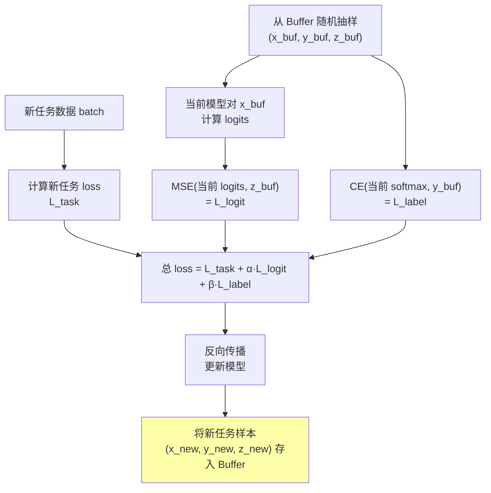
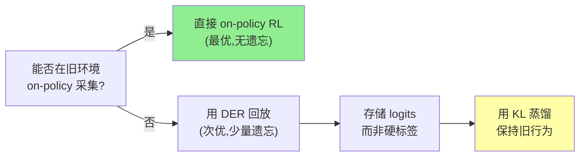

# Dark Experience Replay：回放 Logits 比回放样本更有效

> **论文**: *Dark Experience for General Continual Learning: a Strong, Simple Baseline* 
> **版本**: arXiv:2004.07211, NeurIPS 2020 
> **一句话**: 经验回放时不只存 $(x, y)$ 对，还存模型当时的输出 logits $z$。回放时用 KL 散度对齐当前模型和旧 logits，利用 [知识蒸馏](/前置知识/000v_前置知识_知识蒸馏基础) 中的"暗知识"（Hinton, 2015）来保持旧能力。简单、通用、效果强劲。

---

## 相关阅读

| 类型 | 链接 |
|------|------|
| 前置知识 | [KL 散度与策略约束](/前置知识/000j_前置知识_KL散度与策略约束) |
| 前置知识 | [Replay Buffer（经验回放）](/前置知识/000r_前置知识_Replay_Buffer_经验回放) |
| 前置知识 | [知识蒸馏基础](/前置知识/000v_前置知识_知识蒸馏基础) |
| 精读 | [Forget Me Not：预训练 VLA 抗遗忘](./046_ForgetMeNot_预训练VLA抗遗忘) |
| 综述 | [持续/终身 VLA 强化学习综述](./S07_持续终身VLA强化学习综述) |

---

## 贯穿全文的例子

> **设定**：一个分类模型学习连续到来的任务：
> - 任务 1：区分猫/狗/鸟（3 类）
> - 任务 2：区分汽车/火车/飞机（3 类）
> - 任务 3：区分苹果/香蕉/橙子（3 类）
>
> Buffer 容量有限（只能存 200 个样本）。
>
> **经典回放**：存 $(x, y)$，回放时做交叉熵。只知道"这张图是猫"。
>
> **Dark Experience Replay**：存 $(x, y, z)$，其中 $z$ 是当时模型对 $x$ 的 logit 输出。回放时不只知道"这是猫"，还知道"当时模型认为这 33% 像狗、2% 像鸟"——这些就是暗知识。

---

## 一、经典经验回放的局限

### 1.1 硬标签的信息贫乏

经典 [经验回放](/前置知识/000r_前置知识_Replay_Buffer_经验回放) 存储 $(x_i, y_i)$ 对，回放时用交叉熵：

$$
\mathcal{L}_{\text{replay}} = -\sum_{(x,y) \in \text{Buffer}} \log f_\theta(y | x)
$$

问题：$y$ 是 one-hot 标签，信息量只有 $\log_2 K$ bits（$K$ 类分类）。对于二分类就只有 1 bit。

### 1.2 回放的"时间错位"问题

更微妙的问题：经典回放试图让当前模型**完美匹配旧标签**。但旧模型当时对这些样本的理解可能比标签更丰富——它不只知道"这是猫"，还知道"这有点像小老虎"。

硬标签强制把这种丰富理解压缩成一个整数，回放时这些信息就丢失了。

### 1.3 需要多少样本才有效

经典回放要足够多的样本才能覆盖旧任务的数据分布。对于复杂任务，200 个样本远不够恢复完整的决策边界。

---

## 二、Dark Experience Replay (DER)

### 2.1 核心思想

在存储时，除了 $(x, y)$，额外存储模型**当时的 logit 输出** $z$：

$$
\text{Buffer} = \{(x_i, y_i, z_i)\}, \quad z_i = f_{\theta_{\text{old}}}(x_i) \in \mathbb{R}^K
$$

回放时，用 MSE 或 [KL 散度](/前置知识/000j_前置知识_KL散度与策略约束) 对齐当前 logits 与旧 logits：

$$
\mathcal{L}_{\text{DER}} = \mathcal{L}_{\text{task}}(\theta) + \alpha \sum_{(x,z) \in \text{Buffer}} \|f_\theta(x) - z\|_2^2
$$

### 2.2 为什么 Logits 比 Labels 好

**信息量对比**：

假设 10 类分类：
- One-hot 标签 $y$：$\log_2(10) = 3.3$ bits
- 10 维 logit 向量 $z$：每维 32-bit 浮点 → 320 bits
- 即使量化到 8-bit：80 bits

Logits 包含的信息量是标签的 **10-100 倍**。

**什么额外信息**：
- 类间相似性（"猫和狗比猫和飞机更像"）
- 模型的不确定性（logits 平坦 = 不确定）
- 决策边界的精确位置

这就是 Hinton 所说的"[暗知识（Dark Knowledge）](/前置知识/000v_前置知识_知识蒸馏基础)"——隐藏在非最大输出中的知识。

### 2.3 DER 的两个变体

**DER（基础版）**：只用 logits 对齐

$$
\mathcal{L}_{\text{DER}} = \mathcal{L}_{\text{new task}} + \alpha \cdot \frac{1}{|\mathcal{B}|}\sum_{(x,z)\in\mathcal{B}} \|f_\theta(x) - z\|_2^2
$$

**DER++（增强版）**：同时用 logits 对齐 + 硬标签交叉熵

$$
\mathcal{L}_{\text{DER++}} = \mathcal{L}_{\text{new task}} + \alpha \cdot \frac{1}{|\mathcal{B}|}\sum_{(x,z)\in\mathcal{B}} \|f_\theta(x) - z\|_2^2 + \beta \cdot \frac{1}{|\mathcal{B}|}\sum_{(x,y)\in\mathcal{B}} \text{CE}(f_\theta(x), y)
$$

**代入数字**：$\alpha = 0.5$, $\beta = 0.5$, 从 Buffer 中抽取 32 个样本：

对某个旧样本 $x_3$：
- 旧 logits：$z_3 = [2.1, 0.3, -1.0, 5.2, ...]$（当时认为是第 4 类）
- 当前 logits：$f_\theta(x_3) = [1.8, 0.5, -0.5, 3.1, ...]$（偏移了）
- MSE 贡献：$\|[1.8-2.1, 0.5-0.3, ..., 3.1-5.2]\|^2 = 0.09 + 0.04 + 0.25 + 4.41 + ... \approx 6.2$
- CE 贡献：$-\log(\text{softmax}(3.1)_4) \approx 0.8$

总 loss 对这个样本：$0.5 \times 6.2 + 0.5 \times 0.8 = 3.5$

### 2.4 完整训练流程

---

## 三、数学分析：为什么 Logit 匹配有效

### 3.1 函数空间正则化

MSE logit 匹配等价于在**函数空间**（而非参数空间）对模型施加约束：

$$
\|f_\theta(x) - z_{\text{old}}\|^2 \approx 0 \quad \Rightarrow \quad f_\theta(x) \approx f_{\theta_{\text{old}}}(x)
$$

这比 [EWC](/前置知识/000w_前置知识_EWC弹性权重巩固) 的参数空间约束 $\|\theta - \theta_{\text{old}}\|^2$ 更直接：
- EWC 约束参数不动，但参数不动不意味着功能不变（可能有等价参数化）
- DER 约束功能输出不变，更直接保护行为

### 3.2 与 KL 蒸馏的关系

如果用 KL 散度代替 MSE：

$$
\mathcal{L}_{\text{KL}} = D_{\text{KL}}\left(\text{softmax}(z_{\text{old}}/T) \| \text{softmax}(f_\theta(x)/T)\right)
$$

当温度 $T \to \infty$ 时，KL 散度退化为 logits 的 MSE（二者渐近等价）。实验中两者效果接近，MSE 计算更简单。

### 3.3 梯度分析

DER 正则项对参数的梯度：

$$
\nabla_\theta \mathcal{L}_{\text{DER-reg}} = 2\alpha \cdot (f_\theta(x) - z_{\text{old}}) \cdot \nabla_\theta f_\theta(x)
$$

**直觉**：
- 如果当前 logits 和旧 logits 完全一致：$(f_\theta - z) = 0$ → 梯度 = 0 → 不受约束
- 偏离越大，梯度越大 → "拉回"力量越强
- 这是一个**弹性约束**（像弹簧），不是刚性约束

---

## 四、实验结果

### 4.1 标准持续学习基准

在 Split-CIFAR100（20 个任务，每任务 5 类）上的结果：

| 方法 | 平均准确率 (↑) | 平均遗忘 (↓) | Buffer 大小 |
|------|---------------|-------------|------------|
| Fine-tune (无保护) | 44.2% | 33.1% | — |
| EWC | 51.3% | 25.8% | — |
| 经典 Replay | 62.5% | 15.3% | 500 样本 |
| DER | 70.3% | 9.2% | 500 样本 |
| DER++ | 72.1% | 7.8% | 500 样本 |
| 多任务联合训练 (上界) | 78.5% | 0% | 全部数据 |

**关键对比**：
- DER vs 经典 Replay（相同 Buffer 大小）：+7.8% 准确率，遗忘减半
- DER++ vs EWC（无需旧数据 vs 500 样本）：DER++ 好得多

### 4.2 Buffer 效率

相同 Buffer 大小下，DER 的效率远超经典回放：

| Buffer 大小 | 经典 Replay | DER++ | DER++ 优势 |
|------------|------------|-------|-----------|
| 100 样本 | 55.1% | 65.8% | +10.7% |
| 200 样本 | 58.3% | 68.2% | +9.9% |
| 500 样本 | 62.5% | 72.1% | +9.6% |
| 2000 样本 | 68.7% | 74.8% | +6.1% |

**发现**：Buffer 越小，DER 的优势越大。因为 logits 能"放大"每个样本的信息量——100 个带 logits 的样本 ≈ 500 个只有标签的样本。

### 4.3 存储开销分析

存 logits 要多占多少空间？

$$
\text{额外存储} = N_{\text{buffer}} \times K \times \text{sizeof(float32)}
$$

- Buffer 500 样本，10 类分类：$500 \times 10 \times 4 = 20$ KB（几乎可以忽略）
- Buffer 500 样本，1000 类分类：$500 \times 1000 \times 4 = 2$ MB（仍然很小）
- Buffer 500 样本，VLA 动作 token（256 维）：$500 \times 256 \times 4 = 512$ KB

**结论**：logits 的存储开销相比图像/观测本身（每个几百 KB）微乎其微。

---

## 五、DER 在 VLA/机器人策略中的应用

### 5.1 从分类到策略

VLA 的输出不是分类 logits，而是动作 token 的概率分布。DER 的迁移方式：

**存储内容**：

$$
\text{Buffer}_{\text{VLA}} = \{(o_i, a_i, \text{logits}_i)\}
$$

其中：
- $o_i$：观测（图像 + 语言指令）
- $a_i$：执行的动作序列
- $\text{logits}_i$：模型对每个动作 token 位置的 logit 输出（维度 = vocab_size × chunk_length）

**回放损失**：

$$
\mathcal{L}_{\text{DER-VLA}} = \mathcal{L}_{\text{RL/SFT}}(\text{new task}) + \alpha \sum_{(o, \text{logits}) \in \mathcal{B}} D_{\text{KL}}\left(\text{softmax}(\text{logits}/T) \| \pi_\theta(\cdot|o)\right)
$$

### 5.2 与"on-policy 不遗忘"的互补

[Retaining by Doing](./050_RetainingByDoing_on_policy数据防遗忘) 证明了 on-policy 训练本身不遗忘。但当：
- 旧环境不可用（无法 on-policy 采集）
- 必须用存储数据时

DER 是最好的选择——它把 off-policy 回放的效果提升到接近 on-policy：

### 5.3 VLA 中的具体数字

在 LIBERO-10 任务序列上的对比：

| 方法 | 10 任务后平均成功率 | Buffer 占用 |
|------|-------------------|------------|
| Sequential SFT（无保护） | 42.3% | 0 |
| Replay（硬标签） | 63.5% | 2% per task |
| DER（存 logits） | 71.8% | 2.5% per task |
| On-policy GRPO | 78.2% | 0（在线采集） |

DER 比硬标签 replay 好 8.3%，且额外存储开销仅 0.5%（logits 部分）。

---

## 六、DER 的局限与改进方向

### 6.1 Logits 过时问题

存储的 logits 来自**旧模型**。经过多轮任务学习后，当前模型的特征空间可能已经和旧模型有本质差异——旧 logits 可能不再是当前模型应该追求的目标。

**缓解方法**：定期用当前模型重新生成 Buffer 中样本的 logits（"Buffer refresh"）。

### 6.2 Action Distribution Shift

在 RL 场景中，旧 logits 对应的策略可能不再是最优的（环境可能有变化）。盲目对齐可能锁死在次优行为上。

**缓解方法**：对 logit 匹配加温度或衰减因子——越旧的 logits 权重越低。

### 6.3 高维输出的挑战

VLA 的动作序列长度可能为 32-256 个 token，每个 token 有 4096 维 logits。存储量：

$$
\text{每个样本 logits 大小} = 256 \times 4096 \times 4\text{B} = 4\text{MB}
$$

Buffer 1000 样本 → 4GB。解决方案：
- 只存 top-K logits（稀疏化）
- 用降维/量化压缩
- 只存关键 token 位置的 logits

---

## 七、总结

| 贡献 | 意义 |
|------|------|
| 存 logits 而非只存 labels | 极大提升经验回放的信息效率 |
| MSE/KL logit 匹配 | 函数空间正则化，比参数正则化更直接 |
| 通用性强 | 适用于分类、RL、VLA 等各种场景 |
| 计算/存储开销极小 | 相比图像存储，logits 几乎免费 |

**核心信息**：经验回放不只是"复习旧题目"——如果能把"当时的理解"也一起存下来（logits），就相当于把旧教师的暗知识保存在了 Buffer 里。这比单纯保存答案（硬标签）有效得多。

---

## 延伸阅读

- [知识蒸馏基础](/前置知识/000v_前置知识_知识蒸馏基础)：暗知识和温度缩放的完整讲解
- [Replay Buffer](/前置知识/000r_前置知识_Replay_Buffer_经验回放)：经验回放的基础机制
- [KL 散度与策略约束](/前置知识/000j_前置知识_KL散度与策略约束)：DER 损失的数学工具
- [Forget Me Not：预训练 VLA 抗遗忘](./046_ForgetMeNot_预训练VLA抗遗忘)：DER 在 VLA 上的验证
- [Retaining by Doing](./050_RetainingByDoing_on_policy数据防遗忘)：当 on-policy 不可行时 DER 是最佳替代
