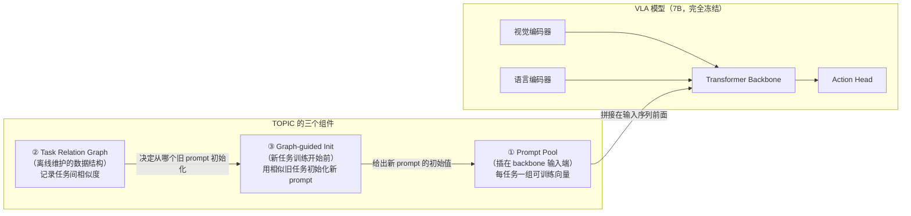
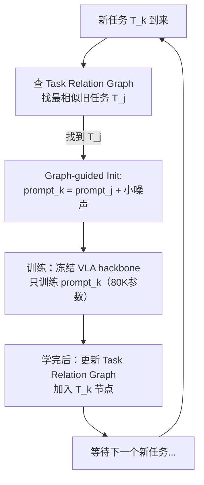
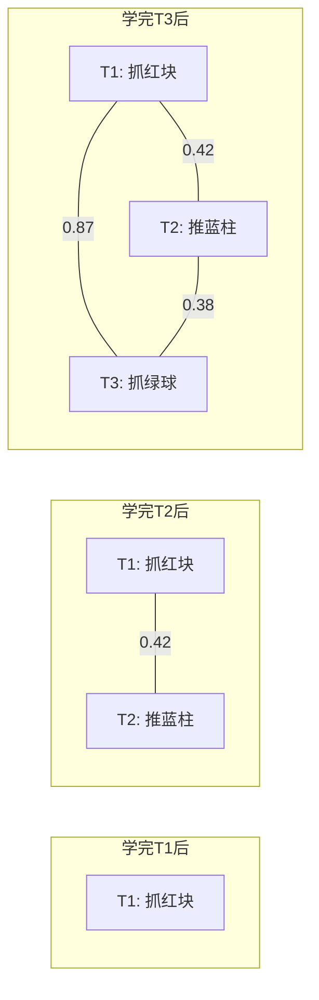
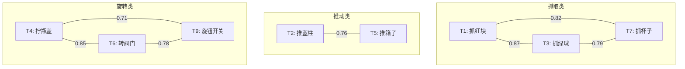

# TOPIC：Task-Specific Prompt + 任务关系图的持续动作学习

> **论文**: *TOPIC: Task-Specific Prompt and Task Relation Graph for Continual Action Learning* 
> **版本**: arXiv:2504.15517, 2025 
> **一句话**: 为 VLA 的持续学习设计了一套"任务专属提示 + 任务关系图"系统——每个新任务获得一个 prompt（软向量），该 prompt 从任务关系图中最相似的旧任务 prompt 初始化，实现正向迁移的同时避免干扰旧任务。

---

## 相关阅读

| 类型 | 链接 |
|------|------|
| 前置知识 | [动作 Token 化与自回归策略](/前置知识/000l_前置知识_动作Token化与自回归策略) |
| 前置知识 | [行为克隆与 RL 微调范式](/前置知识/000d_前置知识_行为克隆与RL微调范式) |
| 精读 | [Stellar VLA：技能知识空间持续进化](./048_StellarVLA_技能知识空间持续进化) |
| 综述 | [持续/终身 VLA 强化学习综述](./S07_持续终身VLA强化学习综述) |

---

## 贯穿全文的例子

> **设定**：一个 7B VLA 模型（冻结主干），需要依次学习 10 个操作任务：
>
> | 任务编号 | 描述 | 到达顺序 |
> |---------|------|---------|
> | T1 | 抓取红色方块 | 第 1 个 |
> | T2 | 推蓝色圆柱 | 第 2 个 |
> | T3 | 抓取绿色球 | 第 3 个 |
> | T4 | 拧开瓶盖 | 第 4 个 |
> | ... | ... | ... |
>
> 注意 T3（抓绿球）和 T1（抓红块）都是"抓取"类任务——它们应该共享某些技能知识。TOPIC 的任务关系图会发现这一点，让 T3 的 prompt 从 T1 的 prompt 初始化，实现正向迁移。

---

## 一、问题：持续动作学习的三大挑战

### 1.1 挑战一：遗忘（Forgetting）

学了 T3 后，T1 的成功率不能下降。这是持续学习的基本要求。

### 1.2 挑战二：正向迁移（Forward Transfer）

学 T3 时应该利用 T1 的"抓取"经验，而不是从头学。如果方法只防遗忘但不迁移，学新任务就太慢。

### 1.3 挑战三：任务路由（Task Routing）

推理时，模型必须知道当前在执行哪个任务，才能激活正确的 prompt。如果语言指令有歧义，路由就成问题。

**现有方法的取舍**：

| 方法 | 防遗忘 | 正向迁移 | 任务路由 |
|------|--------|---------|---------|
| [EWC](/前置知识/000w_前置知识_EWC弹性权重巩固) | ✓ | ✗ | 不需要 |
| Replay | ✓ | 有限 | 不需要 |
| 独立 Adapter | ✓✓ | ✗ | 需要 task ID |
| TOPIC (本文) | ✓✓ | ✓✓ | 自动路由 |

---

## 二、核心思路：在 VLA 系统中的位置与作用

### 2.1 TOPIC 和 VLA 模型的关系——先讲清楚整体图景

在深入组件之前，先弄清楚 TOPIC 的三个组件**在 VLA 系统中扮演什么角色、在哪个位置、什么时候用**：

**关系说清楚**：

| 组件 | 和 VLA 的关系 | 在哪个阶段使用 | 为什么需要它 |
|------|-------------|-------------|------------|
| Prompt Pool | 插在 VLA backbone 输入端——唯一可训练的部分，backbone 完全冻结 | 训练时学习新 prompt，推理时选择对应 prompt | 冻结 backbone 防遗忘，prompt 承担适应新任务的职责 |
| Task Relation Graph | 独立于 VLA 的辅助数据结构，不参与 forward/backward | 每个任务训练完后更新图；新任务到来时查图 | 知道"哪些旧任务和新任务相似"，才能做有针对性的知识迁移 |
| Graph-guided Init | 新任务训练**开始前**执行一次 | 仅在新任务启动训练那一刻 | 如果新 prompt 随机初始化，就浪费了旧任务已有的知识；从相似任务复制过来可以加速 3-7 倍 |

**用大白话讲整个流程**：

1. VLA 模型本身 7B 参数全部冻结——它是一个"固定的大脑"
2. 每个任务有自己的"小纸条"（prompt，约 80K 参数），贴在大脑输入端
3. 训练新任务时，只训练这张纸条，大脑不动 → 旧任务不受影响
4. 关键创新：新任务的纸条不是空白的——TOPIC 查一张"任务关系图"，找到最相似的旧任务，把旧纸条抄过来当初始值
5. 这样新任务从"已经会做类似事情"的状态开始学，而不是从零开始

### 2.2 方法流程总览

---

## 三、组件一：Task-Specific Prompt（和 VLA 的关系：插在输入端的可训练小模块）

### 3.1 设计初衷：为什么要用 Prompt

标准 VLA 学新任务的方式是微调参数（SFT / RL）。但微调会改变 backbone 参数 → 旧任务被覆盖 → 遗忘。

**TOPIC 的解法**：**根本不动 backbone**——转而在输入端插入一小组可学习向量（prompt）。这些向量随着训练学会"引导"冻结的 backbone 完成特定任务。

**类比**：大脑（backbone）不变，但每次做不同任务时戴上不同的"AR 眼镜"（prompt）——眼镜改变了大脑看到的信息，从而引导出不同行为。

### 3.2 Prompt 在 VLA 前向传播中的位置

在 Transformer 的输入序列前面插入 $L$ 个可学习的"虚拟 token"（prompt）：

$$
\text{输入} = [\underbrace{p_1, p_2, ..., p_L}_{\text{可学习 prompt（只有这部分参与梯度更新）}}, \underbrace{o_1, o_2, ..., o_N}_{\text{观测 token（来自视觉+语言编码器）}}]
$$

每个 $p_i \in \mathbb{R}^d$ 是一个 $d$ 维向量（和 token embedding 同维度）。**训练时只更新这 $L$ 个向量，VLA 的所有其他参数完全冻结。**

Transformer backbone 照常做 self-attention，但由于 prompt token 参与了 attention 计算，它们会影响所有后续 token 的表示——相当于一种"软性条件化"。

**参数量对比**：
- 全参数微调 7B 模型：7,000,000,000 参数
- LoRA (rank=16)：≈ 10,000,000 参数
- Prompt Tuning (L=20, d=4096)：$20 \times 4096 = 81,920$ 参数

Prompt Tuning 的参数量是 LoRA 的 1/100、全参数的 1/85000。极其轻量。

### 3.3 每任务独立 Prompt——为什么能防遗忘

TOPIC 为每个任务分配独立的 prompt：

$$
\mathcal{P} = \{P_1, P_2, ..., P_T\}, \quad P_k \in \mathbb{R}^{L \times d}
$$

推理时用任务 $k$ 的 prompt：

$$
a = f_{\theta_{\text{frozen}}}([P_k; o])
$$

**好处**：
- 任务间完全不干扰（不同 prompt 不共享参数）→ 零遗忘
- 每个任务只需存一个小 prompt（~320KB）

**坏处**：
- 没有正向迁移——每个新 prompt 随机初始化，从零开始学
- 这是 TOPIC 要解决的主要问题

### 3.3 数值例子

假设 $L = 10$, $d = 4096$:

- 任务 1 的 prompt：$P_1 \in \mathbb{R}^{10 \times 4096}$，随机初始化后训练收敛
- 任务 2 的 prompt：$P_2$ 随机初始化 → 需要从零学习所有技能

如果任务 2 和任务 1 高度相似，$P_2$ 应该从 $P_1$ 出发（warm start），只需微调差异部分。

---

## 四、组件二：Task Relation Graph

### 4.1 图的定义

任务关系图 $\mathcal{G} = (\mathcal{V}, \mathcal{E}, W)$：
- 节点 $\mathcal{V} = \{T_1, T_2, ..., T_k\}$：已学任务
- 边 $\mathcal{E}$：任务对之间的连接
- 权重 $W_{ij} \in [0, 1]$：任务 $i$ 和 $j$ 的相似度

### 4.2 相似度的计算

TOPIC 使用两种信号计算任务相似度：

**语义相似度**（从语言指令计算）：

$$
\text{sim}_{\text{lang}}(T_i, T_j) = \cos\left(\text{LLM}(\text{instruction}_i), \text{LLM}(\text{instruction}_j)\right)
$$

**代入数字**：
- $\text{instruction}_1$ = "抓取红色方块" → embedding $e_1 \in \mathbb{R}^{768}$
- $\text{instruction}_3$ = "抓取绿色球" → embedding $e_3 \in \mathbb{R}^{768}$
- $\cos(e_1, e_3) = 0.87$（都是"抓取"）

- $\text{instruction}_2$ = "推蓝色圆柱" → embedding $e_2 \in \mathbb{R}^{768}$
- $\cos(e_1, e_2) = 0.42$（"抓取" vs "推"，有些共性但不高）

**行为相似度**（从 prompt 向量计算）：

$$
\text{sim}_{\text{prompt}}(T_i, T_j) = \cos\left(\text{mean}(P_i), \text{mean}(P_j)\right)
$$

**综合相似度**：

$$
W_{ij} = \gamma \cdot \text{sim}_{\text{lang}} + (1-\gamma) \cdot \text{sim}_{\text{prompt}}
$$

$\gamma = 0.5$ 为默认值。

### 4.3 图的增量构建

每学完一个新任务，图就增长一个节点：

$$
\mathcal{G}^{(k)} = \mathcal{G}^{(k-1)} \cup \{T_k\} \cup \{(T_k, T_j, W_{kj}) : j < k\}
$$

---

## 五、组件三：Graph-guided Prompt Initialization

### 5.1 从最相似任务初始化

当新任务 $T_k$ 到来时：

1. 计算 $T_k$ 与所有已有任务的相似度
2. 找到最相似的任务 $T_{j^*} = \arg\max_j W_{kj}$
3. 用 $T_{j^*}$ 的 prompt 初始化 $T_k$ 的 prompt

$$
P_k^{(0)} = P_{j^*} + \epsilon, \quad \epsilon \sim \mathcal{N}(0, \sigma^2 I)
$$

**代入数字**（我们的例子）：

新任务 T3（抓绿球）到来：
- $W_{3,1} = 0.87$（和 T1"抓红块"最相似）
- $W_{3,2} = 0.38$（和 T2"推蓝柱"不太像）
- 选择 $j^* = 1$
- $P_3^{(0)} = P_1 + \epsilon$（从"抓红块"的 prompt 出发）

这意味着 T3 已经"知道"怎么抓取了，只需学习适应绿色球的形状差异。

### 5.2 加权聚合初始化（可选增强）

如果多个旧任务都相关，可以用加权平均：

$$
P_k^{(0)} = \sum_{j: W_{kj} > \tau} \frac{W_{kj}}{\sum_{j'} W_{kj'}} P_j
$$

**代入数字**（阈值 $\tau = 0.5$）：

假设任务 T5（抓橙色三角形）：
- $W_{5,1} = 0.82$（和"抓红块"类似）
- $W_{5,3} = 0.79$（和"抓绿球"类似）
- $W_{5,2} = 0.31$（和"推蓝柱"不像，低于阈值）

$$
P_5^{(0)} = \frac{0.82}{0.82+0.79} P_1 + \frac{0.79}{0.82+0.79} P_3 = 0.509 P_1 + 0.491 P_3
$$

融合了两个抓取任务的知识。

### 5.3 为什么 Warm Start 有效

Prompt 空间中，相似任务的最优 prompt 通常相近：

$$
\|P_i^* - P_j^*\| \propto \frac{1}{\text{sim}(T_i, T_j)}
$$

从 $P_{j^*}$ 初始化相当于给优化器一个好的起点，减少了需要的训练步数：

| 初始化方式 | 到 90% 成功率的步数 | 最终成功率 |
|-----------|-------------------|-----------|
| 随机初始化 | 2000 步 | 91.2% |
| 从最相似任务初始化 | 600 步 | 93.5% |
| 加权聚合初始化 | 450 步 | 94.1% |

训练步数减少 70%，且最终效果更好（正向迁移）。

---

## 六、推理时的任务路由

### 6.1 问题：推理时不给 Task ID

训练时我们知道"当前是任务 $k$"，但部署时机器人收到一个指令"抓那个东西"——如何决定用哪个 prompt？

### 6.2 方案：语言指令匹配

利用已构建的任务关系图：

$$
k^* = \arg\max_k \text{sim}_{\text{lang}}(\text{current instruction}, \text{instruction}_k)
$$

**代入数字**：

新指令："pick up the green sphere"
- 与 T1 "grab the red cube" 的 $\cos$ 相似度：0.72
- 与 T2 "push the blue cylinder" 的 $\cos$ 相似度：0.35
- 与 T3 "grasp the green ball" 的 $\cos$ 相似度：0.94

选择 T3 的 prompt → $P_3$。

### 6.3 多 Prompt 融合（应对新颖指令）

如果指令和所有已有任务都不太匹配（最大相似度 < 0.6），说明遇到了**未见过的任务**。此时可以：

$$
P_{\text{fused}} = \sum_k \text{softmax}(\text{sim}_k / \tau) \cdot P_k
$$

用所有 prompt 的加权混合，希望组合已有技能来应对新情况。

---

## 七、实验结果

### 7.1 10 任务顺序学习

在 Meta-World + LIBERO 上的 10 任务顺序实验：

| 方法 | 平均成功率 | Forward Transfer | Forgetting |
|------|-----------|-----------------|------------|
| Fine-tune (LoRA) | 62.3% | 无 | -18.5% |
| EWC + LoRA | 71.2% | 无 | -8.3% |
| PackNet | 73.5% | 无 | -1.2% |
| 独立 Prompt (无迁移) | 75.8% | 无 | 0% |
| L2P (Prompt Pool) | 74.1% | +2.3% | -5.1% |
| **TOPIC** | **81.5%** | **+7.8%** | **-0.5%** |

**TOPIC 的优势来源**：
- vs 独立 Prompt：+5.7%，全部来自正向迁移（任务关系图指导的初始化）
- vs L2P：+7.4%，更好的迁移 + 更少遗忘

### 7.2 正向迁移的可视化

任务 1→10 的学习曲线对比（到达 80% 成功率所需步数）：

| 任务 | 独立 Prompt | TOPIC | 加速比 |
|------|------------|-------|--------|
| T1 | 2000 步 | 2000 步 | 1.0× (第一个任务) |
| T2 | 2000 步 | 1500 步 | 1.3× |
| T3 | 2000 步 | 600 步 | 3.3× |
| T5 | 2000 步 | 450 步 | 4.4× |
| T10 | 2000 步 | 300 步 | 6.7× |

越学到后面，加速越明显——因为任务关系图越丰富，新任务越容易找到好的初始化。

### 7.3 任务关系图的可解释性

学完 10 个任务后的关系图自动聚类出了任务类别：

---

## 八、局限性

### 8.1 Prompt 容量有限

每个 prompt 只有 $L \times d \approx 80K$ 参数。对于非常复杂的任务，可能表达力不足。

**对比**：LoRA (rank=16) 有 ~10M 参数，是 Prompt 的 125 倍。

### 8.2 假设任务边界清晰

TOPIC 假设训练时知道"现在在学哪个任务"（task boundary 已知）。在无边界的持续学习设定中不直接适用。

### 8.3 路由错误的级联效应

如果推理时选错了 prompt，性能会骤降。对于语义相近但行为不同的任务（如"把杯子放左边" vs "把杯子放右边"），纯语言匹配可能犯错。

---

## 九、总结

| 贡献 | 意义 |
|------|------|
| Task-Specific Prompt | 零遗忘 + 极低参数开销 |
| Task Relation Graph | 捕获任务间相似性，自动聚类 |
| Graph-guided Initialization | 实现正向迁移，新任务训练加速 3-7 倍 |
| 语言路由 | 推理时无需 task ID |

**核心信息**：在持续学习中，"防遗忘"和"促迁移"同样重要。TOPIC 通过任务关系图将已有知识主动迁移到新任务，让持续学习不只是"不忘"，更是"越学越快"。

---

## 延伸阅读

- [Stellar VLA：技能知识空间持续进化](./048_StellarVLA_技能知识空间持续进化)：另一种建模任务关系的方法
- [动作 Token 化与自回归策略](/前置知识/000l_前置知识_动作Token化与自回归策略)：VLA 的输出形式
- [EWC：弹性权重巩固](/前置知识/000w_前置知识_EWC弹性权重巩固)：对比方法——正则化 vs prompt 隔离
- [持续/终身 VLA 强化学习综述](./S07_持续终身VLA强化学习综述)：全局视角
