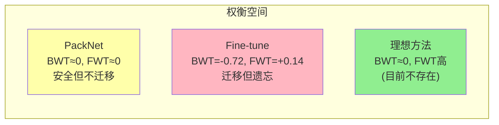

# Continual World：第一个系统性的持续机器人 RL 基准

> **论文**: *Continual World: A Robotic Benchmark for Continual Reinforcement Learning*<br>
> **版本**: arXiv:2105.10919, NeurIPS 2021<br>
> **一句话**: 基于 Meta-World 构建了首个面向机器人操作的持续 RL 基准——10 个操作任务顺序学习，同时测量遗忘（BWT）和正向迁移（FWT）。关键发现：正向迁移和防遗忘同等重要，多数方法只关注了后者；PackNet 防遗忘最好但无迁移，Fine-tune+SAC 有最好的迁移但遗忘严重。

---

## 相关阅读

| 类型 | 链接 |
|------|------|
| 前置知识 | [策略梯度与 PPO](/前置知识/000a_前置知识_策略梯度与PPO) |
| 前置知识 | [SAC (Soft Actor-Critic)](/前置知识/000k_前置知识_SAC_Soft_Actor_Critic) |
| 综述 | [持续/终身 VLA 强化学习综述](./S07_持续终身VLA强化学习综述) |
| 精读 | [Simple Recipe：VLA 天然持续学习者](./045_SimpleRecipe_VLA天然持续学习者) |

---

## 贯穿全文的例子

> **设定**：一个 Sawyer 机械臂，需要顺序学习 10 个操作任务（CW10 序列）：
>
> | 序号 | 任务 | 描述 |
> |------|------|------|
> | 1 | hammer-v1 | 用锤子敲钉子 |
> | 2 | push-wall-v1 | 把物体推过墙壁缺口 |
> | 3 | faucet-close-v1 | 关水龙头 |
> | 4 | push-back-v1 | 把物体推回原位 |
> | 5 | stick-pull-v1 | 用棍子勾物体 |
> | 6 | handle-press-side-v1 | 侧面按压把手 |
> | 7 | push-v1 | 推物体到目标位置 |
> | 8 | shelf-place-v1 | 把物体放到架子上 |
> | 9 | window-close-v1 | 关窗户 |
> | 10 | peg-unplug-side-v1 | 侧面拔出插销 |
>
> 每个任务训练 100 万步（[SAC](/前置知识/000k_前置知识_SAC_Soft_Actor_Critic)），然后切到下一个。10 个任务共 1000 万步。
>
> 最终评估：10 个任务各测 50 episode，报告平均成功率。

---

## 一、为什么需要一个持续 RL 基准

### 1.1 持续学习领域的现状（2021 年前）

2021 年前，持续学习研究主要在**监督学习**上：
- Split-CIFAR、Split-ImageNet：图像分类
- Permuted MNIST：简单变换
- 评估指标：只看遗忘（backward transfer）

但这些基准和**机器人 RL** 有根本差异：
- 监督学习的"任务"是新类别——数据分布变了，但学习算法不变
- RL 的"任务"是新 MDP——奖励、转移函数、甚至动作空间都可能不同
- RL 有**探索**问题——持续学习还要考虑"旧任务的探索经验能否帮助新任务"

### 1.2 Continual World 的设计哲学

1. **足够难但可解**：每个任务单独用 SAC 训练都能到 90%+ 成功率，但顺序学习时会遗忘
2. **任务间有迁移潜力**：都是同一个机械臂，共享底层运动技能
3. **可复现**：基于 Meta-World（开源），有标准化评估协议
4. **同时测两个维度**：遗忘（BWT）和正向迁移（FWT）

---

## 二、基准设计

### 2.1 任务空间

从 Meta-World 的 50 个任务中精选 10 个，使得：
- 难度适中（SAC 100 万步能学会）
- 涵盖多种操作类型（推、拉、按、放、拔）
- 部分任务间有明显的技能共享（如多个"推"任务）

### 2.2 观测和动作空间

所有 10 个任务共享相同的观测和动作空间：

$$
s \in \mathbb{R}^{39} \quad (\text{关节角度 + 物体位置 + 目标位置})
$$
$$
a \in \mathbb{R}^{4} \quad (\text{末端执行器 xyz 速度 + 夹爪})
$$

这使得**同一个网络**可以处理所有任务（没有需要扩展的输出头），是持续学习的理想设定。

### 2.3 训练协议

**CW10 协议**：

```
for task_id = 1, 2, ..., 10:
    训练当前任务 1M 步（SAC）
    评估所有已见任务的成功率
    切换到下一个任务
最终评估所有 10 个任务
```

**CW20 协议**：同样 10 个任务，但重复两遍（测试二次学习效果）。

---

## 三、评估指标

### 3.1 性能矩阵

定义 $R_{i,j}$ 为"学完第 $j$ 个任务后，在第 $i$ 个任务上的成功率"：

$$
R = \begin{bmatrix}
R_{1,1} & R_{1,2} & ... & R_{1,10} \\
- & R_{2,2} & ... & R_{2,10} \\
- & - & ... & R_{3,10} \\
\vdots & & \ddots & \vdots \\
- & - & ... & R_{10,10}
\end{bmatrix}
$$

只有上三角有意义（$R_{i,j}$ 要求 $j \geq i$）。

**代入数字**（Fine-tune 方法的某次实验）：

$$
R = \begin{bmatrix}
0.95 & 0.82 & 0.61 & 0.43 & 0.28 & 0.15 & 0.08 & 0.05 & 0.03 & 0.02 \\
- & 0.91 & 0.78 & 0.55 & 0.38 & 0.22 & 0.12 & 0.07 & 0.04 & 0.02 \\
... & & & & & & & & & ...
\end{bmatrix}
$$

可以看到 Fine-tune 的灾难性遗忘：任务 1 从 0.95 降到 0.02。

### 3.2 Backward Transfer (BWT)

衡量遗忘程度：

$$
\text{BWT} = \frac{1}{T-1}\sum_{i=1}^{T-1} (R_{i,T} - R_{i,i})
$$

**逐项拆解**：
- $R_{i,i}$：任务 $i$ 刚学完时的成功率
- $R_{i,T}$：所有任务学完后，任务 $i$ 的成功率
- BWT < 0 表示遗忘，越负越严重

**代入数字**：
- 任务 1：$R_{1,1} = 0.95$, $R_{1,10} = 0.02$ → 贡献 $0.02 - 0.95 = -0.93$
- 任务 5：$R_{5,5} = 0.88$, $R_{5,10} = 0.35$ → 贡献 $0.35 - 0.88 = -0.53$
- 平均 BWT ≈ -0.65（Fine-tune 的灾难性遗忘）

### 3.3 Forward Transfer (FWT)

衡量正向迁移：

$$
\text{FWT} = \frac{1}{T-1}\sum_{i=2}^{T} (R_{i,i} - R_{i,i}^{\text{random}})
$$

**逐项拆解**：
- $R_{i,i}$：用持续学习方法训练到任务 $i$ 时的成功率
- $R_{i,i}^{\text{random}}$：从**随机初始化**开始训练任务 $i$ 的成功率（独立基线）
- FWT > 0 表示有正向迁移

**代入数字**：
- 任务 3（关水龙头）：用 Fine-tune 在前两个任务后再学 → $R_{3,3} = 0.92$
- 独立训练任务 3 → $R_{3,3}^{\text{random}} = 0.85$
- FWT 贡献：$0.92 - 0.85 = +0.07$（有迁移）

### 3.4 综合指标

$$
\text{Performance} = \frac{1}{T}\sum_{i=1}^T R_{i,T} \quad (\text{最终平均成功率})
$$

$$
\text{Performance} = \text{FWT} - |\text{BWT}| + \text{Baseline}
$$

**核心洞察**：最终性能 = 正向迁移 - 遗忘 + 基线能力。如果只看防遗忘而忽略迁移，可能不如有迁移但有些遗忘的方法。

---

## 四、基线方法与结果

### 4.1 测试的方法

| 方法 | 类型 | 核心机制 |
|------|------|---------|
| Fine-tune | 无保护 | 直接顺序训练 SAC |
| L2 | 正则化 | $\lambda\|\theta - \theta_{\text{old}}\|^2$ |
| [EWC](/前置知识/000w_前置知识_EWC弹性权重巩固) | 正则化 | Fisher 加权 L2 |
| PackNet | 参数隔离 | 剪枝 + 固定 + 分配 |
| Perfect Memory | 回放 | 存所有旧数据混合训练 |
| Multi-task | 上界 | 所有任务同时训练 |

### 4.2 CW10 主要结果

| 方法 | 最终平均成功率 | BWT (遗忘) | FWT (迁移) |
|------|---------------|-----------|-----------|
| Fine-tune | 13.2% | -0.72 | **+0.14** |
| L2 | 25.1% | -0.58 | +0.08 |
| EWC | 34.7% | -0.45 | +0.06 |
| PackNet | 69.8% | **-0.02** | +0.01 |
| Perfect Memory | 72.3% | -0.08 | +0.12 |
| Multi-task (上界) | 89.5% | 0 | — |

### 4.3 关键发现

**发现 1：Fine-tune 有最好的正向迁移**

出人意料：没有任何保护的 Fine-tune 反而 FWT 最高（+0.14）。原因：自由更新参数时，旧任务的知识被"借用"到新任务——虽然旧任务被破坏了，但新任务因此起步更高。

**发现 2：PackNet 零遗忘但零迁移**

PackNet 通过给每个任务分配独立参数子集来防遗忘。代价是：旧任务的参数被冻结，无法被新任务利用 → FWT ≈ 0。

**发现 3：没有方法能同时做到两者**

存在一个隐含的 **遗忘-迁移权衡（Forgetting-Transfer Tradeoff）**：

$$
\text{Performance} \approx f(\text{FWT}, \text{BWT}) \quad \text{s.t.} \quad \text{FWT} + |\text{BWT}| \leq C
$$

增强正向迁移通常意味着参数被新任务修改 → 遗忘增加。



---

## 五、对后续工作的影响

### 5.1 本文的遗产

Continual World 成为后续很多工作的标准评估基准：

| 后续工作 | 年份 | 在 CW10 上的改进 |
|---------|------|-----------------|
| ClonEx-SAC | 2022 | 结合探索克隆和 SAC，FWT +0.05 |
| [Simple Recipe](./045_SimpleRecipe_VLA天然持续学习者) | 2025 | 用大 VLA + RL 突破权衡 |
| [TOPIC](./053_TOPIC_任务增量提示学习VLA) | 2025 | Prompt 隔离 + 图迁移 |
| [Retaining by Doing](./050_RetainingByDoing_on_policy数据防遗忘) | 2025 | 解释 on-policy 为什么不遗忘 |

### 5.2 CW10 的局限性（后续工作的动机）

1. **状态输入而非视觉输入**：39 维状态向量，不是图像。后来的 LIBERO 解决了这个问题
2. **只用 SAC**：没测 on-policy 方法（PPO）。后来发现 on-policy 可能天然好得多
3. **网络太小**：只用 2 层 MLP (256-256)。后来发现大模型天然抗遗忘
4. **没有语言条件**：无法用语言指令区分任务。VLA 范式天然带语言

### 5.3 从 CW10 到现代 VLA 持续学习

现代 VLA 持续学习（2024-2025）与 CW10 的对比：

| 维度 | CW10 (2021) | 现代 VLA (2025) |
|------|-------------|----------------|
| 观测 | 39D 状态 | 图像 + 语言 |
| 模型 | 2 层 MLP (100K) | 7B Transformer |
| RL 算法 | SAC (off-policy) | GRPO/PPO (on-policy) |
| 遗忘程度 | 灾难性 (BWT=-0.72) | 轻微 (BWT≈-0.03) |
| 核心瓶颈 | 遗忘 | 正向迁移/效率 |

**历史启示**：CW10 时代的核心问题是"如何不忘"；到了大 VLA 时代，on-policy RL + 大模型已经让遗忘不再是主要问题（见 [RL's Razor](./047_RLsRazor_在线RL为什么不遗忘)），新的核心问题变成了"如何高效迁移"和"如何扩展到 50+ 任务"。

---

## 六、复现指南

### 6.1 环境安装

CW10 基于 Meta-World 和 MuJoCo：

```python
# 任务构造
import metaworld
CW10_TASKS = [
    'hammer-v1', 'push-wall-v1', 'faucet-close-v1',
    'push-back-v1', 'stick-pull-v1', 'handle-press-side-v1',
    'push-v1', 'shelf-place-v1', 'window-close-v1', 'peg-unplug-side-v1'
]
```

### 6.2 训练循环伪代码

```python
agent = SAC(obs_dim=39, act_dim=4, hidden=[256, 256])

for task_idx, task_name in enumerate(CW10_TASKS):
    env = make_env(task_name)
    
    for step in range(1_000_000):
        # 正常 SAC 训练
        obs = env.reset()
        action = agent.act(obs)
        next_obs, reward, done, info = env.step(action)
        agent.replay_buffer.add(obs, action, reward, next_obs, done)
        agent.train_step()
    
    # 评估所有已见任务
    for eval_task in CW10_TASKS[:task_idx+1]:
        success_rate = evaluate(agent, eval_task, n_episodes=50)
        R[eval_task][task_idx] = success_rate
```

### 6.3 SAC 超参数

本文使用的 [SAC](/前置知识/000k_前置知识_SAC_Soft_Actor_Critic) 超参数：

| 超参数 | 值 |
|--------|-----|
| 学习率 (actor/critic) | 3e-4 |
| Discount factor $\gamma$ | 0.99 |
| Soft update $\tau$ | 0.005 |
| Replay buffer 大小 | 1M |
| Batch size | 256 |
| 自动温度调节 | ✓ |
| 网络结构 | MLP [256, 256] |

---

## 七、指标计算的详细数值例子

### 7.1 假设一个简化的 3 任务场景

性能矩阵：

| | 学完 T1 | 学完 T2 | 学完 T3 |
|---|---------|---------|---------|
| T1 | **0.92** | 0.55 | 0.20 |
| T2 | — | **0.88** | 0.45 |
| T3 | — | — | **0.90** |

**BWT 计算**：
$$
\text{BWT} = \frac{1}{2}\left[(R_{1,3} - R_{1,1}) + (R_{2,3} - R_{2,2})\right]
$$
$$
= \frac{1}{2}\left[(0.20 - 0.92) + (0.45 - 0.88)\right] = \frac{-0.72 + (-0.43)}{2} = -0.575
$$

**FWT 计算**（假设独立训练基线为 $[0.85, 0.83, 0.84]$）：
$$
\text{FWT} = \frac{1}{2}\left[(R_{2,2} - 0.83) + (R_{3,3} - 0.84)\right]
$$
$$
= \frac{(0.88 - 0.83) + (0.90 - 0.84)}{2} = \frac{0.05 + 0.06}{2} = +0.055
$$

**最终性能**：
$$
\text{Perf} = \frac{1}{3}(0.20 + 0.45 + 0.90) = 0.517
$$

### 7.2 理想方法的目标

$$
\text{理想 BWT} \geq -0.05, \quad \text{理想 FWT} \geq +0.10
$$
$$
\text{理想 Perf} = \frac{1}{T}\sum_i R_{i,i} + \text{FWT} - |\text{BWT}| \approx 0.90
$$

---

## 八、总结

| 贡献 | 意义 |
|------|------|
| 首个系统性持续 RL 基准 | 填补了持续学习 × 机器人 RL 的空白 |
| BWT + FWT 双指标框架 | 首次正式强调正向迁移的重要性 |
| 遗忘-迁移权衡的发现 | 为后续工作指明方向 |
| 多基线方法的公平比较 | 统一实验设定下的 benchmark |

**核心信息**：持续 RL 的目标不只是"不忘旧任务"——如果一个方法通过完全隔离参数来防遗忘，但每个新任务都从零学起，那还不如有温和遗忘但有正向迁移的方法。最终性能 = 迁移收益 - 遗忘损失。

---

## 延伸阅读

- [SAC (Soft Actor-Critic)](/前置知识/000k_前置知识_SAC_Soft_Actor_Critic)：CW10 的默认 RL 算法
- [EWC：弹性权重巩固](/前置知识/000w_前置知识_EWC弹性权重巩固)：CW10 测试的正则化基线
- [Simple Recipe：VLA 天然持续学习者](./045_SimpleRecipe_VLA天然持续学习者)：在现代 VLA 上超越了 CW10 的权衡
- [TOPIC：任务增量提示学习](./053_TOPIC_任务增量提示学习VLA)：同时解决迁移和遗忘
- [持续/终身 VLA 强化学习综述](./S07_持续终身VLA强化学习综述)：CW10 在更大图景中的位置
