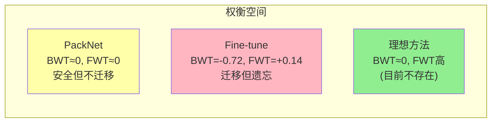

# Continual World：第一个系统性的持续机器人 RL 基准

> **论文**: *Continual World: A Robotic Benchmark for Continual Reinforcement Learning*<br>
> **版本**: arXiv:2105.10919, NeurIPS 2021<br>
> **一句话**: 基于 Meta-World 构建了首个面向机器人操作的持续 RL 基准——10 个操作任务顺序学习，同时测量遗忘（BWT）和正向迁移（FWT）。关键发现：正向迁移和防遗忘同等重要，多数方法只关注了后者；PackNet 防遗忘最好但无迁移，Fine-tune+SAC 有最好的迁移但遗忘严重。

---

## 相关阅读

| 类型 | 链接 |
|------|------|
| 前置知识 | [策略梯度与 PPO](/前置知识/000a_前置知识_策略梯度与PPO) |
| 前置知识 | [SAC (Soft Actor-Critic)](/前置知识/000k_前置知识_SAC_Soft_Actor_Critic) |
| 综述 | [持续/终身 VLA 强化学习综述](./S07_持续终身VLA强化学习综述) |
| 精读 | [Simple Recipe：VLA 天然持续学习者](./045_SimpleRecipe_VLA天然持续学习者) |

---

## 贯穿全文的例子

> **设定**：一个 Sawyer 机械臂，需要顺序学习 10 个操作任务（CW10 序列）：
>
> | 序号 | 任务 | 描述 |
> |------|------|------|
> | 1 | hammer-v1 | 用锤子敲钉子 |
> | 2 | push-wall-v1 | 把物体推过墙壁缺口 |
> | 3 | faucet-close-v1 | 关水龙头 |
> | 4 | push-back-v1 | 把物体推回原位 |
> | 5 | stick-pull-v1 | 用棍子勾物体 |
> | 6 | handle-press-side-v1 | 侧面按压把手 |
> | 7 | push-v1 | 推物体到目标位置 |
> | 8 | shelf-place-v1 | 把物体放到架子上 |
> | 9 | window-close-v1 | 关窗户 |
> | 10 | peg-unplug-side-v1 | 侧面拔出插销 |
>
> 每个任务训练 100 万步（[SAC](/前置知识/000k_前置知识_SAC_Soft_Actor_Critic)），然后切到下一个。10 个任务共 1000 万步。
>
> 最终评估：10 个任务各测 50 episode，报告平均成功率。

---

## 一、为什么需要一个持续 RL 基准

### 1.1 持续学习领域的现状（2021 年前）

2021 年前，持续学习研究主要在**监督学习**上：
- Split-CIFAR、Split-ImageNet：图像分类
- Permuted MNIST：简单变换
- 评估指标：只看遗忘（backward transfer）

但这些基准和**机器人 RL** 有根本差异：
- 监督学习的"任务"是新类别——数据分布变了，但学习算法不变
- RL 的"任务"是新 MDP——奖励、转移函数、甚至动作空间都可能不同
- RL 有**探索**问题——持续学习还要考虑"旧任务的探索经验能否帮助新任务"

### 1.2 Continual World 的设计哲学

1. **足够难但可解**：每个任务单独用 SAC 训练都能到 90%+ 成功率，但顺序学习时会遗忘
2. **任务间有迁移潜力**：都是同一个机械臂，共享底层运动技能
3. **可复现**：基于 Meta-World（开源），有标准化评估协议
4. **同时测两个维度**：遗忘（BWT）和正向迁移（FWT）

---

## 二、基准设计

### 2.1 任务空间

从 Meta-World 的 50 个任务中精选 10 个，使得：
- 难度适中（SAC 100 万步能学会）
- 涵盖多种操作类型（推、拉、按、放、拔）
- 部分任务间有明显的技能共享（如多个"推"任务）

### 2.2 观测和动作空间

所有 10 个任务共享相同的观测和动作空间：

$$
s \in \mathbb{R}^{39} \quad (\text{关节角度 + 物体位置 + 目标位置})
$$

**这个公式在做什么**：规定所有 10 个任务共用同一个 39 维状态空间——关节角度、物体位置、目标位置全部打包成一个固定长度的向量。

::: details 📐 公式详解（点击展开）

| 子表达式 | 它是谁 | 它在干嘛 |
|---------|--------|---------|
| $s\in\mathbb{R}^{39}$ | **统一的状态容器** | 一个固定 39 维的实数向量，作为所有任务共同的状态表示 |
| 关节角度 + 物体位置 + 目标位置 | **容器里装的内容** | 机械臂本体状态、被操作物体的位置、任务目标位置三部分拼接而成 |

**用人话读**："不管做哪个操作任务，状态都被编码成同一种 39 维向量，格式完全统一。"

**为什么是这个形式**：状态空间统一是持续学习的前提条件——只有输入输出维度不变，同一个网络才能不经改造直接处理所有任务，不需要为每个任务扩展新的输入/输出头。
:::

$$
a \in \mathbb{R}^{4} \quad (\text{末端执行器 xyz 速度 + 夹爪})
$$

**这个公式在做什么**：规定所有任务共用同一个 4 维动作空间——末端执行器三个方向的速度，加一个夹爪开合控制量。

::: details 📐 公式详解（点击展开）

| 子表达式 | 它是谁 | 它在干嘛 |
|---------|--------|---------|
| $a\in\mathbb{R}^4$ | **统一的动作容器** | 固定 4 维的连续动作向量 |
| xyz 速度 | **末端执行器怎么动** | 三个方向上的移动速度指令 |
| 夹爪 | **要不要抓/放** | 第四维控制夹爪开合 |

**用人话读**："不管做哪个操作任务，输出动作都是同一种 4 维向量：往哪个方向移动 + 夹爪开合多少。"

**为什么是这个形式**：动作空间统一同样是让单一网络能处理所有任务的必要条件，也让 SAC 这样的连续动作 RL 算法可以直接跨任务复用同一套 actor/critic 结构。
:::

这使得**同一个网络**可以处理所有任务（没有需要扩展的输出头），是持续学习的理想设定。

### 2.3 训练协议

**CW10 协议**：

```
for task_id = 1, 2, ..., 10:
    训练当前任务 1M 步（SAC）
    评估所有已见任务的成功率
    切换到下一个任务
最终评估所有 10 个任务
```

**CW20 协议**：同样 10 个任务，但重复两遍（测试二次学习效果）。

---

## 三、评估指标

### 3.1 性能矩阵

定义 $R_{i,j}$ 为"学完第 $j$ 个任务后，在第 $i$ 个任务上的成功率"：

$$
R = \begin{bmatrix}
R_{1,1} & R_{1,2} & ... & R_{1,10} \\
- & R_{2,2} & ... & R_{2,10} \\
- & - & ... & R_{3,10} \\
\vdots & & \ddots & \vdots \\
- & - & ... & R_{10,10}
\end{bmatrix}
$$

**这个公式在做什么**：用一张上三角矩阵记录"学完第 $j$ 个任务后，第 $i$ 个任务的成功率"——这张表是后面 BWT、FWT 等所有指标计算的原始数据来源。

::: details 📐 公式详解（点击展开）

| 子表达式 | 它是谁 | 它在干嘛 |
|---------|--------|---------|
| $R_{i,j}$ | **某个时间点上某任务的成绩单** | 学完第 $j$ 个任务后（即顺序学习进行到第 $j$ 步），在第 $i$ 个任务上测得的成功率 |
| 对角线 $R_{i,i}$ | **刚学完时的成绩** | 任务 $i$ 刚训练完时自己的成功率，是后续判断"退步了多少"的基准 |
| 最后一列 $R_{i,10}$ | **最终成绩** | 全部 10 个任务学完后，回头测任务 $i$ 的成功率 |
| 下三角（标 `-`） | **未定义区域** | 还没学到任务 $j$ 之前，任务 $i$（$i>j$）根本没被训练过，没有意义 |

**用人话读**："建一张表，记录每次学完一个新任务后，把所有已经学过的任务都测一遍的成功率。"

**为什么是这个形式**：只有把整个顺序学习过程中每个任务在每个时间点的表现都记录下来，才能同时计算"学完后掉了多少"（遗忘）和"学习速度是否被之前任务加速"（迁移）这两个独立的维度。
:::

只有上三角有意义（$R_{i,j}$ 要求 $j \geq i$）。

**代入数字**（Fine-tune 方法的某次实验）：

$$
R = \begin{bmatrix}
0.95 & 0.82 & 0.61 & 0.43 & 0.28 & 0.15 & 0.08 & 0.05 & 0.03 & 0.02 \\
- & 0.91 & 0.78 & 0.55 & 0.38 & 0.22 & 0.12 & 0.07 & 0.04 & 0.02 \\
... & & & & & & & & & ...
\end{bmatrix}
$$

**这个公式在做什么**：给出 Fine-tune 方法在真实实验中测得的性能矩阵前两行数值，直观展示任务 1 的成功率随着学习后续任务不断"跳水"的过程。

::: details 📐 公式详解（点击展开）

| 子表达式 | 它是谁 | 它在干嘛 |
|---------|--------|---------|
| 第一行 $0.95\to0.02$ | **任务 1 的遗忘轨迹** | 学完任务 1 时成功率 0.95，之后每学一个新任务，任务 1 的成功率持续下滑，学完全部 10 个任务后只剩 0.02 |
| 第二行 $0.91\to0.02$ | **任务 2 的遗忘轨迹** | 同样的模式，只是起点稍晚（从任务 2 开始有数值） |
| `-` 位置 | **尚未产生的数据** | 该任务还没被训练到，位置留空 |

**用人话读**："Fine-tune 方法下，每个任务刚学完时成功率都很高，但只要继续学新任务，之前任务的成功率就一路下滑到接近 0。"

**为什么是这个形式**：这组具体数字直接体现了"灾难性遗忘"——没有任何保护机制的顺序训练，新任务的梯度会不断覆盖旧任务学到的参数，是后面 BWT 指标要量化的现象。
:::

可以看到 Fine-tune 的灾难性遗忘：任务 1 从 0.95 降到 0.02。

### 3.2 Backward Transfer (BWT)

衡量遗忘程度：

$$
\text{BWT} = \frac{1}{T-1}\sum_{i=1}^{T-1} (R_{i,T} - R_{i,i})
$$

**这个公式在做什么**：用一个单一数字概括整个序列的平均遗忘程度——每个旧任务"最终成绩"比"刚学完时成绩"退步了多少，取平均。

::: details 📐 公式详解（点击展开）

| 子表达式 | 它是谁 | 它在干嘛 |
|---------|--------|---------|
| $R_{i,i}$ | **巅峰成绩** | 任务 $i$ 刚学完时的成功率，是它"最好的样子" |
| $R_{i,T}$ | **落幕成绩** | 全部 $T$ 个任务都学完后，回头再测任务 $i$ 的成功率 |
| $R_{i,T}-R_{i,i}$ | **单任务退步幅度** | 负值表示遗忘，数值越负说明这个任务被后续训练破坏得越严重 |
| $\frac{1}{T-1}\sum_{i=1}^{T-1}(\cdot)$ | **全局平均遗忘** | 对除最后一个任务外的所有旧任务取平均退步幅度（最后一个任务没有"之后"可比较） |

**用人话读**："把每个旧任务从'刚学完'到'全部学完后'掉了多少分，平均一下，就是整体的遗忘程度。"

**为什么是这个形式**：BWT（Backward Transfer，向后迁移）< 0 表示新知识的学习对旧任务产生了负面影响（遗忘），这是持续学习领域最经典的遗忘度量方式，只需要对角线和最后一列两组数据就能算出来。
:::

**代入数字**：
- 任务 1：$R_{1,1} = 0.95$, $R_{1,10} = 0.02$ → 贡献 $0.02 - 0.95 = -0.93$
- 任务 5：$R_{5,5} = 0.88$, $R_{5,10} = 0.35$ → 贡献 $0.35 - 0.88 = -0.53$
- 平均 BWT ≈ -0.65（Fine-tune 的灾难性遗忘）

### 3.3 Forward Transfer (FWT)

衡量正向迁移：

$$
\text{FWT} = \frac{1}{T-1}\sum_{i=2}^{T} (R_{i,i} - R_{i,i}^{\text{random}})
$$

**这个公式在做什么**：衡量"之前学过的任务"是否帮助了当前任务学得更好——把持续学习途中学任务 $i$ 的成功率，和从零开始单独训练任务 $i$ 的成功率相减，取平均。

::: details 📐 公式详解（点击展开）

| 子表达式 | 它是谁 | 它在干嘛 |
|---------|--------|---------|
| $R_{i,i}$ | **有历史加成的成绩** | 沿着任务序列一路学过来，学到第 $i$ 个任务时的成功率——身上带着之前任务的知识积累 |
| $R_{i,i}^{\text{random}}$ | **从零开始的成绩** | 完全独立、从随机初始化直接训练任务 $i$ 的成功率，作为"没有历史帮助"的对照基线 |
| $R_{i,i}-R_{i,i}^{\text{random}}$ | **迁移收益** | 正值说明之前学的任务确实帮到了当前任务，负值说明反而拖了后腿 |
| $\frac{1}{T-1}\sum_{i=2}^T(\cdot)$ | **全局平均迁移** | 对第 2 到第 $T$ 个任务（第 1 个任务没有"之前"可迁移）取平均迁移收益 |

**用人话读**："比较'带着之前任务经验学新任务'和'从零单独学这个新任务'两种情况的成功率，差值为正就说明经验确实有帮助。"

**为什么是这个形式**：FWT（Forward Transfer，正向迁移）> 0 是持续学习"越学越聪明"这一理想目标的直接量化，需要额外训练一组独立基线模型作为对照才能算出。
:::

**代入数字**：
- 任务 3（关水龙头）：用 Fine-tune 在前两个任务后再学 → $R_{3,3} = 0.92$
- 独立训练任务 3 → $R_{3,3}^{\text{random}} = 0.85$
- FWT 贡献：$0.92 - 0.85 = +0.07$（有迁移）

### 3.4 综合指标

$$
\text{Performance} = \frac{1}{T}\sum_{i=1}^T R_{i,T} \quad (\text{最终平均成功率})
$$

**这个公式在做什么**：用一个数概括整体表现——全部任务学完后，把每个任务的最终成功率取平均，作为方法优劣的总评分。

::: details 📐 公式详解（点击展开）

| 子表达式 | 它是谁 | 它在干嘛 |
|---------|--------|---------|
| $R_{i,T}$ | **每个任务的期末成绩** | 全部 $T$ 个任务都学完之后，任务 $i$ 的成功率 |
| $\frac{1}{T}\sum_{i=1}^T(\cdot)$ | **全班平均分** | 对所有任务的期末成绩取平均 |

**用人话读**："学完全部任务后，把每个任务的最终成功率加起来除以任务数，就是这个方法的总体得分。"

**为什么是这个形式**：这是最直观的"一句话总结方法好坏"的指标，但它把遗忘和迁移两个维度混在一起，看不出退步是来自遗忘还是缺乏迁移——这正是下一个公式要拆解的地方。
:::

$$
\text{Performance} = \text{FWT} - |\text{BWT}| + \text{Baseline}
$$

**这个公式在做什么**：把综合性能拆解成三个可解释的来源——迁移带来的加成、遗忘造成的损失、以及方法本身的基础能力——让读者看清"退步到底是哪个原因造成的"。

::: details 📐 公式详解（点击展开）

| 子表达式 | 它是谁 | 它在干嘛 |
|---------|--------|---------|
| $\text{FWT}$ | **加分项** | 正向迁移带来的性能提升，越大越好 |
| $-\lvert\text{BWT}\rvert$ | **扣分项** | 遗忘造成的性能损失，取绝对值后前面加负号，说明遗忘只会拉低总分 |
| $\text{Baseline}$ | **基础分** | 方法本身不考虑迁移和遗忘时的基础能力水平 |

**用人话读**："一个方法的最终表现 = 基础能力 + 迁移带来的加成 - 遗忘造成的损失。"

**为什么是这个形式**：这个拆解直接支撑了论文的核心论点——只关注防遗忘（让 BWT 接近 0）而忽视迁移，总分未必比"有一定遗忘但迁移很强"的方法高，两个维度必须同时优化。
:::

**核心洞察**：最终性能 = 正向迁移 - 遗忘 + 基线能力。如果只看防遗忘而忽略迁移，可能不如有迁移但有些遗忘的方法。

---

## 四、基线方法与结果

### 4.1 测试的方法

| 方法 | 类型 | 核心机制 |
|------|------|---------|
| Fine-tune | 无保护 | 直接顺序训练 SAC |
| L2 | 正则化 | $\lambda\|\theta - \theta_{\text{old}}\|^2$ |
| [EWC](/前置知识/000w_前置知识_EWC弹性权重巩固) | 正则化 | Fisher 加权 L2 |
| PackNet | 参数隔离 | 剪枝 + 固定 + 分配 |
| Perfect Memory | 回放 | 存所有旧数据混合训练 |
| Multi-task | 上界 | 所有任务同时训练 |

### 4.2 CW10 主要结果

| 方法 | 最终平均成功率 | BWT (遗忘) | FWT (迁移) |
|------|---------------|-----------|-----------|
| Fine-tune | 13.2% | -0.72 | **+0.14** |
| L2 | 25.1% | -0.58 | +0.08 |
| EWC | 34.7% | -0.45 | +0.06 |
| PackNet | 69.8% | **-0.02** | +0.01 |
| Perfect Memory | 72.3% | -0.08 | +0.12 |
| Multi-task (上界) | 89.5% | 0 | — |

### 4.3 关键发现

**发现 1：Fine-tune 有最好的正向迁移**

出人意料：没有任何保护的 Fine-tune 反而 FWT 最高（+0.14）。原因：自由更新参数时，旧任务的知识被"借用"到新任务——虽然旧任务被破坏了，但新任务因此起步更高。

**发现 2：PackNet 零遗忘但零迁移**

PackNet 通过给每个任务分配独立参数子集来防遗忘。代价是：旧任务的参数被冻结，无法被新任务利用 → FWT ≈ 0。

**发现 3：没有方法能同时做到两者**

存在一个隐含的 **遗忘-迁移权衡（Forgetting-Transfer Tradeoff）**：

$$
\text{Performance} \approx f(\text{FWT}, \text{BWT}) \quad \text{s.t.} \quad \text{FWT} + |\text{BWT}| \leq C
$$

**这个公式在做什么**：用一个约束条件表达"遗忘-迁移权衡"这一实验观察——正向迁移和遗忘程度不能同时任意小，它们的和被一个上限 $C$ 卡住。

::: details 📐 公式详解（点击展开）

| 子表达式 | 它是谁 | 它在干嘛 |
|---------|--------|---------|
| $f(\text{FWT},\text{BWT})$ | **性能是两个变量的函数** | 说明最终性能同时依赖迁移和遗忘两个维度，不是单一维度决定的 |
| $\text{FWT}+\lvert\text{BWT}\rvert\le C$ | **跷跷板约束** | 迁移能力和遗忘程度的"总预算"被限制在某个常数 $C$ 以内，迁移强通常伴随遗忘也强 |

**用人话读**："一个方法既要迁移能力强、又要遗忘程度低，这两者好像存在一个此消彼长的上限，目前的方法还没能同时突破两边。"

**为什么是这个形式**：这是从实验结果（PackNet 零遗忘零迁移、Fine-tune 高迁移高遗忘）里归纳出的经验性权衡关系，不是严格数学推导，而是提醒后续研究者：单纯优化其中一个维度（比如只做参数隔离防遗忘）可能天然牺牲另一个维度。
:::

增强正向迁移通常意味着参数被新任务修改 → 遗忘增加。


```mermaid
flowchart LR
    subgraph 权衡空间
        A["PackNet\nBWT≈0, FWT≈0\n安全但不迁移"] 
        B["Fine-tune\nBWT=-0.72, FWT=+0.14\n迁移但遗忘"]
        C["理想方法\nBWT≈0, FWT高\n(目前不存在)"]
    end
    style C fill:#90EE90
    style A fill:#FFFFAA
    style B fill:#FFB6C1
```

---

## 五、对后续工作的影响

### 5.1 本文的遗产

Continual World 成为后续很多工作的标准评估基准：

| 后续工作 | 年份 | 在 CW10 上的改进 |
|---------|------|-----------------|
| ClonEx-SAC | 2022 | 结合探索克隆和 SAC，FWT +0.05 |
| [Simple Recipe](./045_SimpleRecipe_VLA天然持续学习者) | 2025 | 用大 VLA + RL 突破权衡 |
| [TOPIC](./053_TOPIC_任务增量提示学习VLA) | 2025 | Prompt 隔离 + 图迁移 |
| [Retaining by Doing](./050_RetainingByDoing_on_policy数据防遗忘) | 2025 | 解释 on-policy 为什么不遗忘 |

### 5.2 CW10 的局限性（后续工作的动机）

1. **状态输入而非视觉输入**：39 维状态向量，不是图像。后来的 LIBERO 解决了这个问题
2. **只用 SAC**：没测 on-policy 方法（PPO）。后来发现 on-policy 可能天然好得多
3. **网络太小**：只用 2 层 MLP (256-256)。后来发现大模型天然抗遗忘
4. **没有语言条件**：无法用语言指令区分任务。VLA 范式天然带语言

### 5.3 从 CW10 到现代 VLA 持续学习

现代 VLA 持续学习（2024-2025）与 CW10 的对比：

| 维度 | CW10 (2021) | 现代 VLA (2025) |
|------|-------------|----------------|
| 观测 | 39D 状态 | 图像 + 语言 |
| 模型 | 2 层 MLP (100K) | 7B Transformer |
| RL 算法 | SAC (off-policy) | GRPO/PPO (on-policy) |
| 遗忘程度 | 灾难性 (BWT=-0.72) | 轻微 (BWT≈-0.03) |
| 核心瓶颈 | 遗忘 | 正向迁移/效率 |

**历史启示**：CW10 时代的核心问题是"如何不忘"；到了大 VLA 时代，on-policy RL + 大模型已经让遗忘不再是主要问题（见 [RL's Razor](./047_RLsRazor_在线RL为什么不遗忘)），新的核心问题变成了"如何高效迁移"和"如何扩展到 50+ 任务"。

---

## 六、复现指南

### 6.1 环境安装

CW10 基于 Meta-World 和 MuJoCo：

```python
# 任务构造
import metaworld
CW10_TASKS = [
    'hammer-v1', 'push-wall-v1', 'faucet-close-v1',
    'push-back-v1', 'stick-pull-v1', 'handle-press-side-v1',
    'push-v1', 'shelf-place-v1', 'window-close-v1', 'peg-unplug-side-v1'
]
```

### 6.2 训练循环伪代码

```python
agent = SAC(obs_dim=39, act_dim=4, hidden=[256, 256])

for task_idx, task_name in enumerate(CW10_TASKS):
    env = make_env(task_name)
    
    for step in range(1_000_000):
        # 正常 SAC 训练
        obs = env.reset()
        action = agent.act(obs)
        next_obs, reward, done, info = env.step(action)
        agent.replay_buffer.add(obs, action, reward, next_obs, done)
        agent.train_step()
    
    # 评估所有已见任务
    for eval_task in CW10_TASKS[:task_idx+1]:
        success_rate = evaluate(agent, eval_task, n_episodes=50)
        R[eval_task][task_idx] = success_rate
```

### 6.3 SAC 超参数

本文使用的 [SAC](/前置知识/000k_前置知识_SAC_Soft_Actor_Critic) 超参数：

| 超参数 | 值 |
|--------|-----|
| 学习率 (actor/critic) | 3e-4 |
| Discount factor $\gamma$ | 0.99 |
| Soft update $\tau$ | 0.005 |
| Replay buffer 大小 | 1M |
| Batch size | 256 |
| 自动温度调节 | ✓ |
| 网络结构 | MLP [256, 256] |

---

## 七、指标计算的详细数值例子

### 7.1 假设一个简化的 3 任务场景

性能矩阵：

| | 学完 T1 | 学完 T2 | 学完 T3 |
|---|---------|---------|---------|
| T1 | **0.92** | 0.55 | 0.20 |
| T2 | — | **0.88** | 0.45 |
| T3 | — | — | **0.90** |

**BWT 计算**：
$$
\text{BWT} = \frac{1}{2}\left[(R_{1,3} - R_{1,1}) + (R_{2,3} - R_{2,2})\right]
$$

**这个公式在做什么**：把前面 BWT 的一般公式代入这个 3 任务玩具场景，具体算出任务 1 和任务 2 各自的退步幅度并取平均。

::: details 📐 公式详解（点击展开）

| 子表达式 | 它是谁 | 它在干嘛 |
|---------|--------|---------|
| $R_{1,3}-R_{1,1}$ | **任务 1 的退步** | 学完全部 3 个任务后 vs 刚学完任务 1 时，成功率的变化 |
| $R_{2,3}-R_{2,2}$ | **任务 2 的退步** | 同理，任务 2 的退步幅度 |
| $\frac{1}{2}[\cdot]$ | **两个旧任务取平均** | $T=3$ 时只有任务 1、2 有"之后"可比较，任务 3 是最后学的，没有退步可言 |

**用人话读**："这个 3 任务例子里，只需要看任务 1 和任务 2 各自从'刚学完'到'全学完后'退步了多少，取平均就是整体遗忘程度。"

**为什么是这个形式**：这是把一般 BWT 公式在 $T=3$ 时的具体展开，用于演示如何从性能矩阵表格里直接读数计算。
:::

$$
= \frac{1}{2}\left[(0.20 - 0.92) + (0.45 - 0.88)\right] = \frac{-0.72 + (-0.43)}{2} = -0.575
$$

**这个公式在做什么**：把性能矩阵表格里的具体数值代入上一步的公式，算出这个玩具场景的 BWT 具体数值。

::: details 📐 公式详解（点击展开）

| 子表达式 | 它是谁 | 它在干嘛 |
|---------|--------|---------|
| $0.20-0.92=-0.72$ | **任务 1 的实际退步** | 从表格读出 $R_{1,1}=0.92$、$R_{1,3}=0.20$，退步 0.72 |
| $0.45-0.88=-0.43$ | **任务 2 的实际退步** | 从表格读出 $R_{2,2}=0.88$、$R_{2,3}=0.45$，退步 0.43 |
| $-0.575$ | **最终 BWT** | 两个退步幅度平均后的结果，负值确认存在明显遗忘 |

**用人话读**："代入具体数字，这个 3 任务玩具例子的整体遗忘程度是 -0.575，属于比较严重的遗忘。"

**为什么是这个形式**：数值代入是为了让读者能对着上面的性能矩阵表格手动核对一遍公式怎么用，建立"公式—表格—数字"三者对应的直觉。
:::

**FWT 计算**（假设独立训练基线为 $[0.85, 0.83, 0.84]$）：
$$
\text{FWT} = \frac{1}{2}\left[(R_{2,2} - 0.83) + (R_{3,3} - 0.84)\right]
$$

**这个公式在做什么**：把 FWT 的一般公式代入这个 3 任务场景，比较"沿着序列学到任务 2、3 时的成功率"和"独立训练任务 2、3 的基线"，看是否有正向迁移。

::: details 📐 公式详解（点击展开）

| 子表达式 | 它是谁 | 它在干嘛 |
|---------|--------|---------|
| $R_{2,2}-0.83$ | **任务 2 的迁移收益** | 顺序学习到任务 2 时的成功率，减去独立训练任务 2 的基线 0.83 |
| $R_{3,3}-0.84$ | **任务 3 的迁移收益** | 同理，任务 3 顺序学习成功率减去独立基线 0.84 |
| $\frac{1}{2}[\cdot]$ | **两个任务取平均** | 任务 1 没有"之前"可迁移，所以只统计任务 2、3 |

**用人话读**："看任务 2、3 在顺序学习途中的成绩，比它们各自独立从零训练时高多少，取平均就是整体迁移收益。"

**为什么是这个形式**：这是把一般 FWT 公式在 $T=3$ 时的具体展开，配合下面的数值代入完整走一遍计算流程。
:::

$$
= \frac{(0.88 - 0.83) + (0.90 - 0.84)}{2} = \frac{0.05 + 0.06}{2} = +0.055
$$

**这个公式在做什么**：代入表格里的具体成功率数字，算出这个玩具场景的 FWT 具体数值，验证确实存在（微弱的）正向迁移。

::: details 📐 公式详解（点击展开）

| 子表达式 | 它是谁 | 它在干嘛 |
|---------|--------|---------|
| $0.88-0.83=0.05$ | **任务 2 的实际迁移收益** | 顺序学习成功率 0.88 比独立基线 0.83 高 0.05 |
| $0.90-0.84=0.06$ | **任务 3 的实际迁移收益** | 顺序学习成功率 0.90 比独立基线 0.84 高 0.06 |
| $+0.055$ | **最终 FWT** | 两个收益平均后的结果，正值说明之前学的任务确实帮到了后面 |

**用人话读**："代入具体数字，这个例子的整体正向迁移是 +0.055，说明前面任务的经验小幅度帮助了后面任务的学习。"

**为什么是这个形式**：数值代入让读者能直接照着表格核对公式的用法，理解"迁移收益"是怎么从两组成功率的差值里算出来的。
:::

**最终性能**：
$$
\text{Perf} = \frac{1}{3}(0.20 + 0.45 + 0.90) = 0.517
$$

**这个公式在做什么**：把三个任务的最终成功率取平均，得到这个玩具场景下方法的综合得分。

::: details 📐 公式详解（点击展开）

| 子表达式 | 它是谁 | 它在干嘛 |
|---------|--------|---------|
| $0.20, 0.45, 0.90$ | **三个任务的期末成绩** | 分别对应任务 1、2、3 在全部学完后的成功率 |
| $\frac{1}{3}(\cdot)$ | **三任务平均** | 三个成绩求平均得到综合得分 |

**用人话读**："把任务 1、2、3 最终的成功率加起来除以 3，得到这个方法在这个玩具例子里的综合得分是 0.517。"

**为什么是这个形式**：这是综合性能公式 $\text{Performance}=\frac{1}{T}\sum_i R_{i,T}$ 在 $T=3$ 时的直接代入，用来验证"BWT 很负 + FWT 很正"最终会体现在这个中等偏低的综合分数上。
:::

### 7.2 理想方法的目标

$$
\text{理想 BWT} \geq -0.05, \quad \text{理想 FWT} \geq +0.10
$$

**这个公式在做什么**：给出一个"理想持续学习方法"应该达到的两个指标门槛——遗忘几乎为零、迁移要有实质性的正收益。

::: details 📐 公式详解（点击展开）

| 子表达式 | 它是谁 | 它在干嘛 |
|---------|--------|---------|
| $\text{理想 BWT}\ge-0.05$ | **遗忘上限** | 遗忘程度控制在 5% 以内，接近可以忽略 |
| $\text{理想 FWT}\ge+0.10$ | **迁移下限** | 正向迁移至少要有 10% 的实质收益，不能只是象征性的一点点 |

**用人话读**："一个真正理想的持续学习方法，遗忘要几乎不存在（不超过 5%），同时迁移收益要看得见（至少 10%）。"

**为什么是这个形式**：这两个数值门槛是作者根据实验结果和直觉设定的参考目标，用来量化"遗忘-迁移权衡"必须同时被打破才算真正解决问题——目前测试的所有方法都做不到同时满足这两条。
:::

$$
\text{理想 Perf} = \frac{1}{T}\sum_i R_{i,i} + \text{FWT} - |\text{BWT}| \approx 0.90
$$

**这个公式在做什么**：把上面两个理想门槛代入综合性能公式，估算出一个理想方法最终能达到的综合得分。

::: details 📐 公式详解（点击展开）

| 子表达式 | 它是谁 | 它在干嘛 |
|---------|--------|---------|
| $\frac{1}{T}\sum_i R_{i,i}$ | **基础能力** | 每个任务刚学完时（未受后续任务影响）的平均成功率，代表方法本身的学习能力 |
| $+\text{FWT}$ | **迁移加成** | 加上理想情况下至少 +0.10 的正向迁移收益 |
| $-\lvert\text{BWT}\rvert$ | **遗忘扣分** | 减去理想情况下不超过 0.05 的遗忘损失 |
| $\approx 0.90$ | **理想综合得分** | 三者叠加后估算出的目标分数，接近 Multi-task 上界（89.5%） |

**用人话读**："如果一个方法既几乎不遗忘、又有实质性迁移，它的综合得分应该能逼近'所有任务一起训练'这个理论上界。"

**为什么是这个形式**：这个估算把理想门槛和综合性能公式串联起来，说明"打破遗忘-迁移权衡"不是空谈——如果真能同时做到低遗忘和高迁移，综合性能理论上可以接近 Multi-task 上界，这也是后续工作（如现代 VLA 持续学习）努力的方向。
:::

---

## 八、总结

| 贡献 | 意义 |
|------|------|
| 首个系统性持续 RL 基准 | 填补了持续学习 × 机器人 RL 的空白 |
| BWT + FWT 双指标框架 | 首次正式强调正向迁移的重要性 |
| 遗忘-迁移权衡的发现 | 为后续工作指明方向 |
| 多基线方法的公平比较 | 统一实验设定下的 benchmark |

**核心信息**：持续 RL 的目标不只是"不忘旧任务"——如果一个方法通过完全隔离参数来防遗忘，但每个新任务都从零学起，那还不如有温和遗忘但有正向迁移的方法。最终性能 = 迁移收益 - 遗忘损失。

---

## 延伸阅读

- [SAC (Soft Actor-Critic)](/前置知识/000k_前置知识_SAC_Soft_Actor_Critic)：CW10 的默认 RL 算法
- [EWC：弹性权重巩固](/前置知识/000w_前置知识_EWC弹性权重巩固)：CW10 测试的正则化基线
- [Simple Recipe：VLA 天然持续学习者](./045_SimpleRecipe_VLA天然持续学习者)：在现代 VLA 上超越了 CW10 的权衡
- [TOPIC：任务增量提示学习](./053_TOPIC_任务增量提示学习VLA)：同时解决迁移和遗忘
- [持续/终身 VLA 强化学习综述](./S07_持续终身VLA强化学习综述)：CW10 在更大图景中的位置
