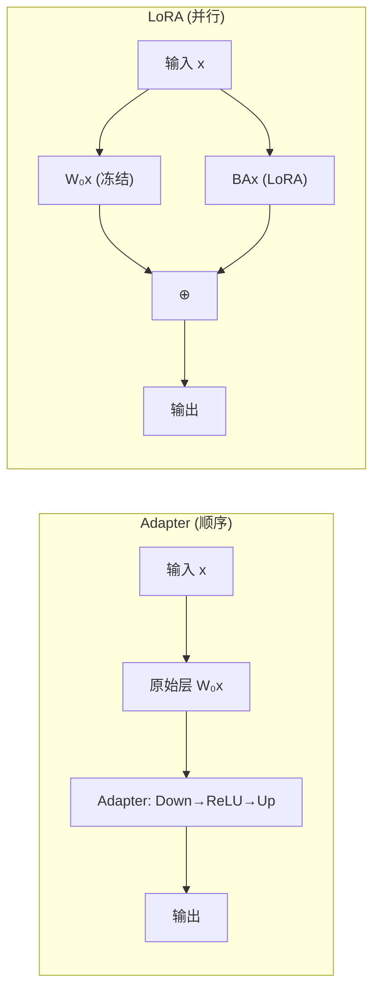

# LoRA: Low-Rank Adaptation of Large Language Models

> **论文信息**：Hu et al., ICLR 2022  
> **一句话概括**：冻结预训练权重，在每层注入可训练的低秩矩阵对 $B \in \mathbb{R}^{d \times r}, A \in \mathbb{R}^{r \times k}$，用不到 0.01% 的参数达到全参数微调的效果，且推理时零额外开销。

**相关阅读**：
- [LoRA 低秩适配基础](/前置知识/000x_前置知识_LoRA低秩适配基础) — LoRA 的数学基础与直觉
- [参数高效微调(PEFT)概览](/前置知识/000y_前置知识_参数高效微调PEFT概览) — LoRA 在 PEFT 家族中的定位

---

## 贯穿全文的例子

> 我们需要将 GPT-3（175B 参数）微调用于自然语言理解任务（如 MNLI、SST-2）。
>
> - **全参数微调**：需要为每个任务存储一份 175B 的模型（~350 GB 存储/任务），且训练需要巨额计算
> - **LoRA 微调**：冻结 175B 参数，每个任务只训练 ~4.7M 参数（约占 0.003%），切换任务只需切换一组小矩阵
>
> 结果：LoRA 在 GLUE 基准和 GPT-3 生成任务上匹配甚至超越全参数微调的效果。

---

## 一、论文动机：大模型微调的困境

### 1.1 背景：预训练 + 微调范式的瓶颈

2020-2021 年，NLP 进入"预训练大模型 + 下游微调"范式。但模型规模的爆炸带来了一个现实问题：

> GPT-3 有 175B 参数。如果有 100 个下游任务，每个都全参数微调一份，需要存储 100 × 350 GB = 35 TB 的模型。这不仅存储成本巨大，而且切换任务意味着完全换载一个模型。

### 1.2 已有方法的不足

在 LoRA 之前，已有的参数高效方法存在各种不足：

| 方法 | 问题 |
|------|------|
| Adapter (Houlsby 2019) | 推理时引入额外的顺序层，增加延迟；在批量推理场景下延迟敏感 |
| Prefix Tuning (Li & Liang 2021) | 难以优化（训练不稳定），且 prefix 占据序列长度，减少可用上下文 |
| 全参数微调 | 存储和计算成本与模型大小成正比，无法扩展 |

### 1.3 关键观察

论文引用了 Aghajanyan et al. (2020) 的关键发现：

> 预训练的过参数化模型实际上存在于一个低内在维度（low intrinsic dimensionality）的空间中。

作者进一步假设：**模型在适配过程中的权重变化也具有低"内在秩"**。这个假设是 LoRA 的理论基础。

---

## 二、方法详解

### 2.1 核心公式

对于预训练权重矩阵 $W_0 \in \mathbb{R}^{d \times k}$，LoRA 将微调后的权重表示为：

$$
W = W_0 + \Delta W = W_0 + BA
$$

其中 $B \in \mathbb{R}^{d \times r}$, $A \in \mathbb{R}^{r \times k}$, $r \ll \min(d, k)$。

修改后的前向传播：

$$
h = W_0 x + \Delta W x = W_0 x + BAx
$$

**为什么是 $BA$ 而不是 $AB$？**

注意维度：
- $x \in \mathbb{R}^k$（输入）
- $A \in \mathbb{R}^{r \times k}$：先将 $k$ 维输入降到 $r$ 维 → $Ax \in \mathbb{R}^r$
- $B \in \mathbb{R}^{d \times r}$：再将 $r$ 维升回 $d$ 维 → $BAx \in \mathbb{R}^d$

所以信息流是：$k \xrightarrow{A} r \xrightarrow{B} d$，经过一个"瓶颈"维度 $r$。

### 2.2 初始化

论文使用了精心设计的初始化：

- $A$：使用随机高斯初始化 $A \sim \mathcal{N}(0, \sigma^2)$
- $B$：初始化为零矩阵 $B = 0$

**设计动机**：确保训练开始时 $\Delta W = BA = 0$，即模型的起点就是预训练模型本身。这避免了随机初始化可能导致的训练初期不稳定。

### 2.3 缩放因子

$$
h = W_0 x + \frac{\alpha}{r} BAx
$$

论文在实验中固定 $\alpha$ 为一个常数（与第一次尝试的 $r$ 值相同），后续改变 $r$ 时不需要重新调学习率。这相当于一个对 $r$ 的归一化：当 $r$ 增大时，每个 rank-1 分量的贡献相应减小。

### 2.4 应用位置

论文主要在 **Transformer 的注意力层**上应用 LoRA：

$$
W_Q, W_K, W_V, W_O \in \mathbb{R}^{d_{\text{model}} \times d_{\text{model}}}
$$

论文通过消融实验发现：
- 同时对 $W_Q$ 和 $W_V$ 加 LoRA 效果优于只对一个加
- 用较小的 $r$（如 4 或 8）就能达到很好的效果
- 增大 $r$ 并不总能带来显著提升（因为内在秩就那么低）

---

## 三、实验结果

### 3.1 RoBERTa 和 DeBERTa 实验

在 GLUE 基准上的结果（以 RoBERTa-Base 为例）：

| 方法 | 可训练参数 | MNLI (Acc) | SST-2 (Acc) | MRPC (Acc) | 平均 |
|------|-----------|------------|-------------|------------|------|
| 全参数微调 | 125M (100%) | 87.6 | 94.8 | 90.2 | 90.9 |
| Adapter (H) | 0.9M (0.7%) | 87.2 | 94.7 | 89.5 | 90.5 |
| Prefix Tuning | 0.8M (0.6%) | 86.5 | 93.8 | 88.1 | 89.5 |
| **LoRA** | **0.3M (0.24%)** | **87.5** | **94.9** | **90.1** | **90.8** |

**关键结论**：LoRA 用最少的参数（只有 Adapter 的 1/3），达到了与全参数微调几乎相同的效果。

### 3.2 GPT-3 (175B) 实验

这是论文最重要的实验——证明 LoRA 在超大规模模型上同样有效：

| 方法 | 可训练参数 | WikiSQL (Acc) | SAMSum (R1/R2/RL) |
|------|-----------|---------------|-------------------|
| 全参数微调 (FT) | 175B | 73.8 | 52.0/28.0/44.5 |
| Adapter (L) | 11M | 73.2 | 51.0/27.4/43.7 |
| Prefix Tuning | 77M | 70.4 | 50.0/26.4/42.5 |
| **LoRA ($r=4$)** | **4.7M** | **73.4** | **52.6/28.3/44.8** |

**惊人发现**：LoRA 用 4.7M 参数（GPT-3 总参数的 0.003%）就**超越**了全参数微调在生成任务上的效果。

### 3.3 推理延迟对比

| 方法 | 额外推理延迟 |
|------|-------------|
| Adapter (H) | +0.5~7% |
| Adapter (L) | +0.3~5% |
| Prefix Tuning | -0.2%（序列变短了反而快一点，但可用长度减少） |
| **LoRA** | **+0%（合并后零开销）** |

---

## 四、消融实验与深入分析

### 4.1 哪些层加 LoRA 最有效？

论文在 GPT-3 上的消融实验（$r=8$, 总参数 budget 固定）：

| 应用位置 | WikiSQL (Acc) | MultiNLI (Acc) |
|---------|---------------|----------------|
| 只有 $W_Q$ | 70.4 | 91.0 |
| 只有 $W_K$ | 70.0 | 90.5 |
| 只有 $W_V$ | 73.0 | 91.3 |
| 只有 $W_O$ | 72.5 | 91.1 |
| $W_Q + W_V$ | **73.4** | **91.7** |
| $W_Q + W_K + W_V + W_O$ | 73.2 | 91.5 |

**结论**：
1. $W_V$ 是最重要的单一目标（可能因为 Value 直接决定了输出内容）
2. $W_Q + W_V$ 组合最佳（可能因为 Query 控制"关注什么"，Value 控制"输出什么"）
3. 加更多层效果持平——因为在固定参数 budget 下，多加层意味着每层的 $r$ 要减小

### 4.2 秩 $r$ 需要多大？

| $r$ | $W_Q$ 参数量 | WikiSQL (Acc) |
|-----|-------------|---------------|
| 1 | 0.3M | 72.8 |
| 2 | 0.6M | 73.0 |
| 4 | 1.2M | 73.4 |
| 8 | 2.4M | 73.4 |
| 64 | 18.9M | 73.3 |
| 256 | 75.5M | 73.1 |

**惊人发现**：$r=1$ 就已经很有效了！$r=4$ 就接近饱和。更大的 $r$ 不仅没帮助，甚至可能略微下降（过拟合）。

**这说明什么？** 微调过程中权重的实际变化确实集中在一个极低维的子空间中。

### 4.3 LoRA 学到的子空间分析

论文做了一个特别有意义的实验——分析不同 $r$ 学到的子空间之间的关系：

将 $r=8$ 和 $r=64$ 学到的 $A$ 矩阵做 SVD，比较它们的顶部奇异向量的重叠程度：

> $r=8$ 学到的子空间与 $r=64$ 的前 8 个奇异方向有 **90%+ 的重叠**。

这直接证实了：**微调确实只需要一个极低秩的变化**，不论你给它多大的空间（$r=64$），它实际用到的有效方向也只有 4~8 个。

---

## 五、与其他方法的理论关系

### 5.1 LoRA 统一了多种方法

论文指出 LoRA 可以看作多种方法的推广：

| 设置 | 等价方法 |
|------|---------|
| $r = k$（满秩） | 全参数微调 |
| 固定 $A$，只训练 $B$ | 类似 Adapter（降维后再升维） |
| $r = 1$ | 秩一更新，类似低秩矩阵分解 |

### 5.2 与 Adapter 的本质区别

虽然 Adapter 也有"降维-升维"的瓶颈结构，但有两个关键区别：

1. **Adapter 是顺序的**（必须等上一层算完才能算 Adapter），LoRA 是**并行的**（与原始前向传播并行计算）
2. **Adapter 有非线性激活**，LoRA 是**纯线性**的 → 可以合并到原始权重

---

## 六、论文的局限性与后续影响

### 6.1 论文承认的局限

1. **不同层使用相同的 $r$**：论文没有自动化地为不同层选择最优的秩 → 后续 AdaLoRA 解决了这个问题
2. **只在注意力层实验**：论文没有系统研究对 MLP 层加 LoRA 的效果 → 后续研究表明全层加效果更好
3. **缺乏对 $\alpha$ 和 $r$ 关系的深入分析** → 后续 rsLoRA 研究了最优缩放

### 6.2 后续影响

LoRA 论文自 2022 年发表以来，催生了一个庞大的研究方向：

| 改进方向 | 代表工作 | 核心改进 |
|---------|---------|---------|
| 量化结合 | QLoRA (2023) | 4-bit 量化基础模型 + LoRA |
| 自适应秩 | AdaLoRA (2023) | 为不同层分配不同的秩 |
| 学习率改进 | LoRA+ (2024) | A 和 B 使用不同学习率 |
| 方向/幅度分解 | DoRA (2024) | 分开适配权重的方向和大小 |
| 减少参数 | VeRA (2024) | 冻结随机 A/B，只训练缩放向量 |
| 更高效 | GaLore (2024) | 梯度低秩投影，不存储 A/B |
| 高秩更新 | MoRA (2024) | 用方阵映射实现高秩 $\Delta W$ |
| 初始化改进 | PiSSA (2024) | 用主成分初始化 A/B |

---

## 七、总结

### 核心贡献

1. **提出了一个极其简洁有效的 PEFT 方法**：低秩分解 + 零初始化 + 线性叠加
2. **在超大模型（175B）上验证了有效性**：0.003% 参数匹配全参数微调
3. **推理零开销**：与 Adapter 和 Prefix Tuning 的关键区别
4. **深入分析了微调的低秩性质**：为后续研究奠定了理论基础

### 延伸阅读

- [LoRA 低秩适配基础](/前置知识/000x_前置知识_LoRA低秩适配基础) — 基础概念
- [参数高效微调(PEFT)概览](/前置知识/000y_前置知识_参数高效微调PEFT概览) — PEFT 家族全景
- [QLoRA 精读](./056_QLoRA_量化低秩适配) — 量化 + LoRA
- [AdaLoRA 精读](./057_AdaLoRA_自适应秩分配) — 自适应秩
- [DoRA 精读](./059_DoRA_权重分解低秩适配) — 方向与幅度
