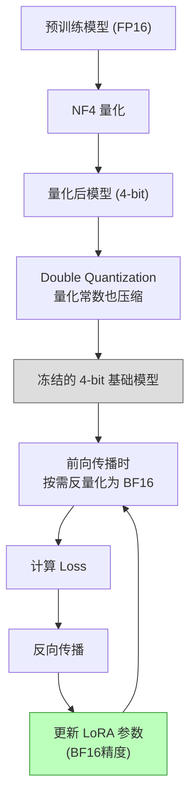

# QLoRA: Efficient Finetuning of Quantized LLMs

> **论文信息**：Dettmers et al., NeurIPS 2023  
> **一句话概括**：将基础模型量化到 4-bit（NF4 格式），再在量化模型上训练 LoRA 适配器——用单张 48GB GPU 就能微调 65B 参数模型，效果不损失。

**相关阅读**：
- [LoRA 低秩适配基础](/前置知识/000x_前置知识_LoRA低秩适配基础) — LoRA 原理
- [LoRA 原始论文精读](./055_LoRA_低秩适配微调大模型) — LoRA 完整技术细节
- [参数高效微调(PEFT)概览](/前置知识/000y_前置知识_参数高效微调PEFT概览) — PEFT 方法对比

---

## 贯穿全文的例子

> 场景：一位研究者只有一张消费级 GPU（RTX 4090, 24GB 显存），想微调 LLaMA-65B 模型用于中文对话。
>
> - **标准 LoRA**：LLaMA-65B 的 FP16 权重需要 ~130 GB 显存来加载 → 远超 24GB → 无法运行
> - **QLoRA**：将 65B 模型量化到 4-bit → 只需 ~33 GB → 配合梯度检查点和分页优化器 → 勉强可以在 48GB GPU 上跑（24GB 还是不够，但 A6000 可以！）
>
> 更典型的场景：用单张 A100-40GB 微调 33B 模型 → 这在 QLoRA 之前是不可能的。

---

## 一、论文动机：LoRA 还不够便宜

### 1.1 LoRA 的显存瓶颈在哪？

回顾 LoRA 的显存占用：

| 组件 | LoRA (FP16) | 占比 |
|------|------------|------|
| 基础模型权重（冻结） | $2 \times P$ bytes | 主要瓶颈！ |
| LoRA 参数 | 很小（~几十 MB） | 可忽略 |
| 激活值（前向传播） | 与 batch/seq 有关 | 可用梯度检查点缓解 |
| 优化器状态 | 只针对 LoRA 参数 | 很小 |

**关键发现**：LoRA 虽然将可训练参数降到了不到 1%，但基础模型本身仍然需要以 FP16（每参数 2 bytes）的精度加载到显存中。对于 65B 模型，光加载权重就需要 130 GB。

**QLoRA 的 Insight**：如果我们能把冻结的基础模型从 FP16 压缩到 4-bit（每参数 0.5 bytes），显存立刻减少 4 倍！

### 1.2 朴素量化的问题

直接对模型量化（如 GPTQ、RTN）再训练 LoRA 会遇到问题：
- 量化引入的误差会通过 LoRA 的梯度传播，导致训练不稳定
- 量化格式（如 INT4）对正态分布的权重不是最优的
- 内存管理效率低，长序列时会 OOM

QLoRA 通过三项技术创新解决了这些问题。

---

## 二、三大技术创新

### 2.1 NF4 (4-bit NormalFloat) 量化

**问题**：预训练模型的权重通常服从正态分布 $\mathcal{N}(0, \sigma^2)$。标准的均匀量化（INT4）对正态分布不是最优的——它在分布密度低的尾部浪费了量化级别。

**NF4 的设计思路**：

1. 假设权重服从标准正态分布 $\mathcal{N}(0, 1)$
2. 将正态分布的 CDF（累积分布函数）等分为 $2^k$ 份（k=4 即 16 份）
3. 每个量化级别对应正态分布中等概率密度的区间的中心点

**具体过程**：

$$
q_i = \Phi^{-1}\left(\frac{i + 0.5}{2^k}\right), \quad i = 0, 1, ..., 2^k - 1
$$

其中 $\Phi^{-1}$ 是标准正态分布的逆 CDF（分位函数）。

**代入数字**（4-bit，16 个量化级别）：

| 级别 $i$ | 分位点 $\frac{i+0.5}{16}$ | 量化值 $q_i$ |
|----------|--------------------------|-------------|
| 0 | 0.03125 | -1.862 |
| 1 | 0.09375 | -1.318 |
| 2 | 0.15625 | -1.010 |
| ... | ... | ... |
| 7 | 0.46875 | -0.078 |
| 8 | 0.53125 | +0.078 |
| ... | ... | ... |
| 15 | 0.96875 | +1.862 |

**为什么 NF4 比 INT4 好？**
- NF4 的量化级别在分布中心（概率密度高的地方）更密集 → 减少了量化误差
- INT4 均匀分布量化级别 → 在尾部浪费了表示能力

**理论保证**：NF4 对正态分布的权重是信息论意义上的最优 4-bit 量化格式。

### 2.2 Double Quantization (双重量化)

**问题**：量化需要存储"量化常数"（scaling factor），通常是每 64 或 128 个权重一组，每组一个 FP32 的 scaling factor。

以 block_size=64 为例：
- 每 64 个权重需要一个 FP32 常数（32 bit）
- 额外开销：$\frac{32}{64} = 0.5$ bit/parameter

这看似不多，但对于 65B 模型是 $65B \times 0.5 / 8 \approx 4$ GB，不可忽略。

**Double Quantization 的方案**：把量化常数本身也量化！

1. 第一层量化：将 FP16 权重量化为 NF4（每 64 个权重一组，产生一个 FP32 量化常数）
2. 第二层量化：将这些 FP32 量化常数再量化为 FP8（每 256 个量化常数一组）

**节省计算**：
- 原始：0.5 bit/param 额外开销
- Double Quantization 后：$\frac{8}{64} + \frac{32}{64 \times 256} \approx 0.127$ bit/param
- **节省**：~0.37 bit/param → 对 65B 模型节省约 3 GB 显存

### 2.3 Paged Optimizers (分页优化器)

**问题**：在长序列训练时，激活值的内存需求可能突然激增（gradient checkpoint 的重计算），导致 GPU OOM。

**解决方案**：利用 NVIDIA 的统一内存（Unified Memory）机制——当 GPU 显存不够时，自动将优化器状态页面换出到 CPU 内存，需要时再换入。

这类似操作系统的虚拟内存/页面交换机制：
- **正常情况**：优化器状态在 GPU 显存中
- **OOM 时**：自动换出到 CPU RAM（速度会降低，但不会崩溃）
- **实践中**：只有极少数 mini-batch 会触发页面交换，整体训练速度影响 <5%

---

## 三、QLoRA 的完整训练流程



**关键细节**：
1. 基础模型以 4-bit 存储在显存中
2. 计算时（前向/反向传播），按需将涉及的权重块**反量化**为 BF16
3. LoRA 的参数 $A, B$ 全程以 BF16 精度存储和计算
4. 只有 LoRA 参数接收梯度更新

**反量化公式**：

$$
W_{\text{dequant}} = \text{scale} \times W_{\text{NF4}} \approx W_{\text{original}}
$$

这个反量化是逐块进行的，不需要把整个模型同时反量化。

---

## 四、实验结果

### 4.1 QLoRA vs 标准 LoRA vs 全参数微调

在 LLaMA 模型上的对比（使用 Alpaca 数据集微调后在 MMLU 上评测）：

| 方法 | 模型大小 | 精度 | 显存需求 | MMLU (5-shot) |
|------|---------|------|---------|---------------|
| 全参数微调 | 7B | FP16 | ~56 GB | 38.7 |
| LoRA (FP16) | 7B | FP16 | ~18 GB | 38.4 |
| **QLoRA (NF4)** | 7B | 4-bit | **~6 GB** | **38.4** |
| 全参数微调 | 13B | FP16 | ~104 GB | 44.6 |
| **QLoRA (NF4)** | 13B | 4-bit | **~12 GB** | **44.5** |
| **QLoRA (NF4)** | 33B | 4-bit | **~22 GB** | **51.3** |
| **QLoRA (NF4)** | 65B | 4-bit | **~41 GB** | **55.5** |

**关键发现**：
1. QLoRA 几乎无损：4-bit 量化 + LoRA 的效果与 FP16 LoRA 完全相同
2. QLoRA 让大模型微调变得可及：单张 A100-40GB 可以训练 33B 模型
3. 更大的量化模型 > 更小的全精度模型：QLoRA-33B (22GB) > 全参数微调-7B (56GB)

### 4.2 量化格式对比

| 量化格式 | 精度 (bits) | LLaMA-7B MMLU | 相对于 FP16 |
|---------|------------|---------------|------------|
| FP16 (baseline) | 16 | 38.4 | 100% |
| Int8 | 8 | 38.3 | 99.7% |
| FP4 | 4 | 37.2 | 96.9% |
| **NF4** | 4 | **38.4** | **100%** |
| Int4 | 4 | 36.5 | 95.1% |

**NF4 完胜其他 4-bit 格式**，与 FP16 效果完全相同。

### 4.3 Guanaco：QLoRA 训练的聊天模型

论文还用 QLoRA 在 OASST1 数据集上训练了 Guanaco 系列模型：

| 模型 | 训练时间 | 训练 GPU | 人类偏好评估 (Elo) |
|------|---------|---------|-------------------|
| ChatGPT-3.5 | - | - | 1058 |
| Guanaco-65B (QLoRA) | 24 小时 | 1×A100-40G | **1044** |
| Guanaco-33B (QLoRA) | 12 小时 | 1×A100-40G | 1028 |
| Vicuna-13B (全参数微调) | - | 8×A100 | 1007 |

**惊人结果**：单张 GPU 训练 24 小时的 Guanaco-65B，在人类偏好评估中达到了 ChatGPT 性能的 99%！

---

## 五、技术细节深挖

### 5.1 为什么 4-bit 量化不损失微调效果？

这看起来违反直觉——毕竟量化引入了误差。论文给出了解释：

1. **LoRA 在反量化后的 BF16 精度上计算**：LoRA 的梯度计算是精确的
2. **冻结权重的量化误差是固定的**：它不会在训练中累积
3. **LoRA 可以"补偿"量化误差**：如果量化后某些层的表示偏了，LoRA 可以学到对应的修正

可以这样理解：
- 预训练权重被量化后变成了 $\tilde{W}_0 = W_0 + \epsilon$（$\epsilon$ 是量化误差）
- LoRA 学到的 $\Delta W = BA$ 可以部分补偿这个 $\epsilon$
- 最终效果 $\tilde{W}_0 + BA \approx W_0 + BA_{\text{ideal}}$

### 5.2 块大小的选择

量化以"块"为单位进行，每块共享一个 scaling factor：

| 块大小 | 量化精度 | 额外开销 | 权衡 |
|--------|---------|---------|------|
| 32 | 更好 | 高（每 32 个参数一个 FP32） | 精度优先 |
| 64 | 好 | 中 | **QLoRA 默认** |
| 128 | 略差 | 低 | 显存优先 |

QLoRA 默认使用 block_size=64，配合 Double Quantization 后额外开销约 0.5 bit/param。

### 5.3 训练精度混合

QLoRA 的精度配置：
- **存储**：基础模型 NF4 (4-bit)，量化常数 FP8 (8-bit)
- **计算**：反量化为 BF16 进行前向/反向传播
- **LoRA 参数**：BF16 存储和计算
- **优化器状态**：FP32（只针对 LoRA 参数，量很小）

---

## 六、QLoRA 的代码实践

```python
from transformers import AutoModelForCausalLM, BitsAndBytesConfig
from peft import LoraConfig, get_peft_model, prepare_model_for_kbit_training
import torch

# 1. 定义 4-bit 量化配置
bnb_config = BitsAndBytesConfig(
    load_in_4bit=True,
    bnb_4bit_quant_type="nf4",          # 使用 NF4 格式
    bnb_4bit_compute_dtype=torch.bfloat16,  # 计算时用 BF16
    bnb_4bit_use_double_quant=True,      # 开启 Double Quantization
)

# 2. 加载量化模型
model = AutoModelForCausalLM.from_pretrained(
    "meta-llama/Llama-2-7b-hf",
    quantization_config=bnb_config,
    device_map="auto",
)

# 3. 准备模型进行 k-bit 训练
model = prepare_model_for_kbit_training(model)

# 4. 配置 LoRA
lora_config = LoraConfig(
    r=16,
    lora_alpha=32,
    target_modules="all-linear",
    lora_dropout=0.05,
    bias="none",
    task_type="CAUSAL_LM",
)

# 5. 应用 LoRA
model = get_peft_model(model, lora_config)
model.print_trainable_parameters()
# 输出: trainable params: 39,976,960 || all params: 3,540,389,888 || trainable%: 1.1289%
# 注意：all params 变小了，因为 4-bit 量化后参数"计数方式"不同
```

---

## 七、QLoRA 的局限与后续发展

| 局限 | 描述 | 改进 |
|------|------|------|
| 训练速度略慢 | 反量化操作增加了计算开销（~10-20%） | Unsloth 等框架优化了核函数 |
| 量化损失不可逆 | 基础模型精度永久降低 | GPTQ + LoRA、AWQ + LoRA |
| 不支持量化感知训练 | 梯度不经过量化步骤 | QA-LoRA (2024) |
| 合并困难 | LoRA 是在量化模型上训的，合并回 FP16 不直接 | 先反量化再合并 |

---

## 八、总结

### 核心贡献

1. **NF4 量化格式**：为正态分布权重设计的信息论最优 4-bit 量化
2. **Double Quantization**：量化量化常数，进一步节省 ~3 GB
3. **Paged Optimizers**：解决训练中的 OOM 问题
4. **组合效果**：让单张 GPU 微调 65B 模型成为可能

### QLoRA 的历史地位

QLoRA 的意义不仅是技术创新——它**民主化了大模型微调**。发布后，个人研究者和小团队第一次能够在消费级硬件上训练出有竞争力的大语言模型，直接催生了大量开源社区微调模型的涌现。

### 延伸阅读

- [LoRA 低秩适配基础](/前置知识/000x_前置知识_LoRA低秩适配基础) — LoRA 核心原理
- [LoRA 原始论文精读](./055_LoRA_低秩适配微调大模型) — LoRA 全部细节
- [AdaLoRA 精读](./057_AdaLoRA_自适应秩分配) — 自适应秩分配
- [GaLore 精读](./061_GaLore_梯度低秩投影训练) — 另一种显存优化路径
