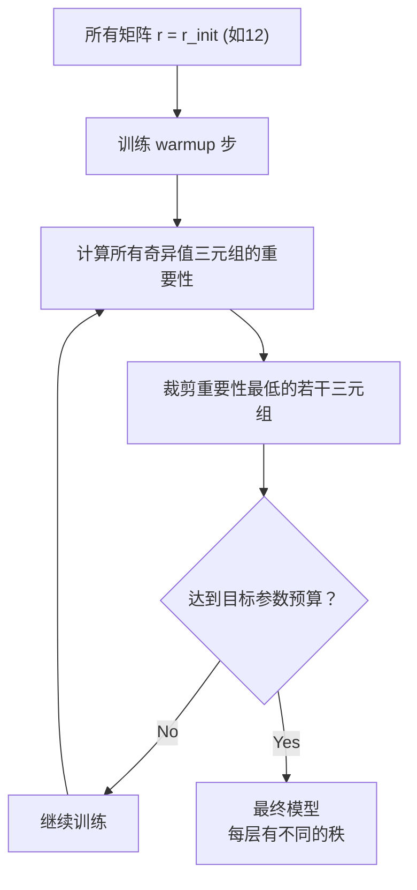

# AdaLoRA: Adaptive Budget Allocation for Parameter-Efficient Fine-Tuning

> **论文信息**：Zhang et al., ICLR 2023  
> **一句话概括**：不同层、不同投影矩阵对任务的重要性不同——AdaLoRA 通过 SVD 参数化 + 重要性评分，自动为每个权重矩阵分配最优的秩（重要的给高秩、不重要的给低秩），在相同参数预算下比统一分配的 LoRA 效果更好。

**相关阅读**：
- [LoRA 低秩适配基础](/前置知识/000x_前置知识_LoRA低秩适配基础) — LoRA 原理回顾
- [LoRA 原始论文精读](./055_LoRA_低秩适配微调大模型) — LoRA 为什么所有层用相同 $r$

---

## 贯穿全文的例子

> 假设我们在 DeBERTa-V3-Base（12 层 Transformer）上用 LoRA 做自然语言推理（NLI）任务。
>
> **观察**：
> - 底层（第 1~3 层）主要编码语法和词汇特征 → 对 NLI 任务不太需要调整
> - 中间层（第 5~8 层）编码语义关系 → NLI 核心所在，需要较大调整
> - 顶层（第 10~12 层）编码任务相关特征 → 也需要一定调整
>
> **标准 LoRA**：所有 12 层都用 $r=8$ → 底层浪费参数，中间层参数不够  
> **AdaLoRA**：自动发现中间层更重要 → 中间层 $r=12$，底层 $r=2$，参数总量相同但效果更好

---

## 一、论文动机：LoRA 的秩分配问题

### 1.1 统一秩的不合理之处

标准 LoRA 对所有目标层使用相同的秩 $r$。但直觉和实验都表明：

> 不同层、不同类型的权重矩阵，在微调过程中所需的"适配能力"（即有效秩）是不同的。

**实证证据**（来自 LoRA 原始论文）：
- 对 GPT-3 做微调后，分析各层 $\Delta W$ 的奇异值分布
- 发现有些层的 $\Delta W$ 只需要秩 1-2 就能很好近似
- 另一些层则需要秩 8-16

**数值例子**：
假设参数预算为 $P_{\text{total}} = 12 \times 2 \times (d \times 8 + 8 \times d)$（12 层 × QV 两个矩阵 × 秩 8）

- **统一分配**：每个矩阵秩 = 8
- **最优分配**（假设已知重要性）：
  - 底层（4 个矩阵）：秩 = 2 → 省下参数
  - 中间层（12 个矩阵）：秩 = 12 → 多分配参数
  - 顶层（8 个矩阵）：秩 = 6
  - 总参数量可以相同，但效果更好

### 1.2 为什么不能手动调？

一个 12 层的模型有 24 个注意力矩阵（Q, K, V, O 各 12 个）+ 24 个 MLP 矩阵。手动为每个选最优 $r$ 需要搜索的空间是天文数字。我们需要一个**自动化**的方法。

---

## 二、方法详解

### 2.1 SVD 参数化

AdaLoRA 的第一个创新是将 LoRA 的 $\Delta W = BA$ 改为 **SVD 式参数化**：

$$
\Delta W = P \Lambda Q
$$

其中：
- $P \in \mathbb{R}^{d \times r}$：左奇异向量矩阵（类似 $B$）
- $\Lambda = \text{diag}(\lambda_1, \lambda_2, ..., \lambda_r)$：对角奇异值矩阵
- $Q \in \mathbb{R}^{r \times k}$：右奇异向量矩阵（类似 $A$）

**与标准 LoRA 的区别**：显式地将"方向"（$P, Q$）和"大小"（$\Lambda$）分开。

**为什么这样做？** 因为我们可以通过**控制 $\lambda_i$ 来决定保留哪些秩分量**：
- $\lambda_i \approx 0$ → 第 $i$ 个秩分量不重要 → 可以裁剪
- $\lambda_i$ 很大 → 第 $i$ 个秩分量重要 → 必须保留

### 2.2 重要性评分

如何判断一个奇异值三元组 $(P_{:,i}, \lambda_i, Q_{i,:})$ 的重要性？

AdaLoRA 使用**基于 Fisher 信息的敏感度分析**：

$$
S(\lambda_i) = \lambda_i^2 \cdot \left\| \frac{\partial \mathcal{L}}{\partial \lambda_i} \right\|^2
$$

**逐项解释**：
- $\lambda_i^2$：当前奇异值的大小——值本身大说明影响大
- $\left\| \frac{\partial \mathcal{L}}{\partial \lambda_i} \right\|^2$：梯度大小——梯度大说明还在被积极优化

**一句话直觉**：重要性 = "当前贡献大" × "还在被积极利用"。一个 $\lambda_i$ 如果值很小且梯度也很小，说明它既不重要也没在被利用 → 可以安全裁掉。

**实际实现中**使用指数移动平均来平滑重要性评分：

$$
\bar{S}_t(\lambda_i) = \beta \cdot \bar{S}_{t-1}(\lambda_i) + (1-\beta) \cdot S_t(\lambda_i)
$$

### 2.3 全局预算分配

核心算法如下：

1. **初始化**：所有权重矩阵以初始秩 $r_{\text{init}}$ 开始训练（如 $r_{\text{init}} = 12$）
2. **训练一段时间**：让每个矩阵的重要性评分稳定
3. **裁剪**：根据全局预算 $b$，将重要性最低的奇异值三元组"剪裁"掉（将 $\lambda_i$ 设为 0 并冻结）
4. **逐步裁剪**：不是一次裁完，而是**分多个 schedule 步逐步裁剪**，直到达到目标参数预算
5. **最终**：不同矩阵保留不同数量的奇异值三元组 → 实现了自适应秩分配

### 2.4 正则化：保持正交性

由于 SVD 分解中 $P$ 和 $Q$ 应该是正交矩阵，AdaLoRA 加了一个正交正则项：

$$
\mathcal{R} = \|P^T P - I\|_F^2 + \|QQ^T - I\|_F^2
$$

**为什么需要这个？** 如果 $P$ 的列不正交，不同秩分量会互相干扰，重要性评分就不准确了。保持正交性确保每个三元组的贡献是独立的。

---

## 三、实验结果

### 3.1 NLU 任务

在 GLUE 基准上（DeBERTa-V3-Base）：

| 方法 | 参数量 | MNLI | SST-2 | CoLA | STS-B | 平均 |
|------|--------|------|-------|------|-------|------|
| 全参数微调 | 184M | 90.5 | 96.1 | 70.2 | 92.1 | 87.2 |
| LoRA ($r=8$) | 1.33M | 90.3 | 95.9 | 68.6 | 91.5 | 86.6 |
| LoRA ($r=2$) | 0.33M | 89.1 | 94.5 | 65.3 | 90.2 | 84.8 |
| **AdaLoRA** (同预算) | **0.33M** | **89.9** | **95.6** | **67.1** | **91.0** | **85.9** |

**关键对比**：在相同参数预算（0.33M）下，AdaLoRA 比统一 $r=2$ 的 LoRA 高 **1.1 个点**——这纯粹来自更智能的参数分配。

### 3.2 问答任务

在 SQuAD v1.1 / v2.0 上：

| 方法 | 参数量 | SQuAD v1.1 (F1) | SQuAD v2.0 (F1) |
|------|--------|-----------------|-----------------|
| 全参数微调 | 184M | 94.9 | 88.7 |
| LoRA ($r=8$) | 1.33M | 94.3 | 87.5 |
| **AdaLoRA** | 1.33M | **94.6** | **88.1** |

### 3.3 AdaLoRA 发现了什么分配模式？

论文可视化了训练后各层各矩阵的秩分配：

**典型发现**（DeBERTa-12 层, NLI 任务）：
- **$W_V$（Value）获得最高秩** → 与 LoRA 原文的消融结论一致
- **$W_Q$（Query）次之**
- **$W_K$（Key）获得最低秩** → Key 在微调中变化最小
- **中间层获得更多总参数**
- **底层和顶层获得较少参数**

这些发现与人工直觉一致，验证了自适应分配的有效性。

---

## 四、与 LoRA 的关键区别总结

| 维度 | LoRA | AdaLoRA |
|------|------|---------|
| 参数化 | $\Delta W = BA$ | $\Delta W = P\Lambda Q$ (SVD 式) |
| 秩 | 所有层相同 | 自适应分配 |
| 训练过程 | 固定结构训练 | 先大秩训练 → 逐步裁剪 |
| 正则化 | 无 | 正交约束 |
| 额外开销 | 无 | 计算重要性评分的少量开销 |
| 适用场景 | 通用 | 参数预算紧张时效果更明显 |

---

## 五、局限与后续发展

### 5.1 局限

1. **训练开销增加**：需要计算和维护重要性评分
2. **裁剪 schedule 是超参数**：需要调节 warmup 步数、裁剪速率
3. **不如 LoRA 简洁**：实现复杂度更高
4. **优势在小预算时明显，大预算时收窄**：当参数足够多时，统一 $r=16$ 也够用

### 5.2 后续影响

AdaLoRA 启发了后续一系列"自适应 LoRA"的工作：
- **DyLoRA (2023)**：在训练中同时训练多个秩的 LoRA，推理时选择最佳秩
- **SoRA (2024)**：基于门控机制的秩选择
- **AutoLoRA (2024)**：使用元学习自动选择秩

---

## 六、总结

### 核心贡献

1. **指出并解决了 LoRA 的秩分配问题**：首次系统研究"哪些层需要更多参数"
2. **SVD 参数化**：显式分离方向和幅度，使裁剪有据可依
3. **基于重要性的全局预算分配**：自动发现最优秩分布

### 延伸阅读

- [LoRA 低秩适配基础](/前置知识/000x_前置知识_LoRA低秩适配基础) — LoRA 基础回顾
- [LoRA 原始论文精读](./055_LoRA_低秩适配微调大模型) — 统一秩的 LoRA
- [DoRA 精读](./059_DoRA_权重分解低秩适配) — 另一种分解权重的思路
