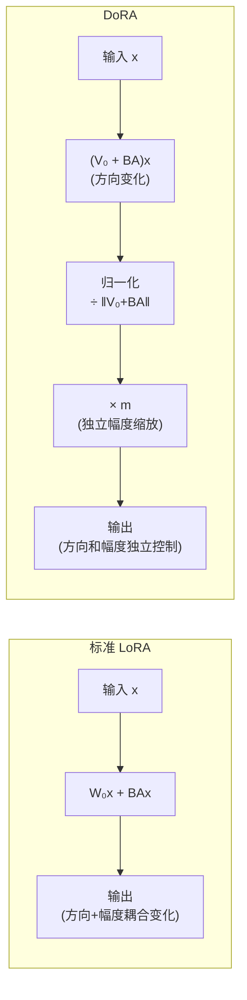

# DoRA: Weight-Decomposed Low-Rank Adaptation

> **论文信息**：Liu et al., ICML 2024  
> **一句话概括**：将权重矩阵分解为**方向分量（direction）**和**幅度分量（magnitude）**，用 LoRA 只适配方向，用独立的标量向量适配幅度——让 PEFT 的学习模式更接近全参数微调，效果系统性优于 LoRA。

**相关阅读**：
- [LoRA 低秩适配基础](/前置知识/000x_前置知识_LoRA低秩适配基础) — LoRA 原理
- [LoRA 原始论文精读](./055_LoRA_低秩适配微调大模型) — LoRA 的技术细节与局限

---

## 贯穿全文的例子

> 微调 LLaMA-7B 做常识问答。
>
> **LoRA 的行为**：$\Delta W = BA$ 同时改变了权重的方向和大小，且这两种改变耦合在一起。
>
> **DoRA 的行为**：
> - 方向改变：由 LoRA 部分的 $BA$ 负责（通过归一化提取方向）
> - 幅度改变：由独立的可学习向量 $m$ 负责
>
> 这种解耦让学习更高效——模型可以独立地决定"朝哪个方向调"和"调多大幅度"。

---

## 一、论文动机

### 1.1 一个关键观察：全参数微调如何改变权重？

论文首先分析了全参数微调时，权重变化 $\Delta W$ 的特征。他们将权重分解为**方向**和**幅度**两个分量（类似 Weight Normalization 的分解）：

$$
W = m \cdot \frac{V}{\|V\|_c}
$$

其中：
- $V \in \mathbb{R}^{d \times k}$：方向矩阵（未归一化的权重）
- $\|V\|_c$：按列计算的 L2 范数，$\|V\|_c \in \mathbb{R}^{1 \times k}$（每列一个标量）
- $m \in \mathbb{R}^{1 \times k}$：幅度向量（每列一个缩放因子）

**全参数微调时的变化模式**：
论文统计了预训练到微调的变化中，方向变化量和幅度变化量的关系：

| 分析维度 | 全参数微调 | LoRA |
|---------|-----------|------|
| 方向变化幅度 | 较大、平滑 | 较大、方差大 |
| 幅度变化幅度 | 较小、平滑 | 与方向变化**强相关** |
| 方向-幅度相关性 | **弱**（近乎独立） | **强**（耦合） |

**关键发现**：
> 全参数微调中，方向变化和幅度变化是**近似独立**的——模型分别学习"往哪调"和"调多少"。  
> 但 LoRA 中，由于 $\Delta W = BA$ 同时影响两者，方向和幅度的变化被**耦合在一起**，限制了学习效率。

### 1.2 Weight Normalization 的启发

Weight Normalization (Salimans & Kingma, 2016) 是一种经典的参数化技巧：

$$
W = g \cdot \frac{V}{\|V\|}
$$

将标量 $g$（幅度）和矩阵 $V$（方向）分开优化，可以加速训练收敛。

DoRA 的核心 Insight：**把 Weight Normalization 的思想应用到 LoRA 上**——用 LoRA 适配方向，用独立参数适配幅度。

---

## 二、方法详解

### 2.1 完整公式

DoRA 将预训练权重 $W_0$ 分解为方向和幅度：

$$
W_0 = m_0 \cdot \frac{V_0}{\|V_0\|_c}
$$

其中 $m_0 = \|W_0\|_c$（预训练权重各列的 L2 范数）。

然后用 LoRA 适配方向部分：

$$
W' = m \cdot \frac{V_0 + \Delta V}{\|V_0 + \Delta V\|_c} = m \cdot \frac{V_0 + BA}{\|V_0 + BA\|_c}
$$

其中：
- $m \in \mathbb{R}^{1 \times k}$：**可学习的幅度向量**，初始化为 $m_0 = \|W_0\|_c$
- $\Delta V = BA$：**LoRA 适配的方向变化**
- $\frac{V_0 + BA}{\|V_0 + BA\|_c}$：归一化保证只改变方向

**逐项理解**：
1. $V_0 + BA$：在预训练方向基础上加上 LoRA 学到的方向修正
2. $\frac{V_0 + BA}{\|V_0 + BA\|_c}$：归一化到单位方向（按列归一化）
3. $m \cdot (\cdots)$：用独立的幅度向量重新缩放

### 2.2 与标准 LoRA 的对比



### 2.3 参数量分析

DoRA 相比标准 LoRA 只多了一个幅度向量 $m \in \mathbb{R}^{1 \times k}$：

| 组件 | 参数量 |
|------|--------|
| 标准 LoRA | $dr + rk$ |
| DoRA | $dr + rk + k$ |
| 额外开销 | $k$（仅一个向量！） |

以 $d=k=4096$, $r=16$ 为例：
- LoRA 参数：$4096 \times 16 + 16 \times 4096 = 131,072$
- DoRA 额外：$4096$
- **额外开销占比**：$\frac{4096}{131072} = 3.1\%$ → 几乎可忽略

### 2.4 初始化

- **$A, B$**：与标准 LoRA 相同（$B=0$, $A$ 随机初始化）
- **$m$**：初始化为 $m_0 = \|W_0\|_c$（预训练权重各列的 L2 范数）

这确保了训练起点与预训练模型完全相同：
$$
W'|_{B=0} = m_0 \cdot \frac{V_0 + 0}{\|V_0\|_c} = \|W_0\|_c \cdot \frac{W_0}{\|W_0\|_c} = W_0 \quad \checkmark
$$

### 2.5 梯度计算

DoRA 的前向传播涉及归一化操作，需要特别注意梯度流：

$$
\frac{\partial W'}{\partial B} = m \cdot \frac{\partial}{\partial B}\left[\frac{V_0 + BA}{\|V_0 + BA\|_c}\right]
$$

归一化的梯度类似于 Layer Normalization：它会"投影掉"当前方向上的分量，只保留正交方向上的更新。这意味着：

> DoRA 的方向更新天然具有**正交投影**效果——它不会让权重在当前方向上伸缩（那是 $m$ 的工作），只会旋转到新方向。

---

## 三、实验结果

### 3.1 常识推理任务

在 LLaMA-7B/13B 上的 8 个常识推理基准：

| 方法 | 参数量 | BoolQ | PIQA | SIQA | HellaSwag | WinoGrande | ARC-e | ARC-c | OBQA | 平均 |
|------|--------|-------|------|------|-----------|------------|-------|-------|------|------|
| LoRA ($r=16$) | 20.5M | 68.9 | 80.7 | 77.4 | 78.1 | 78.8 | 77.8 | 61.3 | 74.8 | 74.7 |
| **DoRA ($r=16$)** | **20.5M** | **71.8** | **82.1** | **78.5** | **80.3** | **80.6** | **79.4** | **63.2** | **76.2** | **76.5** |
| 全参数微调 | 6.7B | 73.2 | 83.5 | 79.8 | 82.1 | 81.4 | 80.7 | 64.8 | 77.5 | 77.9 |

**DoRA 以相同参数量，在所有 8 个任务上系统性超越 LoRA**，且更接近全参数微调。

### 3.2 视觉任务

在 Stable Diffusion + DreamBooth 上做主体驱动生成：

| 方法 | DINO ↑ | CLIP-I ↑ | CLIP-T ↑ |
|------|--------|----------|----------|
| LoRA | 0.594 | 0.781 | 0.304 |
| **DoRA** | **0.621** | **0.798** | **0.312** |
| 全参数微调 | 0.635 | 0.805 | 0.318 |

### 3.3 与 QLoRA 结合

DoRA 可以与 QLoRA 无缝结合（4-bit 基础模型 + DoRA）：

| 方法 | 量化 | 平均准确率 |
|------|------|-----------|
| QLoRA | 4-bit | 73.8 |
| **QDoRA** | 4-bit | **75.6** |

---

## 四、为什么 DoRA 比 LoRA 好？深层分析

### 4.1 学习动力学分析

论文通过追踪训练过程中方向和幅度的变化轨迹，发现：

**LoRA 的问题**：
- 方向更新和幅度更新互相干扰
- 如果模型想"只旋转方向、不改大小"，LoRA 很难做到——因为 $BA$ 一定同时改变方向和大小
- 如果模型想"只缩放、不旋转"，LoRA 也做不好

**DoRA 的解决**：
- 方向更新（通过 $BA$）被归一化约束在方向子空间中
- 幅度更新（通过 $m$）完全独立
- 两者可以各自以最优的速率学习，互不干扰

### 4.2 几何直觉

考虑一个 2D 向量（方便可视化）：

```
LoRA 的 ΔW：
  只能沿固定的方向添加一个向量 → 同时改变方向和长度
  
DoRA 的更新：
  第一步：旋转（通过归一化的方向更新）→ 不改变长度
  第二步：缩放（通过 m 调整）→ 不改变方向
  
结果：DoRA 可以精确到达任何目标点，而 LoRA 可能需要"绕路"
```

### 4.3 与 Weight Normalization 的理论联系

Weight Normalization 的已知优势：
1. **解耦梯度方向和梯度大小**：让优化景观更平滑
2. **消除权重矩阵的尺度对梯度的影响**：加速收敛
3. **隐式正则化效果**：防止权重爆炸

DoRA 继承了这些优势，并将其限制在 LoRA 的低秩空间中。

---

## 五、实现细节

```python
import torch
import torch.nn as nn
import torch.nn.functional as F

class DoRALinear(nn.Module):
    """DoRA 实现：方向用 LoRA 适配，幅度用独立向量适配"""
    
    def __init__(self, original_linear: nn.Linear, r: int = 16, alpha: int = 32):
        super().__init__()
        d, k = original_linear.out_features, original_linear.in_features
        
        # 冻结原始权重
        self.weight = original_linear.weight  # [d, k]
        self.weight.requires_grad = False
        
        # LoRA 参数（适配方向）
        self.lora_A = nn.Parameter(torch.randn(r, k) * 0.01)
        self.lora_B = nn.Parameter(torch.zeros(d, r))
        self.scaling = alpha / r
        
        # 幅度参数（独立可学习）
        # 初始化为原始权重各列的 L2 范数
        with torch.no_grad():
            self.magnitude = nn.Parameter(
                torch.norm(original_linear.weight, dim=0, keepdim=True)  # [1, k]
            )
    
    def forward(self, x: torch.Tensor) -> torch.Tensor:
        # 1. 计算方向更新后的权重
        delta_V = self.lora_B @ self.lora_A  # [d, k]
        V = self.weight + self.scaling * delta_V  # [d, k]
        
        # 2. 按列归一化（只保留方向）
        V_normalized = V / torch.norm(V, dim=0, keepdim=True)  # [d, k]
        
        # 3. 乘以可学习的幅度
        W_prime = self.magnitude * V_normalized  # [d, k]
        
        # 4. 前向传播
        return F.linear(x, W_prime, bias=None)
```

**实现注意事项**：
1. 归一化是按列（`dim=0`）进行的，每列独立归一化
2. `magnitude` 的形状是 `[1, k]`，对应每列一个缩放因子
3. 训练时需要对 `magnitude` 用较小的学习率（它变化幅度本身就小）

---

## 六、DoRA 的局限性

| 局限 | 描述 | 可能的解决 |
|------|------|-----------|
| 计算开销略增 | 每次前向需要计算列范数归一化 | 可以近似（如定期更新范数） |
| 合并不如 LoRA 简洁 | 合并后权重需要保留幅度信息 | 可以直接计算 $m \cdot V_{\text{norm}}$ 合并 |
| 推理时有少量额外计算 | 严格来说不是"零开销"（但可以预计算合并） | 推理前合并权重 |
| 理论分析不够完整 | 为什么方向-幅度分解刚好对应全参数微调的模式？ | 后续理论工作 |

---

## 七、总结

### 核心贡献

1. **发现了全参数微调中方向-幅度独立变化的模式**
2. **指出 LoRA 将方向和幅度耦合是其次优性的来源**
3. **用 Weight Normalization 思想解耦方向和幅度适配**
4. **在几乎不增加参数的情况下系统性提升 LoRA 效果**

### 延伸阅读

- [LoRA 低秩适配基础](/前置知识/000x_前置知识_LoRA低秩适配基础) — 基本原理
- [LoRA 原始论文精读](./055_LoRA_低秩适配微调大模型) — 原始 LoRA
- [AdaLoRA 精读](./057_AdaLoRA_自适应秩分配) — 另一种改进思路
- [LoRA+ 精读](./058_LoRAPlus_不同学习率适配) — 学习率角度的改进
