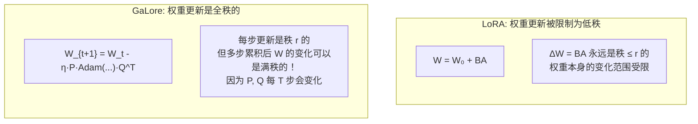

# GaLore: Memory-Efficient LLM Training by Gradient Low-Rank Projection

> **论文信息**：Zhao et al., ICML 2024  
> **一句话概括**：LoRA 冻结预训练权重只训练低秩增量，限制了模型能力；GaLore 则是**全参数训练**，但将梯度投影到低秩子空间再做优化器更新——既保留了全参数微调的表达能力，又像 LoRA 一样节省显存（优化器状态从 $O(d \times k)$ 降到 $O(d \times r + r \times k)$）。

**相关阅读**：
- [LoRA 低秩适配基础](/前置知识/000x_前置知识_LoRA低秩适配基础) — LoRA 的低秩约束
- [QLoRA 精读](./056_QLoRA_量化低秩适配) — 另一种显存优化方法

---

## 贯穿全文的例子

> 我们要从头预训练一个 7B 参数的 LLaMA 架构模型。
>
> - **标准 Adam 训练**：需要存储每个参数的一阶动量 $m$ 和二阶动量 $v$ → 优化器状态 = $2 \times 7B \times 4$ bytes = 56 GB
> - **LoRA**：不适用于预训练（因为需要一个预训练好的基础模型来冻结）
> - **GaLore**：全参数训练，但优化器状态只为低秩投影后的梯度维护 → 优化器状态从 56 GB 降到 ~14 GB
>
> **关键区别**：GaLore 是真正的全参数训练（权重本身是全秩更新的），只是优化器的内存开销被压缩了。

---

## 一、论文动机

### 1.1 LoRA 不能用于预训练

LoRA 的前提是：存在一个高质量的预训练模型，冻结它，只训练低秩增量。

但如果目标是**从头预训练**，LoRA 就不适用了——没有可冻结的预训练权重。

### 1.2 全参数训练的显存瓶颈

使用 Adam 优化器时，显存分配如下：

| 组件 | 大小（7B 模型，FP32 优化器） |
|------|---------------------------|
| 模型参数 (BF16) | 14 GB |
| 梯度 (BF16) | 14 GB |
| Adam 一阶动量 $m$ (FP32) | 28 GB |
| Adam 二阶动量 $v$ (FP32) | 28 GB |
| **总计** | **84 GB** |

优化器状态（$m + v$）占了总显存的 **67%**。如果能压缩优化器状态，显存问题就大大缓解。

### 1.3 核心观察：梯度矩阵也是低秩的

论文发现一个与 LoRA 动机类似的观察：

> 训练过程中，梯度矩阵 $G = \frac{\partial \mathcal{L}}{\partial W} \in \mathbb{R}^{d \times k}$ 也具有**近似低秩**性质。

如果对 $G$ 做 SVD，前 $r$ 个奇异值就能捕获 $G$ 90%+ 的能量。

---

## 二、方法详解

### 2.1 核心思想

GaLore 的核心是：**不限制权重更新为低秩，而是限制优化器操作在低秩子空间中进行**。

标准 Adam 的更新：
$$
W_{t+1} = W_t - \eta \cdot \text{Adam}(G_t, m_t, v_t)
$$

GaLore 的更新：
$$
W_{t+1} = W_t - \eta \cdot P \cdot \text{Adam}(P^T G_t Q, \tilde{m}_t, \tilde{v}_t) \cdot Q^T
$$

其中：
- $P \in \mathbb{R}^{d \times r}$：左投影矩阵
- $Q \in \mathbb{R}^{k \times r}$：右投影矩阵
- $P^T G_t Q \in \mathbb{R}^{r \times r}$：投影后的低秩梯度
- $\tilde{m}_t, \tilde{v}_t \in \mathbb{R}^{r \times r}$：低秩空间中的优化器状态

### 2.2 投影矩阵的获取

$P$ 和 $Q$ 通过对梯度矩阵 $G$ 做 SVD 获得：

$$
G = U \Sigma V^T
$$

取前 $r$ 个奇异向量：
- $P = U_{:, 1:r} \in \mathbb{R}^{d \times r}$（左奇异向量）
- $Q = V_{:, 1:r} \in \mathbb{R}^{k \times r}$（右奇异向量）

**但是每步都做 SVD 太贵了！** 论文的解决方案：**每 $T$ 步更新一次投影矩阵**（如 $T = 200$）。

### 2.3 完整算法

```
算法：GaLore Training
输入：学习率 η, 秩 r, 投影更新间隔 T
初始化：W₀, 投影矩阵 P₀, Q₀（通过初始梯度的 SVD 获得）

for t = 0, 1, 2, ... do:
    1. 计算全梯度 G_t = ∂L/∂W_t  (形状: d×k)
    
    2. if t % T == 0:  # 定期更新投影
         做 SVD: G_t = UΣV^T
         P_t = U[:, :r], Q_t = V[:, :r]
         重置优化器状态 m̃, ṽ（因为子空间变了）
    
    3. 投影梯度到低秩空间:
         G̃_t = P_t^T · G_t · Q_t  (形状: r×r)
    
    4. 在低秩空间做 Adam 更新:
         m̃_t = β₁·m̃_{t-1} + (1-β₁)·G̃_t
         ṽ_t = β₂·ṽ_{t-1} + (1-β₂)·G̃_t²
         Δ̃ = m̃_t / (√ṽ_t + ε)
    
    5. 投影回全空间:
         ΔW = P_t · Δ̃ · Q_t^T  (形状: d×k)
    
    6. 更新权重:
         W_{t+1} = W_t - η · ΔW
```

### 2.4 显存分析

| 组件 | 标准 Adam | GaLore |
|------|-----------|--------|
| 一阶动量 $m$ | $d \times k$ | $r \times r$ |
| 二阶动量 $v$ | $d \times k$ | $r \times r$ |
| 投影矩阵 $P, Q$ | - | $d \times r + k \times r$ |
| **总优化器显存** | $2dk$ | $2r^2 + (d+k)r$ |

以 $d = k = 4096$, $r = 128$ 为例：
- 标准 Adam：$2 \times 4096 \times 4096 = 33,554,432$
- GaLore：$2 \times 128^2 + (4096 + 4096) \times 128 = 32,768 + 1,048,576 = 1,081,344$
- **压缩比**：$\frac{1,081,344}{33,554,432} \approx 3.2\%$

---

## 三、GaLore vs LoRA：关键区别



**核心区别**：
1. **LoRA**：$\Delta W = BA$ 永远在固定的秩 $r$ 子空间中 → 权重变化被永久限制为低秩
2. **GaLore**：每步更新是低秩的，但投影子空间会变化 → 多步累积后权重变化可以覆盖全空间

**类比**：
- LoRA 像是在一条固定的低维走廊里优化
- GaLore 像是在一个会旋转的低维走廊里优化——走廊虽然窄，但方向会变，最终可以到达全空间的任何位置

---

## 四、实验结果

### 4.1 预训练实验

从头训练 LLaMA 架构模型（C4 数据集）：

| 方法 | 参数量 | 优化器显存 | 验证 PPL | 等效全参数？ |
|------|--------|-----------|---------|------------|
| Adam (全参数) | 60M | 480 MB | 34.1 | ✅ |
| Adam (全参数) | 130M | 1.04 GB | 25.1 | ✅ |
| LoRA ($r=128$) | 130M | 26 MB | 28.3 | ❌ |
| **GaLore ($r=128$)** | 130M | **26 MB** | **25.4** | **几乎✅** |
| Adam (全参数) | 350M | 2.8 GB | 19.7 | ✅ |
| **GaLore ($r=256$)** | 350M | **0.2 GB** | **20.1** | **几乎✅** |
| Adam (全参数) | 1B | 8 GB | 16.8 | ✅ |
| **GaLore ($r=512$)** | 1B | **1.2 GB** | **17.0** | **几乎✅** |

**关键发现**：
1. GaLore 在预训练中几乎匹配全参数 Adam 的效果
2. LoRA 在预训练场景中显著落后
3. GaLore 的优化器显存压缩 8~15 倍

### 4.2 微调实验

在 RoBERTa-Base 上做 GLUE 微调：

| 方法 | MNLI | SST-2 | CoLA | 平均 |
|------|------|-------|------|------|
| 全参数 Adam | 87.6 | 94.8 | 63.6 | 82.0 |
| LoRA ($r=8$) | 87.5 | 94.9 | 61.8 | 81.4 |
| **GaLore ($r=4$)** | **87.3** | **94.7** | **62.5** | **81.5** |

微调场景下 GaLore 与 LoRA 效果相当，但 GaLore 的优势在预训练中更明显。

### 4.3 大规模验证

7B 模型训练的关键指标：

| 方法 | 总显存 | GPU 数量 | 训练速度 |
|------|--------|---------|---------|
| Adam BF16 | ~84 GB | 8×A100 | 1x |
| **GaLore** ($r=1024$) | **~32 GB** | **4×A100** | **0.85x** |
| QLoRA (假设从预训练开始) | 不适用 | - | - |

---

## 五、技术细节

### 5.1 投影更新频率 $T$ 的选择

| $T$ | SVD 计算开销 | 子空间跟踪精度 | 推荐场景 |
|-----|-------------|---------------|---------|
| 50 | 高（每 50 步一次 SVD） | 最好 | 训练不稳定时 |
| 200 | 中 | 好 | **默认推荐** |
| 500 | 低 | 尚可 | 训练后期 |
| 1000 | 很低 | 可能不足 | 不推荐 |

SVD 的计算代价：对 $G \in \mathbb{R}^{d \times k}$ 做 rank-$r$ 截断 SVD 的复杂度为 $O(dk \cdot r)$。每 200 步做一次，相对于训练本身的计算量可以忽略（约 1-2% 额外开销）。

### 5.2 子空间切换时的优化器状态处理

当投影矩阵 $P, Q$ 更新后，旧的优化器状态 $\tilde{m}, \tilde{v}$ 在新的子空间中已经没有意义。论文的处理方式是**重置**（设为零）。

这看似浪费，但实践中：
- Adam 的动量是指数加权平均，重置后几步就能重建有效的状态
- $T = 200$ 步的间隔让大部分训练时间都在稳定的子空间中

### 5.3 只投影一侧

论文发现可以只使用左投影 $P$ 或右投影 $Q$（而不是两者同时），效果也不错：

$$
\text{GaLore-left:} \quad \tilde{G} = P^T G \in \mathbb{R}^{r \times k}
$$

这进一步简化了实现，且优化器状态大小变为 $r \times k$（而非 $r \times r$）。

---

## 六、GaLore 的局限

| 局限 | 描述 |
|------|------|
| SVD 开销 | 虽然不频繁，但大矩阵的 SVD 仍有计算成本 |
| 实现复杂 | 需要修改优化器内部逻辑，不如 LoRA 即插即用 |
| 多任务不便 | LoRA 可以为不同任务维护不同适配器并切换；GaLore 的更新融入了权重本身 |
| 推理无优势 | GaLore 训练完的模型就是完整的全参数模型，没有推理时的部署优势 |
| 子空间切换不平滑 | 每 $T$ 步的突然切换可能导致训练震荡 |

---

## 七、总结

### 核心贡献

1. **提出了"梯度低秩投影"的新范式**：不限制权重为低秩，而是限制优化过程为低秩
2. **理论上证明了全参数训练可达性**：多步累积可以覆盖全秩变化
3. **首次让单卡 7B 预训练成为可能**
4. **与 LoRA 互补**：GaLore 适合预训练，LoRA 适合多任务微调

### GaLore vs LoRA 使用建议

| 场景 | 推荐方法 | 原因 |
|------|---------|------|
| 预训练 | **GaLore** | LoRA 不适用于预训练；GaLore 是真正的全参数训练 |
| 单任务微调 | 两者皆可 | 效果接近，LoRA 更简单 |
| 多任务微调 | **LoRA** | 可以为每个任务维护独立适配器 |
| 极致省显存 | **GaLore + 8-bit Adam** | 组合效果最好 |
| 需要推理时切换任务 | **LoRA** | 支持适配器热切换 |

### 延伸阅读

- [LoRA 低秩适配基础](/前置知识/000x_前置知识_LoRA低秩适配基础) — LoRA 的低秩约束
- [QLoRA 精读](./056_QLoRA_量化低秩适配) — 量化方向的显存优化
- [LoRA-FA 精读](./060_LoRA_FA_冻结A矩阵) — 另一种激活值显存优化
