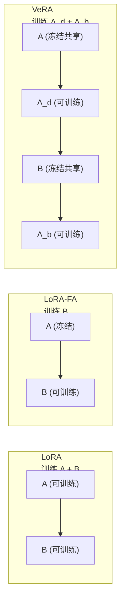

# VeRA: Vector-based Random Matrix Adaptation

> **论文信息**：Kopiczko et al., ICLR 2024  
> **一句话概括**：把 LoRA-FA 的"冻结 $A$"思想推到极致——$A$ 和 $B$ **都冻结**为共享的随机矩阵，只训练两个对角缩放向量 $\Lambda_b \in \mathbb{R}^{d}$ 和 $\Lambda_d \in \mathbb{R}^{r}$。可训练参数量比 LoRA 再少 10 倍以上，效果仍然具有竞争力。

**相关阅读**：
- [LoRA 低秩适配基础](/前置知识/000x_前置知识_LoRA低秩适配基础) — LoRA 的 A/B 矩阵
- [LoRA-FA 精读](./060_LoRA_FA_冻结A矩阵) — 冻结 A 矩阵的先驱

---

## 贯穿全文的例子

> 场景：为一个 7B 模型创建 100 个不同任务的适配器（如多语言翻译的 100 种语言对）。
>
> - **LoRA ($r=16$)**：每个适配器 ~20M 参数 → 100 个 = 2000M 参数存储 ≈ 4 GB
> - **VeRA ($r=256$)**：每个适配器 ~0.1M 参数 → 100 个 = 10M 参数存储 ≈ 20 MB（共享的随机矩阵只存一份）
>
> VeRA 在极端多任务场景下的存储优势是压倒性的。

---

## 一、论文动机

### 1.1 LoRA-FA 的启示

[LoRA-FA](./060_LoRA_FA_冻结A矩阵) 证明了冻结 $A$ 只训练 $B$，效果几乎不损。这引出一个自然问题：

> 如果 $A$ 可以是随机固定的，那 $B$ 是否也可以是随机固定的？我们到底需要训练什么？

### 1.2 核心 Insight

VeRA 的核心 Insight 是：

> $A$ 和 $B$ 提供的本质功能是**从输入空间到输出空间的随机映射基底**。真正需要学习的是**如何加权/选择这些基底**——而这只需要几个向量就够了。

**类比**：
- LoRA：定制一套专属的画笔（$A, B$）来画特定的画
- VeRA：使用一套标准的画笔（固定随机的 $A, B$），只学习每支画笔用多大力度（缩放向量）

---

## 二、方法详解

### 2.1 VeRA 的前向传播

$$
h = W_0 x + \Lambda_b \cdot B \cdot \Lambda_d \cdot A \cdot x
$$

其中：
- $A \in \mathbb{R}^{r \times k}$：**冻结的随机矩阵**（所有层共享同一个 $A$）
- $B \in \mathbb{R}^{d \times r}$：**冻结的随机矩阵**（所有层共享同一个 $B$）
- $\Lambda_d = \text{diag}(\lambda_{d,1}, ..., \lambda_{d,r}) \in \mathbb{R}^{r \times r}$：**可训练的对角矩阵**（每层独立）
- $\Lambda_b = \text{diag}(\lambda_{b,1}, ..., \lambda_{b,d}) \in \mathbb{R}^{d \times d}$：**可训练的对角矩阵**（每层独立）

**信息流**：
$$
x \xrightarrow{A} \mathbb{R}^r \xrightarrow{\Lambda_d} \mathbb{R}^r \xrightarrow{B} \mathbb{R}^d \xrightarrow{\Lambda_b} \mathbb{R}^d
$$

### 2.2 参数量分析

| 组件 | 形状 | 参数量 | 是否共享 | 可训练？ |
|------|------|--------|---------|---------|
| $A$ | $r \times k$ | $rk$ | 全局共享（只存一份） | ❌ |
| $B$ | $d \times r$ | $dr$ | 全局共享（只存一份） | ❌ |
| $\Lambda_d$ | $r$ | $r$ | 每层独立 | ✅ |
| $\Lambda_b$ | $d$ | $d$ | 每层独立 | ✅ |

**可训练参数/层** = $r + d$

以 LLaMA-7B（$d=4096$, $r=256$, 对 $W_Q, W_V$ 每层 2 个）为例：
- LoRA ($r=16$)：每层 $2 \times (4096 \times 16 + 16 \times 4096) = 262,144$
- **VeRA ($r=256$)**：每层 $2 \times (256 + 4096) = 8,704$
- **压缩比**：$\frac{8704}{262144} = 3.3\%$！

VeRA 用 LoRA 3.3% 的参数量，同时使用了更大的 $r=256$（更大的表达能力上限）。

### 2.3 为什么 VeRA 的 $r$ 可以很大？

在 LoRA 中，$r$ 大意味着参数多。但在 VeRA 中，$r$ 大只增加 $\Lambda_d$ 的 $r$ 个参数（可忽略），而 $A, B$ 是共享的不算额外参数。

所以 VeRA 倾向于使用**很大的 $r$**（如 256 或 512），给学习提供更丰富的随机基底。

### 2.4 初始化

- $A \sim \mathcal{N}(0, 1/k)$（Kaiming 初始化，冻结）
- $B \sim \mathcal{N}(0, 1/r)$（Kaiming 初始化，冻结）
- $\Lambda_d$：初始化为全零或接近零的小值
- $\Lambda_b$：初始化为全 1（恒等映射）

这确保初始时 $\Lambda_b B \Lambda_d A \approx 0$，起点仍是预训练模型。

### 2.5 $\Lambda_d$ 和 $\Lambda_b$ 的不同角色

- **$\Lambda_d \in \mathbb{R}^r$（低维缩放）**：选择哪些随机基底方向是重要的
  - $\lambda_{d,i} = 0$：第 $i$ 个基底方向被关闭
  - $\lambda_{d,i}$ 大：第 $i$ 个方向被强调
  
- **$\Lambda_b \in \mathbb{R}^d$（高维缩放）**：选择输出空间的哪些维度被影响
  - $\lambda_{b,j} = 0$：第 $j$ 个输出维度不被 LoRA 修改
  - $\lambda_{b,j}$ 大：第 $j$ 个输出维度被强烈修改

---

## 三、与 LoRA 变体的对比



| 方法 | 可训练参数/层 | 注释 |
|------|-------------|------|
| LoRA | $dr + rk$ | A 和 B 都训练 |
| LoRA-FA | $dr$ | 只训练 B |
| **VeRA** | **$d + r$** | 只训练两个向量 |

---

## 四、实验结果

### 4.1 自然语言理解

在 RoBERTa-Large 上的 GLUE 基准：

| 方法 | 可训练参数 | MNLI | SST-2 | CoLA | MRPC | 平均 |
|------|-----------|------|-------|------|------|------|
| 全参数微调 | 355M | 90.2 | 96.4 | 68.0 | 90.9 | 86.4 |
| LoRA ($r=16$) | 0.8M | 90.6 | 96.2 | 69.3 | 89.7 | 86.5 |
| **VeRA ($r=256$)** | **0.04M** | **89.4** | **95.7** | **66.8** | **89.2** | **85.3** |
| Prompt Tuning | 0.02M | 85.6 | 93.5 | 55.0 | 84.2 | 79.6 |

**分析**：
- VeRA 用 LoRA 5% 的参数，只下降了约 1.2 个点
- VeRA 远超同参数量级的 Prompt Tuning
- 在极端参数效率需求场景下，VeRA 是很好的选择

### 4.2 指令微调

在 LLaMA-7B 上：

| 方法 | 可训练参数 | MT-Bench | 适配器存储大小 |
|------|-----------|----------|-------------|
| LoRA ($r=16$) | 20M | 5.82 | 40 MB |
| LoRA ($r=64$) | 80M | 5.87 | 160 MB |
| **VeRA ($r=256$)** | **0.3M** | **5.54** | **0.6 MB** |
| **VeRA ($r=1024$)** | **0.5M** | **5.71** | **1 MB** |

VeRA 的存储优势巨大（每个适配器不到 1 MB），但效果比 LoRA 略低。

### 4.3 多任务部署的经济性

如果需要部署 N 个任务：

| N (任务数) | LoRA 存储 | VeRA 存储 | VeRA 优势 |
|-----------|----------|----------|----------|
| 1 | 40 MB | 160 MB + 0.6 MB | 无（共享矩阵开销） |
| 10 | 400 MB | 160 MB + 6 MB = 166 MB | 2.4x |
| 100 | 4 GB | 160 MB + 60 MB = 220 MB | 18x |
| 1000 | 40 GB | 160 MB + 600 MB = 760 MB | **53x** |

VeRA 的优势随任务数线性增长——因为共享的随机矩阵（160MB）只存一份。

---

## 五、理论支撑

### 5.1 随机特征映射理论

VeRA 的有效性可以用 **Random Features** 理论解释（Rahimi & Recht, 2007）：

> 一个随机固定的映射 $\phi(x) = Ax$（其中 $A$ 随机且固定）可以近似核方法。在 $\phi(x)$ 之上训练一个线性层就足以逼近复杂函数。

VeRA 的 $A, B$ 扮演了"随机特征映射"的角色，而 $\Lambda_d, \Lambda_b$ 扮演了线性层的角色。

### 5.2 为什么共享 $A, B$ 没问题？

所有层共享同一对 $A, B$ 的合理性：
- 每层的 $\Lambda_d, \Lambda_b$ 不同 → 实际的 $\Delta W = \Lambda_b B \Lambda_d A$ 在每层是不同的
- 共享的 $A, B$ 只提供"基底"，真正的任务特异性由 $\Lambda$ 提供
- 类似于所有层共享相同的位置编码（都是正弦/余弦），但输出不同

---

## 六、代码实现

```python
import torch
import torch.nn as nn

class VeRALinear(nn.Module):
    """VeRA: 冻结共享的 A/B，只训练两个缩放向量"""
    
    def __init__(self, original_linear: nn.Linear, 
                 shared_A: torch.Tensor,  # 全局共享
                 shared_B: torch.Tensor,  # 全局共享
                 r: int = 256):
        super().__init__()
        self.original = original_linear
        self.original.weight.requires_grad = False
        
        d, k = original_linear.out_features, original_linear.in_features
        self.r = r
        
        # 冻结的共享随机矩阵（注册为 buffer，不算参数）
        self.register_buffer('A', shared_A[:r, :k])  # [r, k]
        self.register_buffer('B', shared_B[:d, :r])  # [d, r]
        
        # 唯一可训练的参数：两个缩放向量
        self.lambda_d = nn.Parameter(torch.zeros(r))   # 低维缩放
        self.lambda_b = nn.Parameter(torch.ones(d))    # 高维缩放
    
    def forward(self, x: torch.Tensor) -> torch.Tensor:
        h = self.original(x)
        
        # VeRA 路径
        # x: [batch, seq, k]
        z = x @ self.A.T                    # [batch, seq, r]
        z = z * self.lambda_d               # 逐元素缩放 [batch, seq, r]
        z = z @ self.B.T                    # [batch, seq, d]
        z = z * self.lambda_b               # 逐元素缩放 [batch, seq, d]
        
        return h + z


# 使用时：全局创建共享的随机矩阵
shared_A = torch.randn(1024, 4096) / (4096 ** 0.5)  # max_r × max_k
shared_B = torch.randn(4096, 1024) / (1024 ** 0.5)  # max_d × max_r

# 所有层使用同一对 shared_A, shared_B
vera_layer = VeRALinear(original_layer, shared_A, shared_B, r=256)
```

---

## 七、局限性与适用场景

### 7.1 局限

1. **效果低于 LoRA**：特别是在需要较大适配能力的任务上
2. **缺乏方向学习能力**：$\Lambda$ 只能缩放，不能旋转随机基底
3. **依赖随机种子**：不同随机种子的 $A, B$ 可能导致不同的效果
4. **不支持推理合并**：$\Lambda_b B \Lambda_d A$ 的乘积不是简洁的低秩形式

### 7.2 最佳适用场景

- **极端多任务部署**：100+ 个任务需要各自的适配器
- **边缘设备微调**：参数存储极其有限
- **快速原型**：需要快速尝试很多任务变体
- **联邦学习**：每轮通信只需传输两个向量（$\Lambda_d, \Lambda_b$）

---

## 八、总结

### 核心贡献

1. **将"冻结投影"思想推到极致**：A 和 B 都冻结且全局共享
2. **发现缩放向量足够表达任务差异**：证明了不需要学习投影方向
3. **实现了 LoRA 100x 的参数压缩**：每个适配器不到 1MB
4. **在极端多任务场景下存储优势巨大**

### 延伸阅读

- [LoRA 低秩适配基础](/前置知识/000x_前置知识_LoRA低秩适配基础) — 基础回顾
- [LoRA-FA 精读](./060_LoRA_FA_冻结A矩阵) — 冻结 A 的先驱工作
- [MoRA 精读](./065_MoRA_高秩更新适配) — 相反方向：追求更高秩的更新
