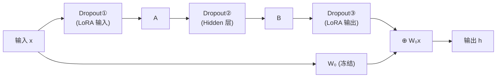

# LoRA Meets Dropout under a Unified Framework

> **论文信息**：Wang et al., 2024  
> **一句话概括**：LoRA 微调在小数据集上容易过拟合，标准 Dropout 对 LoRA 的效果不稳定。论文提出了 **HiddenKey**——一种专为 LoRA 设计的 Dropout 策略：在 $A$ 和 $B$ 之间的隐藏表示上以及 Key 矩阵的输出上做 Dropout，比标准 Dropout 更稳定有效。

**相关阅读**：
- [LoRA 低秩适配基础](/前置知识/000x_前置知识_LoRA低秩适配基础) — LoRA 结构回顾
- [LoRA 原始论文精读](./055_LoRA_低秩适配微调大模型) — LoRA 训练细节

---

## 贯穿全文的例子

> 场景：用 LoRA 微调 RoBERTa-Large 做一个只有 500 条标注数据的情感分类任务。
>
> - **无 Dropout**：训练集准确率 99.8%，验证集准确率 82.3% → 严重过拟合
> - **标准 Dropout ($p=0.1$)**：训练集 97.5%，验证集 84.1% → 有帮助但不够
> - **HiddenKey Dropout**：训练集 95.2%，验证集 **87.6%** → 显著改善
>
> 在数据稀缺场景下，合适的正则化对 LoRA 至关重要。

---

## 一、论文动机：LoRA 也会过拟合

### 1.1 LoRA 过拟合的原因

虽然 LoRA 参数量少，但它仍然可能过拟合，尤其是在：
- **小数据集**（<1000 条）
- **简单任务**（如二分类情感分析）
- **较大的 $r$**（如 $r=64$，参数量增多）

**为什么参数少还会过拟合？** 因为：
1. LoRA 的参数虽少，但直接作用于模型的核心表示（注意力层）
2. 低秩约束本身是一种隐式正则，但不够强
3. 大型预训练模型的表达能力极强，即使少量参数的微调也能轻松记忆小数据集

### 1.2 标准 Dropout 的问题

原始 LoRA 论文中使用了 `lora_dropout`，默认在 $A$ 的输入上做 Dropout：

$$
h_{\text{lora}} = B \cdot A \cdot \text{Dropout}(x)
$$

但论文发现这种方式**效果不稳定**：
- 在某些任务上有帮助
- 在另一些任务上反而降低了效果
- Dropout 率需要精心调节，泛化性差

**问题根源**：Dropout 应用在 $x$ 上，但 $x$ 同时被冻结的 $W_0$ 使用。对 $x$ 做 Dropout 可能干扰 $W_0$ 的正常前向传播。

---

## 二、统一框架：LoRA 中 Dropout 的所有可能位置

论文首先系统化分析了 Dropout 在 LoRA 中可以放置的**所有位置**：



| 位置 | 公式 | 名称 |
|------|------|------|
| ① LoRA 输入 | $B \cdot A \cdot \text{Drop}(x)$ | InputDropout（标准 LoRA 默认） |
| ② Hidden 层 | $B \cdot \text{Drop}(Ax)$ | **HiddenDropout** |
| ③ LoRA 输出 | $\text{Drop}(BAx)$ | OutputDropout |
| ①+② | 组合 | - |
| 全部 | 所有位置 | - |

---

## 三、HiddenKey：最优 Dropout 策略

### 3.1 Hidden Dropout

论文发现**位置②（Hidden 层）**是最有效的 Dropout 位置：

$$
h_{\text{lora}} = B \cdot \text{Dropout}(Ax, p)
$$

**为什么 Hidden Dropout 最好？**

1. **不干扰主路径**：Dropout 只作用于 LoRA 分支的内部，不影响冻结的 $W_0 x$
2. **正则化效果强**：$Ax \in \mathbb{R}^r$ 是低维的（$r$ 通常很小），Dropout 掉一部分维度相当于强制模型用更少的"通道"来表达，避免对特定通道过度依赖
3. **梯度正则化**：Dropout 在 $A$ 和 $B$ 之间，对两者的梯度都有正则效果

### 3.2 Key Dropout

论文还发现：在注意力计算中，**对 Key 矩阵的输出做 Dropout** 有额外的正则化效果：

$$
K = W_K x + \text{Dropout}(B_K A_K x)
$$

为什么 Key 特别重要？
- Key 决定了"什么信息被关注"
- 如果 Key 的 LoRA 过拟合，模型会学到只关注训练集中的特定模式
- 对 Key 的 LoRA 输出做 Dropout 可以防止这种"注意力过拟合"

### 3.3 完整的 HiddenKey 方案

HiddenKey = Hidden Dropout + Key Dropout：

```python
# 对所有 LoRA 层：在 A 输出处做 Dropout
h_lora = B @ dropout(A @ x, p=0.1)

# 对 Key 投影的 LoRA：额外的输出 Dropout
K_lora = dropout(B_K @ A_K @ x, p=0.1)
```

---

## 四、实验结果

### 4.1 小数据集分类

在 GLUE 子集（每类只取 100 条数据）上：

| 方法 | SST-2 | MRPC | COLA | RTE | 平均 |
|------|-------|------|------|-----|------|
| LoRA (无 Dropout) | 82.3 | 76.5 | 45.2 | 58.1 | 65.5 |
| LoRA + 标准 Dropout ($p=0.1$) | 84.1 | 77.8 | 47.5 | 60.4 | 67.5 |
| LoRA + Hidden Dropout | 86.8 | 80.2 | 51.3 | 63.7 | 70.5 |
| **LoRA + HiddenKey** | **87.6** | **81.5** | **53.1** | **65.2** | **71.9** |

HiddenKey 比无 Dropout 提升了 **6.4 个点**，比标准 Dropout 提升了 **4.4 个点**。

### 4.2 不同 $r$ 下的效果

$r$ 越大越容易过拟合，HiddenKey 的效果越明显：

| $r$ | LoRA | LoRA + HiddenKey | 提升 |
|-----|------|-----------------|------|
| 4 | 83.5 | 85.2 | +1.7 |
| 8 | 84.1 | 86.5 | +2.4 |
| 16 | 84.3 | 87.6 | +3.3 |
| 32 | 83.8 | 87.9 | +4.1 |
| 64 | 82.5 | **88.1** | **+5.6** |

注意：没有 HiddenKey 时，$r=64$ 反而比 $r=16$ 差（过拟合）。有了 HiddenKey，大 $r$ 终于能一直提升。

### 4.3 大数据集上的效果

在完整 GLUE 数据集上（非小数据场景）：

| 方法 | MNLI | SST-2 | QQP | 平均 |
|------|------|-------|-----|------|
| LoRA | 90.3 | 95.9 | 91.5 | 92.6 |
| LoRA + HiddenKey | 90.5 | 96.1 | 91.7 | 92.8 |

**大数据集上效果差异很小**——这符合预期：数据量充足时过拟合不是主要问题。

---

## 五、理论分析

### 5.1 为什么 Hidden Dropout 比 Input Dropout 好？

**Input Dropout 的问题**：

$$
h = W_0 \cdot \text{Drop}(x) + BA \cdot \text{Drop}(x)
$$

这里 $\text{Drop}(x)$ 同时影响了冻结路径 $W_0 \cdot \text{Drop}(x)$！在推理时，$W_0$ 看到的是完整的 $x$，但训练时看到的是 Dropped 的 $x$ → 训练-推理不一致。

**Hidden Dropout 避免了这个问题**：

$$
h = W_0 x + B \cdot \text{Drop}(Ax)
$$

$W_0$ 始终看到完整的 $x$，Dropout 只影响 LoRA 分支。

### 5.2 正则化强度分析

Hidden Dropout ($p$) 对 LoRA 的等效正则化强度：

由于 $Ax \in \mathbb{R}^r$ 维度很低（通常 $r=8~64$），Dropout 掉 $p$ 比例意味着：
- 有效使用的维度 $r_{\text{eff}} = r(1-p)$
- 等效于训练时用更小的秩 $r(1-p)$，推理时用完整秩 $r$
- 这是一种"秩增强"效果——训练时困难（少通道），推理时充裕（全通道）

---

## 六、Dropout 率的选择

| 数据集大小 | 推荐 Dropout 率 | 理由 |
|-----------|-----------------|------|
| <500 条 | 0.2~0.3 | 需要强正则化 |
| 500~5000 条 | 0.1~0.2 | 中等正则化 |
| 5000~50000 条 | 0.05~0.1 | 轻度正则化 |
| >50000 条 | 0~0.05 | 几乎不需要 |

---

## 七、代码实现

```python
import torch
import torch.nn as nn
import torch.nn.functional as F

class LoRAWithHiddenKeyDropout(nn.Module):
    """带 HiddenKey Dropout 的 LoRA"""
    
    def __init__(self, original_linear: nn.Linear, r: int = 16, 
                 alpha: int = 32, hidden_dropout: float = 0.1,
                 is_key_projection: bool = False,
                 key_output_dropout: float = 0.1):
        super().__init__()
        self.original = original_linear
        self.original.weight.requires_grad = False
        
        d, k = original_linear.out_features, original_linear.in_features
        self.scaling = alpha / r
        self.hidden_dropout = hidden_dropout
        self.is_key_projection = is_key_projection
        self.key_output_dropout = key_output_dropout
        
        self.A = nn.Parameter(torch.randn(r, k) * (1.0 / k ** 0.5))
        self.B = nn.Parameter(torch.zeros(d, r))
    
    def forward(self, x: torch.Tensor) -> torch.Tensor:
        h = self.original(x)
        
        # LoRA 路径 + Hidden Dropout
        hidden = x @ self.A.T  # [batch, seq, r]
        
        if self.training:
            hidden = F.dropout(hidden, p=self.hidden_dropout)  # Hidden Dropout!
        
        lora_out = hidden @ self.B.T  # [batch, seq, d]
        
        # Key Dropout（只对 Key 投影额外做）
        if self.is_key_projection and self.training:
            lora_out = F.dropout(lora_out, p=self.key_output_dropout)
        
        return h + self.scaling * lora_out
```

---

## 八、总结

### 核心贡献

1. **系统分析了 LoRA 中 Dropout 的所有可能位置**
2. **发现 Hidden Dropout > Input Dropout > Output Dropout**
3. **提出 HiddenKey 策略**：Hidden + Key 组合，效果最佳
4. **在小数据场景下提升显著**（最高 +6 个百分点）

### 使用建议

- **数据量少**（<5k）：强烈建议使用 HiddenKey，$p=0.1~0.2$
- **数据量大**（>50k）：影响不大，可以不用或用很小的 $p$
- **$r$ 较大时**：更需要 Dropout 正则化
- **与其他改进兼容**：可以同时与 rsLoRA、LoRA+、DoRA 组合

### 延伸阅读

- [LoRA 低秩适配基础](/前置知识/000x_前置知识_LoRA低秩适配基础) — LoRA 结构
- [LoRA 原始论文精读](./055_LoRA_低秩适配微调大模型) — 原始 Dropout 配置
- [rsLoRA 精读](./062_rsLoRA_秩稳定缩放) — 与大 $r$ 相关的改进
