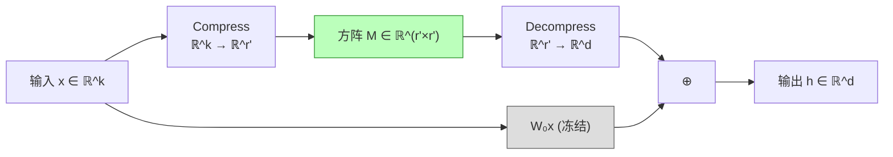

# MoRA: High-Rank Updating for Parameter-Efficient Fine-Tuning

> **论文信息**：Jiang et al., 2024  
> **一句话概括**：LoRA 的低秩约束 $\Delta W = BA$ 限制了它学习新知识（如记忆新信息）的能力。MoRA 用方阵映射（$M \in \mathbb{R}^{r' \times r'}$，$r' = \sqrt{dr/k}$）替代低秩分解，在**相同参数预算**下实现更高秩的权重更新——尤其擅长记忆密集型任务。

**相关阅读**：
- [LoRA 低秩适配基础](/前置知识/000x_前置知识_LoRA低秩适配基础) — LoRA 的低秩约束
- [AdaLoRA 精读](./057_AdaLoRA_自适应秩分配) — 自适应秩的另一种思路

---

## 贯穿全文的例子

> 场景：用 LoRA 微调 LLaMA-7B 来记忆一本专业医学教材（大量需要精确记忆的专有名词和事实）。
>
> **LoRA ($r=256$) 的问题**：$\Delta W$ 秩 ≤ 256 → 能表达的独立"知识方向"不超过 256 个。但医学教材可能包含数千个需要独立记忆的事实。
>
> **MoRA 的解决**：用相同参数量，实现 $\Delta W$ 的秩可以达到 $\min(d, k)$（理论上满秩）→ 可以编码更多独立信息。
>
> 代价：推理时不能像 LoRA 那样零开销合并（但可以近似合并）。

---

## 一、论文动机

### 1.1 LoRA 的低秩瓶颈

LoRA 的 $\Delta W = BA$ 其秩**永远不超过** $r$。这意味着：

$$
\text{rank}(\Delta W) \leq r
$$

**矩阵秩的含义**：秩为 $r$ 的矩阵只能表达 $r$ 个线性独立的"变化方向"。如果任务需要模型在 $r$ 个以上的独立方向上调整，LoRA 就力不从心了。

### 1.2 什么任务需要高秩更新？

| 任务类型 | 所需秩 | LoRA 表现 |
|---------|--------|----------|
| 风格转换（格式/语气） | 低 | 好 |
| 分类/NLU | 低~中 | 好 |
| 代码生成 | 中 | 好 |
| **新知识记忆** | **高** | **差** |
| **多语言翻译** | **高** | **中** |
| **大量实体关系编码** | **高** | **差** |

**直觉解释**：
- 风格转换只需要改变"怎么说"→ 几个方向就够
- 新知识记忆需要改变"知道什么"→ 每条知识可能需要一个独立方向

### 1.3 增大 $r$ 不是解决方案

如果增大 $r$ 到 1024 或更大：
- 参数量暴增（$r=1024$ 时约 640M 参数）
- 失去了 PEFT 的意义
- 且由于 [rsLoRA](./062_rsLoRA_秩稳定缩放) 指出的缩放问题，大 $r$ 的利用效率很低

**MoRA 的思路**：在**不增加参数量**的前提下，实现更高秩的更新。

---

## 二、方法详解

### 2.1 核心思想

LoRA 用两个瘦长矩阵 $B \in \mathbb{R}^{d \times r}$ 和 $A \in \mathbb{R}^{r \times k}$ 相乘：
- 参数量：$dr + rk$
- 结果秩：$\leq r$

MoRA 的替代方案：用一个**方阵** $M \in \mathbb{R}^{r' \times r'}$ 配合降维/升维操作：
- 参数量：${r'}^2 \approx dr + rk$（相同预算）
- 结果秩：$\leq r'$（$r' \gg r$！）

**关键洞察**：给定参数预算 $P = dr + rk$，如果使用方阵 $M$，其边长为：

$$
r' = \sqrt{P} = \sqrt{dr + rk} = \sqrt{r(d+k)}
$$

以 $d = k = 4096$, $r = 8$ 为例：
- LoRA 参数量：$8 \times 4096 + 8 \times 4096 = 65536$
- MoRA 方阵边长：$r' = \sqrt{65536} = 256$
- **MoRA 的 $\Delta W$ 秩可以达到 256**，而 LoRA 只能达到 8！

### 2.2 MoRA 的前向传播

由于 $M \in \mathbb{R}^{r' \times r'}$ 而输入是 $x \in \mathbb{R}^k$, 输出需要 $\mathbb{R}^d$，需要降维和升维操作：

$$
h = W_0 x + \text{Decompress}(M \cdot \text{Compress}(x))
$$

其中：
- $\text{Compress}: \mathbb{R}^k \to \mathbb{R}^{r'}$（将 $k$ 维输入压缩到 $r'$ 维）
- $\text{Decompress}: \mathbb{R}^{r'} \to \mathbb{R}^d$（将 $r'$ 维输出展开到 $d$ 维）

### 2.3 压缩和解压缩的实现

论文探索了多种压缩/解压缩策略：

**策略 1：截断（Truncation）**
$$
\text{Compress}(x) = x_{1:r'} \quad \text{（取前 } r' \text{ 维）}
$$

简单但丢弃了后 $k - r'$ 维的信息。

**策略 2：分组求和（Grouped Sum）**

将 $k$ 维输入分成 $r'$ 组，每组求和：
$$
\text{Compress}(x)_i = \sum_{j \in \text{group}_i} x_j
$$

保留了所有维度的信息（通过加和），但不可逆。

**策略 3：共享行/列操作**

将输入 reshape 为矩阵形式再处理。

**论文推荐策略**：分组求和（简单有效）。

### 2.4 完整流程



### 2.5 秩分析

**定理**：$\Delta W = \text{Decompress} \circ M \circ \text{Compress}$ 的秩为：

$$
\text{rank}(\Delta W) = \min(\text{rank}(M), \text{rank(Compress)}, \text{rank(Decompress)})
$$

- 如果 Compress 和 Decompress 都是满秩映射（如分组求和 + 重复展开）
- 则 $\text{rank}(\Delta W) = \text{rank}(M)$，可达 $r'$

与 LoRA 对比（相同参数预算 $P$）：
- LoRA 最大秩：$r = P / (d + k)$
- MoRA 最大秩：$r' = \sqrt{P}$

以 $P = 65536$, $d = k = 4096$：
- LoRA：$r = 65536 / 8192 = 8$
- MoRA：$r' = \sqrt{65536} = 256$ → **32 倍的秩上限！**

---

## 三、实验结果

### 3.1 记忆任务

在知识密集型任务上（需要记忆新事实）：

| 方法 | 参数量 | UUID 记忆准确率 | 长上下文记忆 | 知识问答 |
|------|--------|----------------|------------|---------|
| LoRA ($r=8$) | 65K | 12.3% | 45.2% | 62.1% |
| LoRA ($r=256$) | 2M | 48.5% | 68.7% | 71.3% |
| **MoRA (同 $r=8$ 预算)** | **65K** | **38.7%** | **62.3%** | **68.5%** |
| **MoRA (同 $r=256$ 预算)** | **2M** | **72.1%** | **81.5%** | **78.2%** |

**MoRA 在记忆任务上远超 LoRA**——特别是在相同参数预算下。

### 3.2 通用任务

在 NLU/NLG 通用任务上：

| 方法 | MMLU | HellaSwag | ARC | 平均 |
|------|------|-----------|-----|------|
| LoRA ($r=16$) | 44.5 | 78.1 | 77.8 | 66.8 |
| **MoRA** (同预算) | 44.2 | 77.8 | 77.5 | 66.5 |

**在通用任务上 MoRA 与 LoRA 持平**——高秩不一定比低秩好（通用任务确实不需要高秩）。

### 3.3 总结规律

| 任务类型 | 更适合的方法 | 原因 |
|---------|------------|------|
| 新知识记忆 | **MoRA** | 需要高秩编码独立事实 |
| 风格/格式适配 | LoRA | 低秩足够 |
| 推理/理解 | 两者相当 | 不依赖权重秩 |
| 多语言翻译 | **MoRA** | 每种语言可能需要独立方向 |

---

## 四、MoRA 的代价

### 4.1 不能像 LoRA 那样合并

LoRA：$W_{\text{merged}} = W_0 + BA$（直接矩阵加法，推理零开销）

MoRA：$\Delta W = \text{Decompress}(M \cdot \text{Compress}(\cdot))$ 不是一个简单的矩阵加法——因为 Compress 和 Decompress 是非线性操作（如分组求和/展开）。

**解决方案**：训练完成后，可以用 $W_0 + \Delta W_{\text{approx}}$ 近似合并：
1. 计算完整的 $\Delta W$ 矩阵（$d \times k$）
2. 加到 $W_0$ 上

这需要临时用 $O(dk)$ 内存计算一次，但之后推理就是零开销了。

### 4.2 训练速度

方阵乘法 $M \cdot z$（$r' \times r'$）的计算量 vs LoRA 的两步乘法 $B(Ax)$：

- LoRA：$O(r \cdot k + r \cdot d)$ = $O(r(d+k))$
- MoRA：$O({r'}^2)$ = $O(r(d+k))$（相同参数预算时相等）

加上 Compress/Decompress 的开销，MoRA 略慢但差异不大。

---

## 五、代码实现

```python
import torch
import torch.nn as nn
import math

class MoRALinear(nn.Module):
    """MoRA: 高秩更新的参数高效微调"""
    
    def __init__(self, original_linear: nn.Linear, r: int = 8):
        super().__init__()
        self.original = original_linear
        self.original.weight.requires_grad = False
        
        d, k = original_linear.out_features, original_linear.in_features
        
        # 计算等效参数预算下的方阵大小
        lora_params = d * r + r * k  # LoRA 同等预算
        r_prime = int(math.sqrt(lora_params))
        self.r_prime = r_prime
        self.d = d
        self.k = k
        
        # 可训练的方阵
        self.M = nn.Parameter(torch.zeros(r_prime, r_prime))
        nn.init.kaiming_uniform_(self.M, a=math.sqrt(5))
        self.M.data *= 0.01  # 缩小初始值
        
        # 计算分组参数
        self.groups_in = k // r_prime if k >= r_prime else 1
        self.groups_out = d // r_prime if d >= r_prime else 1
    
    def compress(self, x: torch.Tensor) -> torch.Tensor:
        """将 k 维输入压缩到 r' 维（分组求和）"""
        batch_shape = x.shape[:-1]
        x_flat = x.reshape(*batch_shape, self.r_prime, -1)  # 分组
        return x_flat.sum(dim=-1)  # 组内求和 → [batch, r']
    
    def decompress(self, z: torch.Tensor) -> torch.Tensor:
        """将 r' 维输出展开到 d 维（重复展开）"""
        batch_shape = z.shape[:-1]
        return z.unsqueeze(-1).expand(*batch_shape, self.r_prime, 
               self.d // self.r_prime).reshape(*batch_shape, self.d)
    
    def forward(self, x: torch.Tensor) -> torch.Tensor:
        h = self.original(x)
        
        # MoRA 路径
        compressed = self.compress(x)         # [batch, seq, r']
        transformed = compressed @ self.M.T   # [batch, seq, r']
        decompressed = self.decompress(transformed)  # [batch, seq, d]
        
        return h + decompressed
```

---

## 六、总结

### 核心贡献

1. **指出了 LoRA 低秩约束在记忆任务上的根本限制**
2. **提出了方阵映射方案**：相同参数下实现 32x 更高的秩
3. **在记忆密集型任务上大幅超越 LoRA**
4. **在通用任务上保持竞争力**

### MoRA vs LoRA 选择指南

- **需要精确记忆大量新信息** → 选 MoRA
- **风格/格式/推理能力适配** → 选 LoRA
- **需要推理零开销** → 选 LoRA（或训练后合并 MoRA）
- **多任务快速切换** → 选 LoRA（适配器更小）

### 延伸阅读

- [LoRA 低秩适配基础](/前置知识/000x_前置知识_LoRA低秩适配基础) — 低秩约束的含义
- [AdaLoRA 精读](./057_AdaLoRA_自适应秩分配) — 自适应秩选择
- [PiSSA 精读](./066_PiSSA_主成分初始化LoRA) — 另一种最大化 LoRA 效果的方法
