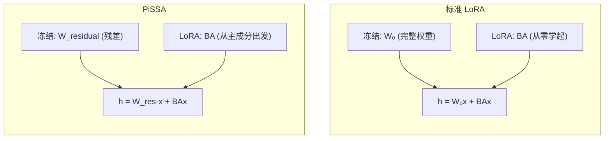

# PiSSA: Principal Singular Values and Singular Vectors Adaptation of Large Language Models

> **论文信息**：Meng et al., 2024  
> **一句话概括**：标准 LoRA 训练残差部分（$B=0$, $A$ 随机）；PiSSA 反过来——用权重矩阵的**主成分**（SVD 的前 $r$ 个分量）初始化 $A, B$，冻结残差部分。这样 LoRA 从一开始就处理最重要的信号，收敛更快、效果更好。

**相关阅读**：
- [LoRA 低秩适配基础](/前置知识/000x_前置知识_LoRA低秩适配基础) — LoRA 的标准初始化策略
- [AdaLoRA 精读](./057_AdaLoRA_自适应秩分配) — SVD 在 LoRA 中的另一种应用

---

## 贯穿全文的例子

> 考虑一个 Transformer 层的 $W_Q \in \mathbb{R}^{4096 \times 4096}$。对它做 SVD：
>
> $$W_Q = U \Sigma V^T = \underbrace{U_{:,1:r} \Sigma_{1:r} V_{:,1:r}^T}_{\text{主成分（前 r 个）}} + \underbrace{U_{:,r+1:} \Sigma_{r+1:} V_{:,r+1:}^T}_{\text{残差（后 d-r 个）}}$$
>
> - **LoRA 的做法**：冻结完整的 $W_Q$，从零开始学 $\Delta W = BA$
> - **PiSSA 的做法**：
>   - 冻结残差部分 $W_{\text{res}}$
>   - 用主成分初始化 LoRA：$B = U_{:,1:r}\Sigma_{1:r}^{1/2}$, $A = \Sigma_{1:r}^{1/2}V_{:,1:r}^T$
>   - 训练的起点就包含了原始权重中最重要的信息

---

## 一、论文动机

### 1.1 LoRA 初始化的问题

标准 LoRA：
- $B = 0$ → 训练起点的 LoRA 贡献为零
- $A \sim \mathcal{N}(0, \sigma^2)$ → 随机方向

**问题**：LoRA 需要从零开始，在训练中逐渐"发现"权重需要调整的方向。这个发现过程消耗了训练预算。

**能否让 LoRA 从一开始就"站在"正确的位置？**

### 1.2 关键观察

预训练权重矩阵 $W$ 的 SVD 分解中，前 $r$ 个奇异值/向量包含了最重要的信息。如果我们直接让 LoRA 的 $A, B$ 初始化为这些主成分，那么：

1. LoRA 从一开始就"知道"权重的主方向
2. 训练只需要在这些主方向上做微调
3. 冻结的部分是"不太重要"的残差

### 1.3 与 LoRA 的对比直觉

**类比**：
- **LoRA**：让一个新人（$B=0$）从零学起一门手艺。先给他所有工具（冻结完整 $W_0$），让他练习额外技能（$\Delta W = BA$）
- **PiSSA**：让一个已经掌握核心技能的学徒（$A, B$ = 主成分）继续精进。把他已经熟练的基础操作固定住（冻结残差），只在核心方向上优化

---

## 二、方法详解

### 2.1 SVD 分解

对预训练权重 $W_0 \in \mathbb{R}^{d \times k}$ 做截断 SVD：

$$
W_0 = U \Sigma V^T = \underbrace{U_r \Sigma_r V_r^T}_{W_{\text{principal}}} + \underbrace{U_{-r} \Sigma_{-r} V_{-r}^T}_{W_{\text{residual}}}
$$

其中：
- $U_r \in \mathbb{R}^{d \times r}$：前 $r$ 个左奇异向量
- $\Sigma_r = \text{diag}(\sigma_1, ..., \sigma_r)$：前 $r$ 个奇异值
- $V_r \in \mathbb{R}^{k \times r}$：前 $r$ 个右奇异向量

### 2.2 PiSSA 的初始化

将主成分分配给 LoRA 的 $A, B$：

$$
B_{\text{init}} = U_r \Sigma_r^{1/2} \in \mathbb{R}^{d \times r}
$$

$$
A_{\text{init}} = \Sigma_r^{1/2} V_r^T \in \mathbb{R}^{r \times k}
$$

冻结残差部分：

$$
W_{\text{frozen}} = W_{\text{residual}} = W_0 - B_{\text{init}} A_{\text{init}}
$$

### 2.3 前向传播

$$
h = W_{\text{frozen}} x + BAx
$$

训练开始时：
$$
W_{\text{frozen}} x + B_{\text{init}} A_{\text{init}} x = W_{\text{residual}} x + W_{\text{principal}} x = W_0 x
$$

✅ 训练起点仍然等于原始预训练模型。

### 2.4 与标准 LoRA 的对比

| 方面 | 标准 LoRA | PiSSA |
|------|-----------|-------|
| 冻结的部分 | $W_0$（完整权重） | $W_{\text{residual}}$（残差） |
| 初始化 $B$ | 全零 | $U_r \Sigma_r^{1/2}$ |
| 初始化 $A$ | 随机 | $\Sigma_r^{1/2} V_r^T$ |
| 训练起点 | $BA = 0$ | $BA = W_{\text{principal}}$ |
| LoRA 的意义 | 从零学习增量 | 在主方向上精调 |



---

## 三、为什么 PiSSA 更好？

### 3.1 梯度信号更强

在训练初始阶段，标准 LoRA 的梯度：
$$
\frac{\partial \mathcal{L}}{\partial B} = \frac{\partial \mathcal{L}}{\partial h} (A_{\text{random}} x)^T
$$

$A_{\text{random}} x$ 是随机方向的投影——信息量不确定。

PiSSA 的梯度：
$$
\frac{\partial \mathcal{L}}{\partial B} = \frac{\partial \mathcal{L}}{\partial h} (\Sigma_r^{1/2} V_r^T x)^T
$$

$V_r^T x$ 是沿**权重最重要方向**的投影——信息量最大。

### 3.2 优化景观更平滑

PiSSA 的训练本质上是在主成分子空间内的微调。这个子空间：
- 包含了权重中变化最大的方向
- 对应最大的奇异值 → 梯度信号最强
- 优化景观相对平滑（高曲率方向）

而 LoRA 需要从随机方向开始，可能在平坦区域浪费训练步数。

### 3.3 数学解释

标准 LoRA 训练等价于在约束 $\text{rank}(\Delta W) \leq r$ 下最小化 loss。其最优解 $\Delta W^*$ 的 SVD 对应着 loss landscape 中变化最大的 $r$ 个方向。

PiSSA 用预训练权重的主成分初始化，相当于给了优化一个**更好的起点**——它假设"预训练权重中最重要的方向在微调中也最重要"。这个假设通常是成立的。

---

## 四、实验结果

### 4.1 语言建模

在 LLaMA-2-7B 上做指令微调：

| 方法 | 参数 | MT-Bench | AlpacaEval | GSM8K |
|------|------|----------|------------|-------|
| LoRA ($r=16$) | 20M | 5.82 | 71.3% | 32.1% |
| **PiSSA ($r=16$)** | 20M | **6.15** | **74.8%** | **35.4%** |
| LoRA ($r=64$) | 80M | 5.87 | 72.5% | 33.8% |
| **PiSSA ($r=64$)** | 80M | **6.28** | **76.2%** | **38.1%** |

PiSSA 在所有指标上系统性超越 LoRA（+0.3~0.4 MT-Bench 分）。

### 4.2 收敛速度

训练 loss 达到特定阈值所需步数：

| 目标 loss | LoRA 步数 | PiSSA 步数 | PiSSA 加速比 |
|----------|-----------|-----------|-------------|
| 1.5 | 2000 | 1200 | 1.7x |
| 1.2 | 5000 | 3000 | 1.7x |
| 1.0 | 10000 | 6500 | 1.5x |

PiSSA 收敛速度约为 LoRA 的 **1.5~1.7 倍**。

### 4.3 代码生成

在 CodeAlpaca 数据上微调后的 HumanEval 通过率：

| 方法 | $r=16$ | $r=32$ | $r=64$ |
|------|--------|--------|--------|
| LoRA | 24.4% | 26.2% | 28.5% |
| **PiSSA** | **28.7%** | **31.0%** | **33.5%** |

---

## 五、实现细节

### 5.1 SVD 计算开销

对 $W \in \mathbb{R}^{d \times k}$ 做 rank-$r$ 截断 SVD：
- 复杂度：$O(dk \cdot r)$
- LLaMA-7B 所有线性层 SVD：约 5~10 分钟（在 GPU 上）
- **只需做一次**（在训练开始前）

### 5.2 使用 Fast SVD

对于大矩阵，使用随机化 SVD（`torch.svd_lowrank`）可以显著加速：

```python
import torch

def init_pissa(weight: torch.Tensor, r: int):
    """用 PiSSA 初始化 LoRA 的 A 和 B"""
    # 随机化截断 SVD（比完整 SVD 快得多）
    U, S, Vh = torch.svd_lowrank(weight.float(), q=r)
    # U: [d, r], S: [r], Vh: [r, k]
    
    # PiSSA 初始化
    sqrt_S = torch.diag(S.sqrt())
    B_init = U @ sqrt_S          # [d, r]
    A_init = sqrt_S @ Vh         # [r, k]
    
    # 残差（冻结部分）
    W_residual = weight - B_init @ A_init
    
    return B_init, A_init, W_residual

# 使用示例
B, A, W_res = init_pissa(layer.weight.data, r=16)
```

### 5.3 与 Hugging Face PEFT 的集成

```python
from peft import LoraConfig, get_peft_model

config = LoraConfig(
    r=16,
    lora_alpha=16,
    init_lora_weights="pissa",  # 使用 PiSSA 初始化！
    target_modules="all-linear",
)

model = get_peft_model(base_model, config)
```

---

## 六、PiSSA 的局限

| 局限 | 描述 | 影响 |
|------|------|------|
| 需要预计算 SVD | 增加初始化时间（5~10 分钟） | 训练前一次性开销 |
| 残差不能共享 | 每层的 $W_{\text{residual}}$ 不同 → 存储与标准 LoRA 相同 | 无额外存储节省 |
| 假设可能不成立 | "预训练主成分方向 = 微调重要方向"不一定对 | 极端域外任务可能不适用 |
| 合并方式不同 | 合并后是 $W_{\text{residual}} + BA$，需要重新计算 | 小问题 |

---

## 七、与其他初始化方法的对比

| 方法 | 初始化 A | 初始化 B | 理论依据 |
|------|---------|---------|---------|
| 标准 LoRA | 随机 | 零 | 保证起点 = 预训练 |
| PiSSA | $\Sigma_r^{1/2} V_r^T$ | $U_r \Sigma_r^{1/2}$ | 主成分方向最重要 |
| OLoRA (2024) | 正交随机 | 正交随机 | 保持梯度流的正交性 |
| LoRA-GA (2024) | 基于梯度近似 SVD | 基于梯度近似 SVD | 直接对齐梯度方向 |

---

## 八、总结

### 核心贡献

1. **提出了基于 SVD 主成分的 LoRA 初始化方法**
2. **将"什么被冻结"从完整权重改为残差**——让 LoRA 管理最重要的部分
3. **收敛速度提升 1.5~1.7 倍**
4. **最终效果系统性优于标准 LoRA**

### 适用建议

- **训练预算有限**（步数少）：PiSSA 优势更大（快速收敛）
- **标准任务**：PiSSA 稳定优于 LoRA
- **极端域外任务**：可能不如标准 LoRA（预训练主方向可能不相关）
- **与其他改进组合**：PiSSA 可以与 LoRA+、rsLoRA、HiddenKey 等组合使用

### 延伸阅读

- [LoRA 低秩适配基础](/前置知识/000x_前置知识_LoRA低秩适配基础) — LoRA 初始化回顾
- [AdaLoRA 精读](./057_AdaLoRA_自适应秩分配) — SVD 的另一种用法
- [DoRA 精读](./059_DoRA_权重分解低秩适配) — 权重分解的另一种思路
