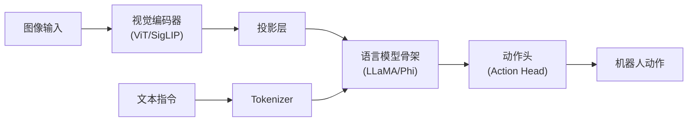
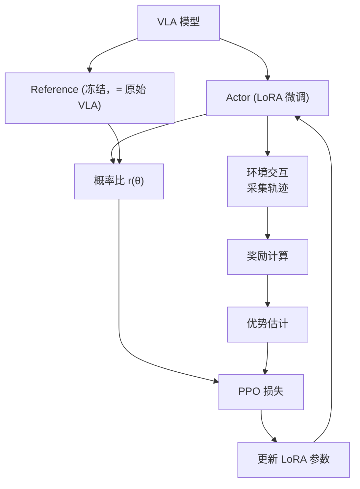

# LoRA 在机器人 VLA (Vision-Language-Action) 模型中的应用

> **综合分析文章**  
> **一句话概括**：VLA 模型（如 OpenVLA、RT-2、Pi0）参数量巨大（7B~55B），直接全参数微调在机器人场景中不切实际（设备、数据、时间限制）。LoRA 成为了 VLA 适配到特定机器人/任务的标准方案。本文梳理 LoRA 在 VLA 中的典型用法、挑战与最佳实践。

**相关阅读**：
- [LoRA 低秩适配基础](/前置知识/000x_前置知识_LoRA低秩适配基础) — LoRA 核心原理
- [参数高效微调(PEFT)概览](/前置知识/000y_前置知识_参数高效微调PEFT概览) — PEFT 全景
- [视觉语言动作模型 VLA 综述](/论文综述/S03_视觉语言动作模型VLA综述) — VLA 模型背景
- [OpenVLA 精读](/论文综述/015_OpenVLA_开源视觉语言动作模型) — 典型 VLA 模型

---

## 贯穿全文的例子

> 场景：我们有一个 7B 参数的 VLA 模型（如 OpenVLA），预训练在 Open X-Embodiment 数据集（100+ 种机器人）上。现在要部署到一个全新的机器人平台（Franka Panda），执行 5 种桌面操作任务。
>
> - **全参数微调**：需要 8×A100 + 数天训练 + 数万条演示 → 实验室买不起
> - **LoRA 微调**：单张 A100 + 数小时训练 + 几百条演示 → 可行！
>
> 但机器人场景有其特殊性：数据极度稀缺、安全性要求高、多任务切换频繁、实时性约束严格。这些都影响 LoRA 的使用策略。

---

## 一、VLA 模型中使用 LoRA 的动机

### 1.1 机器人场景的特殊约束

| 约束 | 描述 | 对微调的影响 |
|------|------|------------|
| **数据稀缺** | 真实机器人数据采集极贵（~$100/条） | 不能用大数据集；需要高效利用少量数据 |
| **计算受限** | 实验室通常只有 1-2 张 GPU | 不能做大规模全参数训练 |
| **快速迭代** | 需要频繁尝试新任务/新场景 | 训练时间要短 |
| **部署受限** | 实际部署在边缘设备或机器人本体 | 推理要快、模型要小 |
| **灾难性遗忘** | 新任务不能破坏已有能力 | 需要保护预训练知识 |

LoRA 天然适配这些约束：
- ✅ 少量参数 → 少数据也不容易过拟合
- ✅ 冻结基础模型 → 保护预训练知识
- ✅ 训练快 → 快速迭代
- ✅ 推理时合并 → 零部署开销
- ✅ 多任务可用多个适配器切换

### 1.2 主流 VLA 模型中的 LoRA 使用

| VLA 模型 | 参数量 | LoRA 使用方式 | 论文中的配置 |
|---------|--------|-------------|------------|
| OpenVLA | 7B | 官方推荐 LoRA 微调 | $r=32$, 全线性层 |
| RT-2 | 55B | 无官方 LoRA 配置 | 全参数微调 |
| Pi0 | 3B | Flow Matching + LoRA | $r=16$, 注意力层 |
| Octo | 93M | 较小，可全参数 | N/A |
| GR00T N1 | ~2B | 支持 LoRA 适配 | $r=8$~32 |
| TinyVLA | 1B | 全参数或 LoRA | $r=16$ |

---

## 二、LoRA 在 VLA 中的技术细节

### 2.1 VLA 的模型结构

典型的 VLA 模型包含三个组件：



LoRA 可以加在不同组件上：

| 组件 | 是否加 LoRA | 常见配置 | 理由 |
|------|-----------|---------|------|
| 视觉编码器 | 通常不加 | 冻结 | 视觉特征通用性强 |
| 投影层 | 有时加 | 全参数微调（参数少） | 参数量小可以直接调 |
| **LLM 骨架** | **几乎总是加** | $r=16$~64 | 参数最多、适配需求最大 |
| 动作头 | 通常全参数 | 全参数微调 | 参数量相对小，且任务特异性强 |

### 2.2 OpenVLA 的官方 LoRA 配置

OpenVLA 论文推荐的微调配置：

```python
# OpenVLA 官方 LoRA 配置
peft_config = LoraConfig(
    r=32,
    lora_alpha=32,
    target_modules=[
        "q_proj", "k_proj", "v_proj", "o_proj",
        "gate_proj", "up_proj", "down_proj",
    ],
    lora_dropout=0.0,
    bias="none",
)
```

**配置解析**：
- $r=32$：中等秩，平衡效果与效率
- $\alpha = r$：缩放因子为 1
- 目标模块：所有注意力层 + MLP 层
- 无 Dropout：机器人数据量少但噪声大，Dropout 可能不合适

### 2.3 微调数据量的影响

机器人场景的数据量远小于 NLP：

| 数据量 | LoRA 效果 | 推荐配置 |
|--------|----------|---------|
| 50 条演示 | 可用但性能有限 | $r=4$~8, 只对 QV |
| 200 条演示 | 良好 | $r=16$, 注意力层 |
| 1000 条演示 | 接近饱和 | $r=32$, 全线性层 |
| 5000+ 条演示 | 可以考虑全参数 | $r=64$ 或全参数 |

---

## 三、关键挑战与解决方案

### 3.1 挑战 1：动作空间的精确性

**问题**：语言任务对输出的精确性要求不高（同义词都可以），但机器人动作需要**毫米级精度**。LoRA 的低秩约束是否影响动作精度？

**实验发现**（来自多篇论文的总结）：
- $r \geq 16$ 时，LoRA 在大多数操作任务上的成功率与全参数微调差异 < 5%
- $r < 8$ 时，精细操作（如插入、旋转）的性能显著下降
- 动作头不建议用 LoRA——全参数微调动作头效果更好

**最佳实践**：LLM 骨架用 LoRA，动作头全参数微调。

### 3.2 挑战 2：灾难性遗忘

**问题**：VLA 预训练时学到了多种机器人和多种任务的泛化能力。LoRA 微调到单一机器人/任务后，这些泛化能力是否会丧失？

**LoRA 的天然优势**：
- 基础模型完全冻结 → 预训练知识完整保留
- LoRA 参数量很小 → 不容易覆盖预训练表示

**但仍有风险**：
- LoRA 改变了注意力模式 → 可能"忘记"如何处理之前见过的任务
- 解决方案：训练时混入少量通用数据（replay），或使用 [EWC 弹性权重巩固](/前置知识/000w_前置知识_EWC弹性权重巩固) 约束

### 3.3 挑战 3：多任务切换

**场景**：一个机器人需要执行 10 种不同任务，能否为每个任务训练一个 LoRA 适配器？

**方案对比**：

| 方案 | 优势 | 劣势 |
|------|------|------|
| 单一 LoRA（所有任务混合训练） | 简单部署 | 任务间可能冲突 |
| 多个 LoRA（每任务一个） | 任务隔离 | 需要任务识别+切换 |
| LoRA 合并（训练多个再合并） | 部署简单+多任务 | 合并可能引入冲突 |
| 共享基础 + 任务路由 | 灵活高效 | 实现复杂 |

**推荐**：如果任务数 ≤ 5 且相似，用单一 LoRA 混合训练。如果任务差异大或 > 5 个，用多个 LoRA + 语言指令路由。

### 3.4 挑战 4：推理延迟

**约束**：机器人控制通常要求 5~50Hz 的决策频率。VLA 模型本身就偏慢，LoRA 是否增加延迟？

**LoRA 的推理方式**：
1. **合并方式**：$W_{\text{merged}} = W_0 + BA$ → 推理完全无额外开销 → **推荐**
2. **分离方式**：保持 $W_0$ 和 $BA$ 分开计算 → 有少量额外开销（用于多任务切换）

合并后的推理延迟与原始模型完全相同。

---

## 四、LoRA 在 VLA RL 后训练中的使用

### 4.1 背景

多篇论文（如 [VLA-RL](/论文综述/006_VLA_RL_PPO直接训练自回归VLA), [RIPT-VLA](/论文综述/007_RIPT_VLA_无Critic的VLA后训练)）使用 RL 对 VLA 进行后训练。在 RL 训练中使用 LoRA 有特殊考虑：

### 4.2 LoRA + PPO 的配合



**关键点**：
- **Actor**：VLA + LoRA → 只训练 LoRA 参数
- **Reference Model**：原始 VLA（无 LoRA）→ 计算 KL 约束
- **优势**：Reference Model 不需要额外显存（就是冻结的 $W_0$ 本身！）
- **这是 LoRA + PPO 的天然优势**：KL 约束是免费的

### 4.3 RL 微调中的 LoRA 超参数

| 超参数 | RL 微调推荐值 | 与 SFT 的差异 | 原因 |
|--------|-------------|-------------|------|
| $r$ | 8~16 | 比 SFT 小 | RL 中过大的 $r$ 容易策略崩溃 |
| 学习率 | $5\text{e-}6$~$2\text{e-}5$ | 比 SFT 小 10x | RL 信号噪声大，需要小步更新 |
| $\alpha$ | $r$ 或 $2r$ | 类似 SFT | - |
| Dropout | 0 | 通常不用 | RL 本身有探索机制 |

---

## 五、最佳实践总结

### 5.1 VLA LoRA 配置推荐

```python
# 推荐的 VLA LoRA 配置（用于 SFT 微调）
config = LoraConfig(
    r=32,                            # 中等秩
    lora_alpha=32,                   # α = r
    target_modules=[                  # 全注意力层 + MLP
        "q_proj", "k_proj", "v_proj", "o_proj",
        "gate_proj", "up_proj", "down_proj",
    ],
    modules_to_save=["action_head"],  # 动作头全参数微调！
    lora_dropout=0.0,
    bias="none",
)

# 推荐训练超参数
training_args = {
    "learning_rate": 2e-4,
    "num_epochs": 10,              # 机器人数据少，多 epoch
    "batch_size": 16,
    "warmup_ratio": 0.03,
    "weight_decay": 0.01,
    "gradient_accumulation_steps": 4,
}
```

### 5.2 常见错误与避坑

| 错误 | 后果 | 正确做法 |
|------|------|---------|
| 视觉编码器也加 LoRA | 视觉特征退化 | 冻结视觉编码器 |
| 动作头用 LoRA 而非全参数 | 动作精度不够 | 动作头全参数微调 |
| $r$ 设太大 + 数据少 | 过拟合 | 少数据时 $r \leq 16$ |
| RL 中学习率太大 | 策略崩溃 | RL 学习率 < SFT 的 1/10 |
| 不做梯度裁剪 | 训练不稳定 | `max_grad_norm=1.0` |

---

## 六、前沿方向

### 6.1 LoRA 变体在 VLA 中的探索

| 方法 | VLA 适用性 | 优势 |
|------|-----------|------|
| QLoRA | ⭐⭐⭐⭐⭐ | 边缘设备部署必备 |
| DoRA | ⭐⭐⭐⭐ | 更精确的动作适配 |
| rsLoRA | ⭐⭐⭐ | 允许用更大 $r$ |
| LoRA-FA | ⭐⭐⭐ | 长序列（多帧视觉输入）省显存 |
| VeRA | ⭐⭐ | 多任务适配器极致压缩 |

### 6.2 未来方向

1. **动态秩分配**：不同时间步/不同视觉输入复杂度使用不同的秩
2. **LoRA + 世界模型**：在世界模型中预训练 LoRA，再迁移到真实环境
3. **联邦 LoRA**：多个机器人协同微调，只传输 LoRA 参数
4. **LoRA Merge for VLA**：合并多个任务 LoRA 得到通用适配器

---

## 七、总结

### 核心要点

1. **LoRA 是 VLA 适配的标准方案**：在计算受限、数据稀缺的机器人场景中几乎不可替代
2. **VLA 有特殊需求**：动作精度要求高、数据少、需要实时推理
3. **最佳实践**：LLM 骨架用 LoRA + 动作头全参数 + 冻结视觉编码器
4. **RL 后训练**：LoRA 天然适配 PPO（Reference Model 免费获得）
5. **多任务**：LoRA 适配器切换是实现 VLA 多任务部署的关键技术

### 延伸阅读

- [LoRA 低秩适配基础](/前置知识/000x_前置知识_LoRA低秩适配基础) — 基础原理
- [QLoRA 精读](./056_QLoRA_量化低秩适配) — 边缘部署方案
- [OpenVLA 精读](/论文综述/015_OpenVLA_开源视觉语言动作模型) — 典型 VLA 模型
- [VLA 模型的 RL 后训练综述](/论文综述/S06_VLA模型的RL后训练综述) — LoRA 在 RL 中的应用
