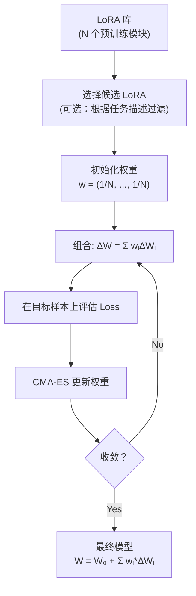

# LoraHub: Efficient Cross-Task Generalization via Dynamic LoRA Composition

> **论文信息**：Huang et al., 2023  
> **一句话概括**：给定一个新任务和少量样本，LoraHub 自动从预训练的 LoRA 模块库中**学习最优的线性组合权重**，实现无需训练新 LoRA 的跨任务泛化——像"乐高积木"一样组装已有的能力。

**相关阅读**：
- [LoRA 低秩适配基础](/前置知识/000x_前置知识_LoRA低秩适配基础) — LoRA 原理
- [LoRA Merge 精读](./068_LoRA_Merge_多适配器合并) — 合并方法全景

---

## 贯穿全文的例子

> 我们有一个 LLaMA-7B 基础模型，以及从社区收集的 20 个已训练好的 LoRA 模块：
> - LoRA-翻译、LoRA-摘要、LoRA-情感分析、LoRA-数学、LoRA-代码...
>
> 现在来了一个新任务：**医学文本分类**（只有 5 条标注样本）。
>
> **传统做法**：用 5 条数据训练一个新 LoRA → 数据太少，效果极差
> **LoraHub 做法**：
> 1. 组合所有 20 个 LoRA：$\Delta W = \sum_i w_i \cdot B_i A_i$
> 2. 用 5 条样本优化权重 $w_1, ..., w_{20}$（无梯度优化，只调 20 个标量）
> 3. 得到最优组合 → 效果远好于从头训 LoRA

---

## 一、论文动机

### 1.1 LoRA 生态的爆发

2023 年起，社区中可用的 LoRA 模块数量爆发式增长（Hugging Face 上有数万个）。每个 LoRA 封装了某个任务/领域的"技能"。

**核心问题**：能否复用这些已有的 LoRA，而不是每次都从头训练？

### 1.2 混合专家的启发

LoraHub 受 Mixture-of-Experts (MoE) 启发：
- 每个 LoRA 是一个"专家"
- 路由权重决定使用哪些专家以及用多少
- 但 LoraHub 不需要训练路由器——直接优化权重

---

## 二、方法详解

### 2.1 问题形式化

给定：
- $N$ 个预训练的 LoRA 模块：$\{\Delta W_i = B_i A_i\}_{i=1}^N$
- 新任务的少量样本：$\mathcal{D}_{\text{target}} = \{(x_j, y_j)\}_{j=1}^K$（通常 $K=5$~10）

目标：找到最优组合权重 $w = (w_1, ..., w_N)$ 使得：

$$
w^* = \arg\min_w \mathcal{L}\left(f_{W_0 + \sum_i w_i \Delta W_i}, \mathcal{D}_{\text{target}}\right)
$$

### 2.2 优化方法

由于只优化 $N$ 个标量（$N$ 通常为 10~50），不需要梯度下降，可以用**无梯度优化**：

论文使用 **CMA-ES**（协方差矩阵自适应进化策略）：
- 基于群体的优化算法
- 不需要计算梯度
- 适合低维、非凸的优化问题
- 通常 100~200 次函数评估就能收敛

**为什么不用梯度？**
- 只有 5~10 条样本，梯度估计极不准确
- 优化变量只有 $N$ 维（很低），CMA-ES 高效
- 避免了对 LoRA 参数的梯度计算（省显存）

### 2.3 算法流程



### 2.4 候选 LoRA 的选择

当 LoRA 库很大（100+）时，全部组合不现实。论文提出了两种筛选策略：

1. **基于相似度**：计算目标任务描述与每个 LoRA 训练任务描述的语义相似度，选 top-K
2. **基于梯度符号**：计算目标样本在每个 LoRA 上的梯度方向，选与目标方向一致的

---

## 三、实验结果

### 3.1 BBH 基准（27 个推理任务）

从 27 个 BBH 任务中训练 26 个 LoRA，测试 leave-one-out：

| 方法 | 平均准确率 | 所需标注数据 |
|------|-----------|-------------|
| 零样本 (无微调) | 32.8% | 0 |
| Few-shot (in-context) | 41.5% | 5 (不训练) |
| 从头训练 LoRA (5-shot) | 35.2% | 5 |
| **LoraHub (5-shot 优化权重)** | **45.3%** | **5** |
| 从头训练 LoRA (全量数据) | 52.1% | 1000+ |

**关键发现**：
- LoraHub 只用 5 条样本就超越了 in-context learning（+3.8%）
- 远超从头训练 LoRA（因为 5 条数据对训练来说太少了）
- 接近全量数据训练效果的 87%

### 3.2 消融实验：LoRA 数量的影响

| 可用 LoRA 数量 | LoraHub 准确率 |
|---------------|---------------|
| 5 | 39.2% |
| 10 | 42.1% |
| 20 | 44.8% |
| 26 | 45.3% |

更多的 LoRA 选择 → 更好的组合可能性。

### 3.3 学到的权重分析

有趣发现：对于"逻辑推理"新任务，LoraHub 学到的权重中：
- "因果推理"LoRA 权重最高（0.35）
- "常识判断"LoRA 次之（0.22）
- "翻译"LoRA 权重接近零（0.01）

这说明 LoraHub 确实学会了**选择相关能力**。

---

## 四、核心优势与局限

### 4.1 优势

1. **零训练成本**：不需要训练新的 LoRA 参数（只优化 N 个标量）
2. **极少数据需求**：5~10 条样本就够
3. **可扩展**：LoRA 库越大，潜在表达能力越强
4. **模块化**：新增能力只需训练新 LoRA 并加入库

### 4.2 局限

1. **依赖 LoRA 库质量**：如果库中没有相关能力的 LoRA，组合再好也无用
2. **线性组合的表达限制**：非线性任务组合可能需要非线性权重
3. **CMA-ES 开销**：100~200 次模型前向传播（在 5 条数据上），约几分钟
4. **秩累积**：组合 N 个秩 $r$ 的 LoRA，结果秩最高 $Nr$ → 可能过大

---

## 五、代码框架

```python
import torch
import numpy as np
from cmaes import CMA  # pip install cmaes

class LoraHub:
    def __init__(self, base_model, lora_modules: list):
        self.model = base_model
        self.loras = lora_modules  # list of (B_i, A_i) pairs
        self.n_loras = len(lora_modules)
    
    def compose(self, weights):
        """按权重组合所有 LoRA"""
        delta_W = sum(w * (B @ A) for w, (B, A) in zip(weights, self.loras))
        return delta_W
    
    def evaluate(self, weights, target_data):
        """在目标数据上评估当前组合"""
        # 临时应用组合后的 LoRA
        delta_W = self.compose(weights)
        # ... 前向传播并计算 loss
        return loss
    
    def optimize(self, target_data, n_iterations=200):
        """用 CMA-ES 优化权重"""
        optimizer = CMA(
            mean=np.ones(self.n_loras) / self.n_loras,
            sigma=0.5,
        )
        
        for _ in range(n_iterations):
            solutions = []
            for _ in range(optimizer.population_size):
                w = optimizer.ask()
                loss = self.evaluate(w, target_data)
                solutions.append((w, loss))
            optimizer.tell(solutions)
        
        return optimizer.mean  # 最优权重
```

---

## 六、总结

### 核心贡献

1. **提出了"LoRA 即技能、组合即泛化"的范式**
2. **无梯度优化组合权重**：极低成本实现跨任务迁移
3. **验证了 LoRA 可组合性**：不同任务的 LoRA 可以有意义地线性组合

### 延伸阅读

- [LoRA 低秩适配基础](/前置知识/000x_前置知识_LoRA低秩适配基础) — 基础
- [LoRA Merge 精读](./068_LoRA_Merge_多适配器合并) — 合并方法对比
- [LoRA 在 VLA 中的应用](./067_LoRA_VLA_机器人视觉语言动作模型适配) — 机器人多任务
