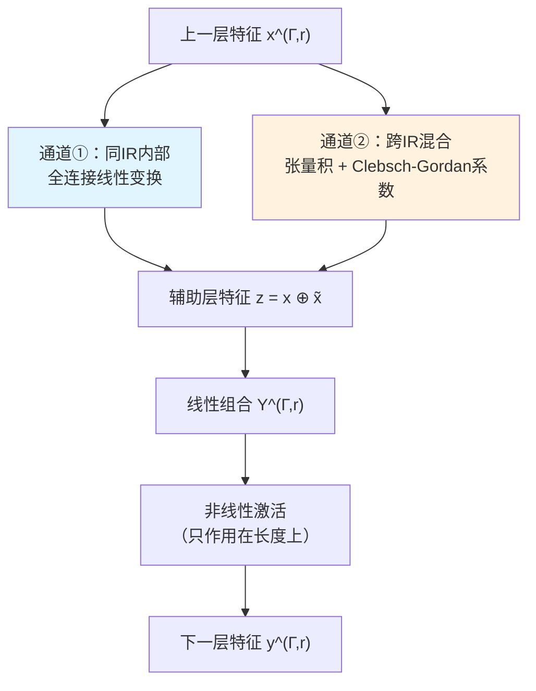

# 晶格系统的等变神经网络力场深度精读

> **论文标题**: Equivariant Neural Networks for Force-Field Models of Lattice Systems
> **作者**: Yunhao Fan, Gia-Wei Chern
> **机构**: Department of Physics, University of Virginia
> **发表**: arXiv:2601.04104v1 [cond-mat.str-el], 2026年1月

**标签**: `#等变神经网络` `#机器学习力场` `#群论` `#点群对称性` `#Holstein模型` `#电子-晶格耦合` `#电荷密度波` `#朗之万动力学` `#大规模模拟`

---

## 相关阅读

在读这篇精读前，建议先了解：

- [群表示论与不可约表示](/前置知识/001m_前置知识_群表示论与不可约表示) — 理解"不可约表示"、"张量积分解"、"Clebsch-Gordan 系数"这几个贯穿全文的核心工具
- [等变神经网络与不变性、等变性](/前置知识/001n_前置知识_等变神经网络与不变性等变性) — 理解 ENN 架构设计的通用原理，本文是它在晶格系统上的具体应用
- [Behler-Parrinello 局部能量框架与近视性原理](/前置知识/001o_前置知识_Behler_Parrinello局部能量框架与近视性原理) — 理解"局部性"如何让机器学习力场做到大规模可扩展，以及传统不变量描述符方法的局限

---

## 一、贯穿全文的例子：一块正在"结晶"的方格子材料

想象一块二维方格子材料，每个格点上有一个原子，这个原子周围的化学环境会让它发生局部的"呼吸式"形变（想象格点周围一圈原子像气球一样鼓起或缩进），用一个标量 $Q_i$ 描述这个鼓缩程度。同时，这个格点上还有一个可以自由移动的电子。

电子和晶格形变是耦合的：电子倾向于停留在"鼓起"的格点上（因为那里能量更低），而电子停留会进一步促使那个格点鼓得更明显——这是一种正反馈。当整块材料温度降低到某个临界点以下，这种耦合效应会自发地让电子和晶格形变在空间上形成**棋盘状**交替排列的图案——某些格点鼓起、电子聚集，相邻格点缩进、电子稀薄。这就是**电荷密度波**（charge-density wave, CDW）相变，也是这篇论文用来验证方法的具体物理场景。

这篇论文要解决的问题是：**能不能训练一个神经网络，只看某个格点周围的局部形变环境，就精确地预测出这个格点受到的力（也就是决定它下一步怎么运动的驱动力），而且这个网络严格尊重方格子固有的对称性——不多算、不少算、不算错方向？**

---

## 二、问题背景：为什么传统方法造成了瓶颈

### 2.1 物理设定：绝热近似下的力

论文考虑的是一大类"电子 + 经典场耦合"的凝聚态格点模型——电子部分服从量子力学，晶格畸变、局部磁矩等"经典场"变量 $\Phi_i$ 则按照牛顿或朗之万动力学演化。因为电子的运动远快于晶格畸变的运动（电子的"惯性"几乎可以忽略），可以采用绝热（Born-Oppenheimer）近似：假设电子瞬间适应当前的晶格构型，晶格则感受到电子"平均"给出的力：

$$
F_i = -\frac{\partial E}{\partial \Phi_i}, \qquad E = \langle \hat H_e\rangle = \mathrm{Tr}\big[\hat\varrho_e \hat H_e(\{\Phi_i\})\big]
$$

这正是[前置知识中介绍的框架](/前置知识/001o_前置知识_Behler_Parrinello局部能量框架与近视性原理)。问题在于：计算 $\hat\varrho_e$ 需要对角化整个电子哈密顿量，而动力学模拟的每一个时间步都要重新做一次——这是主要的计算瓶颈,严重限制了能模拟的系统尺寸和时间尺度。

### 2.2 已有的机器学习力场方法：手工描述符的局限

针对这类格点系统，之前已经有一批工作（包括本文作者所在课题组自己的多篇论文，如 Zhang & Chern 2021 年 PRL 的 double-exchange 模型、Suwa 等人 2019 年 PRB 的强关联电子分子动力学）用手工设计的、对称性感知的**不变量描述符**去逼近局部能量或局部力。

这类方法的核心问题在论文引言里说得很直接：不变量描述符是"系统专用的"（system-specific）——针对方格子设计的描述符不能直接套用到六角格子或者带内部自旋自由度的系统上,每换一种格点模型都要重新设计一套描述符。而且，正如[等变神经网络前置知识](/前置知识/001n_前置知识_等变神经网络与不变性等变性)中详细分析的,不变量描述符从构造上就丢失了方向信息,难以直接、精确地表示力这类等变量,往往需要用更复杂、更高维的特征去间接补偿。

### 2.3 分子系统的等变网络（NequIP、MACE）为什么不能直接搬过来

近年来分子/材料模拟领域已经有 NequIP、MACE 这类基于连续欧几里得对称群 $E(3)$（旋转+平移+反射的连续群）构造的等变神经网络，在分子动力学力场上取得了很高的数据效率和精度。

但晶格系统的对称性结构和分子系统本质不同：晶格的对称操作是**离散的点群**（比如方格子的 $D_4$ 群，只有 8 个元素），而不是连续旋转群 $SO(3)$（有无穷多个元素）。论文在讨论部分明确指出：虽然离散点群是连续旋转群的子群,但直接套用为连续对称设计的 $E(3)$-等变架构,并不能自动施加正确的晶体对称约束——晶格系统还有弹性张量、介电张量、压电张量等只有离散点群才能精确刻画的额外限制。这正是这篇论文要专门针对离散点群设计一套等变网络框架的动机。

---

## 三、方法一：可扩展的机器学习力场总框架

### 3.1 局部性假设：从全局哈密顿量到逐格点求和

论文首先延续 Behler-Parrinello 的思路（详见[前置知识](/前置知识/001o_前置知识_Behler_Parrinello局部能量框架与近视性原理)），利用近视性原理把总能量写成逐格点局部贡献之和：

$$
E = \sum_i \epsilon_i = \sum_i \varepsilon(\mathcal{C}_i), \qquad \mathcal{C}_i = \{\Phi_j \mid |r_j-r_i|\le r_c\}
$$

这一步保证了模型的**线性扩展性**和**跨尺寸迁移性**——在小系统上训练出来的局部模型，可以直接套用到大系统的每一个格点上。

### 3.2 关键选择：直接学力，而不是学能量再求导

论文提出了两条可能的路线：

| 路线 | 学什么 | 力怎么得到 | 输出的对称性要求 |
|------|--------|-----------|-----------------|
| 路线 A | 局部能量 $\epsilon_i = \varepsilon(\mathcal{C}_i)$ | 对能量求导 $F_i = -\partial E/\partial\Phi_i$ | 能量是标量，只需不变性 |
| 路线 B（本文采用） | 局部力 $F_i = \mathcal{F}(\mathcal{C}_i)$ | 直接输出，无需求导 | 力是等变量，需要等变性 |

本文选择路线 B——直接用 ENN 预测力。这个选择和等变网络的能力密切相关：因为 ENN 天生就能输出严格等变的量，不需要绕道"先学不变的能量，再靠自动微分求导得到力"这种间接方式。绕开求导这一步，也避免了求导过程中可能引入的额外数值误差。

---

## 四、方法二：把点群对称性"焊"进网络架构

### 4.1 输入层：把局部环境分解成不可约表示

假设格点 $j$ 通过某个点群操作 $R$ 映射到格点 $k$（记 $O(R)$ 是这个操作作用在空间坐标上的矩阵，$A(R)$ 是它作用在经典变量上的表示矩阵），那么局部环境里的变量必须满足协调的变换关系：

$$
\Phi_k \to \tilde\Phi_k = A(R)\cdot \Phi_j, \qquad r_k - r_i = O(R)\cdot(r_j - r_i)
$$

**为什么需要这个公式**：局部邻域里几十个格点上的变量 $\{\Phi_j\}$ 整体上构成点群的一个（通常可约的）大表示，我们需要先严格定义"对称操作怎么同时作用在几何位置和物理变量上"，才能进一步把这个大表示分解成不可约表示,分解正是接下来构造等变网络输入层的第一步。

> **一句话直觉**：转一下整个邻域的几何位置，邻域里每个点上的物理量也要按同样的规则一起转。

**逐项拆解**：

| 符号 | 含义 |
|------|------|
| $R$ | 点群 $G$ 中把格点 $j$ 映到格点 $k$ 的某个对称操作 |
| $O(R)$ | $R$ 作用在空间坐标上的正交矩阵 |
| $A(R)$ | $R$ 作用在经典变量 $\Phi$ 上的表示矩阵 |
| $\Phi_j, \tilde\Phi_k$ | 变换前格点 $j$ 的变量，变换后格点 $k$ 应有的变量 |

利用局部环境天然的**分块对角**结构（同一个"壳层"——也就是到中心格点距离相同的一圈格点——的变量在对称操作下只在壳层内部互相变换，不会混到别的壳层），可以对每个壳层独立做群论分解，得到一组按不可约表示 $\Gamma$ 分类、带多重度指标 $r$ 的对称适配基 $f^{(\Gamma,r)}$。

**具体数值例子**（论文 Fig.1 给出的方格子案例）：给定中心格点 $i$，它的 4 个最近邻 $\{Q_a,Q_b,Q_c,Q_d\}$ 构成一个 4 维表示，分解为 $4 = 1A_1 \oplus 1B_1 \oplus 1E$，对应的对称适配基是：

$$
f^{(A_1)} = Q_a+Q_b+Q_c+Q_d,\quad f^{(B_1)} = Q_a-Q_b+Q_c-Q_d,\quad f^{(E)} = (Q_a-Q_c,\ Q_b-Q_d)
$$

这三个组合正是[群表示论前置知识](/前置知识/001m_前置知识_群表示论与不可约表示)第三节里详细推导过的同一套分解——这里直接套用在了具体的物理格点上。把所有壳层的分解叠加起来，论文实验中用的局部邻域（半径 $r_c=3.61$ 个晶格常数，共 45 个格点）总共分解为：

$$
45 = 9A_1 \oplus 3A_2 \oplus 6B_1 \oplus 5B_2 \oplus 11E
$$

这五个数字（9、3、6、5、11）分别是五种不可约表示在输入层的**多重度**，也正是网络架构表（下面第 4.3 节的表格）里"Input"那一行的通道数。

### 4.2 前向传播：两条合法的信息流通道

网络的每一层，节点都被明确标记为某个不可约表示 $\Gamma$ 的一个分量，记作 $x_k^{(\Gamma,r)}$。要从一层的特征 $x^{(\Gamma,r)}$ 算出下一层的特征 $y^{(\Gamma,r)}$，论文设计了两条并行的信息通道，这正是[等变神经网络前置知识](/前置知识/001n_前置知识_等变神经网络与不变性等变性)第四节讲的通用机制在这里的具体实现：

**通道①**（同类型内部混合）：对每个不可约表示 $\Gamma$，允许该类型不同"多重度副本"之间做普通的全连接线性组合，权重只依赖 $(\Gamma,r,r')$，不依赖分量指标 $k$——这正是前置知识里公式 (12) 对应的机制,保证同一类型内部混合不破坏等变性。

**通道②**（跨类型混合）：只要目标类型 $\Gamma$ 出现在张量积分解 $\Gamma_1\otimes\Gamma_2$ 里，就可以用 Clebsch-Gordan 系数把两个不同类型的特征拧成一个新的 $\Gamma$ 型特征：

$$
\tilde x_k^{(\Gamma,r)} = \sum_{ij} C^{(\Gamma,\Gamma_1,\Gamma_2)}_{kij}\, x_i^{(\Gamma_1,r_1)}\, x_j^{(\Gamma_2,r_2)}
$$

论文 Fig.2(d) 列出了 $D_4$ 群里几个代表性的张量积分解规则（如 $B_1\otimes B_1=A_1$、$E\otimes E = A_1\oplus A_2\oplus B_1\oplus B_2$），这些正是[群表示论前置知识](/前置知识/001m_前置知识_群表示论与不可约表示)第四节详细推导过的分解结果。

把两条通道的输出合并成辅助层特征 $z=x\oplus\tilde x$（意味着辅助层的节点数通常会比原始隐藏层大很多，因为它同时保留了"原始副本"和"所有合法的跨类型混合项"），再做一次线性组合得到中间激活：

$$
Y_k^{(\Gamma,r)} = \sum_{r'} W^{(\Gamma)}_{r,r'}\, z_k^{(\Gamma,r')}
$$

### 4.3 非线性激活与最终架构

和前置知识里讲的机制完全一致，非线性激活只作用在特征向量的长度上，方向部分严格保持线性：

$$
y^{(\Gamma,r)} = F_{\text{av}}\big(\|Y^{(\Gamma,r)}\| + b_r^{(\Gamma)}\big)\cdot \hat{Y}^{(\Gamma,r)}
$$

论文实验中用的具体网络架构（针对 Holstein 模型的方格子情形）如下：

| 层 | IR 通道数（$A_1\oplus A_2\oplus B_1\oplus B_2\oplus E$） | 非线性 |
|------|------|------|
| 输入层 | $9\oplus3\oplus6\oplus5\oplus11$ | – |
| 辅助层 1 | $128\oplus115\oplus130\oplus123\oplus264$ | – |
| 隐藏层 1 | $32\oplus32\oplus32\oplus32\oplus32$ | ReLU |
| 辅助层 2 | $2512\oplus2576\oplus2576\oplus2576\oplus4128$ | – |
| 隐藏层 2 | $8\oplus8\oplus8\oplus8\oplus8$ | ReLU |
| 辅助层 3 | $148\oplus164\oplus164\oplus164\oplus264$ | – |
| 隐藏层 3 | $4\oplus4\oplus4\oplus4\oplus4$ | ReLU |
| 辅助层 4 | $34\oplus42\oplus42\oplus42\oplus68$ | – |
| 输出层 | $1\oplus0\oplus0\oplus0\oplus0$ | 线性 |

可以看到辅助层的通道数远大于相邻隐藏层——这正是因为辅助层要容纳所有"跨类型混合"产生的中间项。输出层只保留 $A_1$（恒等表示）通道，因为 Holstein 模型里晶格形变 $Q_i$ 是纯标量，它对应的力也是标量，天然只需要 $A_1$ 通道，其余四个通道数都是 0。整个网络共 **496,514 个可训练参数**。

---

## 五、实验设置：Holstein 模型上的验证

### 5.1 物理模型

论文选用半满填充（half-filled）的方格子 Holstein 模型作为验证平台,这是研究电子-晶格耦合和电荷密度波物理的经典模型：

$$
\hat H_e = -t_{nn}\sum_{\langle ij\rangle} \hat c_i^\dagger \hat c_j - g\sum_i Q_i \hat n_i + \sum_i\Big(\frac{P_i^2}{2m}+\frac{kQ_i^2}{2}\Big) + \kappa\sum_{\langle ij\rangle} Q_iQ_j
$$

**逐项拆解**：

| 项 | 物理含义 |
|------|---------|
| $-t_{nn}\sum \hat c_i^\dagger \hat c_j$ | 最近邻电子跳跃项，$t_{nn}$ 是跳跃振幅，描述电子的"迁移能力" |
| $-g\sum Q_i \hat n_i$ | 电子-晶格耦合项，$g$ 是耦合强度，晶格形变 $Q_i$ 越大，电子停留在该格点的能量越低 |
| $P_i^2/2m + kQ_i^2/2$ | 局部谐振子项，$m$ 是有效质量，$k$ 是弹性系数，描述晶格形变自身的"弹簧"势能 |
| $\kappa\sum Q_iQ_j$ | 最近邻反铁畸变耦合，$\kappa$ 控制相邻格点形变的关联倾向 |

这正是贯穿全文例子里"呼吸式形变 + 电子停留"耦合机制的数学表达：$Q_i$ 就是那个描述"鼓起/缩进"程度的标量，$\hat n_i = \hat c_i^\dagger \hat c_i$ 是电子在格点 $i$ 上的占据数算符。

因为 $Q_i$ 是不带内部自由度的纯标量，它对应的力也是标量（$A_1$ 表示）——论文特意指出，这使 Holstein 模型成为一个"最简但非平凡"的测试平台：非平凡之处在于局部环境仍然有丰富的点群结构需要 ENN 去正确处理，最简之处在于输出端不需要处理向量或更高阶张量,方便清晰地验证方法本身是否正确。

### 5.2 精确力的解析表达式

利用 Hellmann-Feynman 定理，力的精确表达式可以直接写出：

$$
F_i = -kQ_i - \kappa\sum_{j\in \mathcal{N}(i)} Q_j + g\langle \hat n_i\rangle
$$

**逐项拆解**：前两项是纯弹性贡献（谐振子恢复力 + 相邻格点的反铁畸变耦合力），计算代价很低；第三项 $g\langle \hat n_i\rangle$ 是电子介导的力，需要通过对角化一个大规模紧束缚哈密顿量（有效在位势 $v_i^{\text{eff}}=-gQ_i$）来计算电子密度期望值 $\langle \hat n_i\rangle$——这正是每个时间步都要重复的计算瓶颈。ENN 要学习的，就是把这整个复杂的"对角化 + 求期望"过程,压缩成一个直接从局部形变环境映射到力的函数。

### 5.3 训练细节与静态精度验证

训练数据来自 $40\times 40$ 格点系统的精确对角化（exact diagonalization, ED）计算，取无量纲电子-晶格耦合 $\lambda = g^2/(kW)=1.5$（$W=8t_{nn}$ 是电子能带宽度）。为了让训练集覆盖非平衡动力学中真实会遇到的构型，除了随机构型和准有序 CDW 构型，还专门加入了热淬火（thermal quench）模拟过程中的中间态,总共 600 个构型（400 训练 + 200 验证）。

因为力是逐格点的局部观测量，每一个构型实际上提供 $40\times 40=1600$ 个独立的训练样本，600 个构型相当于 400×1600 ≈ 64 万个有效训练样本（论文原文强调的是 400 个训练构型对应 400×40×40 个局部环境）——这种"一份构型，多份局部样本"的放大效应，是局部性框架天然带来的数据效率优势。

用 Adam 优化器（学习率 0.001）最小化均方误差损失：

$$
L = \sum_i \big(F_i^{\text{ML}} - F_i^{\text{exact}}\big)^2
$$

训练结果：预测力和精确力散点图高度重合，测试集误差分布 $\delta = F^{\text{ML}}-F^{\text{exact}}$ 呈窄而对称的分布，标准差仅 $\sigma_\delta = 0.0084$。作者特别强调，仅用约 $5\times10^5$ 个参数就达到了这个精度，体现出很好的数据效率和偏差-方差平衡。

### 5.4 动力学精度验证：不只是"力算得准"，动力学也要"走得对"

静态力预测准，不代表放进动力学模拟里长期演化也准——误差可能会累积。论文用 ENN 预测的力驱动朗之万动力学方程：

$$
\frac{d^2Q_i}{dt^2} = -\frac{\partial\langle\hat H_e\rangle}{\partial Q_i} - \gamma\frac{dQ_i}{dt} + \eta_i(t)
$$

其中 $\gamma$ 是阻尼系数，$\eta_i(t)$ 是满足 $\langle\eta_i(t)\eta_j(t')\rangle = 2\gamma k_BT\delta_{ij}\delta(t-t')$ 的高斯热噪声,模拟系统和热库的耦合。作者对比了用 ENN 力驱动的朗之万动力学和用精确对角化力驱动的朗之万动力学，在淬火后不同时刻的等时晶格关联函数 $C_{ij}=\langle Q_iQ_j\rangle$，发现两者在所有检验时刻都高度一致——这说明 ENN 不仅在单点力预测上准确，累积到长时间动力学演化上也没有明显偏差。

---

## 六、大规模应用：揭示电荷密度波的反常粗化动力学

有了经过验证的 ENN 力场，论文接着做了一件精确对角化方法在合理时间内根本做不到的事：把系统尺寸推大到 $200\times 200$ 格点，研究电荷密度波从无序到有序的**粗化**（coarsening）过程——也就是随机噪声中的小片"有序岛"如何逐渐长大、合并成大片有序区域。

### 6.1 描述粗化程度的序参量

论文定义了一个局域 CDW 序参量：

$$
\phi_i = n_i - \frac{1}{4}\sum_{j\in\mathcal{N}(i)} n_j \exp(i\,\mathbf{Q}\cdot \mathbf{r}_i)
$$

其中 $\mathbf{Q}=(\pi,\pi)$ 是棋盘状 CDW 的有序波矢。这个量衡量"某格点电子密度和周围环境的对比度"，配合棋盘相位因子，$\phi_i$ 接近 $+1$ 或 $-1$ 就代表该处已经形成了局部 CDW 有序（对应两种等价的、破缺了 $Z_2$ 子格对称性的基态），$\phi_i\approx 0$ 则代表处在无序或畴壁（domain wall）区域。

淬火后的快照显示：短时间内（如 $n_{\text{step}}=200$）系统迅速形成大量交替正负的小畴，随着时间推进，畴壁逐渐消失、同号畴合并，畴的典型尺寸稳步增大——这正是相分离/相变粗化动力学的典型图景。

### 6.2 标度分析与反常的生长指数

论文进一步用结构因子 $S(k,t)=|\tilde n(k,t)|^2$ 提取一个随时间变化的特征长度 $L(t)$：

$$
L^{-1}(t) = \sum_k S(k,t)\,|k-\mathbf{Q}| \Big/ \sum_k S(k,t)
$$

并验证不同时刻的结构因子在用 $L(t)$ 重新标度后可以坍缩到同一条曲线 $S(q,t)/L^2(t) = G(qL(t))$——这是相变有序动力学的标志性特征，说明整个粗化过程确实由单一的特征长度尺度主导。

$$
L(t) \sim t^\alpha
$$

**为什么这个结果值得强调**：对于打破 Ising 型 $Z_2$ 对称性的棋盘状 CDW，传统的相有序动力学理论（Allen-Cahn 方程，基于"畴壁法向速度和其曲率成正比"的曲率驱动机制）预言生长指数应为 $\alpha=1/2$。但论文在 $T=0.1, 0.2, 0.3$（对应能带宽度 $W$ 归一化的温度单位）三个温度下测得的指数分别是

$$
\alpha = 0.059,\ 0.115,\ 0.155
$$

**远远小于** Allen-Cahn 预言的 $1/2$，而且随温度升高而增大——这是一个反常、温度依赖的超慢粗化行为。

论文给出的物理解释是：在强耦合极限下，$Q_i$ 在每个格点上存在两个能量相近的局部极小值（分别对应电子占据数 $\langle\hat n_i\rangle=0$ 和 $1$），两者之间被一个高度 $\Delta E\sim g^2/k$ 的能量壁分隔。畴壁移动需要局部翻越这个能量壁——这个过程在低温下会被强烈抑制，需要热激活才能进行，因此叠加在曲率驱动的机制之上，让整体粗化速度大幅低于经典理论预期。此外,半满填充下电子数守恒的全局约束,也会让不同格点的局部翻转相互关联,进一步阻碍畴壁自由移动。这一现象和该课题组早前基于手工描述符的机器学习模型得到的结果是一致的,但这次是首次借助严格保持对称性的等变神经网络、在更大规模系统上确认了这个反常标度行为。

需要强调的是：这个反常粗化现象**只有在能访问足够大的时空尺度时才能被观察和确认**——而这正是 ENN 力场提供的核心能力，是精确对角化方法在合理时间内完全无法企及的。

---

## 七、方法定位与讨论

### 7.1 和分子系统 ENN（NequIP、MACE）的关系与区别

| 维度 | 分子系统 ENN（NequIP、MACE 等） | 本文的晶格 ENN |
|------|------------------------------|---------------|
| 对称群 | 连续欧几里得群 $E(3)$ / $SO(3)$ | 离散点群（如 $D_4$）+ 内部对称性 |
| 局部环境定义 | 原子间距离、方向（连续几何量） | 格点间离散的对称操作关系 |
| 典型内部自由度 | 原子种类、原子坐标 | 局部晶格畸变、局部磁矩、轨道伪自旋等经典场 |
| 常用实现方式 | 消息传递 / 图神经网络 + 球谐函数展开 | 每层节点直接标记为点群不可约表示 |

论文特别强调：虽然离散点群理论上是连续旋转群 $SO(3)$ 的子群,但直接把 $E(3)$-等变架构套用到晶体系统上,并不能自动施加正确的对称约束——晶体特有的弹性、介电、压电张量等物理量,只有从离散点群出发才能得到正确的变换规则。这是本文选择专门构造离散点群 ENN 的核心理由,而不是简单复用已有的连续群等变网络。

### 7.2 未来扩展方向

论文在讨论部分提出了几个自然的延伸方向：

- **与图神经网络/卷积架构结合**：目前的 BP 式局部性由固定截断半径 $r_c$ 控制，未来可以考虑把平移不变性和离散空域对称性交给卷积或消息传递机制处理，让 ENN 专注于处理格点内部自由度（自旋、轨道多重态等）的对称结构，这样有可能获得更灵活的、可自适应的感受野。
- **推广到更一般的结构-性质映射**：ENN 框架不局限于预测力，理论上可以直接用来预测张量型响应函数（如弹性张量）、对称性分辨的序参量、有效耦合系数等材料科学中广泛出现的量。
- **推广到更复杂的电子模型**：本文用的是电子-晶格耦合的 Holstein 模型作为验证，方法本身对底层电子求解器是不敏感的（agnostic），理论上可以推广到 Jahn-Teller 模型、双交换模型、s-d 模型甚至强关联的 Hubbard 型模型，只要能提供训练用的精确力数据。

---

## 八、总结与评价

### 8.1 核心贡献

1. 提出了第一个专门针对**凝聚态格点系统离散点群对称性**（而不是分子系统连续 $E(3)$ 对称性）设计的等变神经网络力场框架，把局部动力学变量直接组织成点群不可约表示,通过同类型内部混合 + 跨类型 Clebsch-Gordan 混合两条通道实现严格等变的逐层前向传播。
2. 在方格子 Holstein 模型上完成了完整的 proof-of-principle 验证：约 50 万参数、600 个训练构型（有效局部样本近 64 万）就达到了 $\sigma_\delta=0.0084$ 的静态力预测精度,并且长时间朗之万动力学的关联函数与精确对角化结果高度吻合。
3. 借助 ENN 力场把可模拟系统尺寸推大到 $200\times200$，首次在如此大规模下确认了电荷密度波粗化过程存在反常的、温度依赖的超慢生长指数（$\alpha\approx 0.06$–$0.16$，远小于经典 Allen-Cahn 理论的 $1/2$），并给出了基于能量壁 + 电子数守恒约束的物理解释。

### 8.2 优点

- **对称性保证是架构层面的，不依赖训练数据"猜出来"**：无论训练数据多少，网络输出天然满足晶格点群对称性，不会出现"训练数据不够导致对称性被违反"的问题。
- **紧凑高效**：约 50 万参数就能达到很高精度，相比一些需要海量高维不变量特征的传统方法，参数量和数据需求都更省。
- **直接学力，跳过求导环节**：避免了"学能量再自动微分求力"可能引入的额外数值误差,也更契合本身就以力为核心驱动量的绝热动力学模拟场景。
- **验证链条完整**：不仅验证了静态力预测精度，还验证了长时间动力学的一致性，最后用实际的大规模应用（CDW 粗化）证明了方法的价值,而不是停留在"精度指标好看"的层面。

### 8.3 局限与思考

- **目前验证的物理系统相对简单**：Holstein 模型的经典变量是纯标量,力也是标量,只涉及最简单的 $A_1$ 通道输出。论文本身承认这是"最简但非平凡"的验证，真正体现方法威力的场景（比如带内部自旋自由度的 s-d 模型，输出是矢量力）留给了未来工作。
- **局部性假设的边界**：固定截断半径 $r_c$ 的做法继承了 BP 框架的局限——如果某个物理现象本质上依赖超出 $r_c$ 范围的长程关联（比如某些临界现象附近的关联长度发散），这个框架可能需要额外处理。
- **训练数据仍需要昂贵的精确对角化**：虽然 ENN 大幅降低了推理阶段的计算成本，但生成训练数据依然需要在小系统上做代价高昂的精确对角化或其他多体求解器计算，这部分成本没有被这篇论文的方法降低。

### 8.4 个人评价

这篇论文最有意思的地方，不在于"又造了一个等变网络"，而在于它把等变网络理论里"不可约表示 + Clebsch-Gordan 混合"这套相对抽象的群论机器,清清楚楚地安在了一个具体、可解释的物理场景里——每一层的通道数、每一个符号，都能对应到方格子的具体几何结构上,读者可以逐字核对。这种"把群论落到实处"的写法,对于想真正理解等变网络内部机制（而不只是调用现成库）的读者来说非常友好。

另外，反常 CDW 粗化那部分结果提醒我们：机器学习力场不只是"加速计算"的工具，它打开的大尺度、长时间窗口本身就可能揭示出小系统模拟完全看不到的新物理现象——这是这类方法真正的科学价值所在，而不仅仅是效率上的优化。

---

## 延伸阅读

- [群表示论与不可约表示](/前置知识/001m_前置知识_群表示论与不可约表示) — 不可约表示、张量积分解的数学基础
- [等变神经网络与不变性、等变性](/前置知识/001n_前置知识_等变神经网络与不变性等变性) — ENN 架构设计的通用原理
- [Behler-Parrinello 局部能量框架与近视性原理](/前置知识/001o_前置知识_Behler_Parrinello局部能量框架与近视性原理) — 局部性假设与传统不变量描述符方法
- Behler, J. and Parrinello, M., "Generalized neural-network representation of high-dimensional potential-energy surfaces", Phys. Rev. Lett. 98, 146401 (2007) ← BP 框架原始论文
- Suwa, H. et al., "Machine learning for molecular dynamics with strongly correlated electrons", Phys. Rev. B 99, 161107 (2019) ← 同课题组早期基于描述符的方法
- Zhang, P. and Chern, G.-W., "Arrested Phase Separation in Double-Exchange Models", Phys. Rev. Lett. 127, 146401 (2021) ← 同课题组机器学习力场在其他格点模型上的应用
